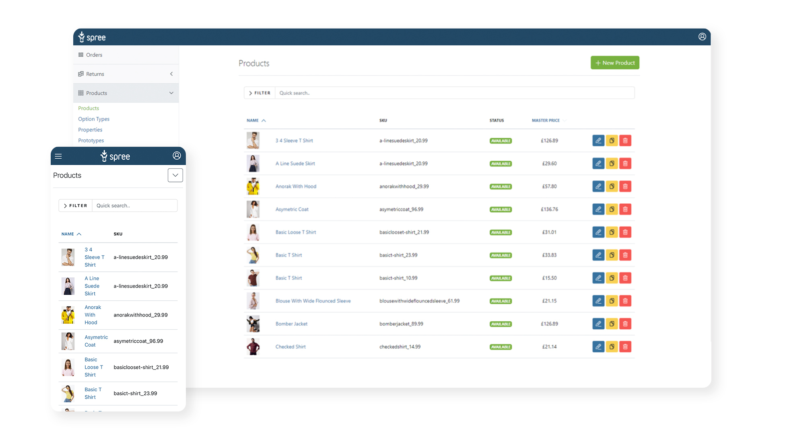

  

  <h1 align="center">Spree Commerce</h2>

  

    Open Source e-commerce platform for global brands.
     
     
    The best alternative to BigCommerce, Magento, Commerce Tools, etc.
     
    Build any eCommerce solution that your business requires.
     
     
    <a href="https://slack.spreecommerce.org">Slack</a>
    ·
    <a href="https://docs.spreecommerce.org">Documentation</a>
    ·
    <a href="https://spreecommerce.org">Website</a>
    ·
    <a href="https://github.com/spree/spree/milestones?direction=asc&sort=due_date&state=open">Roadmap</a>
  

  
  

## Getting Started

Visit the [Quickstart Guide](https://docs.spreecommerce.org/developer/getting-started) to set up Spree in 5 minutes.

## Features

* **Composable**
  * connect with your existing ecosystem, build custom workflows with ease
  * [Storefront and Admin API](https://docs.spreecommerce.org/api-reference)
  * Webhooks
* **Customizable and modular**
  * pick and choose parts you want to use
  * customize everything else (storefront, order processing, API, etc)
* **[Global Commerce](https://spreecommerce.org/use-cases/international-sales-demo/)**
  * multi-currency
  * multi-language
  * full translation support for products, categories, and more
  * different shipping methods / costs for different regions
  * advanced tax calculation
* **Multi-Store** - host multiple brands / stores on one Spree instance with different branding, configuration, payment methods, shipping options, product catalogs etc
* **[Multi-vendor marketplace](https://spreecommerce.org/use-cases/multi-vendor-marketplace-demo/)** - run your own marketplace with multiple suppliers with dedicated Supplier Dashboard
* **Responsive Admin Panel** - manage and curate products, users, orders, returns, shipments & more
* **Orders** - robust system for orders, shipments, returns and refunds
* **Carts** -  comprehensive and advanced discounts system
* **Payments** - over 30 payment provider integration out of the box plus API to integrate any other gateway
* **Run everywhere** - cloud, VPS, Docker, Kubernetes
* **Battle Tested** - used by thousands of merchants around the globe in all categories since 2007!
* **Extensions** adding new features to Spree

## Community & Contributing

Spree is an open source project and we love contributions in any form - pull requests, issues, feature ideas!

Follow our [Contributing Guide](https://docs.spreecommerce.org/developer/contributing)

[Join our Slack](https://slack.spreecommerce.org) to meet other community members.

## Enterprise support

[Contact us](https://spreecommerce.org/contact/) for enterprise support. We offer migration services, can help with custom development, launch your own Spree applications, optimize your Spree stack, etc.

## License

Spree is released under the [New BSD License](https://github.com/spree/spree/blob/main/license.md).
