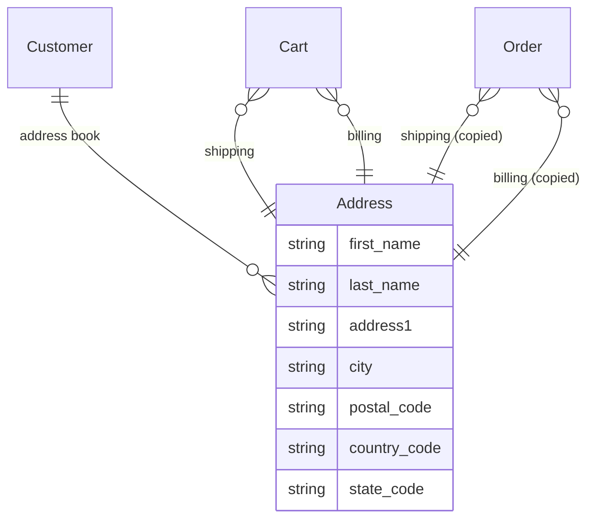

## Overview

An address is where something goes or who gets billed. Every cart collects a shipping and a billing address, and signed-in customers can keep an address book.

Addresses matter beyond the label on a parcel: the shipping address decides which delivery options a customer sees and how much tax they pay.



## Address fields

| Field | Description |
|---|---|
| `first_name`, `last_name` | Contact name |
| `address1`, `address2` | Street address |
| `city` | City |
| `postal_code` | Postal code — not used by every country |
| `phone` | Phone number |
| `company` | Company name, optional |
| `country_code` | Country, as an ISO code such as `US` |
| `state_code` | State or province code such as `CA`, where the country has them |
| `state_name` | Free text, for countries with no official list |
| `label` | What the customer filed it under — "Home", "Office" |
| `is_default_shipping`, `is_default_billing` | Whether it is the default in the address book |

<Note>
Countries and states are named by their **ISO codes** — `country_code: "US"`, `state_code: "CA"` — never by an ID. A code means the same thing everywhere, so you can send one without looking anything up first.

The older names `country_iso` and `state_abbr` still work but are going away. Use `country_code` and `state_code` in new code.
</Note>

## Address forms that adapt

Address formats are not universal. The United States wants a state and a ZIP code; Hong Kong wants neither. A form that demands both everywhere will block real customers from checking out.

Every country tells you what it needs:

<CodeGroup>

```typescript Store SDK
const { data: countries } = await client.countries.list()

// One country, with its states for a picker
const usa = await client.countries.get('US', { expand: ['states'] })

usa.states_required   // true  → show a state picker
usa.zipcode_required  // true  → require a postal code
usa.states            // [{ abbr: "CA", name: "California" }, ...]
```

```bash cURL
curl 'https://api.mystore.com/api/v3/store/countries' \
  -H 'X-Spree-API-Key: pk_xxx'

curl 'https://api.mystore.com/api/v3/store/countries/US?expand=states' \
  -H 'X-Spree-API-Key: pk_xxx'
```

</CodeGroup>

Drive the form from those two flags rather than hardcoding a list of countries. When `states_required` is `false`, let the customer type a `state_name` instead of picking a `state_code`.

Only countries you actually sell to are listed — that's decided by your [Markets](/developer/core-concepts/markets).

## The customer address book

A signed-in customer can save addresses and mark defaults, so checkout is one tap next time.

<CodeGroup>

```typescript Store SDK
const { data: addresses } = await client.customer.addresses.list()

const address = await client.customer.addresses.create({
  label: 'Home',
  first_name: 'John',
  last_name: 'Doe',
  address1: '123 Main St',
  city: 'Los Angeles',
  country_code: 'US',
  state_code: 'CA',
  postal_code: '90001',
  phone: '555-0100',
  is_default_shipping: true,
})

await client.customer.addresses.update(address.id, { city: 'Brooklyn' })
await client.customer.addresses.delete(address.id)
```

```bash cURL
curl -X POST 'https://api.mystore.com/api/v3/store/customers/me/addresses' \
  -H 'X-Spree-API-Key: pk_xxx' \
  -H 'Authorization: Bearer <customer_token>' \
  -H 'Content-Type: application/json' \
  -d '{
    "label": "Home",
    "first_name": "John",
    "last_name": "Doe",
    "address1": "123 Main St",
    "city": "Los Angeles",
    "country_code": "US",
    "state_code": "CA",
    "postal_code": "90001"
  }'
```

</CodeGroup>

## Addresses at checkout

On a cart you can point at a saved address or send a new one inline:

```typescript Store SDK
// Reuse something from the address book
await client.carts.update(cartId, {
  shipping_address_id: 'addr_xxx',
  billing_address_id: 'addr_yyy',
})

// Or send one directly — nothing needs saving first
await client.carts.update(cartId, {
  email: 'john@example.com',
  shipping_address: {
    first_name: 'John',
    last_name: 'Doe',
    address1: '123 Main St',
    city: 'Los Angeles',
    country_code: 'US',
    state_code: 'CA',
    postal_code: '90001',
  },
})
```

Setting the shipping address is what makes delivery options and tax appear, so do it before asking the customer to choose delivery. The updated cart comes back with new totals — you don't need a second request.

<Warning>
An address is **copied onto the order** when the cart completes, not linked to. Editing a saved address next year does not rewrite last year's invoice — which is exactly what you want when a customer moves house.
</Warning>

## Validating addresses

Spree checks that required fields are present and that the state and postal code make sense for the country. Anything it rejects comes back as a `422` naming the field, so you can put the message next to the input.

For real-world verification — that a street exists, that a unit number is missing — connect an address validation service. See [Providers](/developer/providers/overview).

## How geography flows through a purchase

<Steps>
  <Step title="A customer arrives">
    Their country resolves to a [Market](/developer/core-concepts/markets), which sets the currency and locale, and whether prices are shown with tax included.
  </Step>
  <Step title="They fill in an address">
    The form adapts to the country using `states_required` and `zipcode_required`.
  </Step>
  <Step title="Delivery options appear">
    The shipping address decides which [delivery methods](/developer/core-concepts/fulfillments) can reach them, and what each costs.
  </Step>
  <Step title="Tax is worked out">
    The same address decides the [tax](/developer/core-concepts/taxes) charged.
  </Step>
  <Step title="The order is placed">
    Both addresses are copied onto the order as a permanent record.
  </Step>
</Steps>

## Related

- [Markets](/developer/core-concepts/markets) — where you sell, in which currency
- [Fulfillments](/developer/core-concepts/fulfillments) — how the address shapes delivery options
- [Taxes](/developer/core-concepts/taxes) — how the address shapes tax
- [Carts](/developer/core-concepts/carts) — the checkout flow end to end
