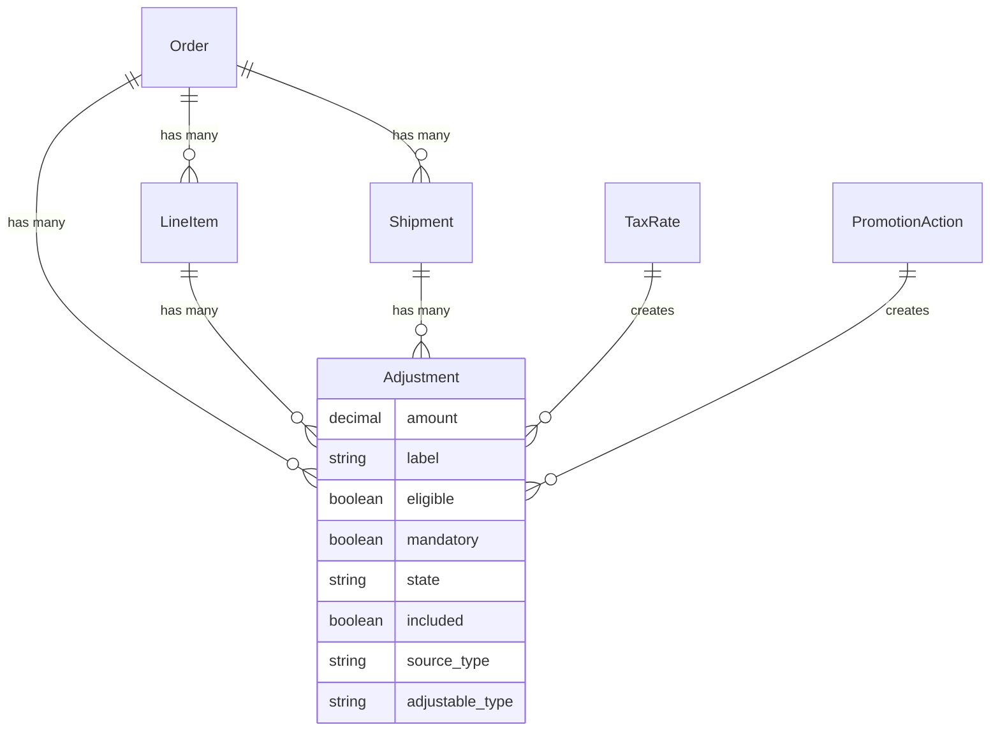

## Overview

An Adjustment modifies the price of an [Order](/developer/core-concepts/orders), a [Line Item](/developer/core-concepts/orders#line-items), or a [Shipment](/developer/core-concepts/shipments). Adjustments can be positive (charges) or negative (credits).



**Key relationships:**
- **Adjustment** modifies prices on orders, line items, or shipments
- **Source** is where the adjustment comes from ([Tax Rate](/developer/core-concepts/taxes) or [Promotion Action](/developer/core-concepts/promotions))
- **Adjustable** is what's being adjusted (Order, LineItem, or Shipment)
- Positive amounts are charges, negative amounts are credits

## Adjustment Types

### Included vs Additional

- **Included** adjustments are part of the item's displayed price (e.g., VAT in European stores)
- **Additional** adjustments are added on top of the item's price (e.g., US sales tax)

### Sources

Adjustments are created by two sources:

| Source | Example | Typical Amount |
|--------|---------|----------------|
| [Tax Rate](/developer/core-concepts/taxes) | Sales tax, VAT | Positive (charge) |
| [Promotion Action](/developer/core-concepts/promotions) | Coupon discount, free shipping | Negative (credit) |

## Adjustment Attributes

| Attribute | Description | Example |
|-----------|-------------|---------|
| `amount` | The monetary value of the adjustment | `-10.00` |
| `label` | Human-readable description | `10% off order` |
| `eligible` | Whether the adjustment currently applies | `true` |
| `mandatory` | If `true`, always applied regardless of eligibility rules | `false` |
| `state` | `open` (auto-updated) or `closed` (locked) | `open` |
| `included` | Whether the amount is included in the item's displayed price | `false` |

## Adjustment Lifecycle

- **Open** adjustments are recalculated whenever the order is updated (e.g., items added/removed, address changed)
- **Closed** adjustments are locked and will not be automatically recalculated
- When a promotion becomes ineligible (e.g., item removed from cart), its adjustments are automatically removed

## Store API

Adjustments appear in order responses when you expand line items or shipments:

<CodeGroup>

```typescript SDK
const order = await client.store.orders.get('or_abc123', {
  expand: ['line_items', 'shipments'],
  orderToken: '<token>',
})

// Line item adjustments (promotions, taxes)
order.line_items?.forEach(item => {
  item.adjustment_total  // total adjustments on this item
  item.additional_tax_total
  item.included_tax_total
})

// Order-level totals
order.adjustment_total    // total of all adjustments
order.promo_total         // total promotional discounts
order.additional_tax_total
order.included_tax_total
```

```bash cURL
curl 'https://api.mystore.com/api/v3/store/orders/or_abc123?expand=line_items,shipments' \
  -H 'Authorization: Bearer spree_pk_xxx' \
  -H 'X-Spree-Order-Token: <token>'
```

</CodeGroup>

## Related Documentation

- [Promotions](/developer/core-concepts/promotions) — Promotion-based adjustments
- [Taxes](/developer/core-concepts/taxes) — Tax adjustments
- [Shipments](/developer/core-concepts/shipments) — Shipping adjustments
- [Orders](/developer/core-concepts/orders) — How adjustments affect order totals
