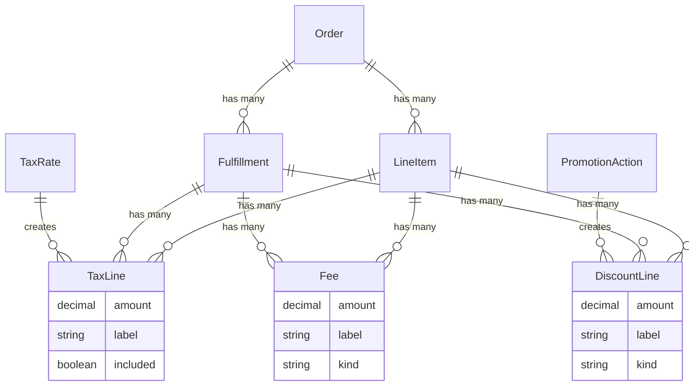

## Overview

Spree records every price modification as a typed adjustment line attached to a [Line Item](/developer/core-concepts/orders#line-items) or a [Fulfillment](/developer/core-concepts/shipments):

- **TaxLine** — tax owed on an item, one line per applicable tax rate
- **DiscountLine** — a credit (always negative), typically written by a promotion
- **Fee** — a charge (never negative), e.g. gift wrapping or a service surcharge

There are no order-level adjustment rows: whole-order discounts are distributed proportionally across the order's line items when the promotion applies. Every line belongs to exactly one item or fulfillment, so per-line tax and partial refunds always know the real discounted amount they operate on.



## Discounts vs Discount Lines

Two related concepts share the "discount" name; they answer different questions:

- **`discounts`** — *which promotions* are applied to the order; each entry carries the promotion's name, code, and its total contribution. This is what storefronts show next to the coupon field.
- **`discount_lines`** — *where the money landed*, line by line. Each row belongs to one line item or fulfillment.

The sum of `discounts[].amount` always equals `discount_total`.

## Tax: Included vs Additional

- **Included** tax lines are part of the item's displayed price (e.g., VAT in European stores)
- **Additional** tax lines are added on top of the item's price (e.g., US sales tax)

Tax is always computed from the discounted basis: an item's tax lines reflect its price net of all discounts, including its share of whole-order promotions.

## Recalculation

Adjustment lines are maintained by the order's recalculation pipeline, which runs whenever the order is updated (items added or removed, address changed, delivery rate selected). Adjusters run in a fixed order — discounts, then fees, then tax last, so tax always sees the discounted basis.

Two rules govern the lifecycle:

- **Lines follow the order.** Amounts refresh on every update; a line whose promotion no longer applies — or whose amount reaches zero — is removed. When two promotions compete for the same item, only the better discount is kept. Zero-amount lines are never stored.
- **Completed orders are frozen.** After completion an order's adjustment lines are never recalculated — what the customer saw at checkout is what the order keeps.

Manual discount lines and fees (`kind: 'manual'`) are never touched by the adjusters.

## Custom Adjusters

Custom charges and discounts register an adjuster and write typed lines:

```ruby
# config/initializers/spree.rb
Spree.adjusters << MyApp::Adjusters::GiftWrap

# app/models/my_app/adjusters/gift_wrap.rb
class MyApp::Adjusters::GiftWrap < Spree::Adjusters::Base
  # type defaults to :fee — runs after discounts, before tax

  def update
    return unless adjustable.respond_to?(:gift_wrap?) && adjustable.gift_wrap?

    adjustable.fees.find_or_initialize_by(kind: 'gift_wrap', order: adjustable.order).tap do |fee|
      fee.amount = 5.99
      fee.label = 'Gift wrapping'
      fee.save!
    end
  end
end
```

Declare `self.type = :discount` to run in the discount pass and write `DiscountLine` rows instead (amounts must be negative).

## Store API

Cart and order line items embed their tax and discount lines; totals are exposed as [money fields](/api-reference/store-api/monetary-amounts):

<CodeGroup>

```typescript Store SDK
const cart = await client.carts.get('cart_abc123', { spreeToken: '<token>' })

cart.items?.forEach(item => {
  item.tax_lines       // [{ amount, label, included, tax_rate_id }]
  item.discount_lines  // [{ amount, label, kind, promotion_id }]
  item.adjustment_total
})

cart.discounts        // applied promotions: [{ name, code, amount }]
cart.discount_total   // equals the sum of discounts[].amount
cart.additional_tax_total
cart.included_tax_total
```

```bash cURL
curl 'https://api.mystore.com/api/v3/store/carts/cart_abc123' \
  -H 'X-Spree-API-Key: pk_xxx' \
  -H 'X-Spree-Token: <token>'
```

</CodeGroup>

## Admin API

Each order exposes read-only collections of its lines — they are maintained by the pipeline and cannot be created or edited through the API:

<CodeGroup>

```typescript Admin SDK
const { data: taxLines } = await adminClient.orders.taxLines.list('or_abc123')
const { data: discountLines } = await adminClient.orders.discountLines.list('or_abc123')
const { data: fees } = await adminClient.orders.fees.list('or_abc123')

// or expand them on the order
const order = await adminClient.orders.get('or_abc123', {
  expand: ['tax_lines', 'discount_lines', 'fees'],
})
```

```bash CLI
spree api get /orders/or_abc123/discount_lines
```

</CodeGroup>

## Upgrading from Spree 5

Spree 5's polymorphic `Spree::Adjustment` is deprecated: nothing writes it anymore, and it is removed in 6.1. Run `rake spree:migrate_adjustments` once after upgrading — it converts completed orders' historical rows: tax adjustments become `TaxLine`s, promotion adjustments become `DiscountLine`s, and manual adjustments split by sign into `DiscountLine`s (credits) and `Fee`s (charges). In-flight carts need no migration; their lines are rebuilt on the next update.

## Related Documentation

- [Promotions](/developer/core-concepts/promotions) — how discount lines are created
- [Taxes](/developer/core-concepts/taxes) — how tax lines are computed
- [Shipments](/developer/core-concepts/shipments) — fulfillment-attached lines
- [Orders](/developer/core-concepts/orders) — how adjustment lines roll up into totals
- [Calculators](/developer/core-concepts/calculators) — how tax rate and promotion action amounts are computed
