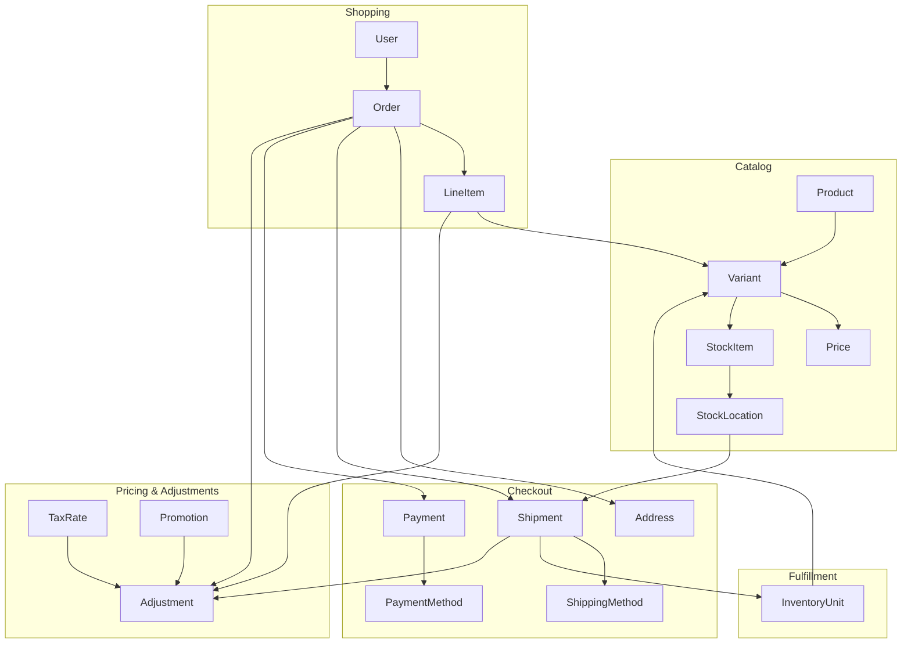
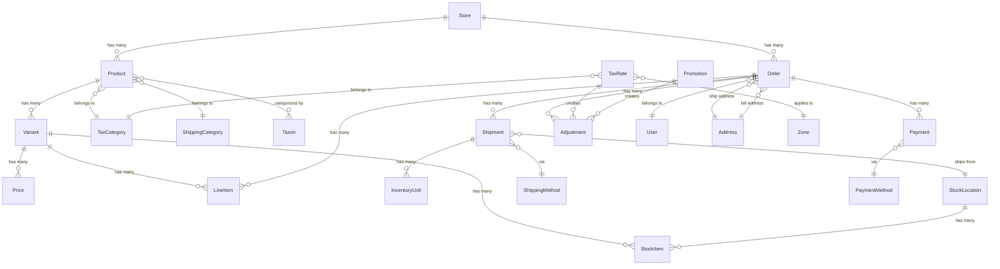

## Overview

Spree is built around a set of interconnected models that represent the core concepts of e-commerce: products, orders, payments, and shipments. Understanding how these pieces fit together is essential for customizing and extending Spree.

## Core Commerce Flow

The following diagram shows how the main models interact during a typical customer purchase:

**How it works:**

1. **Catalog** - [Products](/developer/core-concepts/products) have [Variants](/developer/core-concepts/products#variants) (SKUs) with prices and inventory tracked at [Stock Locations](/developer/core-concepts/inventory#stock-locations)

2. **Shopping** - Customers add Variants to their cart, creating an [Order](/developer/core-concepts/orders) with Line Items

3. **Checkout** - The Order collects [Addresses](/developer/core-concepts/addresses), calculates [Shipping](/developer/core-concepts/shipments) options, and processes [Payments](/developer/core-concepts/payments)

4. **Fulfillment** - [Shipments](/developer/core-concepts/shipments) are created from Stock Locations, tracking individual [Inventory Units](/developer/core-concepts/inventory#inventory-units)

5. **Pricing & Adjustments** - [Taxes](/developer/core-concepts/taxes) and [Promotions](/developer/core-concepts/promotions) create [Adjustments](/developer/core-concepts/adjustments) that modify order totals

## Core Model Relationships

This diagram shows the key database relationships between Spree's main models:

## Multi-Store Architecture

Spree supports multiple [Stores](/developer/core-concepts/stores) from a single installation. Each Store can have:

- Its own domain and branding
- Different currencies and locales
- Separate product catalogs
- Independent payment and shipping methods
- Isolated orders and customers

This makes Spree suitable for multi-brand retailers, international expansion, or B2B/B2C hybrid setups.

## Extension Points

Spree is designed to be customized without modifying core code. The main extension mechanisms are:

| Mechanism | Use Case | Documentation |
|-----------|----------|---------------|
| **Events & Subscribers** | React to order completion, payment, shipment events | [Events Guide](/developer/core-concepts/events) |
| **Webhooks** | Notify external systems of changes | [Webhooks Guide](/developer/core-concepts/webhooks) |
| **Dependencies** | Swap out services (tax calculation, shipping estimation) | [Dependencies Guide](/developer/customization/dependencies) |
| **Decorators** | Modify existing model/controller behavior (use sparingly) | [Decorators Guide](/developer/customization/decorators) |

<Info>
For most customizations, prefer **Events** and **Dependencies** over Decorators. They're easier to maintain and won't break during upgrades.
</Info>

## Code Conventions

Spree is built on [Ruby on Rails](https://rubyonrails.org) and follows Model-View-Controller (MVC) architecture. All Spree code is namespaced under `Spree::` to avoid conflicts with your application code.

**Example: Product**

| Component | Location | Class Name |
|-----------|----------|------------|
| Model | `core/app/models/spree/product.rb` | `Spree::Product` |
| Admin Controller | `admin/app/controllers/spree/admin/products_controller.rb` | `Spree::Admin::ProductsController` |
| API Serializer | `api/app/serializers/spree/v2/storefront/product_serializer.rb` | `Spree::V2::Storefront::ProductSerializer` |

## Packages

Spree is distributed as a set of Ruby gems (packages). Most users run Spree in **headless mode** with a custom frontend built using the [Storefront API](/api-reference/storefront) or [Platform API](/api-reference/platform).

**Core packages** (required):

| Package | Purpose |
|---------|---------|
| `spree_core` | Models, services, and business logic |
| `spree_api` | [Storefront API](/api-reference/storefront), [Platform API](/api-reference/platform), and [Webhooks](/developer/core-concepts/webhooks) |

**Optional packages:**

| Package | Purpose |
|---------|---------|
| `spree_admin` | Admin dashboard for managing your store |
| `spree_cli` | CLI tool to interact with your Spree installation |
| `spree_storefront` | Pre-built Rails storefront (not needed for headless setups) |
| `spree_emails` | Transactional email templates (order confirmation, shipping, etc.) |
| `spree_page_builder` | Visual page builder for the Rails storefront |
| `spree_sample` | Sample data (products, categories, etc.) for development and testing |
| `spree_dev_tools` | Development and testing utilities for Spree applications and extensions |

<Info>
For headless commerce, you only need `spree_core` and `spree_api`. Build your customer-facing frontend with any technology (Next.js, Nuxt, mobile apps) using the Storefront API.
</Info>

## Related Documentation

- [Products](/developer/core-concepts/products) - Product catalog and variants
- [Orders](/developer/core-concepts/orders) - Order lifecycle and state machine
- [Payments](/developer/core-concepts/payments) - Payment processing
- [Shipments](/developer/core-concepts/shipments) - Shipping and fulfillment
- [Customization Quickstart](/developer/customization/quickstart) - How to extend Spree