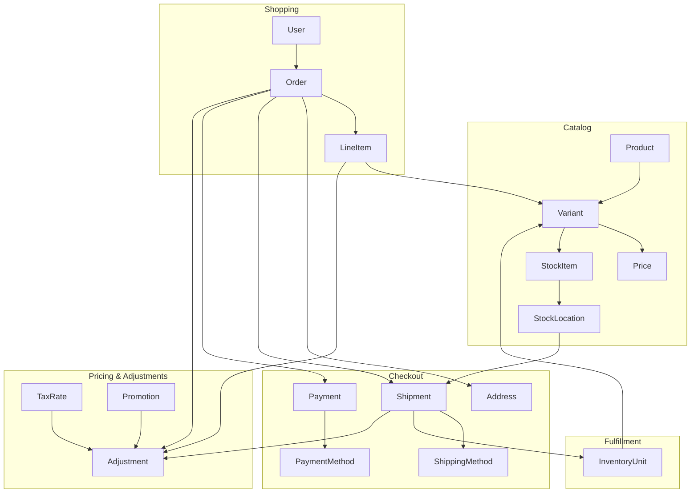
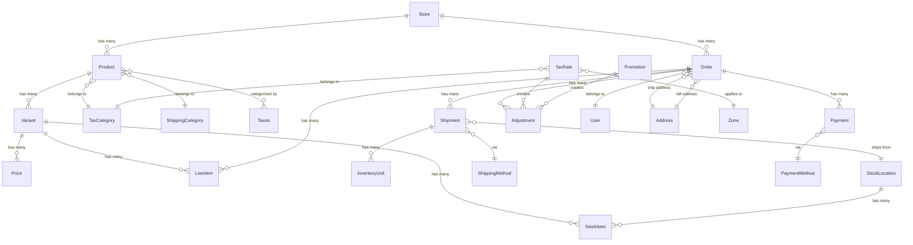

## Overview

Spree is a commerce engine built around interconnected models that represent the core concepts of commerce: products, orders, payments, and shipments. It adapts to your stack — use it as a headless API for any frontend, embed it into an existing application, or scale it from a single storefront to a global multi-vendor marketplace.

<Info>
  Spree supports PostgreSQL, MySQL, and SQLite. PostgreSQL is recommended for production. [Learn more about database configuration](/developer/deployment/database).
</Info>

## Core Commerce Flow

The following diagram shows how the main models interact during a typical customer purchase:

**How it works:**

1. **Catalog** — [Products](/developer/core-concepts/products) have [Variants](/developer/core-concepts/products#variants) (SKUs) with prices and inventory tracked at [Stock Locations](/developer/core-concepts/inventory#stock-locations)

2. **Shopping** — Customers add Variants to their cart, creating an [Order](/developer/core-concepts/orders) with Line Items

3. **Checkout** — The Order collects [Addresses](/developer/core-concepts/addresses), calculates [Shipping](/developer/core-concepts/shipments) options, and processes [Payments](/developer/core-concepts/payments)

4. **Fulfillment** — [Shipments](/developer/core-concepts/shipments) are created from Stock Locations, tracking individual [Inventory Units](/developer/core-concepts/inventory#inventory-units)

5. **Pricing & Adjustments** — [Taxes](/developer/core-concepts/taxes) and [Promotions](/developer/core-concepts/promotions) create [Adjustments](/developer/core-concepts/adjustments) that modify order totals

## Core Model Relationships

This diagram shows the key database relationships between Spree's main models:

## APIs

Spree exposes two REST APIs, both under API v3:

| API | Purpose | Authentication |
|-----|---------|----------------|
| [**Store API**](/api-reference/introduction) | Customer-facing — cart, checkout, products, account | Publishable API key + JWT |
| **Admin API** | Operational — manage products, orders, customers, settings | Secret API key |

Both APIs use [prefixed IDs](/api-reference/introduction) (e.g., `prod_86Rf07xd4z`, `or_m3Rp9wXz`), flat JSON request/response structures, and full TypeScript types via the [@spree/sdk](/developer/sdk/quickstart).

Events from both APIs can trigger [Webhooks](/developer/core-concepts/webhooks) to notify external systems in real time.

## Multi-Store Architecture

Spree supports [multiple stores](/developer/multi-store/quickstart) from a single installation. Each Store can have:

- Its own domain and branding
- Different currencies and locales
- Separate product catalogs
- Independent payment and shipping methods
- Isolated orders and customers

This makes Spree suitable for multi-brand retailers, international expansion, or B2B/B2C hybrid setups.

## Extension Points

Spree is designed to be customized without modifying core code. The main extension mechanisms are:

| Mechanism | Use Case | Documentation |
|-----------|----------|---------------|
| **Events & Subscribers** | React to order completion, payment, shipment events | [Events Guide](/developer/core-concepts/events) |
| **Webhooks** | Notify external systems of changes | [Webhooks Guide](/developer/core-concepts/webhooks) |
| **Dependencies** | Swap out services (tax calculation, shipping estimation) | [Dependencies Guide](/developer/customization/dependencies) |
| **Decorators** | Modify existing model/controller behavior (use sparingly) | [Decorators Guide](/developer/customization/decorators) |

<Info>
For most customizations, prefer **Events** and **Dependencies** over Decorators. They're easier to maintain and won't break during upgrades.
</Info>

## Packages

Spree is distributed as a set of packages:

**Core (required):**

| Package | Purpose |
|---------|---------|
| `spree` | Models, services, business logic, Store API, Admin API, and Webhooks |

**Optional:**

| Package | Purpose |
|---------|---------|
| `spree_admin` | Admin dashboard for managing your store |
| `spree_emails` | Transactional email templates (order confirmation, shipping, etc.) |

**TypeScript packages:**

| Package | Purpose |
|---------|---------|
| [`@spree/sdk`](/developer/sdk/quickstart) | TypeScript SDK for Store API and Admin API |
| [`@spree/next`](/developer/storefront/nextjs/spree-next-package) | Next.js integration — server actions, caching, cookie-based auth |

<Info>
For headless commerce, you only need the `spree` package. Build your customer-facing frontend with any technology (Next.js, Nuxt, mobile apps) using the Store API and SDK.
</Info>

## Related Documentation

- [Products](/developer/core-concepts/products) — Product catalog and variants
- [Orders](/developer/core-concepts/orders) — Order lifecycle and state machine
- [Payments](/developer/core-concepts/payments) — Payment processing
- [Shipments](/developer/core-concepts/shipments) — Shipping and fulfillment
- [Customization Quickstart](/developer/customization/quickstart) — How to extend Spree
