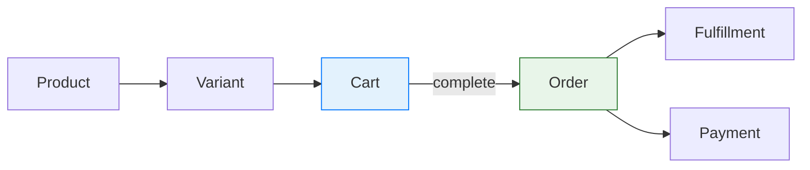
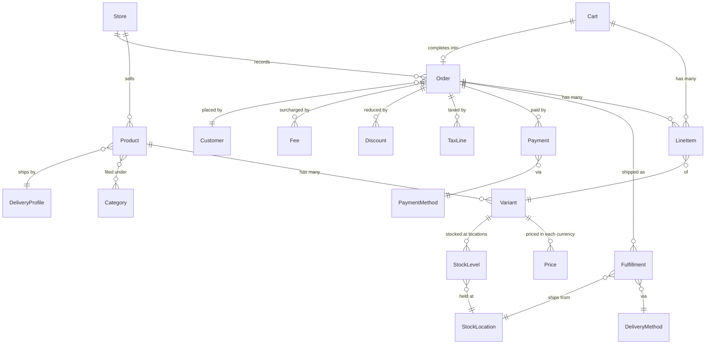
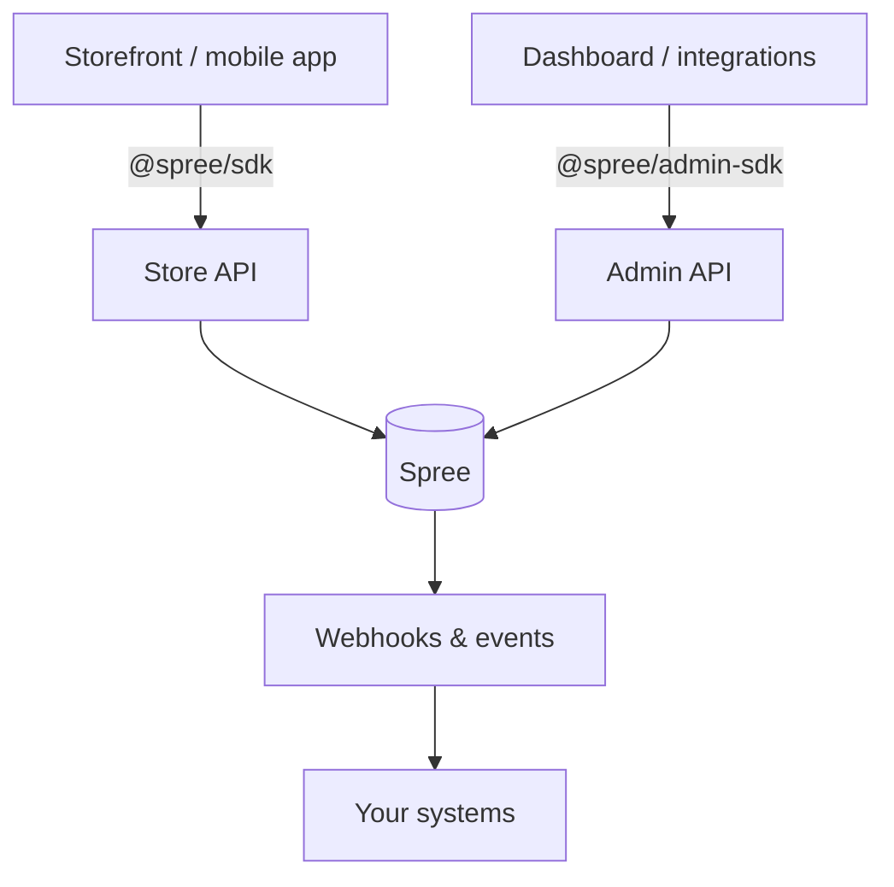

## Overview

Spree is a commerce engine you drive through a REST API. It holds the catalog, works out what a customer owes, takes the money, and tracks what was sent. You build the storefront, the mobile app, or the internal tool on top of it.

There is no built-in storefront you have to accept. Everything a customer-facing app needs is on the Store API, and everything a back office needs is on the Admin API. Both ship as typed TypeScript clients.

## The shape of a purchase

Four things carry a purchase from browsing to delivery. Each one has a job the others don't:

<CardGroup cols={2}>
  <Card title="Product" icon="package" href="/developer/core-concepts/products">
    What you sell. A product has variants — the actual buyable items, each with its own price and stock.
  </Card>
  <Card title="Cart" icon="shopping-cart" href="/developer/core-concepts/carts">
    What a customer is assembling. It changes constantly and is usually abandoned.
  </Card>
  <Card title="Order" icon="receipt" href="/developer/core-concepts/orders">
    What they committed to. A permanent financial record that must not change quietly.
  </Card>
  <Card title="Fulfillment" icon="truck" href="/developer/core-concepts/fulfillments">
    What actually ships. One parcel, from one location, with one tracking number.
  </Card>
</CardGroup>

```mermaid
flowchart LR
    Product --> Variant
    Variant --> Cart
    Cart -->|complete| Order
    Order --> Fulfillment
    Order --> Payment

    style Cart fill:#e3f2fd,stroke:#0077ff
    style Order fill:#e8f5e9,stroke:#2e7d32
```

**A cart and an order are separate records**, and that distinction shapes most of the API. A cart tolerates half-finished states — no address yet, no payment chosen. An order has to keep saying what the customer actually agreed to pay, so once it exists, today's prices and promotions can't quietly rewrite it. Completing a cart creates the order.

## How the pieces relate

```mermaid
erDiagram
    Store ||--o{ Product : "sells"
    Store ||--o{ Order : "records"

    Product ||--o{ Variant : "has many"
    Product }o--o{ Category : "filed under"
    Product }o--|| DeliveryProfile : "ships by"

    Variant ||--o{ Price : "priced in each currency"
    Variant ||--o{ StockLevel : "stocked at locations"
    StockLevel }o--|| StockLocation : "held at"

    Cart ||--o{ LineItem : "has many"
    Cart ||--o| Order : "completes into"
    LineItem }o--|| Variant : "of"

    Order ||--o{ LineItem : "has many"
    Order ||--o{ Fulfillment : "shipped as"
    Order ||--o{ Payment : "paid by"
    Order ||--o{ TaxLine : "taxed by"
    Order ||--o{ Discount : "reduced by"
    Order ||--o{ Fee : "surcharged by"
    Order }o--|| Customer : "placed by"

    Fulfillment }o--|| DeliveryMethod : "via"
    Fulfillment }o--|| StockLocation : "ships from"
    Payment }o--|| PaymentMethod : "via"
```

Three things in that diagram are worth calling out, because they're where Spree differs from what you might expect:

**Money added or removed is never one mixed list.** Tax, discounts and fees are three separate kinds of row. "What tax did we charge?" is a direct question with a direct answer instead of a filter over a mixed pile. See [Order totals](/developer/core-concepts/order-totals).

**Delivery is described by a profile, not a category.** A [delivery profile](/developer/core-concepts/fulfillments) says how a product travels — physically shipped, or digital — and which locations and methods serve it.

**Stock lives per location.** A variant has a stock level at each [stock location](/developer/core-concepts/inventory), so availability is a real question about real warehouses rather than a single number.

## The two APIs

```mermaid
flowchart TB
    Storefront["Storefront / mobile app"] -->|"@spree/sdk"| StoreAPI["Store API"]
    BackOffice["Dashboard / integrations"] -->|"@spree/admin-sdk"| AdminAPI["Admin API"]
    StoreAPI --> Spree[(Spree)]
    AdminAPI --> Spree
    Spree --> Webhooks["Webhooks & events"]
    Webhooks --> External["Your systems"]
```

| API | For | Authentication |
|---|---|---|
| [**Store API**](/api-reference/store-api/introduction) | Anything a customer touches — browsing, cart, checkout, their account | [Publishable key](/api-reference/store-api/authentication), plus a customer token once signed in |
| [**Admin API**](/api-reference/admin-api/introduction) | Anything staff or systems touch — catalog, orders, settings | [Secret key](/api-reference/admin-api/authentication) with scopes, or a staff token |

The split is about exposure, not convenience. A publishable key is safe in browser code because it can only reach what a shopper is allowed to see. A secret key never belongs in a browser.

Both APIs share the same filtering, pagination and error shapes, so what you learn on one carries to the other. Both return **prefixed IDs** — `prod_86Rf07xd4z`, `cart_k5nR8xLq` — so an ID tells you what it points at.

<Note>
Money is always a **string**: `"135.60"`, never `135.60`. JavaScript can't represent every decimal exactly — `0.1 + 0.2` gives `0.30000000000000004` — which is not something you want inside a price. Every amount also comes formatted for its currency as `display_total`, `display_price` and so on. Render the `display_` one.
</Note>

## Building on top

Spree assumes you'll extend it, and gives you three ways in that survive an upgrade:

| Approach | Use it for | Guide |
|---|---|---|
| **Webhooks** | Telling another system something happened — an ERP, a warehouse, an email tool | [Webhooks](/developer/core-concepts/webhooks) |
| **Custom fields** | Storing your own data on a product, order or customer without changing the schema | [Custom Fields](/developer/core-concepts/metafields) |
| **Providers** | Plugging in a real service for tax, delivery rates, payments or search | [Providers](/developer/providers/overview) |

For merchant-managed data, reach for [custom fields](/developer/core-concepts/metafields) before anything heavier — they're queryable and editable in the dashboard without touching code.

## Multi-store, multi-market, multi-seller

One Spree installation can run more than one business:

- **[Stores](/developer/core-concepts/stores)** are separate businesses — their own catalog, orders, customers and settings. Data does not cross between them.
- **[Channels](/developer/core-concepts/channels)** are the ways one store sells: a website, a mobile app, a retail till.
- **[Markets](/developer/core-concepts/markets)** are the regions a store sells into, each with its currency, locale and tax treatment.
- **[Sellers](/developer/core-concepts/products#seller-submissions)** let one store list goods from many vendors, for a marketplace.

## What you install

| Package | What it is |
|---|---|
| `spree` | The engine — catalog, checkout, payments, both APIs |
| `spree_emails` | Transactional email, if you don't send your own |
| `spree_dashboard` | The back-office dashboard |

Providers for search, delivery rates, tax and payments install separately, so you only carry what you use.

**TypeScript:**

| Package | What it is |
|---|---|
| [`@spree/sdk`](/developer/sdk/quickstart) | Store API client — for your storefront |
| [`@spree/admin-sdk`](/developer/sdk/admin/quickstart) | Admin API client — for back-office and integrations |
| [`@spree/cli`](/developer/cli/quickstart) | Command line for local setup and calling the Admin API |

<Info>
Spree runs on PostgreSQL, MySQL or SQLite. PostgreSQL is recommended for production — [database configuration](/developer/deployment/database).
</Info>

## Where to go next

<CardGroup cols={2}>
  <Card title="Quickstart" icon="rocket" href="/developer/getting-started/quickstart">
    Get an installation running.
  </Card>
  <Card title="Store SDK" icon="code" href="/developer/sdk/quickstart">
    Build a storefront against the Store API.
  </Card>
  <Card title="Products" icon="package" href="/developer/core-concepts/products">
    How the catalog is modelled.
  </Card>
  <Card title="Carts" icon="shopping-cart" href="/developer/core-concepts/carts">
    Cart, checkout, and what completion guarantees.
  </Card>
</CardGroup>
