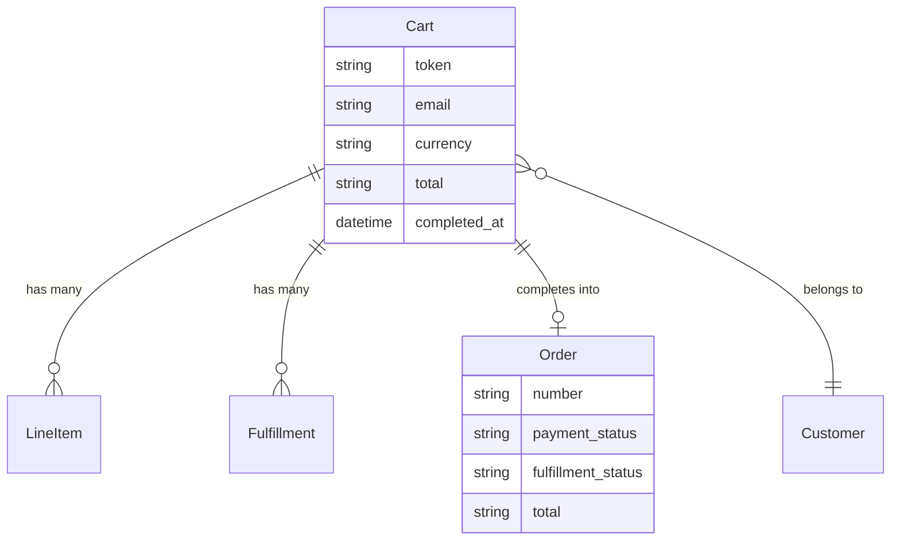

## Overview

A cart is everything that happens before a purchase is final: adding items, entering an address, choosing delivery, and paying. Completing a cart creates an [Order](/developer/core-concepts/orders) — a separate, permanent record.

The two are kept apart because they want opposite things. A cart changes constantly, tolerates half-finished states, and is often abandoned. An order is a financial record: it must not change quietly, and it has to keep saying what the customer actually agreed to pay.



## Cart attributes

| Attribute | Description |
|---|---|
| `id` | Cart ID, e.g. `cart_86Rf07xd4z` |
| `token` | Guest cart token — save it so a guest can return to their cart |
| `email` | Customer's email address |
| `currency` | Cart currency, e.g. `USD` |
| `total_quantity` | Total number of items |
| `requirements` | What the cart still needs before it can be completed |
| `item_total` / `display_item_total` | Sum of line item prices |
| `delivery_total` / `display_delivery_total` | Delivery cost |
| `tax_total` / `display_tax_total` | Total tax |
| `discount_total` / `display_discount_total` | Total discount |
| `total` / `display_total` | Cart total |
| `amount_due` / `display_amount_due` | Still to pay after store credit and gift cards |
| `warnings` | Items removed or changed since the customer last looked |
| `completed_at` | Set once checkout succeeded |

Every amount comes in two forms: `total` is the raw value (`"135.60"`) and [`display_total` is formatted for the currency](/api-reference/store-api/monetary-amounts) (`"$135.60"`). Render the `display_` one.

<Note>
Money is sent as a **string**, not a number. JavaScript numbers can't represent every decimal exactly — `0.1 + 0.2` gives `0.30000000000000004` — which is not something you want inside a price. Let Spree do the arithmetic and render the formatted strings.
</Note>

## Creating a cart and adding items

<CodeGroup>

```typescript Store SDK
// Create a cart
const cart = await client.carts.create()
// cart.token => "abc123" (save this for guest checkout)

// Add an item
await client.carts.items.create(cart.id, {
  variant_id: 'var_xxx',
  quantity: 2,
})

// Update quantity
await client.carts.items.update(cart.id, 'li_xxx', { quantity: 3 })

// Remove an item
await client.carts.items.delete(cart.id, 'li_xxx')
```

```bash cURL
# Create a cart
curl -X POST 'https://api.mystore.com/api/v3/store/carts' \
  -H 'X-Spree-API-Key: pk_xxx'

# Add an item
curl -X POST 'https://api.mystore.com/api/v3/store/carts/cart_xxx/items' \
  -H 'X-Spree-API-Key: pk_xxx' \
  -H 'X-Spree-Token: abc123' \
  -H 'Content-Type: application/json' \
  -d '{ "variant_id": "var_xxx", "quantity": 2 }'

# Update quantity
curl -X PATCH 'https://api.mystore.com/api/v3/store/carts/cart_xxx/items/li_xxx' \
  -H 'X-Spree-API-Key: pk_xxx' \
  -H 'X-Spree-Token: abc123' \
  -H 'Content-Type: application/json' \
  -d '{ "quantity": 3 }'
```

</CodeGroup>

Every change returns the whole cart with new totals, so you never need a second request to refresh the summary.

When a guest signs in, attach their cart to the account:

<CodeGroup>

```typescript Store SDK
await client.carts.associate(cartId, { spreeToken: 'abc123' })
```

```bash cURL
curl -X POST 'https://api.mystore.com/api/v3/store/carts/cart_xxx/associate' \
  -H 'X-Spree-API-Key: pk_xxx' \
  -H 'Authorization: Bearer $CUSTOMER_JWT' \
  -H 'X-Spree-Token: abc123'
```

</CodeGroup>

## Checkout requirements

A cart tells you what it still needs before it can be completed:

```json Response
{
  "requirements": [
    {
      "step": "address",
      "field": "email",
      "code": "email_required",
      "message": "Email address is required"
    }
  ]
}
```

Every entry has the same four fields. Branch on `code` — `message` is translated prose
meant for a person, and `step` is only a grouping hint.

This is what lets you design your own checkout. Spree tells you what's missing; you decide how and when to ask for it — one long page, a few steps, or whatever suits your storefront.

Seven checks run on every cart read:

| `code` | `step` | Raised when |
|---|---|---|
| `line_items_required` | `cart` | The cart is empty |
| `email_required` | `address` | No email address |
| `ship_address_required` | `address` | Something needs shipping and there is no address |
| `delivery_method_required` | `delivery` | A delivery method hasn't been chosen |
| `payment_required` | `payment` | The total isn't covered by payments |
| `po_number_required` | `address` | A company requires a purchase-order number |
| `order_minimum_not_met` | `cart` | Below the order minimum, with the shortfall in the message |

<Warning>
  **An empty `requirements` array does not guarantee completion will succeed.** What a
  cart reports is the *advisory* set. Completing one additionally checks stock
  (`out_of_stock`, `discontinued`), negotiated quantity rules
  (`quantity_rule_violated`) and the guest-checkout policy
  (`guest_checkout_not_allowed`) — each of which has to load line items, so they are
  held back to keep reading a cart cheap. Treat a failed completion as a normal path,
  not an exception.
</Warning>

### Checkout steps

A cart also reports a step list, so you can render a progress indicator:

<CodeGroup>

```typescript Store SDK
const cart = await client.carts.get(cartId)

cart.current_step     // "delivery"
cart.completed_steps  // ["address"]
```

```json Response
{
  "current_step": "delivery",
  "completed_steps": ["address"]
}
```

</CodeGroup>

Spree has no checkout state machine. The list is computed from the cart's own data,
and nothing on the server refuses a write because of where the customer appears to be
— you can set an address, choose delivery and attach a payment in any order.
`current_step` is simply the step of the first unmet requirement.

Five steps are built in, and three only appear when they apply:

| Step | Present when |
|---|---|
| `address` | Always |
| `delivery` | The cart has items and isn't entirely digital |
| `payment` | The total is above zero |
| `confirm` | A payment method asks for one, or the store always wants one |
| `complete` | Always |

So a free digital order reports `address` then `complete`. A storefront that hardcodes
five steps will show two that never apply.

<Note>
  Requirements use one grouping name that is not a step: **`cart`**. Missing line
  items, the order minimum and stock problems are filed under it, and there is no
  `cart` entry in the step list — `current_step` reports those as `address`. If you
  group requirements by `step` to place them on screens, give `cart` a home.
</Note>

Checkout introspection lives on the cart, not the order. An order has already been
placed, so `current_step` and `requirements` do not appear on it.

To add your own step or requirement, see
[Customizing checkout](/developer/customization/checkout).

## Checkout

<Steps>
  <Step title="Add the customer's details">
    ```typescript Store SDK
    await client.carts.update(cartId, {
      email: 'john@example.com',
      shipping_address: {
        first_name: 'John', last_name: 'Doe',
        address1: '123 Main St', city: 'Los Angeles',
        country_code: 'US', state_code: 'CA', postal_code: '90001',
      },
    })
    ```
  </Step>
  <Step title="Choose delivery">
    Each [fulfillment](/developer/core-concepts/fulfillments) offers delivery rates. Pick one per fulfillment.

    ```typescript Store SDK
    const cart = await client.carts.get(cartId)
    await client.carts.fulfillments.update(cartId, cart.fulfillments[0].id, {
      selected_delivery_rate_id: 'rate_xxx',
    })
    ```
  </Step>
  <Step title="Take payment">
    For providers like Stripe, create a payment session and confirm it with their own SDK.

    ```typescript Store SDK
    const session = await client.carts.paymentSessions.create(cartId, {
      payment_method_id: 'pm_xxx',
    })
    // session.external_data.client_secret => use with Stripe.js

    await client.carts.paymentSessions.complete(cartId, session.id)
    ```
  </Step>
  <Step title="Complete the cart">
    ```typescript Store SDK
    const order = await client.carts.complete(cartId)
    ```

    You get back an [Order](/developer/core-concepts/orders) — or, in a marketplace where the cart held several sellers' goods, an [order group](/developer/core-concepts/sellers#one-checkout-several-sellers) holding one order per seller. Tell them apart with `isOrderGroup` from `@spree/sdk`.
  </Step>
</Steps>

Discount codes, gift cards and store credit can be applied any time before completion:

<CodeGroup>

```typescript Store SDK
await client.carts.discountCodes.apply(cartId, 'SUMMER20')
await client.carts.giftCards.apply(cartId, 'GIFT-XXXX')
await client.carts.storeCredits.apply(cartId)
```

```bash cURL
curl -X POST 'https://api.mystore.com/api/v3/store/carts/cart_xxx/discount_codes' \
  -H 'X-Spree-API-Key: pk_xxx' \
  -H 'Content-Type: application/json' \
  -d '{ "code": "SUMMER20" }'
```

</CodeGroup>

## What completion guarantees

Completing a cart moves real money, so Spree is careful about it:

**Double submission is safe.** A customer double-clicking "Place order" gets the same order back rather than a second charge. This holds even when your app runs on several servers.

**An interrupted completion recovers.** If something dies after the customer was charged, trying again finishes the job instead of charging twice.

**Totals are worked out at the last moment.** The amount charged is calculated when the cart is completed, not taken from an earlier request — so a price or promotion that changed while the customer was reviewing can't lead to the wrong charge.

**The order keeps what the cart collected.** The customer, addresses, items, notes, purchase order number, tax identifier and the cart's `metadata` are all copied onto the order. When a checkout is split into one order per seller, every one of those orders receives the same copy. After that the cart and the order are independent — changing one never changes the other.

<Warning>
  A customer can write a cart's `metadata` through the Store API, so once it is copied onto the order, treat those keys as customer input. Do not keep anything there that your own code later trusts, such as a fraud or approval flag.
</Warning>

If a cart can't be completed you get told why — a payment failure, or unmet [requirements](#checkout-requirements) — and the cart is left alone so the customer can fix it and try again.

## Abandoned carts

Carts emit `cart.created`, `cart.updated` and `cart.deleted` [events](/developer/core-concepts/events), which also reach [webhooks](/developer/core-concepts/webhooks) — enough to drive abandonment email without polling for changes.

Completed carts are kept rather than deleted, and an order records which cart it came from, so you can measure conversion. Abandoned carts are cleared out on a schedule you control; carts with a payment in progress are never removed.

## Related

- [Orders](/developer/core-concepts/orders) — the record a cart becomes
- [Payments](/developer/core-concepts/payments) — payment methods and sessions
- [Fulfillments](/developer/core-concepts/fulfillments) — delivery options
