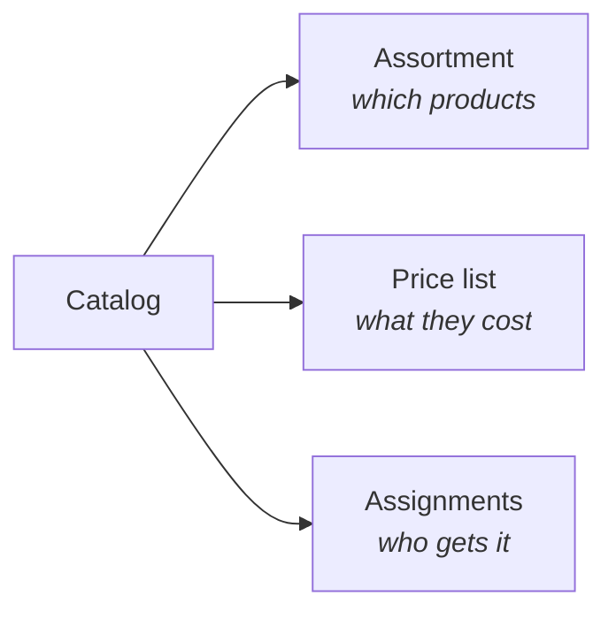
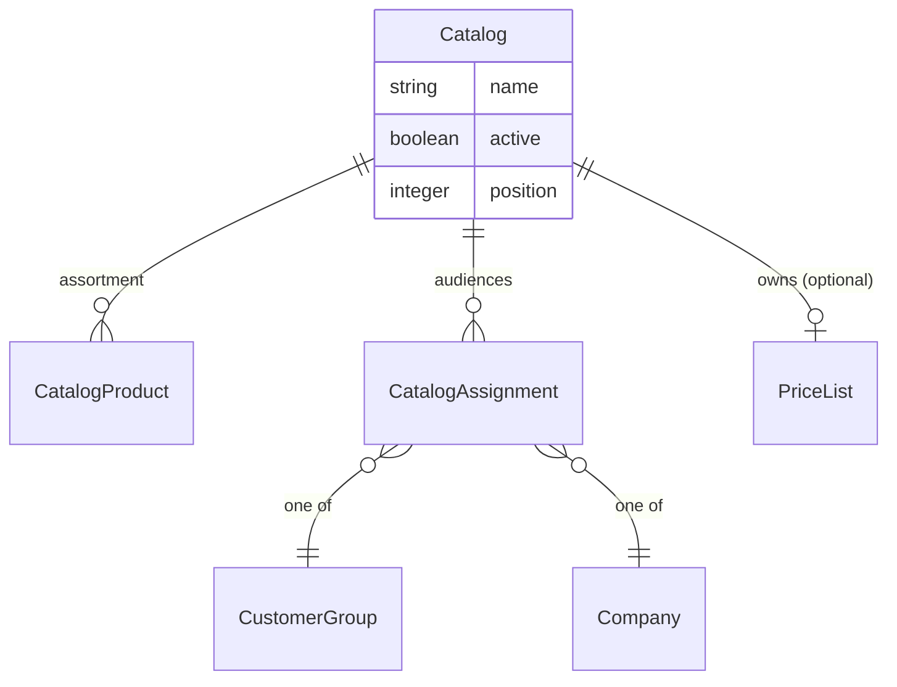

## Overview

Not every shopper should see the same store. A wholesale buyer gets trade prices and a range retail never sees. A negotiated account has its own agreed pricing. A retail till carries a subset of what the website does.

A catalog answers both halves of that at once: **what an audience sees**, and **what they pay**.





## The two modes

The single most useful thing to understand about catalogs is that an **empty assortment means something different from a full one** — it's the switch between the two ways a catalog is used.

<CardGroup cols={2}>
  <Card title="Pricing overlay" icon="tag">
    **Assortment empty.** Nothing is hidden — the audience browses the normal store — but the attached price list applies.

    This is how "this company sees everything, just at their negotiated prices" is expressed.
  </Card>
  <Card title="Restricted range" icon="filter">
    **Assortment has products.** The audience sees *only* what's in it.

    This is how a wholesale-only range, or a channel-specific selection, is expressed.
  </Card>
</CardGroup>

That's worth pausing on, because it's the one behaviour that surprises people: adding a product to an empty catalog doesn't add one item to what a customer sees — it switches the catalog into restricting mode, and they now see *only* that item.

## Creating one

```typescript Admin SDK
const catalog = await adminClient.catalogs.create({
  name: 'Wholesale',
  price_list_id: 'plist_xxx',
  active: true,
})
```

The price list is optional. A catalog with an assortment and no price list restricts the range at normal prices; a catalog with a price list and no assortment adjusts prices without hiding anything.

A price list is either **standalone** (matched by its own rules) or **owned by exactly one catalog** — attaching a list a catalog already claims moves it. Detaching (`price_list_id: null`) is an explicit act with a real consequence: a released list starts matching by its own rules again, and a rule-less one matches everyone.

### Filling the assortment

```typescript Admin SDK
// Add products (a bare array of IDs)
await adminClient.catalogs.products.create(catalog.id, ['prod_xxx', 'prod_yyy'])

const { data: products } = await adminClient.catalogs.products.list(catalog.id)

await adminClient.catalogs.products.delete(catalog.id, 'prod_xxx')
```

Membership is all a catalog holds — it decides *what* a buyer sees, never the order they see it in. Presentation order stays with categories and collections.

When a catalog should restrict to exactly what its price list covers, there's a shortcut that copies those products in rather than making someone add them by hand:

```typescript Admin SDK
const { added_count } = await adminClient.catalogs.importProducts(catalog.id)
```

## Choosing the audience

A catalog is assigned to a buyer audience:

| Assign to | Meaning |
|---|---|
| **[Customer group](/developer/core-concepts/customers)** | A segment — wholesale accounts, staff, a loyalty tier |
| **[Company](/developer/core-concepts/companies)** | One B2B organization |

A [Channel](/developer/core-concepts/channels) is not assigned — it names its catalog directly via `default_catalog_id`, which applies to everyone buying through it when nothing narrower does.

```typescript Admin SDK
await adminClient.catalogs.assign(catalog.id, {
  assignable_type: 'customer_group',
  assignable_id: 'cgrp_xxx',
})
```

<Note>
**A company assignment covers the whole subtree.** Assign the group-wide catalog once at the root of a [company tree](/developer/core-concepts/companies) and every division below inherits it — no re-assigning per branch. A branch can still add its own catalog on top.
</Note>

## What a shopper ends up seeing

When several catalogs could apply, they combine rather than compete:

<Steps>
  <Step title="Find the catalogs that apply">
    For a company buyer, that's the catalogs on their node **and its ancestors**. Otherwise their customer group's catalogs. Otherwise the channel's default catalog, if it has one.
  </Step>
  <Step title="Combine the assortments">
    The shopper sees the union of what those catalogs contain — so a division's extra catalog adds to the group's range rather than replacing it.
  </Step>
  <Step title="Any empty assortment lifts the restriction">
    If one applicable catalog is a pricing overlay, the restriction is off and the shopper sees the full range. An overlay is explicitly "don't hide anything", and that has to win — otherwise adding negotiated pricing would accidentally narrow someone's catalog.
  </Step>
</Steps>

Gated storefront access is checked before any of this — a shopper who has to sign in never reaches catalog resolution.

## How pricing resolves

Prices are checked in order, and the first match wins:

1. Price lists attached to the applicable catalogs, **nearest first** — the buyer's own company node before its parent's
2. Ordinary price lists whose rules match
3. The product's base price

Nearest-first is what lets a subsidiary hold a better-negotiated rate than the group's, without disturbing anyone else.

<Warning>
A price list owned by a catalog applies **because the catalog applies** — its own rules are not consulted, and it's excluded from ordinary rule matching.

That exclusion is load-bearing: a price list with no rules would otherwise match everyone, and one company's negotiated pricing would leak to the entire storefront. It also means a deactivated catalog's list goes **dormant** — turning the catalog off never releases its pricing to the whole store. Only explicitly detaching the list puts it back into rule matching.
</Warning>

## Related

- [Companies](/developer/core-concepts/companies) — B2B buyers and the subtree rule
- [Pricing](/developer/core-concepts/pricing) — price lists and rules
- [Products](/developer/core-concepts/products) — the catalog being narrowed
- [Channels](/developer/core-concepts/channels) — per-channel default catalogs
