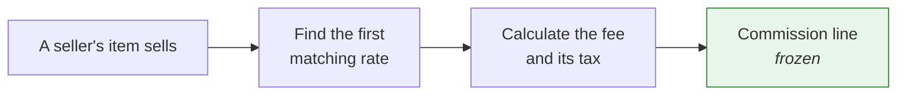
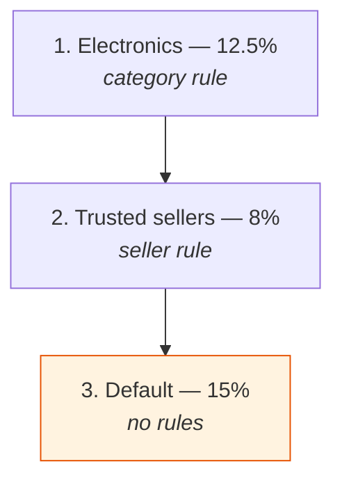

## Overview

A marketplace earns by taking a cut of what its sellers sell. Commissions are how you describe that cut and how Spree records what was actually charged.

There are two halves, and — as with [promotions and discounts](/developer/core-concepts/promotions) — keeping them apart is what makes the whole thing work:

| | |
|---|---|
| **Commission rate** | Configuration. What you charge, and when. Editable. |
| **Commission line** | The record of one charge on one sale. Frozen. |

Editing a rate changes what the *next* sale is charged and never what a past one was.



<Note>
**A commission is not a [fee](/developer/core-concepts/fees).** A fee is charged to the shopper and rolls into the order total. A commission is a settlement between the marketplace and the seller — the customer never sees it, and it never touches the order total.
</Note>

## Rates

A rate says what to charge. It's either a percentage of the sale or a flat amount.

```typescript Admin SDK
await adminClient.commissionRates.create({
  name: 'Electronics',
  code: 'electronics',
  kind: 'percentage',
  value: '12.5',
  enabled: true,
})
```

| Attribute | Description |
|---|---|
| `name` | What operators call it |
| `code` | An optional short handle, unique per store |
| `kind` | `percentage` or `fixed` |
| `value` | The percentage, for a percentage rate |
| `enabled` | Whether it's in play |
| `position` | Where it sits in the list — see below |
| `tax_inclusive` | Whether the fee is charged on the gross or net amount |
| `include_shipping` | Whether delivery is commissioned too |
| `commission_tax_rate` | An explicit tax rate for the fee, overriding the default |

## The list is the precedence

This is the most important thing to understand about commission rates, and it's deliberately different from how you might expect.

When a sale happens, Spree walks the store's enabled rates **in list order** and takes **the first one whose rules match**. There's no scoring, and no built-in hierarchy where a product rule beats a category rule.

<Info>
What an operator sees in the table is exactly what resolution does. A marketplace that wants a different answer drags a row up or down, rather than reasoning about which rule type counts as "more specific".
</Info>

Two consequences worth planning around:

**A rate with no rules matches everything.** That's how you express a default — and it belongs at the **bottom** of the list, because anything below it is unreachable.

**New rates are created at the top.** A rate is created to say something more specific than what's already there, and appending it below the catch-all would leave it dead on arrival.



If nothing matches, **no commission is charged**. That's a real answer, not a fallback — a marketplace with no rate covering a sale charges nothing rather than inventing a default nobody configured.

## Rules

Rules narrow when a rate applies. A rate can hold several, and **all of them must match** — while the IDs listed *within* one rule are alternatives.

So "electronics **and** these three sellers" is two rules on one rate.

```typescript Admin SDK
// Every rule kind, with the schema describing its settings — so an editor
// is built from what this marketplace actually has, not a hardcoded list
const { data: types } = await adminClient.commissionRates.ruleTypes()

await adminClient.commissionRates.update('crate_xxx', {
  rules: [
    { type: 'category_rule', preferences: { category_ids: ['ctg_xxx'] } },
    { type: 'seller_rule', preferences: { seller_ids: ['sel_xxx', 'sel_yyy'] } },
  ],
})
```

Rules are replaced wholesale on update — send the full set you want.

### The four rule types

<AccordionGroup>
  <Accordion title="Product rule — these specific products">
    Charges the rate only for the products named.

    Products are stored as real references rather than a list of IDs in a field, so a marketplace naming a thousand products stays workable.
  </Accordion>
  <Accordion title="Category rule — anything filed here">
    Charges the rate for products in the named categories.

    **A category matches its descendants too.** A rate on "Electronics" governs a camera under Electronics → Cameras, so you don't restate the rule every time someone adds a subcategory.
  </Accordion>
  <Accordion title="Seller rule — these sellers">
    Charges the rate only when the seller is one of those named. This is how a negotiated rate for a large vendor is expressed.

    A rule naming nobody narrows nothing — and rather than silently charging every seller, it's treated as not matching.
  </Accordion>
  <Accordion title="Item total rule — sales in a value band">
    Charges the rate only on sales within a value range. "15% under 50, 10% above" is two rates, each holding one of these.

    Bounds are **inclusive at the bottom and exclusive at the top**, so two bands can meet at a number without overlapping or leaving a gap.

    The band is weighed against exactly the same figure the fee is charged on, so a band can never admit a sale the fee then treats as worth something different.
  </Accordion>
</AccordionGroup>

One rule of each type per rate. Rules can only name products and sellers belonging to the same store — pointing one at another marketplace's catalog is refused rather than quietly ignored.

## What the fee is charged on

Two settings on the rate decide the base, and both matter more than they first appear.

### Gross or net

`tax_inclusive` decides whether the fee is charged on the amount including the customer's tax, or excluding it.

**The default is net**, and that default is deliberate: the customer's VAT isn't the seller's revenue, and charging commission on it would tax the same money twice under two different regimes.

Discounts come off either way. Commission is charged on what the customer actually paid, so a promotion is the seller's concession.

### Delivery

`include_shipping` adds a commission on the delivery charge as well as the goods.

<Warning>
A **flat** rate cannot commission delivery. A flat fee is charged per sale, so charging the same amount again on the parcel would double it. A marketplace wanting a flat charge on delivery states it as its own rate.
</Warning>

## Amounts and currencies

Money is stated per currency, never converted:

```typescript Admin SDK
// A percentage, with a floor and a cap in each currency
await adminClient.commissionRates.create({
  name: 'Standard',
  kind: 'percentage',
  value: 10,
  bounds: {
    USD: { min_amount: 1, max_amount: 50 },
    EUR: { min_amount: 1, max_amount: 45 },
  },
})

// A flat fee, stated per currency
await adminClient.commissionRates.create({
  name: 'Listing fee',
  kind: 'fixed',
  value: 0,
  amounts: { USD: '5.00', GBP: '4.00' },
})
```

- **`amounts`** — what a flat fee charges, per currency
- **`bounds`** — the floor and cap a percentage charges within, per currency

Both replace the whole set on write, and writing `bounds` never disturbs `amounts`.

Percentages and flat fees behave differently across currencies, for a good reason:

| | Behaviour in a currency with no stated amount |
|---|---|
| **Flat rate** | Doesn't apply — resolution falls through to the next rate. Converting one currency's figure into another would invent a fee nobody set. |
| **Percentage** | Still applies, uncapped. A ratio travels; its floor and cap don't. A marketplace that capped its dollar fees hasn't thereby said it wants no commission on euro sales. |

A flat fee is charged **per unit**, not per line. Otherwise buying three cameras together would earn a third of buying them separately — letting the shopper decide the marketplace's revenue.

## Tax on commission

The commission is the marketplace's own service to the seller. That's a separate taxable supply from the seller's sale to the customer, with its own place of supply — which is why the two taxes are worked out independently and never mix.

The tax rate is resolved in this order:

1. An explicit `commission_tax_rate` on the rate
2. The store's tax engine, using the **seller's** address
3. The store's default commission tax rate

<Warning>
Commission tax follows the **seller's** jurisdiction, not the shopper's. A German marketplace charging a French seller is a cross-border B2B supply, and the shopper's location has nothing to do with it.
</Warning>

Each line carries a `taxability_reason` — `standard_rated`, `zero_rated`, `reverse_charge` — using the same vocabulary as [tax lines](/developer/core-concepts/taxes) on goods. An invoice explaining why a marketplace fee was reverse-charged should use the same words as one explaining it for goods.

## Commission lines

When an order is placed, the resolved rate is applied and the result frozen as a commission line — one per item, plus one per delivery where the rate includes it.

| Attribute | Description |
|---|---|
| `amount` | The fee |
| `tax_amount` | Tax on the fee |
| `total` | The two added together |
| `rate` / `kind` | A snapshot of what was applied |
| `tax_rate` / `taxability_reason` | How it was taxed, and why |
| `country_code` / `state_code` | The seller's jurisdiction |
| `currency` | The sale's currency |
| `line_item_id` / `fulfillment_id` | What was commissioned — exactly one |
| `commission_rate_id` | The rate, if it still exists |

```typescript Admin SDK
const { data: lines } = await adminClient.commissionLines.list({
  filter: { seller_id_eq: 'sel_xxx' },
})
```

**Every field is a snapshot.** Editing the rate afterwards changes nothing here, and neither does deleting it — a retired rate is soft-deleted precisely so "which rate charged this" stays answerable.

There is **no write path**. Lines are read-only in the API, and correcting a charge means recording a reversal rather than editing history — the discipline any ledger needs.

## What this doesn't do

Commission lines say what the marketplace charged. They don't move money.

<Warning>
Open source has **no payout ledger**. Paying sellers means connecting a provider such as Stripe Connect, or building against the commission lines and [payment splits](/developer/core-concepts/sellers#one-checkout-several-sellers). Scheduled payout runs, refund clawbacks and reconciliation are Enterprise features.
</Warning>

## Related

- [Sellers](/developer/core-concepts/sellers) — marketplaces, order splitting and payment splits
- [Taxes](/developer/core-concepts/taxes) — the tax vocabulary commission lines share
- [Fees](/developer/core-concepts/fees) — buyer-facing charges, which commissions are not
- [Promotions](/developer/core-concepts/promotions) — the same rules-and-record split, on the buyer side
