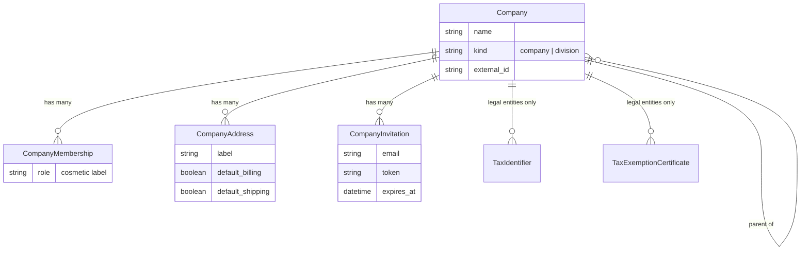
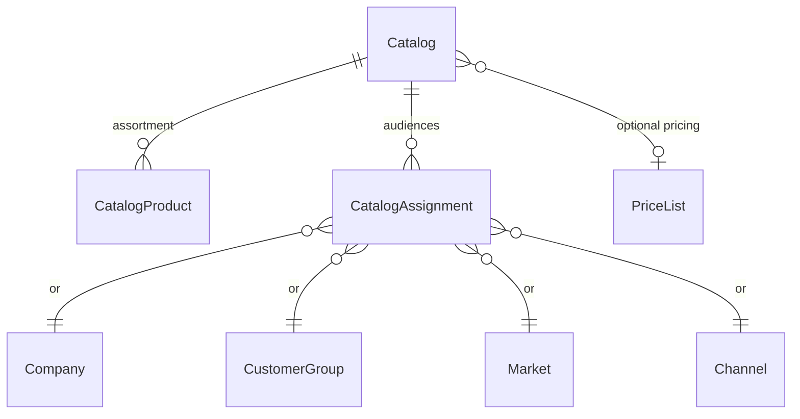

## Overview

A business customer in Spree is a **tree of company nodes**, not a flat account. One node can stand alone — a company with a few members and addresses — or grow into a group: subsidiaries, divisions, regional units, each with its own buyers and ship-to sites.

Three ideas carry the whole model:

- **The tree is structure.** `Spree::Company` is self-referential (`parent_id`), store-scoped, and shallow — depth is capped at five levels. How many ship-to sites a node has never dictates how many nodes exist; addresses are just an address book.
- **Nodes are typed, and the type decides tax.** A `company` node is a legal entity; a `division` is an organizational unit. Tax registrations and exemption certificates exist only on legal entities, and a purchase's tax always resolves through the node's `legal_entity` — the nearest self-or-ancestor `company` node. A division *is* its legal entity; a subsidiary never borrows its parent's registration.
- **Membership is standing over a subtree.** A `CompanyMembership` joins a customer to a node, and that standing covers the node and everything below it. Any authorization question — "may this customer act for node N?" — is a membership check on N and its ancestors, never an equality check on one node.

## Members and invitations

People join by email, from either side — staff in the dashboard or an existing member on the storefront. An email that matches a store customer becomes a membership immediately; an unknown email becomes a `Spree::CompanyInvitation` — a plaintext-token record with a 30-day expiry, whose invite email links to the storefront acceptance page. Accepting either registers a new account (through the standard customer-creation flow, with the invited email) or binds the invitation to the signed-in customer, and lands as a membership either way.

Memberships stay always-active and always customer-backed: the pending state lives on the invitation, never as a status on the membership.

**In open source, every member can do everything within their standing** — buy, see the subtree's purchases, manage addresses and members. There are no company roles; the `role` string on a membership is a cosmetic label. Finer control (roles, approvals, spending limits) is an Enterprise layer that enforces through the storefront access policy class (`Spree::Dependencies.storefront_access_policy_class`) and the checkout `validate` hooks — injection points that are deliberate no-ops in OSS.

## Purchases

Carts and orders carry a `company_id` pointing at any node — buying *for* a division means pointing at it. A buyer with exactly one membership resolves to it automatically; a buyer with several names the node on their cart (the `company_id` param on cart update, validated against their standing). The node is frozen onto the order at completion, like every other order attribute, so a placed order's tax treatment stays explainable no matter how the tree changes later.

Exemption certificates and the company's tax registration always resolve through `company.legal_entity` — see [Taxes, Discounts & Fees](/docs/developer/core-concepts/taxes-discounts-fees) for how they reach the tax provider.

## Catalogs

A `Spree::Catalog` narrows what an audience sees and — through an optional price list — what they pay.

- **Assortment** — a positioned product join. A catalog with no price list is assortment-only: it narrows what is visible, and base prices apply. Selecting a price list on a catalog whose assortment is still empty seeds the assortment from the list's products — one step for the common "the wholesale range is already priced" flow; a curated assortment is never touched.
- **Audiences** — assignments to a channel, a customer group, a market, or a company node. A company assignment covers the node's **subtree**: assign the group-wide catalog once at the root, and a branch adds its own extra catalog without re-assigning the shared one.
- **Visibility** — a buyer resolving to a company node sees the union of the effective catalogs on the node and its ancestors; otherwise their customer group's catalogs apply; otherwise every channel listing (narrowed to the channel's default catalog when one is set). Gated storefront access runs first — a login-gated guest never reaches this resolution.
- **Pricing** — the effective catalogs' price lists are checked nearest node first (the purchase node's own assignments before its parent's), then the ordinary rule-matched price lists, then base prices. A price list attached to a catalog applies *because the catalog applies* — its own rules are not consulted, and it is excluded from generic rule matching so a rule-less list cannot leak to every shopper.

## Storefront self-service

The Store API ships a full company directory for members: their memberships with ancestor paths (`GET /store/account/companies`), node details and renaming, the address book, members and invitations, and the subtree's completed orders. Authorization on every endpoint is **standing plus the access policy** — never roles, never CanCanCan. The deliberate trade-off: within a company, OSS trusts every member; merchants who need restraint layer the Enterprise governance on the same injection points, with no schema changes.
