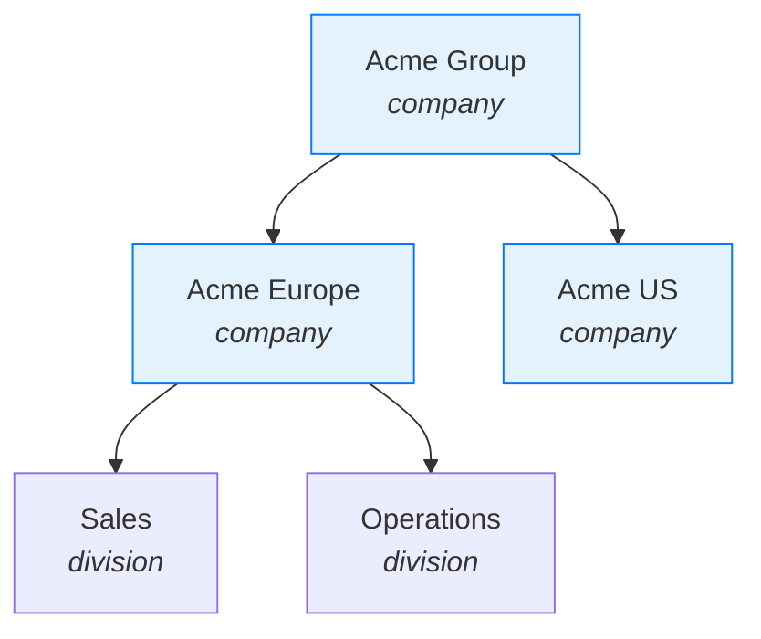
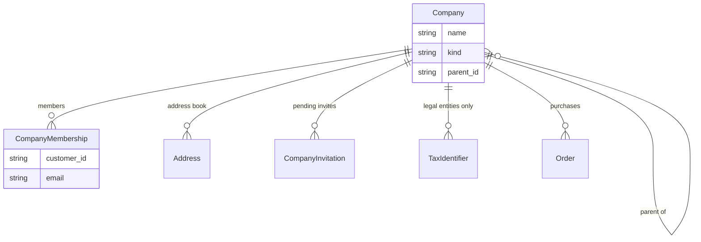
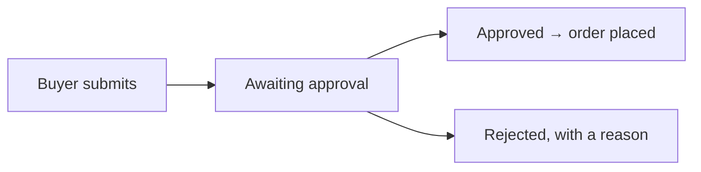

## Overview

Selling to businesses breaks an assumption most storefronts make: that a customer is a person. A business buyer is a person acting *for* an organization — one that has other buyers, several delivery sites, a VAT number, and a finance team who wants to see everything anyone ordered.

A company in Spree models that. And because real organizations aren't flat, a company can be a **tree**: a parent with subsidiaries, divisions, regional units, each with its own people and addresses.



A node is one of two kinds, and the difference is about tax, not hierarchy:

| Kind | What it is |
|---|---|
| `company` | A legal entity — it can hold a tax registration |
| `division` | An organizational unit inside one — it cannot |

Trees are capped at five levels, and the root must always be a `company`.



## Membership covers a subtree

Someone belongs to a company through a membership, and **that standing reaches everything below the node** — not just the node itself.

So a buyer attached to "Acme Europe" can act for Sales and Operations beneath it, without anyone creating three memberships. Give someone standing at the root and they cover the whole group.

This is why authorization always asks "does this person have standing on this node *or any of its ancestors*", never "is this person a member of exactly this node".

```typescript Store SDK
// Which companies can this customer act for?
const { data: memberships } = await client.account.companies()

memberships.forEach((m) => {
  m.company.name      // "Acme Europe"
  m.company.ancestors // [{ name: "Acme Group", … }] — the path above it
})
```

<Note>
**In open source, every member can do everything within their standing** — buy, see the subtree's orders, and manage addresses and members. There are no company roles; the `role` label on a membership is cosmetic.

To restrict what individual people may do, see [company governance](#company-governance) below.
</Note>

## Adding people

Both the dashboard and the storefront add members the same way — by email:

```typescript Store SDK
const result = await client.companies.members.create('comp_xxx', {
  customer_email: 'buyer@acme.com',
})
```

What comes back depends on whether that email is already a customer:

- **An existing customer** becomes a member straight away.
- **An unknown email** produces an invitation, valid for 30 days, and an email with a link.

You can tell which by the ID prefix — `cmem_` for a membership, `cinv_` for an invitation.

Accepting an invitation either signs an existing customer in, or registers a new account with the invited email. Either way it ends as a membership:

```typescript Store SDK
// The token comes from the invitation email — no sign-in needed to read it
const invitation = await client.companyInvitations.lookup(token)
invitation.company_name

await client.companyInvitations.accept(token, {
  first_name: 'Dana',
  last_name: 'Reid',
  password: 'a-strong-password',
})
```

Memberships are always active and always backed by a real customer. Anything still waiting lives on the invitation, so there's no such thing as a half-active member.

## Buying for a company

A cart and an order can name a company. That's what turns a personal purchase into a company one — it decides which addresses are on offer, whose tax registration applies, and who else will see the order.

```typescript Store SDK
await client.carts.update(cartId, { company_id: 'comp_xxx' })
```

A buyer with exactly one membership doesn't need to choose; it resolves on its own. A buyer who belongs to several names the node — and it must be one they have standing on.

The company is **frozen onto the order** at completion, like the addresses and prices. Reorganize the tree next year and last year's order still explains itself.

```typescript Store SDK
// Everything anyone in the subtree has bought
const { data: orders } = await client.companies.orders.list('comp_xxx')
```

That subtree rollup is the feature a finance team actually asks for: one place showing what the whole organization spent, without chasing individual accounts.

## The shared address book

A company keeps its own addresses — ship-to sites, a billing address — separate from any individual's. They're labelled, and one of each kind can be the default.

```typescript Store SDK
await client.companies.addresses.create('comp_xxx', {
  label: 'Northern Warehouse',
  first_name: 'Goods',
  last_name: 'Inwards',
  address1: '14 Dock Road',
  city: 'Rotterdam',
  country_code: 'NL',
  postal_code: '3011',
  default_shipping: true,
})
```

Note that a delivery site is just an address. Ten warehouses do not mean ten company nodes — nodes exist for organizational and legal structure, addresses for where things go.

## Tax

Tax registrations and exemption certificates live **only on legal entities**, and a purchase resolves tax through the node's nearest `company` ancestor.

```typescript Admin SDK
await adminClient.companies.taxIdentifiers.create('comp_xxx', {
  kind: 'eu_vat',
  value: 'NL123456789B01',
})

// Validation runs against the official registry, in the background
await adminClient.companies.taxIdentifiers.validate('comp_xxx', 'txid_xxx')
```

<Warning>
The walk stops at the first `company` node, **whether or not it holds a registration**. A subsidiary with no VAT number of its own therefore has none — it never quietly borrows its parent's, because in most jurisdictions that would be a false declaration.
</Warning>

Exemption certificates hang off a legal entity and are scoped to the country or state that issued them. Check whether a certificate is `active` rather than reading its status — a verified certificate stops exempting once it expires, and `active` accounts for that.

See [Taxes](/developer/core-concepts/taxes) for how these reach the tax calculation.

## Company governance

Open source deliberately trusts every member equally. That's the right default for a company of five people, and the wrong one for a company of five hundred — where a junior buyer should not be able to place a £40,000 order, remove their manager, or see what another division spent.

Company governance adds that control. It works through the same endpoints and the same data, so nothing about your storefront integration changes when it's switched on — the calls you already make simply start enforcing.

<Card title="Requires a Spree Enterprise licence" icon="lock" href="https://spreecommerce.org/enterprise/">
  Company roles, order approvals, spending limits and governance audit history are part of Spree Enterprise. See what's included, or talk to the team about your use case.
</Card>

### Company roles

Where open source has a cosmetic label, Enterprise has real roles built from a fixed set of capabilities:

| Capability | Allows |
|---|---|
| `place_orders` | Completing a purchase |
| `approve_orders` | Approving what others submit |
| `view_node_purchases` | Seeing this node's orders |
| `view_company_purchases` | Seeing the whole subtree's orders |
| `manage_company_members` | Adding and removing people |
| `manage_company_addresses` | Editing the address book |

Roles are **data, edited by the company's own administrator** rather than by your staff — the buying organization manages its own structure, which is the point of self-service. Guards prevent someone granting themselves more than they hold.

These are entirely separate from [staff roles](/developer/core-concepts/staff-roles). A company role never reaches anything belonging to the store.

### Order approvals

A member without `place_orders` submits their basket instead of completing it. Someone with `approve_orders` reviews and releases it.



Checkout returns a well-known `approval_required` response rather than a generic failure, so a storefront can show the right message and the right next step. The approval history is append-only — who asked, who decided, when.

### Spending limits

Limits are set per member or per node, with a reset period — £5,000 a month for a buyer, £50,000 for a division. They're enforced at completion, alongside approvals, so an over-limit basket is caught before payment rather than after.

### Restricted self-service

The same storefront endpoints — the company directory, address book, member management, order history — become capability-gated. A member without `view_company_purchases` sees their own node's orders and not the group's; a member without `manage_company_members` can read the team but not change it.

<Info>
**Nothing about the data model changes.** Governance enforces through a policy layer and the checkout validation hooks, over the same companies, memberships and endpoints described on this page. You can build a B2B storefront against open source today and have it work unchanged when governance is enabled.
</Info>

Payment terms and net invoicing, quotes, and a packaged buyer portal are on the Enterprise roadmap — [talk to the team](https://spreecommerce.org/enterprise/) if those matter to your timeline.

## Managing companies as staff

```typescript Admin SDK
// Roots only
const { data: roots } = await adminClient.companies.list({ parent_id_null: 1 })

// Children of one node
const { data: children } = await adminClient.companies.list({ parent_id_eq: 'comp_xxx' })

const division = await adminClient.companies.create({
  name: 'Sales',
  kind: 'division',
  parent_id: 'comp_xxx',
})
```

Moving a branch is an update with a new `parent_id`. Deleting a node removes its whole subtree, and is refused outright once any order exists beneath it — history doesn't get deleted to tidy up an org chart.

## Related

- [Catalogs](/developer/core-concepts/catalogs) — giving a company its own range and prices
- [Customers](/developer/core-concepts/customers) — the accounts memberships are built on
- [Taxes](/developer/core-concepts/taxes) — registrations and exemptions
- [Orders](/developer/core-concepts/orders) — company purchases
