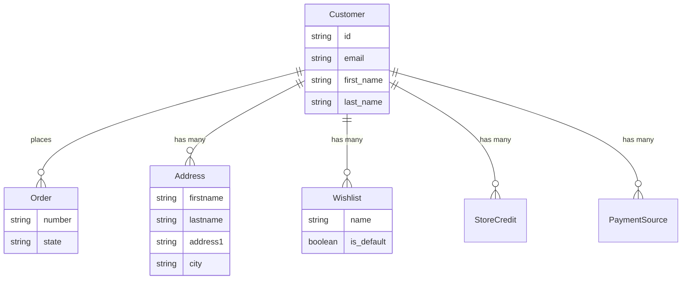

import { Since } from '/snippets/since.mdx';

## Overview

Customers interact with your store through the Store API. They can register, log in, manage their profile, and view order history.



## Registration

<CodeGroup>

```typescript SDK
const { token, user } = await client.customers.create({
  email: 'john@example.com',
  password: 'password123',
  password_confirmation: 'password123',
  first_name: 'John',
  last_name: 'Doe',
})
// token => JWT token for subsequent authenticated requests
// user => { id: "usr_xxx", email: "john@example.com", first_name: "John", ... }
```

```bash cURL
curl -X POST 'https://api.mystore.com/api/v3/store/customers' \
  -H 'X-Spree-Api-Key: pk_xxx' \
  -H 'Content-Type: application/json' \
  -d '{
    "email": "john@example.com",
    "password": "password123",
    "password_confirmation": "password123",
    "first_name": "John",
    "last_name": "Doe"
  }'
```

</CodeGroup>

## Login

<CodeGroup>

```typescript SDK
const { token, user } = await client.auth.login({
  email: 'john@example.com',
  password: 'password123',
})
// Use the token for authenticated requests
```

```bash cURL
curl -X POST 'https://api.mystore.com/api/v3/store/auth/login' \
  -H 'Authorization: Bearer pk_xxx' \
  -H 'Content-Type: application/json' \
  -d '{
    "email": "john@example.com",
    "password": "password123"
  }'
```

</CodeGroup>

The response includes a JWT `token` and a `user` object. Pass the token in subsequent requests via the `Authorization: Bearer <token>` header.

## Token Refresh

Refresh an expiring token to keep the session alive:

<CodeGroup>

```typescript SDK
const { token } = await client.auth.refresh({
  token: existingToken,
})
```

```bash cURL
curl -X POST 'https://api.mystore.com/api/v3/store/auth/refresh' \
  -H 'Authorization: Bearer <jwt_token>'
```

</CodeGroup>

## Password Reset

Password reset is a two-step flow. First, request a reset email. Then, use the token from the email to set a new password.

### Step 1: Request Reset

<CodeGroup>

```typescript SDK
await client.customer.passwordResets.create({
  email: 'john@example.com',
  redirect_url: 'https://myshop.com/reset-password',
})
// Always returns { message: "..." } — even if the email doesn't exist
// This prevents email enumeration
```

```bash cURL
curl -X POST 'https://api.mystore.com/api/v3/store/customer/password_resets' \
  -H 'X-Spree-Api-Key: pk_xxx' \
  -H 'Content-Type: application/json' \
  -d '{
    "email": "john@example.com",
    "redirect_url": "https://myshop.com/reset-password"
  }'
```

</CodeGroup>

The optional `redirect_url` parameter specifies where the password reset link in the email should point to. The token will be appended as a query parameter (e.g., `https://myshop.com/reset-password?token=...`). If the store has [Allowed Origins](/developer/core-concepts/allowed-origins) configured, the `redirect_url` must match one of them.

This fires a `customer.password_reset_requested` event with the reset token in the payload. If you're using the `spree_emails` package, the email is sent automatically. Otherwise, subscribe to this event to send the reset email yourself (see [Events](/developer/core-concepts/events)).

### Step 2: Reset Password

<CodeGroup>

```typescript SDK
const { token, user } = await client.customer.passwordResets.update(
  'reset-token-from-email',
  {
    password: 'newsecurepassword',
    password_confirmation: 'newsecurepassword',
  }
)
// Returns JWT token + user (auto-login)
```

```bash cURL
curl -X PATCH 'https://api.mystore.com/api/v3/store/customer/password_resets/RESET_TOKEN' \
  -H 'X-Spree-Api-Key: pk_xxx' \
  -H 'Content-Type: application/json' \
  -d '{
    "password": "newsecurepassword",
    "password_confirmation": "newsecurepassword"
  }'
```

</CodeGroup>

On success, the user is automatically logged in and a JWT token is returned. The reset token expires after 15 minutes (configurable via `Spree::Config.customer_password_reset_expires_in`) and is single-use (changing the password invalidates it).

## Newsletter Subscriptions

<Since version="5.5" />

Headless storefronts often need to collect newsletter signups before account creation (footer forms, popup overlays). The Store API exposes a double opt-in subscription flow that mirrors the password reset webhook pattern.

### Step 1: Subscribe

<CodeGroup>

```typescript SDK
await client.newsletterSubscribers.create({
  email: 'guest@example.com',
  redirect_url: 'https://myshop.com/newsletter/confirm',
})
// Returns the NewsletterSubscriber (verified: false for guests)
```

```bash cURL
curl -X POST 'https://api.mystore.com/api/v3/store/newsletter_subscribers' \
  -H 'X-Spree-Api-Key: pk_xxx' \
  -H 'Content-Type: application/json' \
  -d '{
    "email": "guest@example.com",
    "redirect_url": "https://myshop.com/newsletter/confirm"
  }'
```

</CodeGroup>

The optional `redirect_url` points at the storefront page that will receive the verification token. It is validated against the store's [Allowed Origins](/developer/core-concepts/allowed-origins) — URLs that do not match are silently dropped from the webhook payload (secure-by-default).

This fires a `newsletter_subscriber.subscription_requested` event whose payload includes `email`, `verification_token`, and the validated `redirect_url`. Subscribe to this event from your storefront's webhook handler to send the confirmation email — the link in the email should point to `<redirect_url>?token=<verification_token>`. The bundled `spree_emails` package also listens to this event and sends a default confirmation email if you're not running a headless storefront.

If the request is authenticated via a customer JWT and the JWT's email matches the subscribed email, the subscription is **auto-verified** and no event is fired (the user has already proven email ownership).

### Step 2: Verify

<CodeGroup>

```typescript SDK
await client.newsletterSubscribers.verify({
  token: 'token-from-email',
})
// Returns the verified NewsletterSubscriber
```

```bash cURL
curl -X POST 'https://api.mystore.com/api/v3/store/newsletter_subscribers/verify' \
  -H 'X-Spree-Api-Key: pk_xxx' \
  -H 'Content-Type: application/json' \
  -d '{ "token": "token-from-email" }'
```

</CodeGroup>

On success, the subscriber is marked verified. If the subscription is linked to a customer record, that customer's `accepts_email_marketing` flag is also set to `true`. Consent is preserved across registration: if a guest subscribes and later registers with the same email, the existing subscriber is reused — registration won't accidentally reset their opt-in state.

## Customer Profile

<CodeGroup>

```typescript SDK
// Get current customer
const customer = await client.customer.get()
// {
//   id: "usr_xxx",
//   email: "john@example.com",
//   first_name: "John",
//   last_name: "Doe",
//   default_shipping_address: { ... },
//   default_billing_address: { ... },
//   addresses: [{ ... }, { ... }],
// }

// Update profile
const updated = await client.customer.update({
  first_name: 'Jonathan',
  accepts_email_marketing: true,
})
```

```bash cURL
# Get current customer
curl 'https://api.mystore.com/api/v3/store/customer' \
  -H 'Authorization: Bearer <jwt_token>'

# Update profile
curl -X PATCH 'https://api.mystore.com/api/v3/store/customer' \
  -H 'Authorization: Bearer <jwt_token>' \
  -H 'Content-Type: application/json' \
  -d '{ "first_name": "Jonathan", "accepts_email_marketing": true }'
```

</CodeGroup>

## Customer Resources

Authenticated customers have access to these resources:

| Resource | Description |
|----------|-------------|
| [**Addresses**](/developer/core-concepts/addresses#customer-address-book) | Billing and shipping addresses with default selection |
| [**Orders**](/developer/core-concepts/orders#order-history) | Past order history |
| **Credit Cards** | Saved credit cards for checkout |
| **Payment Sources** | Other saved payment methods (PayPal, Klarna, etc.) |
| **Store Credits** | Balance assigned by the store, usable at checkout |
| **Gift Cards** | Gift cards owned by or assigned to the customer |
| **Wishlists** | Saved product lists |

## Guest Checkout

Customers don't need to register to purchase. Guest checkout uses an order token (`X-Spree-Token`) to identify the cart. See [Orders — Cart](/developer/core-concepts/orders#cart) for details.

## Related Documentation

- [Addresses](/developer/core-concepts/addresses) — Customer address management
- [Orders](/developer/core-concepts/orders) — Order history and checkout
- [Authentication](/developer/customization/authentication) — Custom authentication setup
- [Staff & Roles](/developer/core-concepts/staff-roles) — Admin users and permissions
