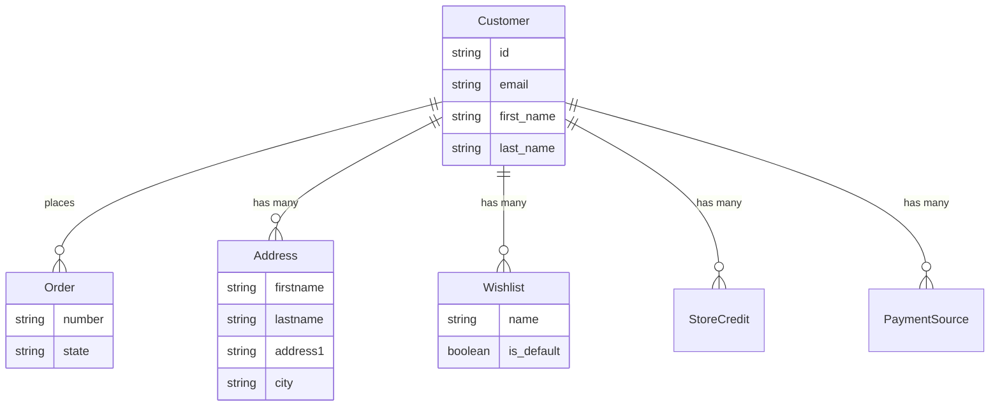

## Overview

Customers interact with your store through the Store API. They can register, log in, manage their profile, and view order history.



## Registration

<CodeGroup>

```typescript SDK
const { token, user } = await client.store.auth.register({
  email: 'john@example.com',
  password: 'password123',
  password_confirmation: 'password123',
  first_name: 'John',
  last_name: 'Doe',
})
// token => JWT token for subsequent authenticated requests
// user => { id: "usr_xxx", email: "john@example.com", first_name: "John", ... }
```

```bash cURL
curl -X POST 'https://api.mystore.com/api/v3/store/auth/register' \
  -H 'Authorization: Bearer spree_pk_xxx' \
  -H 'Content-Type: application/json' \
  -d '{
    "email": "john@example.com",
    "password": "password123",
    "password_confirmation": "password123",
    "first_name": "John",
    "last_name": "Doe"
  }'
```

</CodeGroup>

## Login

<CodeGroup>

```typescript SDK
const { token, user } = await client.store.auth.login({
  email: 'john@example.com',
  password: 'password123',
})
// Use the token for authenticated requests
```

```bash cURL
curl -X POST 'https://api.mystore.com/api/v3/store/auth/login' \
  -H 'Authorization: Bearer spree_pk_xxx' \
  -H 'Content-Type: application/json' \
  -d '{
    "email": "john@example.com",
    "password": "password123"
  }'
```

</CodeGroup>

The response includes a JWT `token` and a `user` object. Pass the token in subsequent requests via the `Authorization: Bearer <token>` header.

## Token Refresh

Refresh an expiring token to keep the session alive:

<CodeGroup>

```typescript SDK
const { token } = await client.store.auth.refresh({
  token: existingToken,
})
```

```bash cURL
curl -X POST 'https://api.mystore.com/api/v3/store/auth/refresh' \
  -H 'Authorization: Bearer <jwt_token>'
```

</CodeGroup>

## Customer Profile

<CodeGroup>

```typescript SDK
// Get current customer
const customer = await client.store.customer.get()
// {
//   id: "usr_xxx",
//   email: "john@example.com",
//   first_name: "John",
//   last_name: "Doe",
//   default_shipping_address: { ... },
//   default_billing_address: { ... },
//   addresses: [{ ... }, { ... }],
// }

// Update profile
const updated = await client.store.customer.update({
  first_name: 'Jonathan',
  accepts_email_marketing: true,
})
```

```bash cURL
# Get current customer
curl 'https://api.mystore.com/api/v3/store/customer' \
  -H 'Authorization: Bearer <jwt_token>'

# Update profile
curl -X PATCH 'https://api.mystore.com/api/v3/store/customer' \
  -H 'Authorization: Bearer <jwt_token>' \
  -H 'Content-Type: application/json' \
  -d '{ "first_name": "Jonathan", "accepts_email_marketing": true }'
```

</CodeGroup>

## Customer Resources

Authenticated customers have access to these resources:

| Resource | Description |
|----------|-------------|
| [**Addresses**](/developer/core-concepts/addresses#customer-address-book) | Billing and shipping addresses with default selection |
| [**Orders**](/developer/core-concepts/orders#order-history) | Past order history |
| **Credit Cards** | Saved credit cards for checkout |
| **Payment Sources** | Other saved payment methods (PayPal, Klarna, etc.) |
| **Store Credits** | Balance assigned by the store, usable at checkout |
| **Gift Cards** | Gift cards owned by or assigned to the customer |
| **Wishlists** | Saved product lists |

## Guest Checkout

Customers don't need to register to purchase. Guest checkout uses an order token (`X-Spree-Order-Token`) to identify the cart. See [Orders — Cart](/developer/core-concepts/orders#cart) for details.

## Related Documentation

- [Addresses](/developer/core-concepts/addresses) — Customer address management
- [Orders](/developer/core-concepts/orders) — Order history and checkout
- [Authentication](/developer/customization/authentication) — Custom authentication setup
- [Staff & Roles](/developer/core-concepts/staff-roles) — Admin users and permissions
