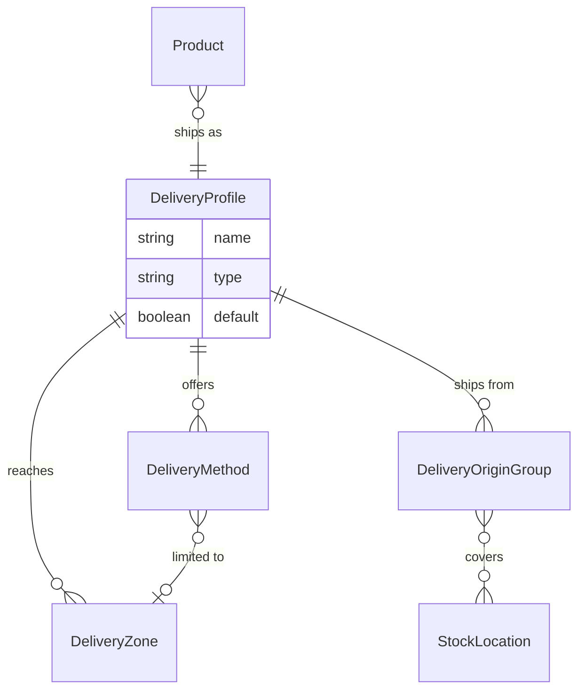

## Overview

Four pieces decide what a customer is offered at checkout:

| Piece | Question it answers |
|---|---|
| **Delivery profile** | How does this product ship at all? |
| **Delivery zone** | Where can it go? |
| **Delivery method** | What does the customer pick? |
| **Rate provider** | What does it cost? |

A product belongs to one profile. The profile decides which methods are even
possible, the zone decides where they apply, and the rate provider prices them.



## Delivery profiles

A **delivery profile** is how a product ships. Every product has exactly one,
and it is required — a new product gets its product type's profile, or the
store default.

Two kinds ship with Spree:

| Kind | Behaviour |
|---|---|
| `DeliveryProfiles::Shipping` | Physical goods. Offers carriers and counters, produces a parcel |
| `DeliveryProfiles::Digital` | Downloads and entitlements. No address, no carrier, available on payment |

Whether checkout collects a shipping address is decided by the methods on the
profile rather than the kind, so a shipping profile offering only click-and-
collect asks for no address either.

This is what lets one order contain a vinyl record and its download without
special handling in your storefront: the cart splits by profile, so the
download is ready immediately and the record gets a tracking number. A cart
holding only digital goods skips the delivery step at checkout entirely.

A profile also decides **where a product ships from**, through its origin
groups. A group is a named set of stock locations with its own zones and
methods, so "ships from the EU warehouse" and "ships from the US warehouse"
can offer different carriers at different prices. With no groups, every
location qualifies.

That is how a store with a refrigerated warehouse keeps chilled goods from
being picked at a dry one: order routing only allocates from locations the
profile covers.

```typescript Admin SDK
// What profiles the store has
const profiles = await adminClient.deliveryProfiles.list()

// Ship a product as a download
await adminClient.products.update('prod_xxx', {
  delivery_profile_id: 'dp_digital',
})
```

<Note>
Profiles are a template at creation time, not a live binding: changing a
profile does not rewrite products already assigned to it. Reassign a product
explicitly when it should ship differently.
</Note>

## Delivery methods and zones

A **delivery method** is what the customer picks — "Standard", "Express", "Collect in store". A **delivery zone** decides where it's available.

Zones match on country and state, and also on postal code prefixes and ranges, so you can offer same-day delivery to a handful of city postcodes without listing every one:

```typescript Admin SDK
await adminClient.deliveryZones.create({
  name: 'London same-day',
  members: [
    { member_type: 'postal_code', country_code: 'GB', postal_code_prefix: 'SW1' },
    { member_type: 'postal_code', country_code: 'GB', postal_code_from: 'EC1A', postal_code_to: 'EC1V' },
  ],
})
```

A zone member is either a whole country, a state, or a postal code prefix or range.

<Note>
Delivery zones cover delivery only. Tax is handled separately — see [Taxes](/developer/core-concepts/taxes).
</Note>

### Pricing and rules

Delivery is priced either by a rule you configure in the dashboard — flat rate, per item, price bands — or by asking a carrier for live rates.

Methods can also carry conditions that decide when they're offered at all: free shipping over a certain order value, or heavy items excluded from letter post. These are applied in one place, so both kinds of pricing respect them.

## Rates

A method is priced one of two ways, and the choice is per method:

- **A calculator** you configure — flat rate, per item, price bands. Predictable,
  no network call, no carrier account. See [calculators](/developer/core-concepts/calculators).
- **A rate provider** that asks a carrier what this parcel actually costs.
  See [EasyPost](/integrations/shipping/easypost), or write your own with
  [custom delivery rate providers](/developer/how-to/custom-delivery-rate-provider).

A carrier-priced method returns one option per service, so a single "Carrier
rates" method can offer Ground, 2-Day and Overnight as separate choices.

## Packaging

Every quote needs to know what the goods travel in. A carrier charges by
dimensional weight as well as actual weight, so the size of the box matters to
the price, and the empty box's own weight has to be added to what it holds —
otherwise every parcel is quoted light.

Package types are that vocabulary: the box parcels ship in, and for wholesale,
the cartons products are packed into and the pallets or containers an order
leaves on.

```typescript Admin SDK
await adminClient.packageTypes.create({
  name: 'Standard mailer',
  kind: 'box',
  length: 30, width: 20, height: 15, dimensions_unit: 'cm',
  weight: 0.4, weight_unit: 'kg',
  default: true,
})
```

One row is marked `default`, and that is the box quotes are built on. Marking
another one default demotes the first, so there is never more than one.

Measurements are optional individually, which is how a merchant records what
they know. A box with no dimensions still contributes its weight; a box with
nothing measured contributes nothing, and dimensional pricing has nothing to
work from.

<Note>
Deleting the default box is refused, and so is switching its flag off when
nothing else would take it. Both would leave quotes with no size and no tare,
which under-prices bulky parcels silently rather than failing.
</Note>

### On a marketplace

A seller packs their own goods, in their own boxes, from their own warehouse.
So packaging has an owner: rows created by the operator are the marketplace's,
and each seller has their own.

A parcel is quoted with the box belonging to whoever's warehouse it left,
falling back to the marketplace's when a seller has not recorded one. Sellers
manage theirs through the Seller API, and can also pack products into the
marketplace's cartons — those they read but cannot change.

```typescript Seller SDK
// Their own packaging — what the seller panel's settings page lists.
const { data: mine } = await sellerClient.packageTypes.list({ owner: 'mine' })

// Their own plus the marketplace's, which is what a carton picker wants.
const { data: available } = await sellerClient.packageTypes.list()

available.forEach((row) => {
  row.name
  row.editable   // false on the marketplace's own rows
  row.default    // this seller's default box
})
```

A seller's settings page asks for `owner: 'mine'`. A list mixing both owners
reads as "packaging is configured" while the seller has recorded nothing of
their own, which makes the shipping-box requirement look broken rather than
outstanding. Where a seller genuinely benefits from the marketplace's rows —
choosing the carton a product is packed into — the unfiltered list is what
the picker reads.

Because the fallback keeps checkout working, a seller who never opens the page
would quietly ship with someone else's measurements. The **shipping box**
onboarding requirement is what asks them for it: it is satisfied by a default
box of their own with all three dimensions and a weight recorded. See
[sellers](/developer/core-concepts/sellers#onboarding-requirements).

## Related

- [Fulfillments](/developer/core-concepts/fulfillments) — what happens to the parcel afterwards
- [Calculators](/developer/core-concepts/calculators) — how a price is worked out
- [EasyPost](/integrations/shipping/easypost) — live carrier rates and labels
- [Selling digital products](/developer/how-to/sell-digital-products) — the digital profile end to end
