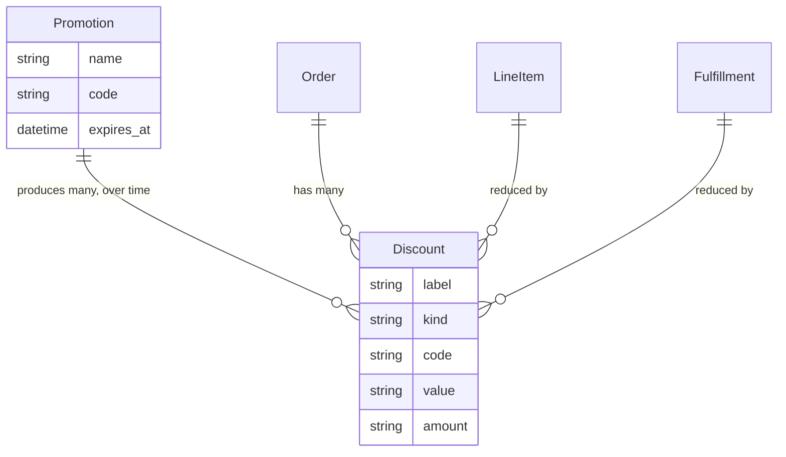

## Overview

A discount is one line on one order saying money came off, and why.

<Note>
**A discount is not a promotion.** A [promotion](/developer/core-concepts/promotions) is a *rule* — "20% off shoes in July" — that exists on its own, before anybody buys anything. A discount is the *result* on a particular order.

Think of the promotion as the sign in the shop window and the discount as the line on the receipt. One promotion produces thousands of discounts over its life.
</Note>

That separation is what lets an order stay truthful. The promotion can be edited, paused or deleted next month; the discount row on last month's order still says exactly what that customer was given.

It also means **not every discount has a promotion behind it.** When a support agent takes $10 off as a goodwill gesture, that's a discount with no campaign attached — which is what the `kind` field distinguishes.



| | [Promotion](/developer/core-concepts/promotions) | Discount |
|---|---|---|
| What it is | A campaign rule | A row on one order |
| Exists | Before any order | Only once money comes off |
| How many | One | One per order it applies to |
| Can change later | Yes — edit or end it | No — it's a financial record |
| Set up by | A merchant, in advance | Created automatically, or by staff |

## Discount attributes

| Attribute | Description |
|---|---|
| `label` | What the customer sees — `Summer Sale` |
| `kind` | `promotion` or `manual` |
| `code` | The coupon code used, if there was one |
| `value` / `value_type` | The rule behind it — `"10"` and `percent` |
| `amount` / `display_amount` | What actually came off, as a negative amount |
| `promotion_id` | The promotion responsible, for promotion discounts |
| `line_item_id` / `fulfillment_id` | What it reduced |

Note the difference between `value` and `amount`. `value` is the rule — "10 percent". `amount` is the money — "-$12.00". You need the rule to explain the discount and the amount to add up the order.

## Reading discounts on an order

Whatever produced them, the rows read the same way:

```typescript Store SDK
const cart = await client.carts.get(cartId)

cart.display_discount_total // "-$12.00"

cart.discounts.forEach((discount) => {
  discount.label          // "Summer Sale"
  discount.kind           // "promotion" or "manual"
  discount.code           // "SUMMER20", when a code was used
  discount.display_amount // "-$12.00"
})
```

Applying a coupon code, and what decides whether it's accepted, belongs to [Promotions](/developer/core-concepts/promotions).

## Manual discounts

Sometimes there's no promotion — a price match, an apology for a late delivery. Staff can add a discount directly:

<CodeGroup>

```typescript Admin SDK
// 10% off one line item
await adminClient.orders.discounts.create('or_xxx', {
  label: 'Goodwill discount',
  value: '10',
  value_type: 'percent',
  line_item_id: 'li_xxx',
})

// A flat amount across the order
await adminClient.orders.discounts.create('or_xxx', {
  label: 'Price match',
  value: '15.00',
  value_type: 'flat',
})
```

```bash cURL
curl -X POST 'https://api.mystore.com/api/v3/admin/orders/or_xxx/discounts' \
  -H 'X-Spree-API-Key: sk_xxx' \
  -H 'Content-Type: application/json' \
  -d '{ "label": "Goodwill discount", "value": "10", "value_type": "percent" }'
```

</CodeGroup>

<Warning>
Only **manual** discounts can be edited or deleted. Changing one that came from a promotion returns a `422`.

That row belongs to the promotion that created it. If staff could edit it, an order would start disagreeing with the promotion it claims to have used — and the reporting behind "how did the summer sale do" stops adding up.
</Warning>

## How a discount is spread

An order-level discount isn't kept as one lump sum. It's divided across the items it applied to, in proportion to what they cost.

This looks like an implementation detail until someone returns one item out of three. Then the question is: how much of that $30 discount belonged to the returned shirt? If the discount were one lump, you'd have to guess. Because it was spread at the time, the answer is already recorded, and the refund is right without anyone doing arithmetic on the phone.

The same reasoning applies to tax — the tax on a partially returned order follows the same split.

## Discounts on placed orders

Once an order exists, its discounts stop being regenerated. Editing a placed order re-applies the rows it already has rather than re-running today's promotions.

The alternative would mean an order quietly changing because a sale ended overnight — which is indefensible to a customer holding a confirmation email.

## Related

- [Promotions](/developer/core-concepts/promotions) — the rules that create most discounts
- [Order totals](/developer/core-concepts/order-totals) — how discounts roll into the total
- [Gift cards & store credit](/developer/core-concepts/store-credits-gift-cards) — payment, not discount
- [Returns](/developer/core-concepts/returns-exchanges-claims) — how a discount is unwound on a return
