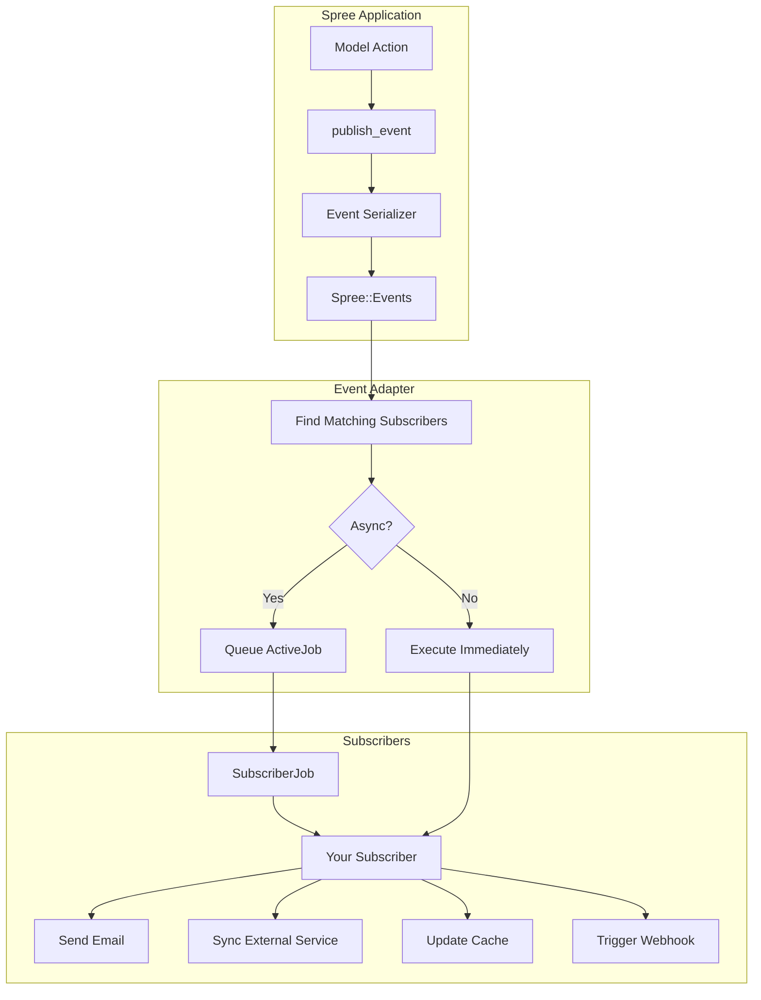

## Overview

Spree includes a powerful event system that allows you to react to various actions happening in your store. When something happens (an order is completed, a product is created, etc.), Spree publishes an event that your code can subscribe to and handle.

This pattern enables loose coupling between components and makes it easy to:

- Send email notifications when orders are placed
- Sync data with external services when products change
- Log audit trails for compliance
- Trigger webhooks to notify third-party systems
- Update caches when inventory changes

## How Events Work

Spree's event system is built on top of [`ActiveSupport::Notifications`](https://api.rubyonrails.org/classes/ActiveSupport/Notifications.html) but provides a cleaner, more Rails-like API through:

1. **`Spree::Events`** - The main module for publishing and subscribing to events
2. **`Spree::Subscriber`** - Base class for creating event subscribers
3. **`Spree::Publishable`** - Concern that enables models to publish events

When an event is published, all matching subscribers are notified. By default, subscribers run asynchronously via ActiveJob to avoid blocking the main request.



## Creating a Subscriber

Create a subscriber class in `app/subscribers/` that inherits from `Spree::Subscriber`:

```ruby app/subscribers/my_app/order_completed_subscriber.rb
module MyApp
  class OrderCompletedSubscriber < Spree::Subscriber
    subscribes_to 'order.complete'

    def handle(event)
      order_id = event.payload['id']
      order = Spree::Order.find_by(id: order_id)
      return unless order

      # Your custom logic here
      ExternalService.notify_order_placed(order)
    end
  end
end
```

### Subscriber DSL

The `Spree::Subscriber` class provides a clean DSL for declaring subscriptions:

```ruby
class MySubscriber < Spree::Subscriber
  # Subscribe to a single event
  subscribes_to 'order.complete'

  # Subscribe to multiple events
  subscribes_to 'order.complete', 'order.cancel', 'order.resume'

  # Subscribe to all events matching a pattern
  subscribes_to 'order.*'  # All order events
  subscribes_to '*.*'      # All events (use sparingly!)

  # Run synchronously instead of via ActiveJob
  subscribes_to 'order.complete', async: false
end
```

### Handling Multiple Events

When subscribing to multiple events, use the `on` DSL to route events to specific methods:

```ruby app/subscribers/my_app/order_audit_subscriber.rb
module MyApp
  class OrderAuditSubscriber < Spree::Subscriber
    subscribes_to 'order.complete', 'order.cancel', 'order.resume'

    on 'order.complete', :log_order_completed
    on 'order.cancel', :log_order_canceled
    on 'order.resume', :log_order_resumed

    private

    def log_order_completed(event)
      create_audit_log(event, 'completed')
    end

    def log_order_canceled(event)
      create_audit_log(event, 'canceled')
    end

    def log_order_resumed(event)
      create_audit_log(event, 'resumed')
    end

    def create_audit_log(event, action)
      AuditLog.create!(
        resource_type: 'Spree::Order',
        resource_id: event.payload['id'],
        action: action,
        occurred_at: event.created_at
      )
    end
  end
end
```

## Working with Events

### Event Object

When your subscriber receives an event, you get a `Spree::Event` object with:

```ruby
def handle(event)
  event.id         # => "550e8400-e29b-41d4-a716-446655440000" (UUID)
  event.name       # => "order.complete"
  event.store_id   # => 1 (ID of the store where the event originated)
  event.payload    # => { "id" => 1, "number" => "R123456", ... }
  event.metadata   # => { "spree_version" => "5.1.0" }
  event.created_at # => Time when event was published

  # Helper methods
  event.store        # => Spree::Store instance (lazy loaded)
  event.resource_type # => "order" (extracted from name)
  event.action        # => "complete" (extracted from name)
end
```

### Finding the Record

The payload contains serialized attributes, not the actual record. To get the record:

```ruby
def handle(event)
  record_id = event.payload['id']
  record = Spree::Order.find_by(id: record_id)
  return unless record

  # Work with the record
end
```

<Warning>
For destroy events, the record no longer exists in the database. Use the payload data instead, or capture what you need before deletion.
</Warning>

## Available Events

### Lifecycle Events

Models that include `Spree::Publishable` and call `publishes_lifecycle_events` automatically publish:

| Event Pattern | Description |
|---------------|-------------|
| `{model}.created` | Record was created |
| `{model}.updated` | Record was updated |
| `{model}.deleted` | Record was deleted |

For example, `Spree::Price` publishes `price.created`, `price.updated`, and `price.deleted`.

Models with lifecycle events enabled include: `Order`, `Payment`, `Price`, `Shipment`, `Variant`, `LineItem`, `StockItem`, and many others.

### Order Events

| Event | Description |
|-------|-------------|
| `order.created` | Order was created |
| `order.updated` | Order was updated |
| `order.completed` | Order checkout completed |
| `order.canceled` | Order was canceled |
| `order.resumed` | Canceled order was resumed |
| `order.paid` | Order is fully paid |
| `order.shipped` | All order shipments are shipped |

### Shipment Events

| Event | Description |
|-------|-------------|
| `shipment.created` | Shipment was created |
| `shipment.updated` | Shipment was updated |
| `shipment.shipped` | Shipment was shipped |
| `shipment.canceled` | Shipment was canceled |
| `shipment.resumed` | Shipment was resumed |

### Payment Events

| Event | Description |
|-------|-------------|
| `payment.created` | Payment was created |
| `payment.updated` | Payment was updated |
| `payment.paid` | Payment was completed |

### Price Events

| Event | Description |
|-------|-------------|
| `price.created` | Price was created |
| `price.updated` | Price was updated |
| `price.deleted` | Price was deleted |

### Customer Events

| Event | Description |
|-------|-------------|
| `customer.created` | Customer was created |
| `customer.updated` | Customer was updated |
| `customer.deleted` | Customer was deleted |

### Admin Events

| Event | Description |
|-------|-------------|
| `admin.created` | Admin user was created |
| `admin.updated` | Admin user was updated |
| `admin.deleted` | Admin user was deleted |

### Product Events

| Event | Description |
|-------|-------------|
| `product.activate` | Product status changed to active |
| `product.archive` | Product status changed to archived |
| `product.out_of_stock` | Product has no stock left for any variant |
| `product.back_in_stock` | Product was out of stock and now has stock again |

## Publishing Custom Events

You can publish custom events from anywhere in your application:

### From a Model

Models including `Spree::Publishable` can use `publish_event`:

```ruby
class Spree::Order < Spree.base_class
  def mark_as_fraudulent!
    update!(fraudulent: true)
    publish_event('order.marked_fraudulent')
  end
end
```

### From Anywhere

Use `Spree::Events.publish` directly:

```ruby
Spree::Events.publish(
  'inventory.low_stock',
  { variant_id: variant.id, quantity: variant.total_on_hand }
)
```

## Event Serializers

Event payloads are generated using the same [Store API V3 serializers](/api-reference/introduction) used by the REST API. This means webhook payloads and API responses share the same schema, making it easy to reuse types in your integrations.

### How Serializers Work

When a model publishes an event, Spree looks for a V3 serializer class matching the model name:

- `Spree::Order` → `Spree::Api::V3::OrderSerializer`
- `Spree::Product` → `Spree::Api::V3::ProductSerializer`
- `Spree::Payment` → `Spree::Api::V3::PaymentSerializer`

For STI models (e.g., `Spree::Exports::Products`), the serializer lookup walks up the class hierarchy until it finds a match (e.g., → `Spree::Api::V3::ExportSerializer`).

If no serializer is found, a minimal fallback payload is returned:

```json
{ "id": "prod_86Rf07xd4z", "created_at": "2025-01-15T10:00:00Z", "updated_at": "2025-01-15T10:30:00Z" }
```

### Built-in Serializers

Spree includes V3 serializers for all core models in [`api/app/serializers/spree/api/v3/`](https://github.com/spree/spree/tree/main/api/app/serializers/spree/api/v3):

| Serializer | Model |
|------------|-------|
| `OrderSerializer` | Orders with totals, states, nested line items, shipments, payments, addresses |
| `ProductSerializer` | Products with pricing, stock status, availability |
| `PaymentSerializer` | Payments with amounts, states, nested payment method and source |
| `ShipmentSerializer` | Shipments with tracking, nested shipping method and rates |
| `LineItemSerializer` | Line items with quantity, pricing, nested option values |
| `VariantSerializer` | Variants with SKU, pricing, nested option values |
| `PriceSerializer` | Prices with amounts, currency, price list |
| ... | [And many more](https://github.com/spree/spree/tree/main/api/app/serializers/spree/api/v3) |

### Payload Context

Event serializers receive specific context parameters that control what data is included:

- **`store`** — Prefers the resource's store (e.g., `order.store`), falls back to `Spree::Current.store`
- **`currency`** — Uses `Spree::Current.currency` (with full fallback chain)
- **`user: nil`** — Events never include user-specific pricing
- **`includes: []`** — Conditional associations are not included in event payloads

This means event payloads contain the same top-level attributes and unconditional associations as API responses, but conditional associations (like product variants, images, or metafields) are excluded.

### Overriding Event Serializers

To customize the payload for existing events, create a custom V3 serializer and configure it via dependencies:

```ruby app/serializers/my_app/order_serializer.rb
module MyApp
  class OrderSerializer < Spree::Api::V3::OrderSerializer
    # Add custom attributes
    attribute :loyalty_points do |order|
      (order.total.to_f * 10).to_i
    end

    attribute :custom_field do |order|
      order.custom_field
    end
  end
end
```

```ruby config/initializers/spree.rb
Spree.api.order_serializer = 'MyApp::OrderSerializer'
```

<Warning>
When overriding serializers, make sure to include all attributes that webhooks and subscribers depend on. Removing attributes may break integrations.
</Warning>

### Serializers for Custom Models

If you add a custom model that publishes events, create a V3 serializer:

```ruby app/models/my_app/subscription.rb
module MyApp
  class Subscription < Spree.base_class
    publishes_lifecycle_events

    def renew!
      update!(renewed_at: Time.current)
      publish_event('subscription.renewed')
    end
  end
end
```

```ruby app/serializers/spree/api/v3/subscription_serializer.rb
module Spree
  module Api
    module V3
      class SubscriptionSerializer < BaseSerializer
        typelize plan_name: :string, status: :string,
                 user_id: [:string, nullable: true],
                 renewed_at: [:string, nullable: true],
                 expires_at: [:string, nullable: true]

        attributes :plan_name, :status,
                   renewed_at: :iso8601, expires_at: :iso8601,
                   created_at: :iso8601, updated_at: :iso8601

        attribute :user_id do |subscription|
          subscription.user&.prefixed_id
        end
      end
    end
  end
end
```

Models without a matching serializer will use a minimal fallback payload containing only `id`, `created_at`, and `updated_at`.

## Registering Subscribers

Subscribers in `app/subscribers/` are automatically registered during Rails initialization.

For subscribers in other locations, add them to the `Spree.subscribers` array in an initializer:

```ruby config/initializers/event_subscribers.rb
Rails.application.config.after_initialize do
  Spree.subscribers << MyApp::CustomSubscriber
end
```

To remove a built-in subscriber:

```ruby config/initializers/event_subscribers.rb
Rails.application.config.after_initialize do
  Spree.subscribers.delete(Spree::ExportSubscriber)
end
```

## Synchronous vs Asynchronous

By default, subscribers run asynchronously via `Spree::Events::SubscriberJob`. This prevents slow subscriber code from blocking HTTP requests.

For critical operations that must complete before the request finishes, use synchronous mode:

```ruby
class CriticalOrderHandler < Spree::Subscriber
  subscribes_to 'order.complete', async: false

  def handle(event)
    # This runs immediately, blocking the request
  end
end
```

<Warning>
Use synchronous subscribers sparingly. They can significantly slow down your application if the handler code is slow or makes external API calls.
</Warning>

## Temporarily Disabling Events

You can disable event publishing temporarily:

```ruby
Spree::Events.disable do
  # Events published in this block won't trigger subscribers
  order.complete!
end
```

This is useful for:
- Data migrations where you don't want to trigger side effects
- Test setup where subscribers would interfere
- Bulk operations where individual events would be too noisy

## Testing Subscribers

### Testing Event Handling

```ruby spec/subscribers/my_app/order_completed_subscriber_spec.rb
require 'spec_helper'

RSpec.describe MyApp::OrderCompletedSubscriber do
  let(:order) { create(:completed_order_with_totals) }
  let(:event) do
    Spree::Event.new(
      name: 'order.complete',
      payload: order.event_payload
    )
  end

  describe '#handle' do
    it 'notifies external service' do
      expect(ExternalService).to receive(:notify_order_placed).with(order)
      described_class.new.handle(event)
    end
  end
end
```

### Testing Event Publishing

Use the `emit_webhook_event` matcher (if available) or stub the events:

```ruby
it 'publishes order.complete event' do
  expect(Spree::Events).to receive(:publish).with(
    'order.complete',
    hash_including('id' => order.id)
  )

  order.complete!
end
```

## Best Practices

<CardGroup cols={2}>
  <Card title="Keep handlers fast" icon="bolt">
    Move slow operations to background jobs. Subscribers should do minimal work and delegate heavy lifting.
  </Card>

  <Card title="Handle missing records" icon="shield">
    Always check if the record exists before processing. It may have been deleted between event publish and handler execution.
  </Card>

  <Card title="Be idempotent" icon="rotate">
    Design handlers to be safely re-run. Events might be delivered more than once in edge cases.
  </Card>

  <Card title="Use specific patterns" icon="crosshairs">
    Subscribe to specific events rather than wildcards when possible. This makes code easier to understand and debug.
  </Card>
</CardGroup>

## Example: Inventory Alert Subscriber

Here's a complete example of a subscriber that sends alerts when inventory is low:

```ruby app/subscribers/my_app/inventory_alert_subscriber.rb
module MyApp
  class InventoryAlertSubscriber < Spree::Subscriber
    subscribes_to 'stock_item.update'

    LOW_STOCK_THRESHOLD = 10

    def handle(event)
      stock_item = find_stock_item(event)
      return unless stock_item
      return unless stock_dropped_below_threshold?(event, stock_item)

      send_low_stock_alert(stock_item)
    end

    private

    def find_stock_item(event)
      Spree::StockItem.find_by(id: event.payload['id'])
    end

    def stock_dropped_below_threshold?(event, stock_item)
      previous_count = event.payload['count_on_hand_before_last_save']
      current_count = stock_item.count_on_hand

      previous_count >= LOW_STOCK_THRESHOLD && current_count < LOW_STOCK_THRESHOLD
    end

    def send_low_stock_alert(stock_item)
      InventoryMailer.low_stock_alert(
        variant: stock_item.variant,
        stock_location: stock_item.stock_location,
        count_on_hand: stock_item.count_on_hand
      ).deliver_later
    end
  end
end
```

## Custom Event Adapters

Spree's event system uses an adapter pattern, making it possible to swap the underlying event infrastructure. By default, Spree uses [`ActiveSupport::Notifications`](https://api.rubyonrails.org/classes/ActiveSupport/Notifications.html), but you can create custom adapters for other backends like Kafka, RabbitMQ, or Redis Pub/Sub.

### Configuring a Custom Adapter

Set your adapter class in an initializer:

```ruby config/initializers/spree.rb
Spree.events_adapter_class = 'MyApp::Events::KafkaAdapter'
```

### Creating a Custom Adapter

Inherit from `Spree::Events::Adapters::Base` and implement the required methods:

```ruby app/models/my_app/events/kafka_adapter.rb
module MyApp
  module Events
    class KafkaAdapter < Spree::Events::Adapters::Base
      def publish(event_name, payload, metadata = {})
        event = build_event(event_name, payload, metadata)

        # Publish to Kafka
        kafka_producer.produce(
          event.to_json,
          topic: "spree.#{event_name}"
        )

        event
      end

      def subscribe(pattern, subscriber, options = {})
        registry.register(pattern, subscriber, options)
      end

      def unsubscribe(pattern, subscriber)
        registry.unregister(pattern, subscriber)
      end

      def activate!
        @kafka_producer = Kafka.new(
          seed_brokers: ENV['KAFKA_BROKERS']
        ).producer
      end

      def deactivate!
        @kafka_producer&.shutdown
      end

      private

      attr_reader :kafka_producer
    end
  end
end
```

### Base Class Interface

The `Spree::Events::Adapters::Base` class defines the required interface:

| Method | Description |
|--------|-------------|
| `publish(event_name, payload, metadata)` | Publish an event, return `Spree::Event` |
| `subscribe(pattern, subscriber, options)` | Register a subscriber for a pattern |
| `unsubscribe(pattern, subscriber)` | Remove a subscriber |
| `activate!` | Called during Rails initialization |
| `deactivate!` | Called during shutdown |

The base class also provides helper methods:
- `build_event(name, payload, metadata)` - Creates a `Spree::Event` instance
- `subscriptions_for(event_name)` - Finds matching subscriptions from the registry
- `registry` - Access to the `Spree::Events::Registry` instance

<Info>
See `Spree::Events::Adapters::ActiveSupportNotifications` for a complete reference implementation.
</Info>

## Related Documentation

- [Webhooks](/developer/core-concepts/webhooks) - HTTP callbacks for external integrations
- [Customization Quickstart](/developer/customization/quickstart) - Overview of all customization options
- [Decorators](/developer/customization/decorators) - When to use decorators vs events
- [Checkout Flow](/developer/customization/checkout) - Using events in checkout customization
