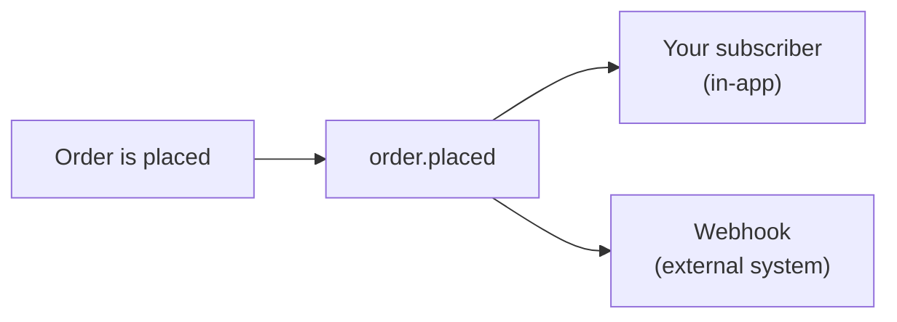

## Overview

Something happens in a store — an order is placed, a payment clears, a product sells out — and you want something else to happen: notify a warehouse, post to a channel, update a spreadsheet.

Events are how you attach that behaviour without editing Spree. Spree announces what happened; your code decides what to do about it.


```mermaid
flowchart LR
    Action["Order is placed"] --> Event["order.placed"]
    Event --> Sub["Your subscriber<br/>(in-app)"]
    Event --> Hook["Webhook<br/>(external system)"]
```

There are two ways to listen, and which you want depends on where your code lives:

| | Use it when |
|---|---|
| **[Webhooks](/developer/core-concepts/webhooks)** | The thing reacting is a separate system — a Next.js app, an ERP, an automation tool |
| **Subscribers** | The reaction belongs inside the Spree application itself |

If you're building a headless storefront, **webhooks are almost certainly what you want**. Subscribers are for when you're running Spree as your own application and want to add behaviour to it.

## What Spree announces

Most records announce their own lifecycle:

| Event | When |
|---|---|
| `<resource>.created` | A record is created |
| `<resource>.updated` | It changes |
| `<resource>.deleted` | It's removed |

Those exist for orders, carts, products, variants, customers, payments, fulfillments, returns, media, price changes and more.

On top of that, meaningful business moments get their own events:

| Event | Meaning |
|---|---|
| `order.placed` | A customer completed checkout |
| `order.paid` | Payment is settled in full |
| `order.canceled` | The order was cancelled |
| `order.shipped` / `order.delivered` | Everything has shipped / arrived |
| `payment.completed` / `payment.voided` | A payment succeeded / was released |
| `fulfillment.shipped` / `fulfillment.canceled` | A parcel went out / was stood down |
| `product.out_of_stock` / `product.back_in_stock` | Availability flipped |
| `return.received` / `return.refunded` | A return arrived / was refunded |
| `import.completed` / `export.completed` | Bulk work finished |

The distinction matters when choosing what to listen for. `order.updated` fires whenever anything about an order changes — including an admin editing a note. `order.placed` fires once, when a customer actually bought something. Sending a confirmation email on the wrong one is how customers receive nine copies.

## What an event carries

An event carries the record it's about, serialized:

```json
{
  "id": "or_86Rf07xd4z",
  "number": "R123456789",
  "status": "placed",
  "payment_status": "paid",
  "total": "135.60",
  "email": "customer@example.com"
}
```

IDs are the same prefixed IDs the API uses, so you can take an ID out of an event and fetch the full record without translating anything.

## Reacting in another system

Point a webhook at your endpoint and subscribe it to the events you care about. That's covered fully in [Webhooks](/developer/core-concepts/webhooks) — including signature verification, which you should not skip.

## Reacting inside Spree

A subscriber is a small class that names the events it wants and does something when one arrives.

```bash
bin/rails g spree:subscriber OrderPlaced order.placed
```

The generator writes the class, a test, and — the step that's easy to forget — registers it.

```ruby app/subscribers/order_placed_subscriber.rb
class OrderPlacedSubscriber < Spree::Subscriber
  subscribes_to 'order.placed'

  def handle(event)
    order = Spree::Order.find_by_prefix_id(event.payload['id'])
    return unless order

    WarehouseClient.new.submit(order)
  end
end
```

A subscriber can listen to several events, or to a whole family:

```ruby
subscribes_to 'order.placed', 'order.canceled'
subscribes_to 'order.*'
```

Subscribers must be registered — they aren't discovered automatically, because a subscriber that starts running because of where its file sits is hard to reason about:

```ruby config/initializers/spree.rb
Rails.application.config.after_initialize do
  Spree.subscribers << OrderPlacedSubscriber
end
```

### Subscribers run in the background

By default a subscriber runs as a background job, so a slow API call in your code doesn't slow down the customer's checkout — and a failure doesn't roll back their order.

That's almost always what you want. If you genuinely need to run inside the same transaction, you can ask to:

```ruby
subscribes_to 'order.placed', async: false
```

<Warning>
A synchronous subscriber runs while the customer waits, and an exception in it can fail their checkout. Reserve it for work that must be atomic with the order, and keep it fast.
</Warning>

## Publishing your own events

Anything in your own code can announce something, and subscribers and webhooks treat it like any built-in event:

```ruby
order.publish_event('order.flagged_for_review')
```

Useful when your own domain has moments worth reacting to — a fraud check completing, an approval granted.

## Guidance

**Listen for the specific event.** `order.placed` rather than `order.updated` with a status check.

**Assume events can arrive more than once.** A retry after a network blip can redeliver. Make handlers safe to run twice — check whether you've already acted before acting.

**Don't chain long sequences of subscribers.** When one event triggers a subscriber that triggers another, working out what happened after the fact becomes archaeology. Prefer one handler that does the sequence.

**Keep failures contained.** A subscriber that raises shouldn't take down anything else. Handle your own errors and log them.

## Related

- [Webhooks](/developer/core-concepts/webhooks) — reacting from outside Spree
- [Orders](/developer/core-concepts/orders) — the order lifecycle these events describe
- [Imports & Exports](/developer/core-concepts/imports-exports) — completion events for bulk work
