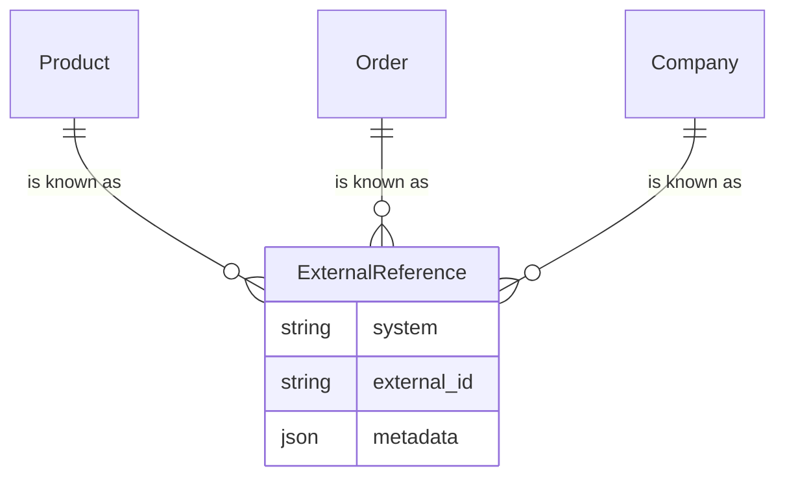

## Overview

When Spree is connected to other systems, the same product lives in several places at once. Your ERP knows it as `MAT-100`, your PIM as `SKU-88412`, and Spree as `prod_86Rf07xd4z`.

External references are how Spree remembers those other keys. Each record can carry one key per system, and every integration can then find, create and update records using the key it already knows — without ever storing a Spree ID.

They solve three problems that come up in every integration:

- **Mapping.** Which Spree product is ERP item `MAT-100`?
- **Repeatable feeds.** A nightly import cannot know whether Spree has seen a row before. Sending the same row twice must update the record, not create a duplicate.
- **Several systems at once.** A PIM sync must never erase the key the ERP wrote.

## How references are stored



An external reference has three parts:

| Field | What it holds | Example |
|---|---|---|
| `system` | Which system the key belongs to | `erp`, `pim`, `netsuite` |
| `external_id` | The key that system knows the record by | `MAT-100` |
| `metadata` | Optional bookkeeping for the integration (a version, an etag, when it last synced) | `{ "etag": "W/\"42\"" }` |

Two rules keep the mapping unambiguous, and the database enforces both:

- **One key per system per record.** A product has at most one `erp` key.
- **One record per key.** Within a store, `erp:MAT-100` names exactly one product.

### System keys

A system key is a short lowercase name made of letters, digits and underscores, such as `erp`, `akeneo` or `legacy_pim`. Spree lowercases and trims what you send, so `ERP` and `erp` are the same system.

The system does not have to be a connected [integration](/developer/providers/overview). A nightly CSV from a legacy system that has no live connection still needs somewhere to record its keys. When a connector does exist, use the same name it uses, so the connector, its references and its settings page all agree.

## What can carry external references

| Record | Typical source of the key |
|---|---|
| Products | PIM or ERP item number |
| Variants | ERP or PIM SKU-level key |
| Categories | PIM category code |
| Media | DAM asset ID |
| Stock locations | ERP warehouse code |
| Stock levels | ERP inventory record |
| Orders | ERP sales order number, written back after the order is sent there |
| Companies | ERP or CRM account number (B2B) |
| Sellers | Payout provider account, recorded by the [payout provider](/developer/providers/payouts) itself |

Customers are deliberately absent. A customer account can shop in more than one store, so a store-level key for it has no single owner. In B2B, the buyer's ERP identity belongs on their [company](/developer/core-concepts/companies) instead.

## Writing references

Send `external_references` with any create or update on the Admin API. It accepts the same map the API returns:

<CodeGroup>

```typescript Admin SDK
const product = await adminClient.products.create({
  name: 'Canvas Tote',
  external_references: { erp: 'MAT-100', pim: 'SKU-88412' },
})
```

```bash CLI
spree api post /products -d '{
  "name": "Canvas Tote",
  "external_references": { "erp": "MAT-100", "pim": "SKU-88412" }
}'
```

</CodeGroup>

A list is accepted too, which some feeds find more natural:

```json
{
  "external_references": [
    { "system": "erp", "external_id": "MAT-100" },
    { "system": "pim", "external_id": "SKU-88412" }
  ]
}
```

What a write changes:

- **Systems you name are set.** A system the record has no key for gets one; a system it already has gets the new key.
- **Systems you don't name are left alone.** A PIM sending only `pim` never touches the `erp` key.
- **A blank key removes the reference.** Send `{ "erp": "" }` to unlink a record from the ERP.

## Reading references

Admin API responses for every record above except sellers include `external_references` as a flat map — the same shape you send:

```json Response
{
  "id": "prod_86Rf07xd4z",
  "name": "Canvas Tote",
  "external_references": {
    "erp": "MAT-100",
    "pim": "SKU-88412"
  }
}
```

External references never appear in the Store API. Which ERP a merchant runs, and the keys records have in it, is back-office information.

In the dashboard, references show in the **JSON** view on each record's detail page. There is no form for editing them: they are written by integrations and read by whoever is debugging a sync.

## Addressing records by your keys

Anywhere the Admin API takes a record ID in the path, you can write `external:<system>:<key>` instead. An integration that only ever learned the ERP's key can then read, update and delete without first asking Spree for the record's ID.

<CodeGroup>

```typescript Admin SDK
const product = await adminClient.products.get('external:erp:MAT-100')

await adminClient.products.update('external:erp:MAT-100', {
  name: 'Canvas Tote — Natural',
})
```

```bash CLI
spree api get /products/external:erp:MAT-100

spree api patch /products/external:erp:MAT-100 -d '{
  "name": "Canvas Tote — Natural"
}'
```

</CodeGroup>

The lookup follows the same rules as a Spree ID. It only finds records in the current store, and an API key or admin user that cannot see the record gets a `404`, exactly as they would for its Spree ID.

<Warning>
Use this form only for keys made of letters, digits, dashes, underscores and colons. A key containing a slash or a dot cannot be part of a URL path; address that record by its Spree ID instead.
</Warning>

## Repeatable feeds

A create that names a key Spree already knows **updates that record instead of creating a new one**. A feed can therefore send every row on every run, and the result is the same as if it had sent each row once.

<CodeGroup>

```typescript Admin SDK
// First run: creates the product.
// Every later run: updates the same product.
await adminClient.products.create({
  name: 'Canvas Tote',
  external_references: { erp: 'MAT-100' },
})
```

```bash CLI
spree api post /products -d '{
  "name": "Canvas Tote",
  "external_references": { "erp": "MAT-100" }
}'
```

</CodeGroup>

The update needs the same permission an ordinary update would, so a key that may create records but not edit them cannot use a create to change one.

Image feeds work the same way. Media created from a URL with `external_references` is recorded under those keys, and a later run with the same key finds the existing image instead of adding a second copy.

## When a key is already taken

If an update names a key that already belongs to a **different** record, Spree keeps the record's other changes and answers with `422`:

```json Response
{
  "error": {
    "code": "conflicting_external_reference",
    "message": "External has already been taken"
  }
}
```

This usually means two records in Spree map to one record in the other system — for example, a product that was duplicated by hand. Remove the reference from one of them (send a blank key), then retry.

## Filtering companies by key

Companies can be filtered by their references, which helps when reconciling a list of accounts against an ERP:

```http
GET /api/v3/admin/companies?q[external_references_system_eq]=erp&q[external_references_external_id_eq]=ACME-1
```

For every other record, look it up by its key with the `external:<system>:<key>` path form above.

## References belong to a store

A reference is owned by the store its record belongs to. Two stores can each map `erp:MAT-100` to their own product without colliding, and a key from one store never finds a record in another. A feed that serves several stores sends its rows to each store separately.

## External references, custom fields or metadata?

All three can hold "an ID from another system", but only one is built for it.

| | External references | [Custom fields](/developer/core-concepts/metafields) | [Metadata](/developer/customization/metadata) |
|---|---|---|---|
| **For** | A record's key in another system | Data a merchant curates | Any data your code keeps |
| **Unique per store** | Yes, enforced | No | No |
| **Find a record by it** | Yes, in the URL path | Through filters | No |
| **Create-or-update by it** | Yes | No | No |
| **Several systems at once** | Yes, one key each | One field per system | Your own structure |
| **Store API** | Never | Configurable | Never |

If an integration needs to find a record again by a key it owns, use an external reference. If a merchant should see and edit the value, use a custom field. Anything else your code needs to remember belongs in metadata.

## Related

- [ERP](/developer/providers/erp) — feeding stock and orders from an ERP
- [PIM](/developer/providers/pim) — syncing product content from a PIM
- [Imports & Exports](/developer/core-concepts/imports-exports) — file-based feeds
- [Companies](/developer/core-concepts/companies) — B2B accounts and their ERP identity
- [Admin SDK](/developer/sdk/admin/resources) — the TypeScript client used in the examples
