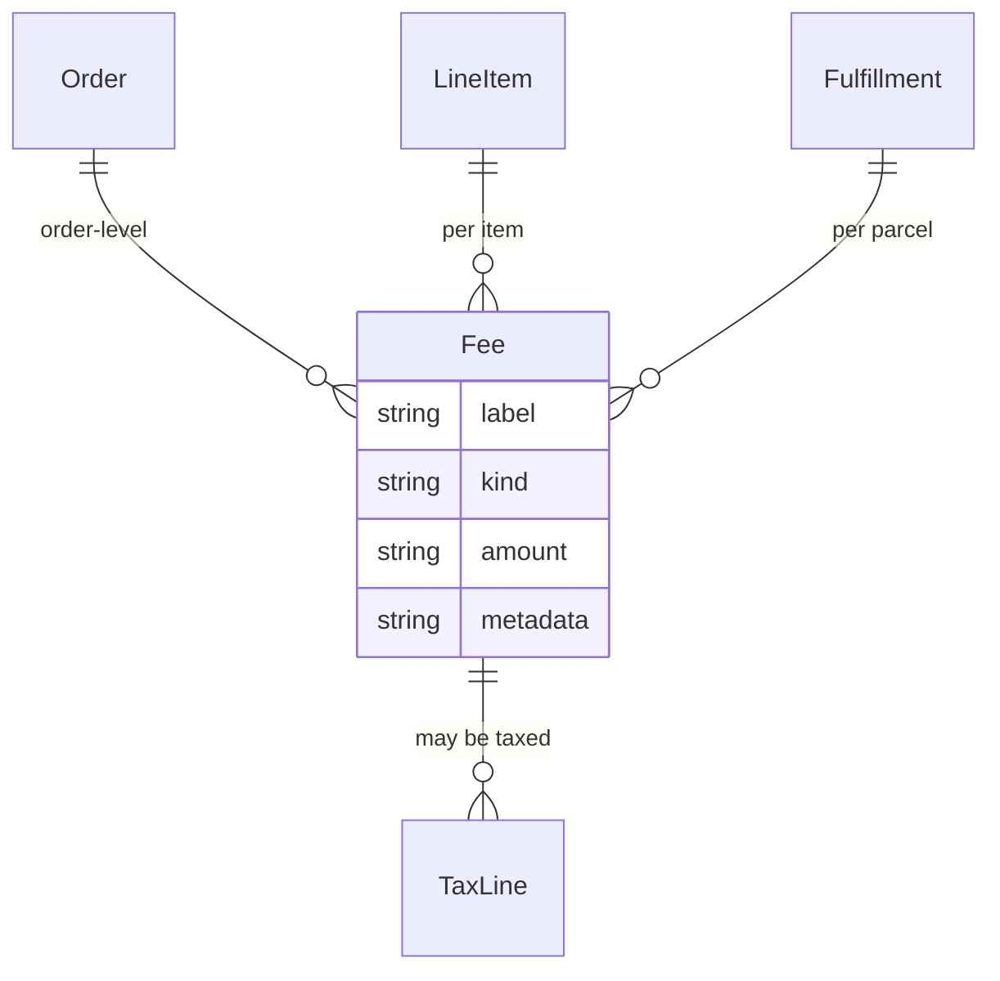

## Overview

A fee is money added to an order that isn't the price of a product and isn't tax. Gift wrapping. A handling charge. The surcharge for paying cash on delivery. An import duty on a parcel crossing a border.

Fees are their own kind of row, separate from [tax](/developer/core-concepts/taxes) and [discounts](/developer/core-concepts/discounts), so a merchant can answer "what did we charge in handling this quarter" without untangling a mixed list.



## Fee attributes

| Attribute | Description |
|---|---|
| `label` | What the customer sees — `Gift wrapping` |
| `kind` | What sort of charge it is — see below |
| `amount` / `display_amount` | The charge |
| `line_item_id` | Set when the fee is for one item |
| `fulfillment_id` | Set when the fee is for one parcel |

When neither ID is set, the fee applies to the whole order.

| `kind` | Typical use |
|---|---|
| `surcharge` | A general extra charge |
| `handling` | Packing and processing |
| `gift_wrap` | Gift wrapping |
| `cod` | Cash on delivery |
| `payment` | A payment method surcharge |
| `duty` | Customs duty — see [below](#customs-duties) |

The list is open — an extension can add its own kind.

<Note>
**Fees are always positive.** To take money off, create a [discount](/developer/core-concepts/discounts) instead. This isn't pedantry: when a refund is worked out later, it has to know whether a row was a charge or a credit, and a negative fee makes that ambiguous.
</Note>

## Adding a fee

<CodeGroup>

```typescript Admin SDK
// Gift wrapping on one item
await adminClient.orders.fees.create('or_xxx', {
  label: 'Gift wrapping',
  kind: 'gift_wrap',
  amount: '5.00',
  line_item_id: 'li_xxx',
})

// A handling charge on the whole order
await adminClient.orders.fees.create('or_xxx', {
  label: 'Handling',
  kind: 'handling',
  amount: '2.50',
})
```

```bash cURL
curl -X POST 'https://api.mystore.com/api/v3/admin/orders/or_xxx/fees' \
  -H 'X-Spree-API-Key: sk_xxx' \
  -H 'Content-Type: application/json' \
  -d '{ "label": "Gift wrapping", "kind": "gift_wrap", "amount": "5.00" }'
```

</CodeGroup>

Fees are visible to the storefront on the cart and the order, so a customer sees what they're being charged before they pay:

```typescript Store SDK
const cart = await client.carts.get(cartId)

cart.fees.forEach((fee) => {
  fee.label          // "Gift wrapping"
  fee.display_amount // "$5.00"
})

cart.display_fee_total // "$7.50"
```

## Fees and tax

Fees are **taxable by default** — a handling charge in a VAT country is itself subject to VAT, and Spree writes tax lines against the fee accordingly.

Customs duties are the exception, described next.

## Customs duties

When a parcel crosses a border, the destination country may charge import duty. Whether the customer pays that at checkout or gets a bill from the courier later is a commercial decision — and quoting it up front is what avoids parcels being refused at the door.

A duty is recorded as a fee with `kind: 'duty'`. Two things make it different from every other fee.

### Duties aren't taxed

A duty is an import charge levied by the destination country, not a sale that domestic tax applies to. Charging tax on top of it would invent tax the merchant never owed, so Spree leaves duties out of the taxable set. Where import VAT genuinely applies, whoever calculated the duty records that tax itself.

### Duties remember what they were calculated from

A duty fee keeps a copy of its inputs — the commodity code, the country of origin, the rate — in its `metadata`.

This matters more than it sounds. A product's classification can be corrected next month; a supplier can change. What the customer was actually charged must not move when that happens. The snapshot is the authoritative record, and a duty is never re-derived from today's catalogue.

## Customs classification

For any of this to work, the goods have to be described in the language customs authorities use. Three fields on each variant do that:

| Field | What it is | Example |
|---|---|---|
| `hs_code` | The Harmonized System commodity code — the international classification for what the item *is* | `6109.10` |
| `country_of_origin` | Where it was made, as an ISO country code — not where it ships from | `PT` |
| `customs_description` | A plain description for the declaration, when the product name isn't clear enough | `Cotton t-shirt` |

```typescript Admin SDK
await adminClient.products.variants.update('prod_xxx', 'var_xxx', {
  hs_code: '6109.10',
  country_of_origin: 'PT',
  customs_description: 'Cotton t-shirt',
})
```

<Warning>
`country_of_origin` is where the item was **manufactured**, not the warehouse it leaves from. Duty rates and trade agreements turn on origin, so getting this wrong produces the wrong charge — and can hold a parcel at the border.
</Warning>

These fields are editable per variant and in the bulk product editor. They're also what a carrier integration puts on the customs declaration for an international label — required for cross-border parcels, ignored for domestic ones.

<Info>
Spree records classification and charges duties; it does not itself estimate them. A landed-cost provider calculates the numbers and writes the duty fees. See [Providers](/developer/providers/overview).
</Info>

## Related

- [Taxes](/developer/core-concepts/taxes) — how tax is worked out
- [Discounts](/developer/core-concepts/discounts) — taking money off
- [Order totals](/developer/core-concepts/order-totals) — how fees roll into what a customer pays
- [Products](/developer/core-concepts/products) — variants and their attributes
