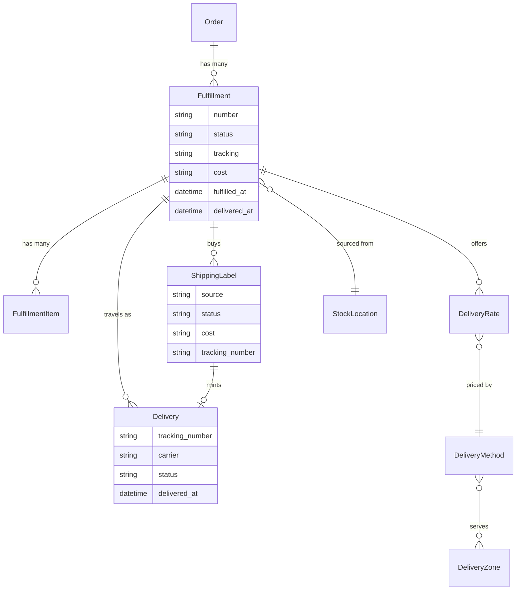

## Overview

A fulfillment is one batch of items going to the customer by one method — a parcel from a warehouse, a digital download, or an order waiting at a pickup counter. An order gets one fulfillment per combination of stock location and delivery method, so an order sourced from two warehouses has two.

The word is deliberately broader than "shipment". A digital download has no carrier, no address and no package, and click-and-collect ships nowhere at all — a fulfillment covers all of them without dragging along fields that make no sense for most.



## Fulfillment attributes

| Attribute | Description |
|---|---|
| `id` | Fulfillment ID, e.g. `ful_86Rf07xd4z` |
| `number` | Fulfillment number, e.g. `F123456789` |
| `status` | See [statuses](#statuses) below |
| `tracking` / `tracking_url` | The first consignment's tracking number and link, summarised for convenience |
| `deliveries` | Every consignment this batch travels as — see [consignments](#where-the-parcel-actually-is) |
| `labels` | Postage bought or uploaded for it |
| `cost` / `display_cost` | Delivery cost for this fulfillment |
| `delivery_rates` | The options the customer can choose from |
| `selected_delivery_rate_id` | The chosen option |
| `fulfilled_at` | When it went out |
| `delivered_at` | When the customer got it — what return windows count from |

## Statuses

A fulfillment's status says what **you** did with the parcel — nothing else.

| Value | Meaning |
|---|---|
| `unfulfilled` | Still with you. Nothing has left |
| `fulfilled` | It went out — handed to the carrier, or waiting at the counter for a pickup order |
| `delivered` | The customer has it |
| `canceled` | It won't be sent |

Statuses only move forward: once something has gone out it stays gone out, and a later payment problem changes the order's [payment status](/developer/core-concepts/orders#statuses) rather than the fulfillment.

Whether a fulfillment *can* go out — the order is paid, nothing is on backorder — is checked when you fulfill it, and the answer comes back with a reason. It is not baked into the status, so a refund never moves a parcel backwards. Staff who need to ship against an invoice can pass `force`.

### Where the parcel actually is

One fulfillment can travel as several parcels — a gym machine that arrives in
three boxes, or a pallet moving under one freight PRO number. Each is a
**delivery**: its own tracking number, its own carrier, its own journey.

A delivery's `status` is what the carrier reports, and it never changes the
fulfillment's own `status`:

| Value | Meaning |
|---|---|
| `pre_transit` | Label made, carrier hasn't got it yet |
| `in_transit` | On its way |
| `out_for_delivery` | On the van |
| `available_for_pickup` | Waiting at a carrier location |
| `delivered` | Carrier says it arrived |
| `return_to_sender` | Coming back to you |
| `failure` | Delivery failed — a bad address, damage, a refused parcel |
| `unknown` | The carrier said something we don't recognise |

Keeping the two apart is the point. A parcel that bounces still shows
`fulfilled`, because you did hand it over; the trouble shows up as
`return_to_sender` on that delivery and you decide what to do about it.

The fulfillment rolls up from its deliveries: it becomes `delivered` when
**every** consignment has arrived, so a machine that arrives in three boxes is
only delivered when the third one lands. That rollup is recomputed whenever
deliveries are added, removed or corrected — including when a tracking number
is fixed, which starts that consignment's journey over.

`delivered_at` is what return windows and the EU withdrawal period count from,
so it records when the carrier says the parcel arrived rather than when you
heard about it.

Carriers report this through their provider's webhook, matched to the delivery
by tracking number. With no carrier integration, staff mark receipt by hand —
`markDelivered` in the Admin SDK, on a single delivery or the whole
fulfillment — which is also how pickup orders get closed out.

A fulfillment keeps `tracking` and `tracking_url` as a summary of its first
consignment, so a storefront showing one tracking link needs no changes.

<CodeGroup>

```typescript Admin SDK
// Add a second parcel to the same fulfillment
await adminClient.orders.fulfillments.deliveries.create('or_xxx', 'ful_xxx', {
  tracking_number: '1Z999AA10123456784',
})

// Correct a number — the consignment's journey starts over
await adminClient.orders.fulfillments.deliveries.update('or_xxx', 'ful_xxx', 'dlv_xxx', {
  tracking_number: '9400100000000000000000',
})

// Confirm one parcel arrived
await adminClient.orders.fulfillments.deliveries.markDelivered('or_xxx', 'ful_xxx', 'dlv_xxx')
```

```bash cURL
curl -X POST 'https://api.mystore.com/api/v3/admin/orders/or_xxx/fulfillments/ful_xxx/deliveries' \
  -H 'X-Spree-API-Key: sk_xxx' \
  -H 'Content-Type: application/json' \
  -d '{ "tracking_number": "1Z999AA10123456784" }'
```

</CodeGroup>

## Shipping labels

Postage is its own record. A label is either **purchased** through a carrier
integration or **uploaded** — bought elsewhere and recorded so the PDF and its
cost live with the consignment.

Buying one mints the delivery it covers, so you never enter the tracking number
yourself. The file is fetched into Spree's own storage right after purchase, so
a merchant can reprint after the carrier's link has expired or the integration
has been disconnected.

A label's `cost` is what **you** paid the carrier. It is admin-only accounting
data and never appears in a store API response or on the customer's order.

| Field | Meaning |
|---|---|
| `source` | `purchased` or `uploaded` |
| `status` | `purchased`, `refund_requested` or `refunded` |
| `cost` / `currency` | What the merchant paid the carrier |
| `tracking_number` | Frozen once bought |
| `download_url` | Streamed through the API, never served from storage |

A purchased label is given back by refunding it with the carrier; an uploaded
one has nothing to refund, so it is deleted instead. Either way the consignment
it minted goes with it only while the parcel never moved — once it is on its
way, that journey is a fact and stays.

<CodeGroup>

```typescript Admin SDK
// Buy postage through the carrier integration
const label = await adminClient.orders.fulfillments.labels.create('or_xxx', 'ful_xxx')

// Or record one bought elsewhere
await adminClient.orders.fulfillments.labels.create('or_xxx', 'ful_xxx', {
  file: signedBlobId,
  tracking_number: '1Z999AA10123456784',
  cost: '12.50',
  currency: 'USD',
})

// Give the postage back
await adminClient.orders.fulfillments.labels.refund('or_xxx', 'ful_xxx', label.id)
```

```bash cURL
curl -X POST 'https://api.mystore.com/api/v3/admin/orders/or_xxx/fulfillments/ful_xxx/labels' \
  -H 'X-Spree-API-Key: sk_xxx'
```

</CodeGroup>

Some carriers also produce paperwork beside the label — a commercial invoice or
a customs declaration for anything crossing a border. Those come back on the
fulfillment's `documents`, each with a `kind` and a `url`.

## Delivery types

Every delivery method has a type that decides how it behaves:

| Type | Behaviour |
|---|---|
| `shipping` | Physical delivery to an address. Someone marks it sent. |
| `digital` | Available the moment the order is placed. No address needed. |
| `pickup` | Collection from one of your own stock locations. |
| `pickup_point` | Collection from a third-party point — a locker or partner shop. |

This is what lets a store sell a downloadable album and a vinyl record in the same order without any special handling in your storefront: the download is ready immediately, the record gets a tracking number.

## Choosing delivery at checkout

Each fulfillment on a cart offers delivery rates. The customer picks one per fulfillment.

<CodeGroup>

```typescript Store SDK
const cart = await client.carts.get(cartId)

cart.fulfillments[0].delivery_rates
// => [{ id: 'rate_xxx', name: 'DHL Express', display_cost: '$12.00',
//       estimated_delivery_date: '2026-08-07' }, ...]

await client.carts.fulfillments.update(cartId, cart.fulfillments[0].id, {
  selected_delivery_rate_id: 'rate_xxx',
})
```

```bash cURL
curl -X PATCH 'https://api.mystore.com/api/v3/store/carts/cart_xxx/fulfillments/ful_xxx' \
  -H 'X-Spree-API-Key: pk_xxx' \
  -H 'X-Spree-Token: abc123' \
  -H 'Content-Type: application/json' \
  -d '{ "selected_delivery_rate_id": "rate_xxx" }'
```

</CodeGroup>

Rates carry more than a price — carrier, service level and estimated delivery date — so you can show "DHL Express, arrives Tuesday" instead of just a number.

## Pickup

For pickup methods, ask the API where the customer can collect:

<CodeGroup>

```typescript Store SDK
// Your own pickup-enabled locations
const locations = await client.deliveryMethods.pickupLocations('dm_xxx')

// Third-party pickup points near the customer
const points = await client.deliveryMethods.pickupPoints('dm_xxx', {
  latitude: 34.0522,
  longitude: -118.2437,
})
```

```bash cURL
curl 'https://api.mystore.com/api/v3/store/delivery_methods/dm_xxx/pickup_locations' \
  -H 'X-Spree-API-Key: pk_xxx'
```

</CodeGroup>

## Managing fulfillments

<CodeGroup>

```typescript Admin SDK
// What's still with you
const fulfillments = await adminClient.orders.fulfillments.list('or_xxx')

// Add tracking, then mark it sent. `tracking` is a shortcut that creates or
// corrects the fulfillment's first consignment; use the deliveries endpoints
// when a batch travels as more than one parcel.
await adminClient.orders.fulfillments.update('or_xxx', 'ful_xxx', {
  tracking: '1Z999AA10123456784',
})
await adminClient.orders.fulfillments.fulfill('or_xxx', 'ful_xxx')

// Ship only some of it — the chosen units split off and ship,
// the rest stays open
await adminClient.orders.fulfillments.fulfill('or_xxx', 'ful_xxx', {
  items: [{ item_id: 'li_xxx', quantity: 1 }],
})

// Ship against an unpaid invoice — your call, not the API's
await adminClient.orders.fulfillments.fulfill('or_xxx', 'ful_xxx', { force: true })

// Record receipt yourself when no carrier reports it for you
await adminClient.orders.fulfillments.markDelivered('or_xxx', 'ful_xxx')

// Split it when only part can go now
await adminClient.orders.fulfillments.split('or_xxx', 'ful_xxx', {
  items: [{ fulfillment_item_id: 'fi_xxx', quantity: 1 }],
})

// Cancel
await adminClient.orders.fulfillments.cancel('or_xxx', 'ful_xxx')
```

```bash cURL
curl -X PATCH 'https://api.mystore.com/api/v3/admin/orders/or_xxx/fulfillments/ful_xxx' \
  -H 'X-Spree-API-Key: sk_xxx' \
  -H 'Content-Type: application/json' \
  -d '{ "tracking": "1Z999AA10123456784" }'

curl -X PATCH 'https://api.mystore.com/api/v3/admin/orders/or_xxx/fulfillments/ful_xxx/fulfill' \
  -H 'X-Spree-API-Key: sk_xxx'
```

</CodeGroup>

## Delivery methods and zones

A **delivery method** is what the customer picks — "Standard", "Express", "Collect in store". A **delivery zone** decides where it's available.

Zones match on country and state, and also on postal code prefixes and ranges, so you can offer same-day delivery to a handful of city postcodes without listing every one:

```typescript Admin SDK
await adminClient.deliveryZones.create({
  name: 'London same-day',
  members: [
    { member_type: 'postal_code', country_code: 'GB', postal_code_prefix: 'SW1' },
    { member_type: 'postal_code', country_code: 'GB', postal_code_from: 'EC1A', postal_code_to: 'EC1V' },
  ],
})
```

A zone member is either a whole country, a state, or a postal code prefix or range.

<Note>
Delivery zones cover delivery only. Tax is handled separately — see [Taxes](/developer/core-concepts/taxes).
</Note>

### Pricing and rules

Delivery is priced either by a rule you configure in the dashboard — flat rate, per item, price bands — or by asking a carrier for live rates.

Methods can also carry conditions that decide when they're offered at all: free shipping over a certain order value, or heavy items excluded from letter post. These are applied in one place, so both kinds of pricing respect them.

## Adding your own statuses

A made-to-order business — print on demand, furniture built after purchase —
has a stage between "order placed" and "handed to the carrier". There are two
ways to model it, and the lighter one is usually right.

**Track production in your own model, gate handover with a hook.** A production
pipeline usually has more resolution than one word — queued, printing, quality
check, packed — and that detail belongs in your own tables or your
integration's metadata, not in the parcel's lifecycle vocabulary. What core
needs to know is only *whether the parcel may go out yet*, and that is exactly
what the fulfill workflow's validate hook expresses:

```ruby
Spree.hooks.register('fulfillments.fulfill.validate') do |flow|
  work_order = MyApp::WorkOrder.find_by(fulfillment: flow.fulfillment)
  flow.reject!('still in production') unless work_order&.completed?
end
```

The fulfillment stays `unfulfilled` while you build the thing; your storefront
renders "we're making your furniture" as presentation, the same way pickup
orders render `fulfilled` as "ready for pickup".

**Add a real status when merchants need to act on the stage.** If staff filter
by it, reports group by it, or webhooks fire on entering it, make it a
first-class status:

```ruby
# an initializer
Spree::Fulfillment.add_status('in_production', after: 'unfulfilled')
```

That gives you the `in_production?` predicate, the `.in_production` scope and
a valid value. Moving into it is deliberately not declarative — write a small
workflow, which is also where the printer submission or the workshop handoff
belongs:

```ruby
class MyApp::Fulfillments::StartProduction < Spree::Workflow
  def perform(fulfillment:)
    super
    step :ensure_startable      # refuse unless fulfillment.unfulfilled?
    step :mark_in_production    # update!(status: 'in_production') + publish an event
    external_step :submit_to_printer
    success(fulfillment.reload)
  end
end
```

Core's own actions keep working on your status without overrides: the guards
ask whether the parcel has *already gone out*, not whether it holds one of the
built-in values, so an `in_production` fulfillment can still be fulfilled or
canceled. Statuses are additive only — core workflows guard on core statuses,
so removing one would silently break them — and confirmed receipt still only
follows handover.

## Events

Fulfillments publish [events](/developer/core-concepts/events) — `fulfillment.created`, `fulfillment.fulfilled`, `fulfillment.delivered`, `fulfillment.canceled` — which also reach [webhooks](/developer/core-concepts/webhooks). Use them to notify a customer, push to a warehouse system, or send tracking emails.

## Related

- [Orders](/developer/core-concepts/orders) — how delivery status rolls up
- [Inventory](/developer/core-concepts/inventory) — stock locations and availability
- [Returns, Exchanges & Claims](/developer/core-concepts/returns-exchanges-claims) — items coming back
