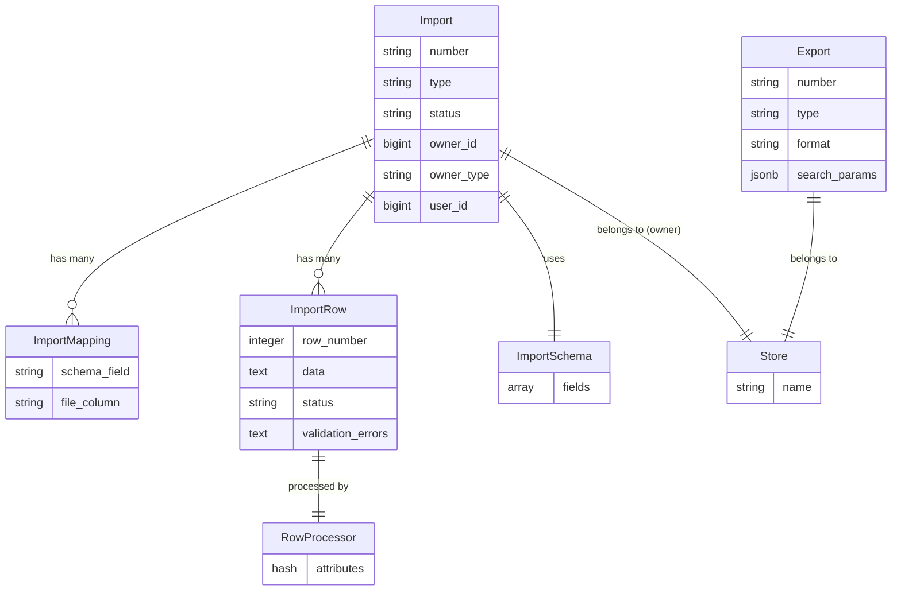

## Overview

Spree provides a comprehensive bulk data import and export system for managing large datasets. The system supports CSV file processing with configurable field mapping, asynchronous processing via background jobs, and real-time progress tracking in the admin interface.

### Import/Export System Diagram



## Architecture

The import/export system uses several design patterns:

1. **Single Table Inheritance (STI)**: Import and Export types inherit from base classes
2. **State Machine**: Imports progress through states (pending → mapping → processing → completed)
3. **Schema Definition**: ImportSchema classes define expected fields and validation
4. **Row Processors**: Transform CSV rows into database records
5. **Event-Driven Processing**: Background jobs handle heavy lifting asynchronously
6. **Registry Pattern**: Types registered in `Spree.import_types` and `Spree.export_types`

---

## Exports

Exports generate CSV files from filtered database records.

### Built-in Export Types

| Type | Description | Multi-line |
|------|-------------|------------|
| `Spree::Exports::Products` | Products with all variants | Yes |
| `Spree::Exports::Orders` | Orders with line items | Yes |
| `Spree::Exports::Customers` | Customer accounts | No |
| `Spree::Exports::GiftCards` | Gift cards | No |
| `Spree::Exports::NewsletterSubscribers` | Newsletter subscribers | No |

### Export Model

The base `Spree::Export` class provides:

```ruby
module Spree
  class Export < Spree.base_class
    # Associations
    belongs_to :store
    belongs_to :user  # Admin who created export

    # Attachments
    has_one_attached :attachment  # Generated CSV file

    # Key methods
    def csv_headers           # Define column headers
    def scope                 # Base query with store/vendor filtering
    def scope_includes        # Eager loading associations
    def records_to_export     # Apply ransack filters
    def multi_line_csv?       # True if records produce multiple rows
    def generate              # Create CSV and attach file
  end
end
```

### Creating a Custom Exporter

**Step 1: Create the Export Class**

```ruby app/models/spree/exports/subscriptions.rb
module Spree
  module Exports
    class Subscriptions < Spree::Export
      # Define CSV column headers
      def csv_headers
        %w[id email plan_name status created_at] + metafields_headers
      end

      # Eager load associations to avoid N+1 queries
      def scope_includes
        [:user, :plan, { metafields: :metafield_definition }]
      end

      # Override scope if needed (e.g., exclude cancelled)
      def scope
        super.where.not(status: 'cancelled')
      end

      # Set to true if each record produces multiple CSV rows
      def multi_line_csv?
        false
      end
    end
  end
end
```

**Step 2: Add `to_csv` Method to Your Model**

```ruby app/models/spree/subscription.rb
module Spree
  class Subscription < Spree.base_class
    def to_csv(store)
      [
        id,
        user&.email,
        plan&.name,
        status,
        created_at.iso8601
      ] + metafields_csv_values(store)
    end

    private

    def metafields_csv_values(store)
      Spree::MetafieldDefinition.for_resource_type(self.class.name).order(:namespace, :key).map do |definition|
        metafields.find { |m| m.metafield_definition_id == definition.id }&.value
      end
    end
  end
end
```

**Step 3: Register the Export Type**

```ruby config/initializers/spree.rb
Rails.application.config.after_initialize do
  Spree.export_types << Spree::Exports::Subscriptions
end
```

**Step 4: Add Translations**

```yaml config/locales/en.yml
en:
  spree:
    subscriptions: Subscriptions
```

### Multi-line Exports

For exports where each record produces multiple rows (like products with variants):

```ruby app/models/spree/exports/orders_with_items.rb
module Spree
  module Exports
    class OrdersWithItems < Spree::Export
      def multi_line_csv?
        true
      end

      def csv_headers
        %w[order_number line_item_sku quantity price]
      end

      def scope_includes
        [line_items: :variant]
      end
    end
  end
end
```

```ruby app/models/spree/order.rb
# In the Order model
def to_csv(store)
  line_items.map do |item|
    [number, item.variant.sku, item.quantity, item.price]
  end
end
```

### Export Filtering

Exports support Ransack filtering via `search_params`:

```ruby
# In admin, users can filter before exporting
export = Spree::Exports::Products.new(
  store: current_store,
  user: current_user,
  search_params: { name_cont: 'shirt', status_eq: 'active' }.to_json,
  record_selection: 'filtered'  # or 'all' to ignore filters
)
```

---

## Imports

Imports process CSV files to create or update database records.

### Built-in Import Types

| Type | Description |
|------|-------------|
| `Spree::Imports::Products` | Products and variants |

### Import Workflow

```
1. Upload CSV → pending
2. Auto-map columns → mapping
3. User confirms mapping → completed_mapping
4. Parse rows (CreateRowsJob) → processing
5. Process rows (ProcessRowsJob) → completed/failed
```

### Import Components

#### Import Model

```ruby
module Spree
  class Import < Spree.base_class
    # Associations
    belongs_to :owner, polymorphic: true  # Store or Vendor
    belongs_to :user
    has_many :mappings    # Field mappings
    has_many :rows        # CSV rows to process

    # State machine
    state_machine initial: :pending do
      event :start_mapping do
        transition to: :mapping
      end
      event :complete_mapping do
        transition from: :mapping, to: :completed_mapping
      end
      event :start_processing do
        transition from: :completed_mapping, to: :processing
      end
      event :complete do
        transition from: :processing, to: :completed
      end
      event :fail do
        transition to: :failed
      end
    end

    # Key methods
    def import_schema        # Returns schema class instance
    def row_processor_class  # Returns processor class
    def schema_fields        # Fields from schema + metafields
    def mapping_done?        # All required fields mapped?
  end
end
```

#### Import Schema

Defines expected CSV fields:

```ruby
module Spree
  class ImportSchema
    FIELDS = []

    def fields
      self.class::FIELDS
    end

    def required_fields
      FIELDS.select { |f| f[:required] }.map { |f| f[:name] }
    end

    def optional_fields
      FIELDS.reject { |f| f[:required] }.map { |f| f[:name] }
    end
  end
end
```

#### Import Mapping

Maps CSV columns to schema fields:

```ruby
module Spree
  class ImportMapping < Spree.base_class
    belongs_to :import

    # Attributes
    # schema_field - target field name from schema
    # file_column  - CSV column header

    def try_to_auto_assign_file_column(csv_headers)
      # Matches by parameterized name comparison
      self.file_column = csv_headers.find do |header|
        header.parameterize.underscore == schema_field.parameterize.underscore
      end
    end
  end
end
```

#### Import Row

Represents a single CSV row:

```ruby
module Spree
  class ImportRow < Spree.base_class
    belongs_to :import, counter_cache: :rows_count
    belongs_to :item, polymorphic: true, optional: true  # Created record

    # Attributes
    # row_number       - position in CSV
    # data             - JSON-serialized row data
    # status           - pending/processing/completed/failed
    # validation_errors - error message if failed

    def process!
      start_processing!
      self.item = import.row_processor_class.new(self).process!
      complete!
    rescue StandardError => e
      self.validation_errors = e.message
      fail!
    end

    def to_schema_hash
      # Maps CSV data using import.mappings
    end
  end
end
```

#### Row Processor

Transforms row data into database records:

```ruby
module Spree
  module Imports
    module RowProcessors
      class Base
        def initialize(row)
          @row = row
          @import = row.import
          @attributes = row.to_schema_hash
        end

        attr_reader :row, :import, :attributes

        def process!
          raise NotImplementedError
        end
      end
    end
  end
end
```

### Creating a Custom Importer

**Step 1: Create the Import Class**

```ruby app/models/spree/imports/subscriptions.rb
module Spree
  module Imports
    class Subscriptions < Spree::Import
      def row_processor_class
        Spree::Imports::RowProcessors::Subscription
      end
    end
  end
end
```

**Step 2: Define the Schema**

```ruby app/models/spree/import_schemas/subscriptions.rb
module Spree
  module ImportSchemas
    class Subscriptions < Spree::ImportSchema
      FIELDS = [
        { name: 'email', label: 'Customer Email', required: true },
        { name: 'plan_name', label: 'Plan Name', required: true },
        { name: 'status', label: 'Status', required: true },
        { name: 'start_date', label: 'Start Date' },
        { name: 'billing_interval', label: 'Billing Interval' },
        { name: 'amount', label: 'Amount' },
        { name: 'currency', label: 'Currency' }
      ].freeze
    end
  end
end
```

**Step 3: Create the Row Processor**

```ruby app/services/spree/imports/row_processors/subscription.rb
module Spree
  module Imports
    module RowProcessors
      class Subscription < Base
        def process!
          user = find_or_create_user
          plan = find_plan

          subscription = Spree::Subscription.find_or_initialize_by(
            user: user,
            plan: plan
          )

          subscription.status = attributes['status'] if attributes['status'].present?
          subscription.start_date = parse_date(attributes['start_date']) if attributes['start_date'].present?
          subscription.billing_interval = attributes['billing_interval'] if attributes['billing_interval'].present?

          if attributes['amount'].present?
            currency = attributes['currency'].presence || import.store.default_currency
            subscription.set_price(currency, attributes['amount'])
          end

          subscription.save!
          subscription
        end

        private

        def find_or_create_user
          email = attributes['email'].strip.downcase
          Spree.user_class.find_or_create_by!(email: email)
        end

        def find_plan
          Spree::Plan.find_by!(name: attributes['plan_name'].strip)
        end

        def parse_date(date_string)
          Date.parse(date_string)
        rescue ArgumentError
          nil
        end
      end
    end
  end
end
```

**Step 4: Register the Import Type**

```ruby config/initializers/spree.rb
Rails.application.config.after_initialize do
  Spree.import_types << Spree::Imports::Subscriptions
end
```

**Step 5: Add Translations**

```yaml config/locales/en.yml
en:
  spree:
    subscriptions: Subscriptions
```

### Products Import Schema

The built-in products import supports these fields:

**Required Fields:**
- `slug` - Product URL slug
- `sku` - Variant SKU
- `name` - Product name
- `price` - Variant price

**Optional Fields:**
- `status` - Product status (active/draft/archived)
- `description` - Product description
- `meta_title`, `meta_description`, `meta_keywords` - SEO metadata
- `tags` - Product tags
- `compare_at_price` - Original price for sale display
- `currency` - Price currency
- `width`, `height`, `depth`, `dimensions_unit` - Dimensions
- `weight`, `weight_unit` - Weight
- `available_on`, `discontinue_on` - Availability dates
- `track_inventory` - Enable inventory tracking
- `inventory_count`, `inventory_backorderable` - Stock settings
- `tax_category`, `shipping_category` - Category assignments
- `image1_src`, `image2_src`, `image3_src` - Image URLs
- `option1_name`, `option1_value` through `option3_name`, `option3_value` - Variant options
- `category1`, `category2`, `category3` - Taxon assignments (format: "Taxonomy -> Taxon -> Child Taxon")

### Handling Multi-Variant Products

The products import handles variants intelligently:

1. **Master variant rows** (no option values): Create/update the product and its master variant
2. **Non-master variant rows** (with option values): Create additional variants for an existing product

```csv
slug,sku,name,price,option1_name,option1_value,option2_name,option2_value
my-tshirt,TSHIRT-001,My T-Shirt,29.99,,,
my-tshirt,TSHIRT-S-RED,My T-Shirt,29.99,Size,Small,Color,Red
my-tshirt,TSHIRT-M-RED,My T-Shirt,29.99,Size,Medium,Color,Red
my-tshirt,TSHIRT-L-RED,My T-Shirt,29.99,Size,Large,Color,Red
```

### Metafield Support

Both imports and exports support metafields dynamically:

**Export:** Metafield definitions are automatically added as CSV columns using the format `metafield.{namespace}.{key}`.

**Import:** Map CSV columns to metafield definitions. The system automatically detects columns matching the metafield pattern and updates the corresponding metafield values.

---

## Background Jobs

### CreateRowsJob

Parses CSV and creates ImportRow records:

```ruby
module Spree
  module Imports
    class CreateRowsJob < Spree::BaseJob
      queue_as Spree.queues.imports

      def perform(import_id)
        import = Spree::Import.find(import_id)
        # Stream CSV, batch insert rows
        # Then enqueue ProcessRowsJob
      end
    end
  end
end
```

### ProcessRowsJob

Processes pending rows through row processors:

```ruby
module Spree
  module Imports
    class ProcessRowsJob < Spree::BaseJob
      queue_as Spree.queues.imports

      def perform(import_id)
        import = Spree::Import.find(import_id)
        import.rows.pending_and_failed.find_each do |row|
          row.process!
        end
        import.complete!
      end
    end
  end
end
```

### GenerateJob (Exports)

Generates CSV files for exports:

```ruby
module Spree
  module Exports
    class GenerateJob < Spree::BaseJob
      queue_as Spree.queues.exports

      def perform(export_id)
        export = Spree::Export.find(export_id)
        export.generate
      end
    end
  end
end
```

---

## Events

### Import Events

| Event | Trigger |
|-------|---------|
| `import.created` | Import record created |
| `import.completed` | All rows processed |

### Export Events

| Event | Trigger |
|-------|---------|
| `export.created` | Export record created (triggers generation) |

### Import Row Events

| Event | Trigger |
|-------|---------|
| `import_row.completed` | Row processed successfully |
| `import_row.failed` | Row processing failed |

---

## Configuration

### Queue Configuration

```ruby config/initializers/spree.rb
# Configure job queues
Spree.queues.imports = :imports
Spree.queues.exports = :exports
```

### Preferences

Imports support configurable delimiter:

```ruby
import.preferred_delimiter = ';'  # Default: ','
```

---

## Key Files Reference

| File | Purpose |
|------|---------|
| `core/app/models/spree/import.rb` | Base import model |
| `core/app/models/spree/export.rb` | Base export model |
| `core/app/models/spree/import_schema.rb` | Base schema class |
| `core/app/models/spree/import_mapping.rb` | Field mapping model |
| `core/app/models/spree/import_row.rb` | Row model with processing |
| `core/app/models/spree/imports/products.rb` | Products import type |
| `core/app/models/spree/import_schemas/products.rb` | Products schema |
| `core/app/services/spree/imports/row_processors/base.rb` | Base processor |
| `core/app/services/spree/imports/row_processors/product_variant.rb` | Products processor |
| `core/app/models/spree/exports/products.rb` | Products export |
| `core/app/models/spree/exports/orders.rb` | Orders export |
| `core/app/models/spree/exports/customers.rb` | Customers export |
| `core/app/jobs/spree/imports/create_rows_job.rb` | Row creation job |
| `core/app/jobs/spree/imports/process_rows_job.rb` | Row processing job |
| `core/app/jobs/spree/exports/generate_job.rb` | Export generation job |
| `admin/app/controllers/spree/admin/imports_controller.rb` | Admin imports controller |
| `admin/app/controllers/spree/admin/exports_controller.rb` | Admin exports controller |

## Permissions

Access is controlled via CanCanCan:

```ruby
# Allow admin to manage imports/exports
can :manage, Spree::Import
can :manage, Spree::Export
```

Records are filtered by `current_ability` ensuring users only export data they have access to.
