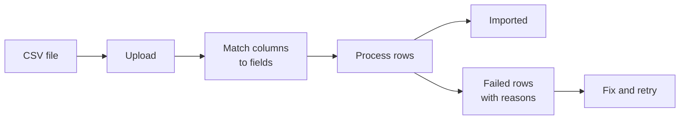

## Overview

Spreadsheets remain how most merchants think about bulk work. A supplier sends a price list as CSV; the finance team wants last quarter's orders in Excel; a migration from another platform arrives as one enormous product export.

Spree handles both directions as background work, so a hundred-thousand-row file doesn't tie up a browser tab or time out.


```mermaid
flowchart LR
    File["CSV file"] --> Upload["Upload"]
    Upload --> Map["Match columns<br/>to fields"]
    Map --> Process["Process rows"]
    Process --> Good["Imported"]
    Process --> Bad["Failed rows<br/>with reasons"]
    Bad --> Retry["Fix and retry"]
```

## What can be imported and exported

| Data | Import | Export |
|---|:---:|:---:|
| Products | Yes | Yes |
| Product translations | Yes | Yes |
| Customers | Yes | Yes |
| Orders | — | Yes |
| Gift cards | — | Yes |
| Coupon codes | — | Yes |
| Newsletter subscribers | — | Yes |

Orders are export-only on purpose. An order is a financial record of something that happened; inventing them from a spreadsheet would let the books say something that never occurred.

## Exporting

An export is created, runs in the background, and produces a file to download.

<CodeGroup>

```typescript Admin SDK
const exportJob = await adminClient.exports.create({
  type: 'Spree::Exports::Products',
})

// Poll until it's done
const status = await adminClient.exports.get(exportJob.id)
status.status       // "pending" → "processing" → "completed"
status.download_url // available once completed
```

```bash CLI
spree api post /exports -d '{"type": "Spree::Exports::Products"}'
spree api get /exports
```

</CodeGroup>

### Exporting a filtered set

An export can carry the same filters as the listing it came from, so "export what I'm looking at" does what a merchant expects — this quarter's orders, this brand's products, not the entire table.

```typescript Admin SDK
await adminClient.exports.create({
  type: 'Spree::Exports::Orders',
  filters: { completed_at_gteq: '2026-01-01' },
})
```

In the dashboard this is the Export button on any list — whatever filters are applied come along.

## Importing

Importing has an extra step, because a file from somewhere else won't have Spree's column names. You upload it, say which of your columns means what, and then it runs.

<Steps>
  <Step title="Upload the file">
    ```typescript Admin SDK
    const importJob = await adminClient.imports.create({
      type: 'Spree::Imports::Products',
      file: uploadedFileId,
    })
    ```

    Spree reads the header row and tells you which columns it found.
  </Step>
  <Step title="Match columns to fields">
    ```typescript Admin SDK
    await adminClient.imports.completeMapping(importJob.id, {
      mappings: [
        { schema_field: 'name', file_column: 'Product Title' },
        { schema_field: 'sku', file_column: 'Item Code' },
        { schema_field: 'price', file_column: 'RRP' },
      ],
    })
    ```

    Obvious matches are suggested for you; you only correct the ones that differ.
  </Step>
  <Step title="Watch it run">
    ```typescript Admin SDK
    const status = await adminClient.imports.get(importJob.id)

    status.status         // "processing" → "completed"
    status.rows_count     // total
    status.processed_count
    status.failed_count
    ```
  </Step>
</Steps>

<Info>
Download a template for any import type to see the expected columns — the quickest way to prepare a file that maps cleanly.
</Info>

## When rows fail

Some rows will fail. A price with a currency symbol in it, a required field left blank, a duplicate SKU.

**A failed row doesn't stop the import.** The good rows are imported; the bad ones are set aside with the reason.

```typescript Admin SDK
const { data: failures } = await adminClient.imports.rows.list(importJob.id, {
  filter: { status_eq: 'failed' },
})

failures.forEach((row) => {
  row.row_number        // 47
  row.validation_errors // "Price is not a number"
})

// After fixing the source data
await adminClient.imports.retryFailedRows(importJob.id)
```

Retrying re-runs only the failures, so a file where three rows out of ten thousand were wrong doesn't need re-importing whole.

<Warning>
A value that isn't a number is rejected, never guessed at. A price written as `"12,50"` fails rather than being read as `1250` — which would be a hundredfold overcharge. Fix the file rather than hoping the import is lenient.
</Warning>

## Interrupted work resumes

Imports remember which row they reached. If the server restarts halfway through a large file, processing picks up where it stopped rather than starting again or skipping the remainder.

## Products with several variants

A product with variants spans several rows — one per variant, repeating the product columns. Rows are grouped by the product identifier, so a t-shirt in three sizes is three rows and becomes one product.

Custom fields can be imported too: a column matching a [custom field](/developer/core-concepts/metafields) you've defined maps to it like any built-in field.

## Knowing when it's finished

Imports and exports emit [events](/developer/core-concepts/events) as they progress, which also reach [webhooks](/developer/core-concepts/webhooks). That's how you trigger the next step of a pipeline — notify a channel, kick off a reindex — without polling.

| Event | When |
|---|---|
| `import.completed` | Every row has been attempted |
| `import.failed` | The import could not run |
| `export.completed` | The file is ready to download |

## Permissions

Import and export are gated by the same [permissions](/developer/core-concepts/staff-roles) as the data they touch. Someone who can't see customers can't export them — otherwise export would be a way around the whole permission system.

## Related

- [Products](/developer/core-concepts/products) — the most-imported data
- [Custom Fields](/developer/core-concepts/metafields) — importing your own fields
- [Events](/developer/core-concepts/events) — reacting to completion
- [Staff & Roles](/developer/core-concepts/staff-roles) — who may import and export
