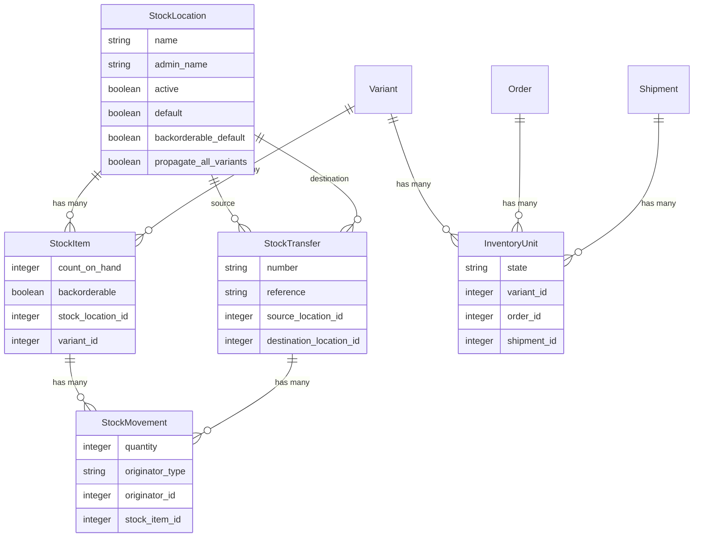

## Overview

In Spree each [Variant](/developer/core-concepts/products#variants) has a `StockItem`. This is the place where the inventory for that variant is stored. A Variant can have multiple `StockItems` if it is available in multiple `StockLocations`.

Back-ordered, sold, or shipped products are stored as individual `InventoryUnit` objects so they can have relevant information attached to them.

New products created in the system can be given a starting "on hand" inventory level. You can subsequently set new inventory levels and the correct things will happen, e.g. adding new on-hand inventory to an out-of-stock product that has some backorders will first fill the backorders then update the product with the remaining inventory count.

### Inventory Model Diagram



**Key relationships:**
- **Stock Location** → Contains Stock Items (inventory per variant) and is the source/destination for Stock Transfers
- **Stock Item** → Tracks quantity (`count_on_hand`) for a specific Variant at a specific Stock Location
- **Stock Movement** → Records changes to Stock Item quantities (purchases, returns, transfers)
- **Stock Transfer** → Moves inventory between Stock Locations, creating Stock Movements at source and destination
- **Inventory Unit** → Represents individual units in [Orders](/developer/core-concepts/orders) and [Shipments](/developer/core-concepts/shipments)

## Inventory Management

### Stock Locations

Stock Locations are the locations where your inventory is shipped from. Each `StockLocation` has many `stock_items` and `stock_movements`.

Stock Locations can be created in the admin panel Configuration → Stock Locations or via Admin API.

Stock Locations have several attributes that define their properties and behavior within the Spree system. Below is a table outlining these attributes:

| Attribute         | Description                                                                 | Example Value       |
|-------------------|-----------------------------------------------------------------------------|---------------------|
| `name`            | The public name of the stock location. This is returned in Store API | Warehouse 1       |
| `admin_name`       | The name used internally for the stock location. This is only returned in Admin API. | WH1 Domestic     |
| `address1`        | The primary address line for the stock location.                           | 5th avenue     |
| `address2`        | The secondary address line for the stock location.                         | Suite 100         |
| `city`            | The city where the stock location is based.                                | New York        |
| `state_id`        | The ID of the state where the stock location is based. This references the `State` model. | 1                 |
| `country_id`      | The ID of the country where the stock location is based. This references the `Country` model. | 1                 |
| `zipcode`         | The postal code for the stock location.                                    | 10001             |
| `phone`           | The contact phone number for the stock location.                           | 555-1234          |
| `active`          | A boolean indicating whether the stock location is active. Inactive stock locations will not be used in stock calculations or be available for selection during checkout. | `true`             |
| `default`          | A boolean indicating whether the stock location is the default one used for new inventory operations. | `false`             |
| `backorderable_default` | A boolean indicating whether new stock items in this location are backorderable by default. | `false` |
| `propagate_all_variants` | A boolean indicating whether new stock items should be automatically created for all Store variants when a new stock location is added. | `false` |

Stock Locations can be easily used for tracking warehouses and other physical locations. They can be used to track separate sections of a warehouse (e.g. aisles, shelves, etc.) or to track different warehouses.

You can easily use them with your Point of Sale (POS) system to track inventory at different locations.

### Stock Items

Stock Items represent the inventory at a stock location for a specific variant. Stock item count on hand can be increased or decreased by creating stock movements.

| Attribute         | Description                                                                 | Example Value       |
|-------------------|-----------------------------------------------------------------------------|---------------------|
| `stock_location_id` | References the stock location where the stock item belongs.                | `1`                 |
| `variant_id`      | References the variant associated with the stock item.                     | `32`                |
| `count_on_hand`   | The number of items available on hand.                                     | `150`               |
| `backorderable`   | Indicates whether the stock item can be backordered.                       | `true`    |

### Stock Transfers

Stock transfers allow you to move inventory in bulk from one stock location to another stock location. This is handy when you want to integrate with a POS system or other inventory management system. Or you can just rely on Spree being the source of truth for your inventory.

<Info>
Stock Transfers can be created in the Admin dashboard or via the Admin API.
</Info>

Here's the list of attributes for the Stock Transfer model:

| Attribute                | Description                                                                 | Example Value       |
|--------------------------|-----------------------------------------------------------------------------|---------------------|
| `number`                 | The unique number identifier for the stock transfer, generated automatically. | `T123456789`        |
| `reference`              | An optional reference field for the stock transfer.                        | Transfer for Event |
| `source_location_id`     | The ID of the stock location where the stock is transferred from.          | `2`                 |
| `destination_location_id`| The ID of the stock location where the stock is transferred to.            | `3`                 |

Stock transfers are crucial for managing inventory across multiple locations, ensuring that stock levels are accurate and up-to-date.

Each Stock Transfer will hold a list of Stock Movements.

### Stock Movements

Stock Movements track the movement of the inventory:

* when you move inventory between stock locations (via Stock Transfer)
* when you add inventory to a stock location
* when you remove inventory from a stock location
* when customers purchase products
* when customers return products

Here's the list of attributes for the Stock Movement model:

| Attribute         | Description                                                                 | Example Value       |
|-------------------|-----------------------------------------------------------------------------|---------------------|
| `stock_item_id`   | References the stock item that the movement belongs to.                     | `45`                |
| `quantity`        | The quantity by which the stock item's count on hand is changed. Positive values indicate stock being added, while negative values indicate stock being removed. | `-10`               |
| `originator_type` | The type of the originator of the stock movement. This is a polymorphic association. | `Spree::Shipment`      |
| `originator_id`   | The ID of the originator of the stock movement. This is used in conjunction with `originator_type`. | `2`                 |

Stock Movements are crucial for maintaining accurate inventory levels and for historical tracking of inventory adjustments.

## Inventory Units

As we mentioned above, back-ordered, sold, or shipped products are stored as individual `InventoryUnit` objects so they can have relevant information attached to them.

We create `InventoryUnit` objects when:

* a product is sold (they are added to the Shipment)
* a product is returned

Here's a list of attributes for the Inventory Unit model:

| Attribute         | Description                                                                 | Example Value       |
|-------------------|-----------------------------------------------------------------------------|---------------------|
| `variant_id`      | References the variant associated with the inventory unit.                 | `32`                |
| `order_id`        | References the order associated with the inventory unit.                   | `123`               |
| `shipment_id`          | References the shipment associated with the inventory unit.                   | `77`                |
| `state`           | The state of the inventory unit | `on_hand`      |

Inventory Units states are:

* `on_hand` - the inventory unit is on hand
* `backordered` - the inventory unit is backordered
* `shipped` - the inventory unit is shipped

<Note>
As we noted before, when you add new Stock Items to a Variant (eg. via Admin Panel or Admin API), the first Inventory Units to fulfill are the backordered ones.
</Note>

## Disabling inventory tracking

What if you don't need to track inventory? You can disable it for the entire application in `config/initializers/spree.rb` file which was generated during installation. Add the following line:

```ruby
Spree::Config[:track_inventory_levels] = false
```

You can also disable tracking inventory on a Variant level, by simply updating Variant `track_inventory` column to `false`, eg.

```ruby
variant.update(track_inventory: false)
```

This can also be done via the Admin Panel or Admin API.

## Related Documentation

- [Products](/developer/core-concepts/products) - Product and variant management
- [Shipments](/developer/core-concepts/shipments) - How inventory relates to shipments
- [Orders](/developer/core-concepts/orders) - How inventory is allocated to orders
