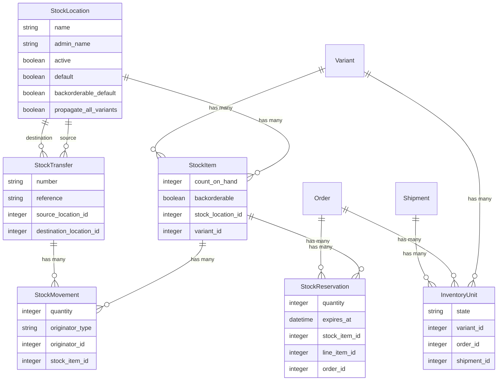

import { Since } from '/snippets/since.mdx';

## Overview

Each [Variant](/developer/core-concepts/products#variants) has a `StockItem` that tracks its inventory at a specific location. A variant can have multiple stock items if it's available at multiple stock locations.

When products are sold or returned, individual `InventoryUnit` records track each unit through the fulfillment process.

Adding new inventory to an out-of-stock product that has backorders will first fill the backorders, then update the available count with the remainder.

During checkout, Spree holds stock with time-limited [Stock Reservations](#stock-reservations) to prevent two customers from buying the same last unit simultaneously.

### Inventory Model Diagram


```mermaid
erDiagram
    StockLocation {
        string name
        string admin_name
        boolean active
        boolean default
        boolean backorderable_default
        boolean propagate_all_variants
    }

    StockItem {
        integer count_on_hand
        boolean backorderable
        integer stock_location_id
        integer variant_id
    }

    StockMovement {
        integer quantity
        string originator_type
        integer originator_id
        integer stock_item_id
    }

    StockTransfer {
        string number
        string reference
        integer source_location_id
        integer destination_location_id
    }

    InventoryUnit {
        string state
        integer variant_id
        integer order_id
        integer shipment_id
    }

    StockReservation {
        integer quantity
        datetime expires_at
        integer stock_item_id
        integer line_item_id
        integer order_id
    }

    StockLocation ||--o{ StockItem : "has many"
    StockLocation ||--o{ StockTransfer : "source"
    StockLocation ||--o{ StockTransfer : "destination"
    Variant ||--o{ StockItem : "has many"
    Variant ||--o{ InventoryUnit : "has many"
    StockItem ||--o{ StockMovement : "has many"
    StockItem ||--o{ StockReservation : "has many"
    StockTransfer ||--o{ StockMovement : "has many"
    Order ||--o{ InventoryUnit : "has many"
    Order ||--o{ StockReservation : "has many"
    Shipment ||--o{ InventoryUnit : "has many"
```

**Key relationships:**
- **Stock Location** → Contains Stock Items (inventory per variant) and is the source/destination for Stock Transfers
- **Stock Item** → Tracks quantity (`count_on_hand`) for a specific Variant at a specific Stock Location
- **Stock Movement** → Records changes to Stock Item quantities (purchases, returns, transfers)
- **Stock Transfer** → Moves inventory between Stock Locations, creating Stock Movements at source and destination
- **Inventory Unit** → Represents individual units in [Orders](/developer/core-concepts/orders) and [Shipments](/developer/core-concepts/shipments)
- **Stock Reservation** → Time-limited soft hold on a Stock Item during checkout, scoped to a specific Order and Line Item

## Inventory Management

### Stock Locations

Stock Locations are the physical locations where your inventory is stored and shipped from.

Stock Locations can be created in the Admin Panel under **Settings → Stock Locations**, or via the Admin API.

Stock Locations have several attributes that define their properties and behavior within the Spree system. Below is a table outlining these attributes:

| Attribute         | Description                                                                 | Example Value       |
|-------------------|-----------------------------------------------------------------------------|---------------------|
| `name`            | The public name of the stock location. This is returned in Store API | Warehouse 1       |
| `admin_name`       | The name used internally for the stock location. This is only returned in Admin API. | WH1 Domestic     |
| `address1`        | The primary address line for the stock location.                           | 5th avenue     |
| `address2`        | The secondary address line for the stock location.                         | Suite 100         |
| `city`            | The city where the stock location is based.                                | New York        |
| `state_id`        | The ID of the state where the stock location is based. This references the `State` model. | 1                 |
| `country_id`      | The ID of the country where the stock location is based. This references the `Country` model. | 1                 |
| `zipcode`         | The postal code for the stock location.                                    | 10001             |
| `phone`           | The contact phone number for the stock location.                           | 555-1234          |
| `active`          | A boolean indicating whether the stock location is active. Inactive stock locations will not be used in stock calculations or be available for selection during checkout. | `true`             |
| `default`          | A boolean indicating whether the stock location is the default one used for new inventory operations. | `false`             |
| `backorderable_default` | A boolean indicating whether new stock items in this location are backorderable by default. | `false` |
| `propagate_all_variants` | A boolean indicating whether new stock items should be automatically created for all Store variants when a new stock location is added. | `false` |

Stock Locations can be easily used for tracking warehouses and other physical locations. They can be used to track separate sections of a warehouse (e.g. aisles, shelves, etc.) or to track different warehouses.

You can easily use them with your Point of Sale (POS) system to track inventory at different locations.

### Stock Items

Stock Items represent the inventory at a stock location for a specific variant. Stock item count on hand can be increased or decreased by creating stock movements.

| Attribute         | Description                                                                 | Example Value       |
|-------------------|-----------------------------------------------------------------------------|---------------------|
| `stock_location_id` | References the stock location where the stock item belongs.                | `1`                 |
| `variant_id`      | References the variant associated with the stock item.                     | `32`                |
| `count_on_hand`   | The number of items available on hand.                                     | `150`               |
| `backorderable`   | Indicates whether the stock item can be backordered.                       | `true`    |

### Stock Transfers

Stock transfers allow you to move inventory in bulk from one stock location to another stock location. This is handy when you want to integrate with a POS system or other inventory management system. Or you can just rely on Spree being the source of truth for your inventory.

<Info>
Stock Transfers can be created in the Admin dashboard or via the Admin API.
</Info>

Here's the list of attributes for the Stock Transfer model:

| Attribute                | Description                                                                 | Example Value       |
|--------------------------|-----------------------------------------------------------------------------|---------------------|
| `number`                 | The unique number identifier for the stock transfer, generated automatically. | `T123456789`        |
| `reference`              | An optional reference field for the stock transfer.                        | Transfer for Event |
| `source_location_id`     | The ID of the stock location where the stock is transferred from.          | `2`                 |
| `destination_location_id`| The ID of the stock location where the stock is transferred to.            | `3`                 |

Stock transfers are crucial for managing inventory across multiple locations, ensuring that stock levels are accurate and up-to-date.

Each Stock Transfer will hold a list of Stock Movements.

### Stock Movements

Stock Movements track the movement of the inventory:

* when you move inventory between stock locations (via Stock Transfer)
* when you add inventory to a stock location
* when you remove inventory from a stock location
* when customers purchase products
* when customers return products

Here's the list of attributes for the Stock Movement model:

| Attribute         | Description                                                                 | Example Value       |
|-------------------|-----------------------------------------------------------------------------|---------------------|
| `stock_item_id`   | References the stock item that the movement belongs to.                     | `45`                |
| `quantity`        | The quantity by which the stock item's count on hand is changed. Positive values indicate stock being added, while negative values indicate stock being removed. | `-10`               |
| `originator_type` | The type of the originator of the stock movement. This is a polymorphic association. | `Spree::Shipment`      |
| `originator_id`   | The ID of the originator of the stock movement. This is used in conjunction with `originator_type`. | `2`                 |

Stock Movements are crucial for maintaining accurate inventory levels and for historical tracking of inventory adjustments.

## Stock Reservations <Since version="5.5" />

Stock Reservations are a time-limited soft hold on stock during checkout. When a customer enters checkout, Spree creates one reservation per line item, scoped to that customer's order. Other customers see availability reduced by all active reservations, so two customers can't both pass the availability check on the same last unit.

### How it works

`StockItem.count_on_hand` is **never** modified by reservations — they're a separate layer queried at availability-check time. The full availability formula is:

```
purchasable = count_on_hand − allocated_count − active_reservations
```

Where `count_on_hand` is the physical pool, `allocated_count` is units already earmarked for pending shipments (always 0 in Spree 5.5; populated in 6.0 when [Typed Stock Movements](https://github.com/spree/spree/blob/main/docs/plans/6.0-typed-stock-movements.md) lands), and `active_reservations` is the sum across non-expired reservations for the variant's stock items.

The `Spree::Stock::Quantifier` is the canonical entry point — `variant.total_on_hand` and `variant.in_stock?` both route through it, so consumers don't need to compute the formula themselves.

### Lifecycle

| Trigger | Action |
|---|---|
| Cart leaves the `cart` state (customer enters checkout) | `Spree::StockReservations::Reserve` creates rows with `expires_at = now + TTL` |
| Customer mutates the cart while in checkout (address, items, quantity) | `Spree::StockReservations::Extend` resets `expires_at` |
| Cart reverts to `cart`, is emptied, destroyed, or completed | `Spree::StockReservations::Release` deletes the rows |
| Order completes | Reservation released, `count_on_hand` decremented as before |
| Customer abandons | `Spree::StockReservations::ExpireJob` cleans up expired rows |

The hooks live inside `Spree::Cart::AddItem`, `Spree::Cart::SetQuantity`, `Spree::Cart::RemoveLineItem`, `Spree::Cart::Empty`, `Spree::Cart::Destroy`, `Spree::Carts::Update`, and `Spree::Carts::Complete` — any caller of those services automatically gets correct reservation behavior.

### Configuration

| Setting | Default | Purpose |
|---|---|---|
| `Spree::Config[:stock_reservations_enabled]` | `true` | Global kill switch. When `false`, behavior matches pre-5.5 (no reservations created, Quantifier ignores them). |
| `Spree::Config[:default_stock_reservation_ttl_minutes]` | `10` | Fallback TTL when a Store doesn't override. |
| `store.preferred_stock_reservation_ttl_minutes` | inherits global | Per-Store TTL override. Resolved by `Spree::StockReservation.ttl_for(order)`. |

TTL deliberately lives on Store, not StockLocation — it's a checkout-experience policy, not a warehouse property. A multi-location cart never has to merge conflicting TTLs from different warehouses.

### Stock Reservation attributes

| Attribute | Description | Example |
|---|---|---|
| `stock_item_id` | The stock item being held against. | `45` |
| `line_item_id` | The line item that justifies this hold. Unique with `stock_item_id`. | `123` |
| `order_id` | The order in checkout. | `78` |
| `quantity` | Units held. Positive integer. | `2` |
| `expires_at` | Timestamp after which the row is ignored and reaped by `ExpireJob`. | `2026-05-04T14:35:00Z` |

### Insufficient stock at reservation time

When Reserve runs (entering checkout, item add/quantity change/removal mid-checkout) and stock can't cover the cart, the cart service returns a failure result and the surrounding transaction rolls back — so the cart change is rejected before the customer can proceed. The Store API surfaces this as a validation error response.

### Background expiry

`Spree::StockReservations::ExpireJob` runs `Spree::StockReservation.expired.in_batches(of: 1_000).delete_all` and should be scheduled to run frequently (every minute is typical). Schedule it via your job runner (sidekiq-cron, solid_queue, etc.) — Spree does not register it automatically.

### Backorderable items

If a stock item has `backorderable: true`, Reserve skips it — backorders represent unlimited supply, so there's nothing to hold. The variant remains purchasable regardless of active reservations.

## Inventory Units

As we mentioned above, back-ordered, sold, or shipped products are stored as individual `InventoryUnit` objects so they can have relevant information attached to them.

We create `InventoryUnit` objects when:

* a product is sold (they are added to the Shipment)
* a product is returned

Here's a list of attributes for the Inventory Unit model:

| Attribute         | Description                                                                 | Example Value       |
|-------------------|-----------------------------------------------------------------------------|---------------------|
| `variant_id`      | References the variant associated with the inventory unit.                 | `32`                |
| `order_id`        | References the order associated with the inventory unit.                   | `123`               |
| `shipment_id`          | References the shipment associated with the inventory unit.                   | `77`                |
| `state`           | The state of the inventory unit | `on_hand`      |

Inventory Units states are:

* `on_hand` - the inventory unit is on hand
* `backordered` - the inventory unit is backordered
* `shipped` - the inventory unit is shipped

<Note>
As we noted before, when you add new Stock Items to a Variant (eg. via Admin Panel or Admin API), the first Inventory Units to fulfill are the backordered ones.
</Note>

## Disabling Inventory Tracking

If you don't need to track inventory, you can disable it:

- **Per variant** — set `track_inventory` to `false` on a specific variant via the Admin Panel or Admin API
- **Globally** — disable inventory tracking for the entire store in your Spree configuration

## Related Documentation

- [Products](/developer/core-concepts/products) - Product and variant management
- [Shipments](/developer/core-concepts/shipments) - How inventory relates to shipments
- [Orders](/developer/core-concepts/orders) - How inventory is allocated to orders
