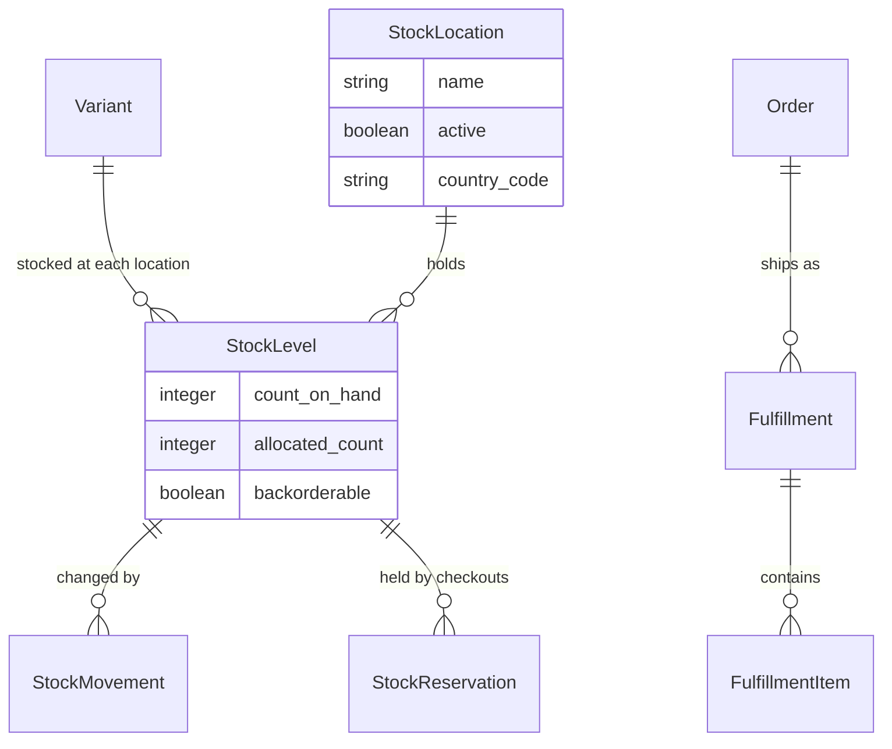

## Overview

Inventory answers one question a shopper cares about — *can I buy this?* — and several a merchant cares about: where is it, how much is left, and what happened to the rest.

Spree tracks stock **per location**. A variant doesn't have "a stock count"; it has a count at each warehouse or shop that carries it. That's what makes it possible to ship from the nearest location, or to let a customer collect in store.


```mermaid
erDiagram
    Variant ||--o{ StockLevel : "stocked at each location"
    StockLocation ||--o{ StockLevel : "holds"
    StockLevel ||--o{ StockMovement : "changed by"
    StockLevel ||--o{ StockReservation : "held by checkouts"
    Order ||--o{ Fulfillment : "ships as"
    Fulfillment ||--o{ FulfillmentItem : "contains"

    StockLevel {
        integer count_on_hand
        integer allocated_count
        boolean backorderable
    }
    StockLocation {
        string name
        boolean active
        string country_code
    }
```

## The three numbers

A stock level carries two counts, and a third is derived from them. Keeping them apart is what stops a warehouse from disagreeing with a website.

| | What it means |
|---|---|
| `count_on_hand` | What is physically on the shelf, right now |
| `allocated_count` | How much of that is already spoken for by orders not yet shipped |
| **`available_count`** | `count_on_hand − allocated_count` — what's actually sellable |

<Note>
**Selling an item does not reduce `count_on_hand`.** Placing an order raises `allocated_count`; the physical count only drops when the parcel actually ships.

This is deliberate. Until it leaves the building, the stock *is* still on the shelf — and a warehouse worker counting boxes should find the number Spree reports. Overselling shows up honestly as `allocated_count` exceeding what's on hand, rather than as an impossible negative count.
</Note>

## Stock locations

A stock location is somewhere stock physically sits: a warehouse, a shop, a third-party fulfillment centre.

| Attribute | Description |
|---|---|
| `name` | What staff call it |
| `active` | Whether it can be used for new orders |
| `default` | Used first when nothing else decides |
| `country_code`, `state_code`, `city`, `postal_code` | Where it is — used for shipping rates and for finding the nearest one |
| `backorderable_default` | Whether new stock levels here allow backorders |
| `fulfillable` | Whether orders can ship from here, or it's display-only stock |
| `pickup` | Whether customers can collect here |

```typescript Admin SDK
const { data: locations } = await adminClient.stockLocations.list()

await adminClient.stockLocations.create({
  name: 'Berlin Warehouse',
  country_code: 'DE',
  city: 'Berlin',
  active: true,
})
```

## Reading and adjusting stock

A stock level is the intersection of a variant and a location. They're created for you — for every variant when a location propagates all variants, or as variants are added.

<CodeGroup>

```typescript Admin SDK
// Stock for one location
const { data: levels } = await adminClient.stockLevels.list({
  filter: { stock_location_id_eq: 'sl_xxx' },
})

// Correct a single count
await adminClient.stockLevels.update('slv_xxx', {
  count_on_hand: 150,
  backorderable: true,
})

// Set many at once — the right call for a nightly sync
await adminClient.stockLevels.bulkUpsert({
  stock_levels: [
    { variant_id: 'var_xxx', stock_location_id: 'sl_xxx', count_on_hand: 40 },
    { variant_id: 'var_yyy', stock_location_id: 'sl_xxx', count_on_hand: 12 },
  ],
})
```

```bash CLI
spree api get '/stock_levels?q[stock_location_id_eq]=sl_xxx'
spree api patch /stock_levels/slv_xxx -d '{"count_on_hand": 150}'
```

</CodeGroup>

<Warning>
Use `bulkUpsert` for feeds from a warehouse or ERP rather than a loop of single updates. It's one request instead of thousands, and it won't half-apply if the connection drops.
</Warning>

## Stock movements

Every change to stock is recorded as a movement, so "why is this number what it is" always has an answer.

| Kind | When it happens |
|---|---|
| `received` | New stock arrives |
| `allocated` | An order claims stock — `allocated_count` goes up |
| `shipped` | A parcel leaves — `count_on_hand` goes down, the allocation is retired |
| `released` | An allocation is given back, because an order was cancelled |
| `adjusted` | A manual correction, such as after a stock count |

```typescript Admin SDK
const { data: movements } = await adminClient.stockMovements.list({
  filter: { variant_id_eq: 'var_xxx' },
})
```

Each movement points at what caused it — the order, the fulfillment, the transfer — so an audit trail reads as a sequence of business events rather than a list of numbers that changed.

## What a shopper sees

For a storefront, all of the above collapses into one question, and the answer is already computed:

```typescript Store SDK
const product = await client.products.get('spree-tote')

product.variants.forEach((variant) => {
  variant.in_stock     // can it be bought right now
  variant.purchasable  // in stock, or backorderable
})
```

`in_stock` already accounts for what's allocated and what other shoppers are holding in checkout. There is nothing to compute client-side, and no separate inventory request to make.

## Reservations during checkout

Without reservations, two customers can both see the last unit, both start checkout, and one discovers at the payment step that it's gone. That's a bad moment to find out.

A reservation is a short, time-limited hold placed when a customer enters checkout. Availability drops for everyone else immediately.

| Moment | What happens |
|---|---|
| Customer enters checkout | Their items are held, with an expiry |
| They keep editing the cart | The expiry is pushed forward |
| They complete the order | The hold becomes a real allocation |
| They abandon it | The hold expires and stock returns |

Reservations never touch `count_on_hand` — they're a separate layer consulted when availability is read. A backorderable item is skipped entirely, since unlimited supply needs no holding.

How long the hold lasts is a **store setting**, because it's a decision about the checkout experience rather than a property of a warehouse. Reservations can also be switched off entirely.

<Info>
Expired reservations are cleaned up by a background job. Spree ships the job but does not schedule it — your app's job runner should run it every minute or so.
</Info>

## Backorders

A stock level marked `backorderable` can be sold past zero. Orders are accepted, allocated, and wait for stock.

When new stock arrives, backorders are filled first, and only the remainder becomes available to new customers — so the people who waited longest aren't overtaken by whoever happens to visit the site next.

## Moving stock between locations

A stock transfer moves inventory from one location to another, and reflects that this takes time: stock is booked out of the source, is in transit, and is received at the destination — where a partial receipt is a normal outcome, because sometimes not everything arrives.

```typescript Admin SDK
const { data: transfers } = await adminClient.stockTransfers.list()
```

## Turning tracking off

Some things don't need counting — a service, a made-to-order item, a digital download. Tracking can be switched off, and those variants are always purchasable.

This is a store-level setting, so a store that sells only digital goods needn't manage stock at all.

## Syncing from an external system

If your inventory truth lives in an ERP or a warehouse system, Spree can defer to it. The rule that matters: **the read path stays local.** Whether a variant is in stock is answered from Spree's own data, not by calling out to another system while a shopper waits for a product page.

Feeds come in through the bulk update above; live checks happen only at decision moments, like completing an order. See [Providers](/developer/providers/overview).

## Related

- [Products](/developer/core-concepts/products) — variants, the things stock is counted for
- [Fulfillments](/developer/core-concepts/fulfillments) — how stock leaves the building
- [Orders](/developer/core-concepts/orders) — where allocation happens
- [Carts](/developer/core-concepts/carts) — checkout and reservations
