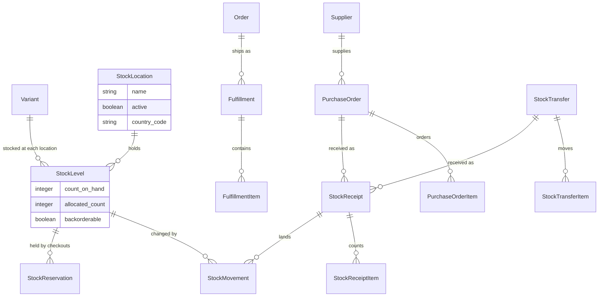

## Overview

Inventory answers one question a shopper cares about — *can I buy this?* — and several a merchant cares about: where is it, how much is left, and what happened to the rest.

Spree tracks stock **per location**. A variant doesn't have "a stock count"; it has a count at each warehouse or shop that carries it. That's what makes it possible to ship from the nearest location, or to let a customer collect in store.


```mermaid
erDiagram
    Variant ||--o{ StockLevel : "stocked at each location"
    StockLocation ||--o{ StockLevel : "holds"
    StockLevel ||--o{ StockMovement : "changed by"
    StockLevel ||--o{ StockReservation : "held by checkouts"
    Order ||--o{ Fulfillment : "ships as"
    Fulfillment ||--o{ FulfillmentItem : "contains"
    Supplier ||--o{ PurchaseOrder : "supplies"
    PurchaseOrder ||--o{ PurchaseOrderItem : "orders"
    StockTransfer ||--o{ StockTransferItem : "moves"
    PurchaseOrder ||--o{ StockReceipt : "received as"
    StockTransfer ||--o{ StockReceipt : "received as"
    StockReceipt ||--o{ StockReceiptItem : "counts"
    StockReceipt ||--o{ StockMovement : "lands"

    StockLevel {
        integer count_on_hand
        integer allocated_count
        boolean backorderable
    }
    StockLocation {
        string name
        boolean active
        string country_code
    }
```

## The three numbers

A stock level carries two counts, and a third is derived from them. Keeping them apart is what stops a warehouse from disagreeing with a website.

| | What it means |
|---|---|
| `count_on_hand` | What is physically on the shelf, right now |
| `allocated_count` | How much of that is already spoken for by orders not yet shipped |
| **`available_count`** | `count_on_hand − allocated_count` — what's actually sellable |

<Note>
**Selling an item does not reduce `count_on_hand`.** Placing an order raises `allocated_count`; the physical count only drops when the parcel actually ships.

This is deliberate. Until it leaves the building, the stock *is* still on the shelf — and a warehouse worker counting boxes should find the number Spree reports. Overselling shows up honestly as `allocated_count` exceeding what's on hand, rather than as an impossible negative count.
</Note>

## Stock locations

A stock location is somewhere stock physically sits: a warehouse, a shop, a third-party fulfillment centre.

| Attribute | Description |
|---|---|
| `name` | What staff call it |
| `active` | Whether it can be used for new orders |
| `default` | Used first when nothing else decides |
| `kind` | What sort of place it is — `warehouse`, `store` or `fulfillment_center` |
| `country_code`, `state_code`, `city`, `postal_code` | Where it is — used for shipping rates and for finding the nearest one |
| `backorderable_default` | Whether new stock levels here allow backorders |
| `pickup_enabled` | Whether customers can collect here |
| `returns_enabled` | Whether customers can bring returns here |

```typescript Admin SDK
const { data: locations } = await adminClient.stockLocations.list()

await adminClient.stockLocations.create({
  name: 'Berlin Warehouse',
  country_code: 'DE',
  city: 'Berlin',
  active: true,
})
```

## Reading and adjusting stock

A stock level is the intersection of a variant and a location. They're created for you — for every variant when a location propagates all variants, or as variants are added.

<CodeGroup>

```typescript Admin SDK
// Stock for one location
const { data: levels } = await adminClient.stockLevels.list({
  stock_location_id_eq: 'sloc_xxx',
})

// Correct a single count
await adminClient.stockLevels.update('sl_xxx', {
  count_on_hand: 150,
  backorderable: true,
})

// Set many at once — the right call for a nightly sync
await adminClient.stockLevels.bulkUpsert({
  stock_levels: [
    { variant_id: 'variant_xxx', stock_location_id: 'sloc_xxx', count_on_hand: 40 },
    { variant_id: 'variant_yyy', stock_location_id: 'sloc_xxx', count_on_hand: 12 },
  ],
})
```

```bash CLI
spree api get '/stock_levels?q[stock_location_id_eq]=sloc_xxx'
spree api patch /stock_levels/sl_xxx -d '{"count_on_hand": 150}'
```

</CodeGroup>

<Warning>
Use `bulkUpsert` for feeds from a warehouse or ERP rather than a loop of single updates. It's one request instead of thousands, and it won't half-apply if the connection drops.
</Warning>

## Stock movements

Every change to stock is recorded as a movement, so "why is this number what it is" always has an answer.

| Kind | When it happens |
|---|---|
| `received` | New stock arrives |
| `allocated` | An order claims stock — `allocated_count` goes up |
| `shipped` | A parcel leaves — `count_on_hand` goes down, the allocation is retired |
| `released` | An allocation is given back, because an order was cancelled |
| `adjusted` | A manual correction, such as after a stock count |

```typescript Admin SDK
// Everything that happened to one SKU, across every location
const { data: movements } = await adminClient.stockMovements.list({
  stock_level_variant_id_eq: 'variant_xxx',
})
```

Each movement points at what caused it — the order, the fulfillment, the transfer, the purchase order, and for stock that arrived, the delivery it came in on — so an audit trail reads as a sequence of business events rather than a list of numbers that changed.

A movement that arrived through a purchase order also carries what the units cost, so "what did this stock cost us" is answerable from the ledger rather than reconstructed from the orders that bought it.

## What a shopper sees

For a storefront, all of the above collapses into one question, and the answer is already computed:

```typescript Store SDK
const product = await client.products.get('spree-tote')

product.variants.forEach((variant) => {
  variant.in_stock     // can it be bought right now
  variant.purchasable  // in stock, or backorderable
})
```

`in_stock` already accounts for what's allocated and what other shoppers are holding in checkout. There is nothing to compute client-side, and no separate inventory request to make.

## Reservations during checkout

Without reservations, two customers can both see the last unit, both start checkout, and one discovers at the payment step that it's gone. That's a bad moment to find out.

A reservation is a short, time-limited hold placed when a customer enters checkout. Availability drops for everyone else immediately.

| Moment | What happens |
|---|---|
| Customer enters checkout | Their items are held, with an expiry |
| They keep editing the cart | The expiry is pushed forward |
| They complete the order | The hold becomes a real allocation |
| They abandon it | The hold expires and stock returns |

Reservations never touch `count_on_hand` — they're a separate layer consulted when availability is read. A backorderable item is skipped entirely, since unlimited supply needs no holding.

How long the hold lasts is a **store setting**, because it's a decision about the checkout experience rather than a property of a warehouse. Reservations can also be switched off entirely.

<Info>
Expired reservations are cleaned up by a background job. Spree ships the job but does not schedule it — your app's job runner should run it every minute or so.
</Info>

## Backorders

A stock level marked `backorderable` can be sold past zero. Orders are accepted, allocated, and wait for stock.

When new stock arrives, backorders are filled first, and only the remainder becomes available to new customers — so the people who waited longest aren't overtaken by whoever happens to visit the site next.

## Moving stock between locations

A stock transfer moves inventory from one location to another, and reflects that this takes time: stock is booked out of the source, is in transit, and is counted in at the destination — where a partial delivery is a normal outcome, because sometimes not everything arrives at once.

That is four steps, not one. A transfer is planned as a draft, packed, sent, and finally counted in:

```typescript Admin SDK
const transfer = await adminClient.stockTransfers.create({
  source_location_id: 'sloc_xxx',
  destination_location_id: 'sloc_yyy',
  items: [{ variant_id: 'variant_xxx', quantity_shipped: 10 }],
})

// The units leave the source here — and are on no shelf until they arrive.
await adminClient.stockTransfers.markInTransit(transfer.id)

// Eight arrived intact and two were crushed. See "Counting a delivery in".
await adminClient.stockTransfers.stockReceipts.create(transfer.id, {
  items: [{ id: 'sti_xxx', quantity_accepted: 8, quantity_rejected: 2, rejection_reason: 'damaged' }],
})
```

| Status | What it means |
|---|---|
| `draft` | A plan. Lines can still change; nothing has moved |
| `ready_to_ship` | Packed. Lines are frozen, nothing has left yet — `markDraft` unfreezes it |
| `in_transit` | The units have left the source and are on no shelf |
| `partially_received` | Some units have been counted in; the rest are still on the road |
| `received` | Everything that left has arrived — or the balance was closed short |
| `over_received` | More arrived than was sent |
| `canceled` | Called off. Once units have left, the merchant says whether they come back or are written off |

Two things follow from the middle step. Availability at the destination does not rise until somebody counts the goods in, which is what makes the number trustworthy. And cancelling a transfer whose units have already left is a decision rather than an undo: either they come back to the source, or they are written off as lost.

## Buying stock in

Stock that comes from a supplier is a purchase order, not a transfer — it has a supplier, a cost per unit and a date it was promised for, none of which apply to moving goods you already own.

```typescript Admin SDK
const order = await adminClient.purchaseOrders.create({
  supplier_id: 'sup_xxx',
  destination_location_id: 'sloc_xxx',
  expected_at: '2026-10-01',
  cancel_by: '2026-10-15',
  items: [{ variant_id: 'variant_xxx', quantity_ordered: 100, unit_cost: '12.50' }],
})

await adminClient.purchaseOrders.markOrdered(order.id)

// A delivery arrives: 58 accepted, 2 refused. The order stays open for the rest.
await adminClient.purchaseOrders.stockReceipts.create(order.id, {
  reference: 'DN-4471',
  items: [{ id: 'poi_xxx', quantity_accepted: 58, quantity_rejected: 2, rejection_reason: 'damaged' }],
})
```

| Status | What it means |
|---|---|
| `draft` | Being put together. Lines and costs can still change |
| `ordered` | Sent to the supplier. Lines are frozen — `markDraft` reopens it while nothing has arrived |
| `partially_received` | Some units have been counted in; the supplier still owes the rest |
| `received` | Every line has what it expected — or the balance was closed short |
| `over_received` | The supplier sent more than was ordered |
| `canceled` | Called off. Units already received stay on the shelf |

Ordered stock is never available stock. Nothing reaches `count_on_hand` until a delivery is counted in, because a merchant who has ordered goods does not have them — and suppliers under-ship often enough that receiving in parts is the ordinary case.

An order carries the day the supplier promised (`expected_at`) and, optionally, the day after which the goods are no longer wanted (`cancel_by`). Both are calendar dates. The dashboard lists filter on *Overdue* and *Past cancel-by*; nothing cancels automatically, because that is a call to confirm with the supplier.

Purchase orders export to CSV, one row per line, which is the file a merchant sends a supplier. They import from one too: rows sharing a `reference` become one draft order, naming the supplier, warehouse and SKU by name — a name that does not exist fails the row rather than creating anything.

Suppliers themselves are an address book, kept per store:

```typescript Admin SDK
const { data: suppliers } = await adminClient.suppliers.list()
```

## Counting a delivery in

Transfers and purchase orders are received the same way: each delivery is a **stock receipt**, numbered and dated, carrying the packing-slip reference and — per line — what was accepted and what was refused, with a reason.

```typescript Admin SDK
const { data: deliveries } = await adminClient.purchaseOrders.stockReceipts.list(order.id, {
  expand: ['items'],
})
```

A receipt records *this delivery's* counts, not running totals: a second box adds to the first rather than restating it. Accepted units land on the destination's shelf, each as a `received` movement that names the receipt. Refused units are recorded and never stocked; the reason is one of `damaged`, `wrong_item`, `expired` or `other`. Omit `items` to count in everything still outstanding, intact.

<Note>
**Refused units count differently on the two documents.** A supplier's refused units are still owed — the goods go back, and the order stays `partially_received` until they are replaced. A transfer's refused units have *arrived*, in whatever state: a crushed unit is not still in the van, so it counts toward the trip being over.
</Note>

When the balance is not coming — the supplier is out of stock, the missing units fell off the van — the document is **closed short**: it settles in `received` with `closed_short_at` and the reason recorded, and the outstanding count stays on each line as the record of the gap. Nothing moves.

```typescript Admin SDK
await adminClient.purchaseOrders.close(order.id, { reason: 'Supplier out of stock' })
await adminClient.stockTransfers.close(transfer.id, { reason: 'Two fell off the van' })
```

## Turning tracking off

Some things don't need counting — a service, a made-to-order item, a digital download. Tracking can be switched off, and those variants are always purchasable.

This is a store-level setting, so a store that sells only digital goods needn't manage stock at all.

## Syncing from an external system

If your inventory truth lives in an ERP or a warehouse system, Spree can defer to it. The rule that matters: **the read path stays local.** Whether a variant is in stock is answered from Spree's own data, not by calling out to another system while a shopper waits for a product page.

Feeds come in through the bulk update above; live checks happen only at decision moments, like completing an order. See [Providers](/developer/providers/overview).

## Related

- [Products](/developer/core-concepts/products) — variants, the things stock is counted for
- [Fulfillments](/developer/core-concepts/fulfillments) — how stock leaves the building
- [Orders](/developer/core-concepts/orders) — where allocation happens
- [Carts](/developer/core-concepts/carts) — checkout and reservations
