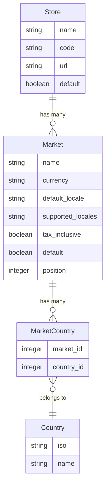

## Overview

Markets let you segment a single [Store](/developer/core-concepts/stores) into distinct geographic regions, each with its own currency, locale, and set of countries. For example, an international store might define:

- **North America** — USD, English, ships to US and Canada
- **Europe** — EUR, German, ships to DE, FR, AT, NL
- **United Kingdom** — GBP, English, ships to GB

### Market Model Diagram



**Key relationships:**
- A **Store** has many Markets — each market defines a selling region
- A **Market** has many Countries through `MarketCountry` join records
- A **Country** can belong to multiple Markets (across different stores)
- Markets connect to the [Pricing](/developer/core-concepts/pricing) system via `Spree::Pricing::Context`

## Market Attributes

| Attribute           | Description                                                                                       | Example Value          |
|---------------------|---------------------------------------------------------------------------------------------------|------------------------|
| `name`              | Human-readable name for the market. Must be unique per store.                                     | `North America`        |
| `currency`          | ISO 4217 currency code used for this market.                                                      | `USD`                  |
| `default_locale`    | Default locale/language for this market.                                                          | `en`                   |
| `supported_locales` | Comma-separated list of additional locales supported by this market.                              | `en,fr`                |
| `tax_inclusive`     | Whether prices in this market include tax.                                                        | `false`                |
| `default`           | Whether this is the default market for the store. Only one market per store can be default.       | `true`                 |
| `position`          | Sort order for market resolution priority. Lower numbers = higher priority.                       | `0`                    |
| `deleted_at`        | Soft-delete timestamp. Markets are never fully removed from the database.                         | `nil`                  |

## Default Market

`Spree::Current.market` provides per-request access to the current market. The fallback chain is:

1. Explicitly set market (e.g., resolved from the customer's country)
2. The store's default market (`store.default_market`)

```ruby
# Spree::Current.market is available in controllers, models, and services
Spree::Current.market
# => #<Spree::Market name: "North America", currency: "USD", ...>

# Set it explicitly per-request
Spree::Current.market = eu_market
```

The default market for a store is determined by the `default` flag, falling back to the first market by position:

```ruby
store.default_market
# => #<Spree::Market name: "North America", default: true, ...>
```

## Currency and Locale

When markets are configured, `Spree::Current.currency` derives from the current market rather than the store:

```ruby
# Fallback chain for currency:
# 1. Explicitly set currency
# 2. Current market's currency
# 3. Store's default_currency
Spree::Current.currency
# => "USD" (from Spree::Current.market.currency)
```

Each market tracks its supported locales. Use `supported_locales_list` to get all available locales (always includes the `default_locale`):

```ruby
market = Spree::Market.find_by(name: 'Europe')
market.supported_locales_list
# => ["de", "en", "fr"]
```

The store aggregates currencies and locales from all its markets:

```ruby
store.supported_currencies_list
# => [#<Money::Currency USD>, #<Money::Currency EUR>, #<Money::Currency GBP>]

store.supported_locales_list
# => ["de", "en", "fr"]
```

## Finding a Market by Country

Resolve which market a country belongs to using the class method:

```ruby
country = Spree::Country.find_by(iso: 'DE')
market = Spree::Market.for_country(country, store: current_store)
# => #<Spree::Market name: "Europe", currency: "EUR", ...>
```

Or via the store convenience method:

```ruby
current_store.market_for_country(country)
# => #<Spree::Market name: "Europe", currency: "EUR", ...>
```

When multiple markets contain the same country, the one with the lowest `position` is returned.

## Countries Available for Checkout

Markets determine which countries are available during checkout. The `countries_available_for_checkout` method on Store aggregates countries from all markets:

```ruby
current_store.countries_available_for_checkout
# => [#<Spree::Country iso: "AT">, #<Spree::Country iso: "CA">, ...]
```

## Creating Markets

```ruby
# Create a market with countries
na_market = current_store.markets.create!(
  name: 'North America',
  currency: 'USD',
  default_locale: 'en',
  countries: [usa, canada],
  default: true
)

eu_market = current_store.markets.create!(
  name: 'Europe',
  currency: 'EUR',
  default_locale: 'de',
  supported_locales: 'de,en,fr',
  tax_inclusive: true,
  countries: [germany, france, austria, netherlands]
)
```

<Info>
When you run `rails db:seed`, Spree automatically creates a default market for each store
</Info>

## Store API

Markets are not directly exposed as API endpoints. Instead, the Store API provides market-aware endpoints for countries, currencies, and locales. Each country includes the currency and locale derived from the market it belongs to.

| Method | Endpoint | Description |
|--------|----------|-------------|
| `GET` | `/api/v3/store/countries` | List countries with their market-derived currency and locale |
| `GET` | `/api/v3/store/countries/:iso` | Get a country with its states |
| `GET` | `/api/v3/store/currencies` | List supported currencies (derived from markets) |
| `GET` | `/api/v3/store/locales` | List supported locales (derived from markets) |

<AccordionGroup>
  <Accordion title="List Countries">

  Returns countries available in the store. Each country includes the currency and locale derived from the market it belongs to — useful for auto-selecting the correct currency and locale based on a customer's location.

  ```javascript
  import { createSpreeClient } from '@spree/sdk'

  const client = createSpreeClient({
    baseUrl: 'https://your-store.com',
    publishableKey: '<api-key>',
  })

  const countries = await client.store.countries.list()
  ```

  ```json
  {
    "data": [
      {
        "iso": "DE",
        "iso3": "DEU",
        "name": "Germany",
        "states_required": false,
        "zipcode_required": true,
        "currency": "EUR",
        "default_locale": "de",
        "supported_locales": ["de", "en"]
      },
      {
        "iso": "US",
        "iso3": "USA",
        "name": "United States of America",
        "states_required": true,
        "zipcode_required": true,
        "currency": "USD",
        "default_locale": "en",
        "supported_locales": ["en", "es"]
      }
    ]
  }
  ```

  </Accordion>
  <Accordion title="List Currencies">

  Returns currencies supported by the store (derived from markets).

  ```javascript
  import { createSpreeClient } from '@spree/sdk'

  const client = createSpreeClient({
    baseUrl: 'https://your-store.com',
    publishableKey: '<api-key>',
  })

  const currencies = await client.store.currencies.list()
  ```

  ```json
  {
    "data": [
      { "iso_code": "USD", "name": "United States Dollar", "symbol": "$" },
      { "iso_code": "EUR", "name": "Euro", "symbol": "€" }
    ]
  }
  ```

  </Accordion>
  <Accordion title="List Locales">

  Returns locales supported by the store (derived from markets).

  ```javascript
  import { createSpreeClient } from '@spree/sdk'

  const client = createSpreeClient({
    baseUrl: 'https://your-store.com',
    publishableKey: '<api-key>',
  })

  const locales = await client.store.locales.list()
  ```

  ```json
  {
    "data": [
      { "code": "de", "name": "de" },
      { "code": "en", "name": "English (US)" }
    ]
  }
  ```

  </Accordion>
</AccordionGroup>

## Pricing Integration

Markets integrate with the [Pricing](/developer/core-concepts/pricing) system through the `Spree::Pricing::Context`. The current market is automatically included in pricing resolution, enabling market-specific Price Lists via the **Market Rule**.

```ruby
# Market is automatically part of the pricing context
context = Spree::Pricing::Context.new(
  variant: variant,
  currency: 'EUR',
  market: eu_market
)

# Price Lists with a Market Rule targeting eu_market will apply
price = variant.price_for(context)
```

See [Pricing — Market Rule](/developer/core-concepts/pricing#price-rules) for details on configuring market-specific price lists.

## Related Documentation

- [Stores](/developer/core-concepts/stores) — Multi-store setup and configuration
- [Pricing](/developer/core-concepts/pricing) — Price Lists, Price Rules, and the Pricing Context
- [Addresses](/developer/core-concepts/addresses) — Countries, States, and Zones
- [Translations](/developer/core-concepts/translations) — Resource and UI translations
