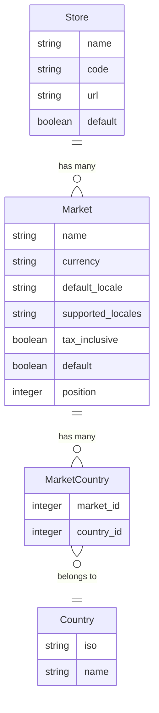

## Overview

Markets let you segment a single [Store](/developer/core-concepts/stores) into distinct geographic regions, each with its own currency, locale, and set of countries. For example, an international store might define:

- **North America** — USD, English, ships to US and Canada
- **Europe** — EUR, German, ships to DE, FR, AT, NL
- **United Kingdom** — GBP, English, ships to GB

### Market Model Diagram


```mermaid
erDiagram
    Store {
        string name
        string code
        string url
        boolean default
    }

    Market {
        string name
        string currency
        string default_locale
        string supported_locales
        boolean tax_inclusive
        boolean default
        integer position
    }

    MarketCountry {
        integer market_id
        integer country_id
    }

    Country {
        string iso
        string name
    }

    Store ||--o{ Market : "has many"
    Market ||--o{ MarketCountry : "has many"
    MarketCountry }o--|| Country : "belongs to"
```

**Key relationships:**
- A **Store** has many Markets — each market defines a selling region
- A **Market** has many Countries through `MarketCountry` join records
- A **Country** can belong to multiple Markets (across different stores)
- Markets connect to the [Pricing](/developer/core-concepts/pricing) system via `Spree::Pricing::Context`

## Market Attributes

| Attribute           | Description                                                                                       | Example Value          |
|---------------------|---------------------------------------------------------------------------------------------------|------------------------|
| `name`              | Human-readable name for the market. Must be unique per store.                                     | `North America`        |
| `currency`          | ISO 4217 currency code used for this market.                                                      | `USD`                  |
| `default_locale`    | Default locale/language for this market.                                                          | `en`                   |
| `supported_locales` | Comma-separated list of additional locales supported by this market.                              | `en,fr`                |
| `tax_inclusive`     | Whether prices in this market include tax. Controls how prices are displayed and how tax is calculated during checkout. | `false`                |
| `default`           | Whether this is the default market for the store. Only one market per store can be default.       | `true`                 |
| `position`          | Sort order for market resolution priority. Lower numbers = higher priority.                       | `0`                    |
| `deleted_at`        | Soft-delete timestamp. Markets are never fully removed from the database.                         | `nil`                  |

## Default Market

`Spree::Current.market` provides per-request access to the current market. The fallback chain is:

1. Explicitly set market (e.g., resolved from the customer's country)
2. The store's default market (`store.default_market`)

```ruby
# Spree::Current.market is available in controllers, models, and services
Spree::Current.market
# => #<Spree::Market name: "North America", currency: "USD", ...>

# Set it explicitly per-request
Spree::Current.market = eu_market
```

The default market for a store is determined by the `default` flag, falling back to the first market by position:

```ruby
store.default_market
# => #<Spree::Market name: "North America", default: true, ...>
```

## Currency and Locale

When markets are configured, `Spree::Current.currency` derives from the current market rather than the store:

```ruby
# Fallback chain for currency:
# 1. Explicitly set currency
# 2. Current market's currency
# 3. Store's default_currency
Spree::Current.currency
# => "USD" (from Spree::Current.market.currency)
```

Each market tracks its supported locales. Use `supported_locales_list` to get all available locales (always includes the `default_locale`):

```ruby
market = Spree::Market.find_by(name: 'Europe')
market.supported_locales_list
# => ["de", "en", "fr"]
```

The store aggregates currencies and locales from all its markets:

```ruby
store.supported_currencies_list
# => [#<Money::Currency USD>, #<Money::Currency EUR>, #<Money::Currency GBP>]

store.supported_locales_list
# => ["de", "en", "fr"]
```

## Tax Zone Resolution

Each market resolves a tax zone from its default country using `Spree::Zone.match`. This zone is used to determine the correct tax rate for browsing prices before a customer enters an address.

```ruby
market = Spree::Market.find_by(name: 'Europe')
market.tax_zone
# => #<Spree::Zone name: "EU_VAT", ...>
```

`Spree::Current.zone` uses the following fallback chain:

1. Explicitly set zone (e.g., from an order's shipping address)
2. Current market's tax zone (`market.tax_zone`)
3. Store's default tax zone

This means browsing prices automatically use the correct tax zone for the customer's market, even before they enter an address at checkout.

## Finding a Market by Country

Resolve which market a country belongs to using the class method:

```ruby
country = Spree::Country.find_by(iso: 'DE')
market = Spree::Market.for_country(country, store: current_store)
# => #<Spree::Market name: "Europe", currency: "EUR", ...>
```

Or via the store convenience method:

```ruby
current_store.market_for_country(country)
# => #<Spree::Market name: "Europe", currency: "EUR", ...>
```

A country also has a `current_market` method that uses `Spree::Current.store`:

```ruby
country = Spree::Country.find_by(iso: 'DE')
country.current_market
# => #<Spree::Market name: "Europe", currency: "EUR", ...>
```

When multiple markets contain the same country, the one with the lowest `position` is returned.

## Countries Available for Checkout

Markets determine which countries are available during checkout. The `countries_available_for_checkout` method on Store aggregates countries from all markets:

```ruby
current_store.countries_available_for_checkout
# => [#<Spree::Country iso: "AT">, #<Spree::Country iso: "CA">, ...]
```

## Creating Markets

```ruby
# Create a market with countries
na_market = current_store.markets.create!(
  name: 'North America',
  currency: 'USD',
  default_locale: 'en',
  countries: [usa, canada],
  default: true
)

eu_market = current_store.markets.create!(
  name: 'Europe',
  currency: 'EUR',
  default_locale: 'de',
  supported_locales: 'de,en,fr',
  tax_inclusive: true,
  countries: [germany, france, austria, netherlands]
)
```

<Info>
When you run `rails db:seed`, Spree automatically creates a default market for each store
</Info>

## Store API

The Store API provides endpoints for markets and countries. All endpoints require a publishable API key.

### Markets Endpoints

| Method | Endpoint | Description |
|--------|----------|-------------|
| `GET` | `/api/v3/store/markets` | List all markets with nested countries |
| `GET` | `/api/v3/store/markets/:id` | Get a single market by prefixed ID |
| `GET` | `/api/v3/store/markets/resolve?country=:iso` | Resolve which market a country belongs to |
| `GET` | `/api/v3/store/markets/:market_id/countries` | List countries in a market |
| `GET` | `/api/v3/store/markets/:market_id/countries/:iso` | Get a country (supports `?include=states`) |

### Countries Endpoints

| Method | Endpoint | Description |
|--------|----------|-------------|
| `GET` | `/api/v3/store/countries` | List all countries (flat, across all markets) |
| `GET` | `/api/v3/store/countries/:iso` | Get a country by ISO code |

Countries support optional includes via the `?include=` parameter:
- `states` — include states/provinces (for address forms)
- `market` — include the country's market with currency, locales, and tax settings

<AccordionGroup>
  <Accordion title="List Markets">

  Returns all markets for the current store with their countries.

  ```bash
  curl -H "Authorization: Bearer spree_pk_xxx" \
    https://example.com/api/v3/store/markets
  ```

  ```json
  {
    "data": [
      {
        "id": "mkt_k5nR8xLq",
        "name": "North America",
        "currency": "USD",
        "default_locale": "en",
        "supported_locales": ["en", "es"],
        "tax_inclusive": false,
        "default": true,
        "countries": [
          { "iso": "US", "iso3": "USA", "name": "United States", "states_required": true, "zipcode_required": true },
          { "iso": "CA", "iso3": "CAN", "name": "Canada", "states_required": true, "zipcode_required": true }
        ]
      },
      {
        "id": "mkt_gbHJdmfr",
        "name": "Europe",
        "currency": "EUR",
        "default_locale": "de",
        "supported_locales": ["de", "en", "fr"],
        "tax_inclusive": true,
        "default": false,
        "countries": [
          { "iso": "DE", "iso3": "DEU", "name": "Germany", "states_required": false, "zipcode_required": true },
          { "iso": "FR", "iso3": "FRA", "name": "France", "states_required": false, "zipcode_required": true }
        ]
      }
    ]
  }
  ```

  </Accordion>
  <Accordion title="Resolve Market by Country">

  Determine which market applies for a given country ISO code. Useful for auto-selecting the correct currency and locale when a customer's location is known.

  ```bash
  curl -H "Authorization: Bearer spree_pk_xxx" \
    https://example.com/api/v3/store/markets/resolve?country=DE
  ```

  Returns the market object on success, or `404` if no market contains that country.

  </Accordion>
  <Accordion title="List Countries in a Market">

  Returns countries belonging to a specific market. Useful for populating address dropdowns during checkout.

  ```bash
  curl -H "Authorization: Bearer spree_pk_xxx" \
    https://example.com/api/v3/store/markets/mkt_k5nR8xLq/countries
  ```

  ```json
  {
    "data": [
      { "iso": "CA", "iso3": "CAN", "name": "Canada", "states_required": true, "zipcode_required": true },
      { "iso": "US", "iso3": "USA", "name": "United States", "states_required": true, "zipcode_required": true }
    ]
  }
  ```

  </Accordion>
  <Accordion title="Get Country with Market">

  Use `?include=market` on any country endpoint to get the market details alongside the country.

  ```bash
  curl -H "Authorization: Bearer spree_pk_xxx" \
    https://example.com/api/v3/store/countries/US?include=market
  ```

  ```json
  {
    "iso": "US",
    "iso3": "USA",
    "name": "United States",
    "states_required": true,
    "zipcode_required": true,
    "market": {
      "id": "mkt_k5nR8xLq",
      "name": "North America",
      "currency": "USD",
      "default_locale": "en",
      "supported_locales": ["en", "es"],
      "tax_inclusive": false,
      "default": true
    }
  }
  ```

  </Accordion>
</AccordionGroup>

### SDK Usage

```typescript
import { createSpreeClient } from '@spree/sdk'

const client = createSpreeClient({ host: 'https://example.com' })

// List all markets
const { data: markets } = await client.store.markets.list()

// Get a single market
const market = await client.store.markets.get('mkt_k5nR8xLq')

// Resolve market by country (e.g., from geolocation)
const market = await client.store.markets.resolve('DE')
// => { id: "mkt_gbHJdmfr", name: "Europe", currency: "EUR", tax_inclusive: true, ... }

// List countries in a market (for checkout address forms)
const { data: countries } = await client.store.markets.countries.list('mkt_k5nR8xLq')

// Get a country with states (for address forms)
const country = await client.store.markets.countries.get('mkt_k5nR8xLq', 'US', { include: 'states' })

// Get a country with its market details
const country = await client.store.countries.get('US', { include: 'market' })
// => { iso: "US", ..., market: { currency: "USD", tax_inclusive: false, ... } }
```

## Pricing Integration

Markets integrate with the [Pricing](/developer/core-concepts/pricing) system through the `Spree::Pricing::Context`. The current market is automatically included in pricing resolution, enabling market-specific Price Lists via the **Market Rule**.

```ruby
# Market is automatically part of the pricing context
context = Spree::Pricing::Context.new(
  variant: variant,
  currency: 'EUR',
  market: eu_market
)

# Price Lists with a Market Rule targeting eu_market will apply
price = variant.price_for(context)
```

See [Pricing — Market Rule](/developer/core-concepts/pricing#price-rules) for details on configuring market-specific price lists.

## Related Documentation

- [Stores](/developer/core-concepts/stores) — Multi-store setup and configuration
- [Pricing](/developer/core-concepts/pricing) — Price Lists, Price Rules, and the Pricing Context
- [Addresses](/developer/core-concepts/addresses) — Countries, States, and Zones
- [Internationalization](/developer/core-concepts/i18n) — Locales, currencies, and translations
