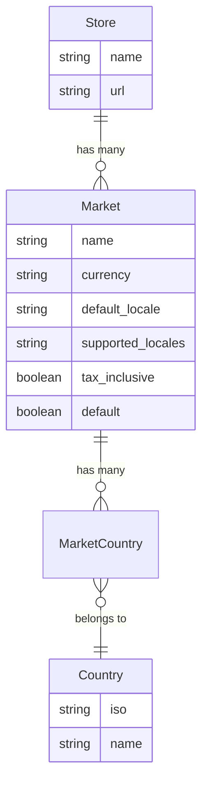

import { Since } from '/snippets/since.mdx';

<Since version="5.4" />

## Overview

Markets let you segment a single [Store](/developer/core-concepts/stores) into distinct geographic regions, each with its own currency, locale, and set of countries. For example, an international store might define:

- **North America** — USD, English, ships to US and Canada
- **Europe** — EUR, German, ships to DE, FR, AT, NL
- **United Kingdom** — GBP, English, ships to GB


```mermaid
erDiagram
    Store ||--o{ Market : "has many"
    Market ||--o{ MarketCountry : "has many"
    MarketCountry }o--|| Country : "belongs to"

    Store {
        string name
        string url
    }

    Market {
        string name
        string currency
        string default_locale
        string supported_locales
        boolean tax_inclusive
        boolean default
    }

    Country {
        string iso
        string name
    }
```

## Market Attributes

| Attribute | Description | Example |
|-----------|-------------|---------|
| `name` | Human-readable name, unique per store | `North America` |
| `currency` | ISO 4217 currency code | `USD` |
| `default_locale` | Default language for this market | `en` |
| `supported_locales` | All locales available in this market | `["en", "es"]` |
| `tax_inclusive` | Whether prices include tax (affects display and checkout calculation) | `false` |
| `default` | Whether this is the fallback market when no country match is found | `true` |
| `countries` | List of countries in this market | `[{ iso: "US" }, { iso: "CA" }]` |

## How Markets Work

When a customer visits your store, their country determines which market applies. The market then sets the currency, locale, and tax behavior for that session.

```
Customer's Country → Market → Currency + Locale + Tax Zone
```

The resolution chain:

1. Customer's country is detected (from URL, geolocation, `X-Spree-Country` header, or manual selection)
2. Spree finds the market containing that country
3. The market's currency and locale become the defaults for the session
4. The market's tax zone determines whether prices are shown with or without tax

If no market matches the customer's country, the store's **default market** is used.

## Listing Markets

Fetch all markets for the current store, including their countries:

<CodeGroup>

```typescript Store SDK
const { data: markets } = await client.markets.list()
// [
//   {
//     id: "mkt_k5nR8xLq",
//     name: "North America",
//     currency: "USD",
//     default_locale: "en",
//     supported_locales: ["en", "es"],
//     tax_inclusive: false,
//     default: true,
//     countries: [
//       { iso: "US", name: "United States", states_required: true, zipcode_required: true },
//       { iso: "CA", name: "Canada", states_required: true, zipcode_required: true }
//     ]
//   },
//   ...
// ]
```

```typescript Admin SDK
const { data: markets } = await adminClient.markets.list()
```

```bash cURL
curl 'https://api.mystore.com/api/v3/store/markets' \
  -H 'X-Spree-API-Key: pk_xxx'
```

</CodeGroup>

## Resolving a Market by Country

When you know a customer's country (e.g., from geolocation or a country picker), resolve which market applies:

<CodeGroup>

```typescript Store SDK
const market = await client.markets.resolve('DE')
// { id: "mkt_gbHJdmfr", name: "Europe", currency: "EUR", tax_inclusive: true, ... }
```

```bash cURL
curl 'https://api.mystore.com/api/v3/store/markets/resolve?country=DE' \
  -H 'X-Spree-API-Key: pk_xxx'
```

</CodeGroup>

Returns the market object on success, or `404` if no market contains that country.

This is useful for building a country switcher — resolve the market to show the customer what currency and language they'll get.

## Countries in a Market

List countries belonging to a specific market. Useful for populating address form dropdowns during checkout:

<CodeGroup>

```typescript Store SDK
const { data: countries } = await client.markets.countries.list('mkt_k5nR8xLq')
// [
//   { iso: "CA", name: "Canada", states_required: true, zipcode_required: true },
//   { iso: "US", name: "United States", states_required: true, zipcode_required: true }
// ]

// Get a country with its states (for address form dropdowns)
const usa = await client.markets.countries.get('mkt_k5nR8xLq', 'US', {
  expand: ['states'],
})
```

```bash cURL
# List countries in a market
curl 'https://api.mystore.com/api/v3/store/markets/mkt_k5nR8xLq/countries' \
  -H 'X-Spree-API-Key: pk_xxx'

# Get a country with its states
curl 'https://api.mystore.com/api/v3/store/markets/mkt_k5nR8xLq/countries/US?expand=states' \
  -H 'X-Spree-API-Key: pk_xxx'
```

</CodeGroup>

You can also fetch countries flat (across all markets) or include the market on a country:

<CodeGroup>

```typescript Store SDK
// All countries across all markets
const { data: countries } = await client.countries.list()

// Get a country with its market details
const germany = await client.countries.get('DE', { expand: ['market'] })
// { iso: "DE", name: "Germany", market: { currency: "EUR", default_locale: "de", tax_inclusive: true } }
```

```typescript Admin SDK
const { data: countries } = await adminClient.countries.list()

const germany = await adminClient.countries.get('DE')
```

```bash cURL
# All countries across all markets
curl 'https://api.mystore.com/api/v3/store/countries' \
  -H 'X-Spree-API-Key: pk_xxx'

# Get a country with its market
curl 'https://api.mystore.com/api/v3/store/countries/DE?expand=market' \
  -H 'X-Spree-API-Key: pk_xxx'
```

</CodeGroup>

## Currency and Locale

Each market defines a [currency and set of supported locales](/api-reference/store-api/monetary-amounts). When a market is resolved, its currency and locale become the defaults for the session.

You can discover all available currencies and locales (aggregated from all markets) via dedicated endpoints:

<CodeGroup>

```typescript Store SDK
const { data: currencies } = await client.currencies.list()
// [{ iso_code: "USD", name: "US Dollar", symbol: "$" }, { iso_code: "EUR", name: "Euro", symbol: "€" }]

const { data: locales } = await client.locales.list()
// [{ code: "en", name: "English" }, { code: "de", name: "German" }]
```

```bash cURL
curl 'https://api.mystore.com/api/v3/store/currencies' \
  -H 'X-Spree-API-Key: pk_xxx'

curl 'https://api.mystore.com/api/v3/store/locales' \
  -H 'X-Spree-API-Key: pk_xxx'
```

</CodeGroup>

See [Localization](/api-reference/store-api/localization) for details on how to pass locale, currency, and country headers in API requests.

## Tax Behavior

The `tax_inclusive` flag on a market controls how prices are displayed and calculated:

- **`tax_inclusive: true`** (common in Europe) — the price shown to the customer already includes tax
- **`tax_inclusive: false`** (common in the US) — tax is added at checkout on top of the displayed price

Each market also resolves a **tax zone** from its default country. This zone determines which tax rates apply when browsing products — before the customer enters a shipping address. Once the customer provides an address at checkout, the actual shipping address takes over for tax calculation.

See [Taxes](/developer/core-concepts/taxes) for details on tax zones and rates.

## Pricing Integration

Markets integrate with the [Pricing](/developer/core-concepts/pricing) system, enabling market-specific pricing through **Price Lists** with a **Market Rule**. This lets you set different prices for the same product in different markets — beyond just currency conversion.

For example, you could price a product at $29.99 in North America and €24.99 in Europe, rather than relying on exchange rate conversion.

See [Pricing — Price Rules](/developer/core-concepts/pricing#price-rules) for details on configuring market-specific price lists.

## Setting Up Markets

Markets are managed in the admin dashboard under **Settings → Markets**. When you run `rails db:seed`, Spree automatically creates a default market for each store.

To create markets programmatically, use the [Admin API](/api-reference/admin-api/introduction). See the [Admin API endpoints](/api-reference/admin-api/endpoints) for the full list of `/markets` routes and required scopes:

<CodeGroup>

```typescript Admin SDK
import { createAdminClient } from '@spree/admin-sdk'

const client = createAdminClient({
  baseUrl: 'https://store.example.com',
  secretKey: 'sk_xxx',
})

// North America market (countries by ISO code)
const northAmerica = await client.markets.create({
  name: 'North America',
  currency: 'USD',
  default_locale: 'en',
  country_isos: ['US', 'CA'],
  default: true,
})

// Europe market with tax-inclusive pricing
const europe = await client.markets.create({
  name: 'Europe',
  currency: 'EUR',
  default_locale: 'de',
  supported_locales: ['de', 'en', 'fr'],
  tax_inclusive: true,
  country_isos: ['DE', 'FR', 'AT', 'NL'],
})
```

```bash CLI
spree api post /markets -d '{
  "name": "North America",
  "currency": "USD",
  "default_locale": "en",
  "country_isos": ["US", "CA"],
  "default": true
}'
```

</CodeGroup>

Update or remove a market the same way:

<CodeGroup>

```typescript Admin SDK
await client.markets.update('market_xxx', { tax_inclusive: true })
await client.markets.delete('market_xxx')
```

```bash CLI
spree api patch /markets/market_xxx -d '{"tax_inclusive": true}'
spree api delete /markets/market_xxx
```

</CodeGroup>

## Related Documentation

- [Markets (Store SDK)](/developer/sdk/store/markets) — Listing, resolving, and reading markets from the Store SDK
- [Pricing](/developer/core-concepts/pricing) — Price Lists, Price Rules, and the Pricing Context
- [Addresses](/developer/core-concepts/addresses) — Countries, States, and Zones
- [Localization](/api-reference/store-api/localization) — Locale, currency, and country headers in API requests
- [Translations](/developer/core-concepts/translations) — Resource and UI translations
