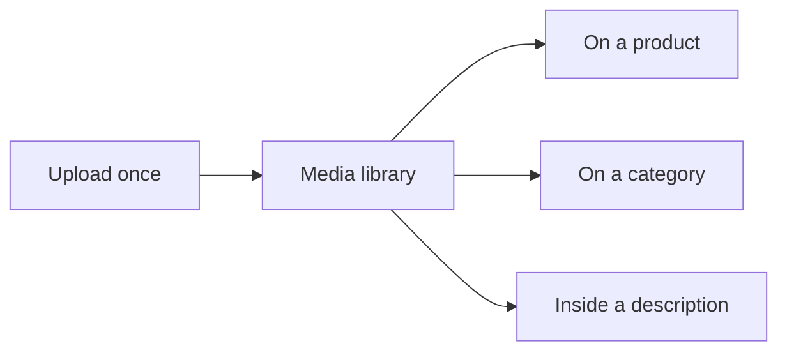

## Overview

Spree handles uploading, processing and serving the images and video a store shows. Files are converted to WebP and preprocessed into several sizes, so a listing page isn't downloading full-resolution photographs.

Files live in a **store-wide media library**. A file is uploaded once and can then be placed wherever it's needed — on a product, on a category, inside a description — without being uploaded again.



## The media library

Every file in a store is in the library, whether or not it's currently placed on anything. That means a file can be uploaded ahead of time, browsed, searched, and reused.

```typescript Admin SDK
// Browse everything in the store
const { data: media } = await adminClient.media.list()

// Where is this file being used?
const { data: usage } = await adminClient.media.usage('med_xxx')
```

| Field | What it tells you |
|---|---|
| `attached` | Whether the file is placed on anything yet |
| `filename`, `content_type`, `byte_size` | What the file actually is |
| `viewable_type` / `viewable_id` | What it's placed on, if anything |
| `media_type` | `image`, `video` or `external_video` |
| `alt` | Alt text, for accessibility and SEO |
| `position` | Order within a gallery |

### Reuse shares the file, not the record

Placing a library file on a product creates a **new media row that shares the same underlying file**:

```typescript Admin SDK
await adminClient.products.media.create('prod_xxx', {
  source_media_id: 'med_xxx',
  alt: 'Worn over a navy jumper',
  position: 2,
})
```

The copy gets its own alt text, its own position, and its own variant links — because the same photograph might be the third image on one product and the hero on another, with different alt text describing what matters in each context. What it doesn't get is a second copy of the bytes.

<Note>
This is why there's no single "shared asset" record to manage. Each placement is independently editable, while storage is shared. Detaching a photo from one product has no effect on any other.
</Note>

### Deleting, safely

A file in use can't be deleted by accident:

```typescript Admin SDK
// Returns 422 with the list of places it's used
await adminClient.media.delete('med_xxx')

// Remove it from everywhere, then delete
await adminClient.media.delete('med_xxx', { detach: true })
```

The dashboard shows you the usage list and asks before doing the second one. Check `usage` before offering a delete in your own tooling.

## What can carry media

| Owner | Typical use |
|---|---|
| **Product** | The main gallery |
| **Variant** | Images specific to one colour or size |
| **Category** | A banner or tile for a navigation page |
| **Collection** | The same, for a merchandising group |

Categories and collections also have simple `image` and `square_image` slots. Setting one places the file; clearing it **removes the placement but keeps the file in the library**, so nothing is destroyed by tidying up a page.

Sellers and stores keep their branding as plain attachments — a logo isn't merchandising, and it doesn't belong in a library people browse for product photos.

## Product media

A media record carries:

- **Position** for ordering within the gallery
- **Media type** — `image`, `video`, or `external_video` (defaults to `image`)
- **Alt text** for accessibility and SEO
- **Focal point** coordinates for smart cropping
- **Preprocessed named variants** for fast delivery
- **`variant_ids`** — which product variants the media represents. An empty array means it represents the product as a whole.

### Product-level gallery

Media belongs to the **product**, and any subset of its variants can reference the same file through `variant_ids` — so one photograph can represent three colourways without being uploaded three times.

#### Uploading a product-level image

<CodeGroup>

```typescript Admin SDK
import { createAdminClient } from '@spree/admin-sdk'

const client = createAdminClient({ baseUrl, secretKey })

// `signed_id` comes from a direct upload; see the Active Storage docs for
// generating one client-side.
const media = await client.products.media.create('prod_86Rf07xd4z', {
  signed_id: signedBlobId,
  alt: 'Front view',
  position: 1,
})
```

```bash cURL
curl -X POST 'https://api.mystore.com/api/v3/admin/products/prod_86Rf07xd4z/media' \
  -H 'X-Spree-API-Key: sk_xxx' \
  -H 'Content-Type: application/json' \
  -d '{
    "signed_id": "<signed-blob-id>",
    "alt": "Front view",
    "position": 1
  }'
```

</CodeGroup>

#### Creating media from a remote URL

When the image already lives at a public URL, pass `url` instead of a `signed_id` — Spree fetches the remote file and stores it as product media, so you skip the direct-upload step entirely.

<CodeGroup>

```typescript Admin SDK
await client.products.media.create('prod_86Rf07xd4z', {
  url: 'https://cdn.example.com/images/tote-front.jpg',
  position: 1,
})
```

```bash cURL
curl -X POST 'https://api.mystore.com/api/v3/admin/products/prod_86Rf07xd4z/media' \
  -H 'X-Spree-API-Key: sk_xxx' \
  -H 'Content-Type: application/json' \
  -d '{
    "url": "https://cdn.example.com/images/tote-front.jpg",
    "position": 1
  }'
```

</CodeGroup>

<Note>
The fetch runs in the background, so this request returns `202 Accepted` with no body — the media appears in the gallery once the download and processing finish. Re-fetch the product's media to know when it's ready.
</Note>

#### Sharing a single image across variants

Pass a `variant_ids` array on the same media endpoint to link/unlink variants. The server replaces the asset's link set on every call — empty array clears all links, omitting the field leaves them untouched.

<CodeGroup>

```typescript Admin SDK
await client.products.media.update('prod_86Rf07xd4z', 'media_k5nR8xLq', {
  variant_ids: ['variant_redM', 'variant_redL'],
})
```

```bash cURL
curl -X PATCH 'https://api.mystore.com/api/v3/admin/products/prod_86Rf07xd4z/media/media_k5nR8xLq' \
  -H 'X-Spree-API-Key: sk_xxx' \
  -H 'Content-Type: application/json' \
  -d '{ "variant_ids": ["variant_redM", "variant_redL"] }'
```

</CodeGroup>

Variants belonging to a different product are silently dropped — the API rejects cross-product tampering at the model layer. Reordering happens once on the product gallery; every linked variant inherits the new order.

#### Storefront gallery resolution

The Store API's `media` field on a product returns its gallery — product-level media when present, falling back to legacy variant-pinned images during the transition. On a variant, `media` returns the assets linked to that variant via `variant_ids`, falling back to direct variant uploads.

This dual rendering means existing storefronts keep working during the upgrade; new uploads attach to the product, and you opt into a [one-shot migration](/v5/developer/upgrades/5.4-to-5.5) to re-home legacy variant-pinned data when convenient.

### Video

A product gallery can hold video as well as images. Spree supports both ways merchants usually have it:

| `media_type` | What it is | What it needs |
|---|---|---|
| `video` | A video file you upload, served from your own storage | An uploaded file (MP4, WebM, or QuickTime) |
| `external_video` | A YouTube or Vimeo link | The link, in `external_video_url` |

Spree reads the link once, when it is saved, and rejects anything it cannot embed — so a broken URL is caught at the point a merchant enters it rather than in the storefront. What it derives comes back on the media object:

| Field | Description |
|---|---|
| `video_provider` | `youtube` or `vimeo` |
| `video_embed_url` | Player URL, ready for an `iframe` |
| `video_url` | The uploaded file itself, for hosted video |
| `poster_url` | A still frame for the video |

Because the derived fields are on the response, a storefront embeds a video without parsing links itself.

#### Adding an external video

<CodeGroup>

```typescript Admin SDK
const video = await client.products.media.create('prod_86Rf07xd4z', {
  media_type: 'external_video',
  external_video_url: 'https://www.youtube.com/watch?v=dQw4w9WgXcQ',
  alt: 'How it is made',
})

video.video_embed_url // https://www.youtube.com/embed/dQw4w9WgXcQ
```

```bash cURL
curl -X POST 'https://api.mystore.com/api/v3/admin/products/prod_86Rf07xd4z/media' \
  -H 'X-Spree-API-Key: sk_xxx' \
  -H 'Content-Type: application/json' \
  -d '{
    "media_type": "external_video",
    "external_video_url": "https://www.youtube.com/watch?v=dQw4w9WgXcQ",
    "alt": "How it is made"
  }'
```

</CodeGroup>

#### Uploading a video file

A hosted video is uploaded the same way an image is, with `media_type` telling Spree what it is. Add `poster_signed_id` to give it a still frame:

```typescript Admin SDK
const video = await client.products.media.create('prod_86Rf07xd4z', {
  media_type: 'video',
  signed_id: signedVideoBlobId,
  poster_signed_id: signedPosterBlobId,
  alt: 'Product in use',
})
```

A poster can also be added or replaced later, on its own:

```typescript Admin SDK
await client.products.media.update('prod_86Rf07xd4z', 'media_k5nR8xLq', {
  poster_signed_id: signedPosterBlobId,
})
```

<Info>
Spree serves an uploaded video as you uploaded it — it does not transcode. Keep files web-friendly (H.264 MP4 or WebM) so they play everywhere, and prefer an external video for long footage so the provider handles streaming.
</Info>

#### Posters

A video has no image of its own, so its sized URLs (`small_url`, `large_url`, and the rest) resolve to its **poster** — the still shown before the video plays. A gallery that only knows how to draw an image still renders the right picture, and can play the video when the shopper asks for it.

Where the poster comes from, in order:

1. **The one the merchant uploaded** — `poster_signed_id` on write, editable in the dashboard's media editor.
2. **The provider's own still**, for a YouTube link.
3. **Nothing**, for a Vimeo link or an uploaded file with no poster — the tile falls back to a placeholder.

Spree does not extract a frame from an uploaded video, so give hosted video and Vimeo links a poster if you want them to show a still.

### Focal Point

`focal_point_x` and `focal_point_y` mark the part of an image that must stay in frame when a storefront crops it to a different shape. Both are fractions between 0 and 1, measured from the top left, so `{ x: 0.5, y: 0.5 }` is dead centre — which is also what a storefront should assume when they are null.

```typescript Admin SDK
await client.products.media.update('prod_86Rf07xd4z', 'media_k5nR8xLq', {
  focal_point_x: 0.25,
  focal_point_y: 0.4,
})
```

Spree stores the focal point and serves it; the cropping itself is the storefront's decision, since only it knows the shape it needs.

### Named Variant Sizes

When an image is uploaded, Spree automatically generates optimized versions in the background:

| Name | Dimensions | Use Case |
|------|------------|----------|
| `mini` | 128x128 | Thumbnails, cart items |
| `small` | 256x256 | Product listings, galleries |
| `medium` | 400x400 | Product cards, category pages |
| `large` | 720x720 | Product detail pages |
| `xlarge` | 2000x2000 | Zoom, high-resolution displays |

All variants are cropped to fill the exact dimensions and converted to WebP format.

## Store API

### Thumbnails (Always Available)

Every product response includes a `thumbnail_url` field — ready to use without any expands. Similarly, each variant includes a `thumbnail_url` and a `media_count` counter.

<CodeGroup>

```typescript Store SDK
// List products — thumbnail_url is always included
const { data: products } = await client.products.list({ limit: 12 })

products.forEach(product => {
  product.thumbnail_url // "https://cdn.../tote-front.webp" — no expand needed
})
```

```typescript Admin SDK
const { data: products } = await adminClient.products.list({ limit: 12 })
```

```bash cURL
# thumbnail_url is always in the response — no ?expand needed
curl 'https://api.mystore.com/api/v3/store/products?limit=12' \
  -H 'X-Spree-API-Key: pk_xxx'
```

</CodeGroup>

<Warning>
Avoid using `?expand=media` on listing pages. This loads **all** media for every product in the response. Use `thumbnail_url` instead and only expand full media on product detail pages.
</Warning>

### Full Media (On Demand)

On the product detail page, [expand media and variants](/api-reference/store-api/relations) to get the full set of media with all named variant URLs:

<CodeGroup>

```typescript Store SDK
const product = await client.products.get('spree-tote', {
  expand: ['media', 'variants'],
})

// Product media gallery
product.media // [{ id, media_type, product_id, variant_ids, original_url, mini_url, ..., alt, position }, ...]

// Each variant has its own thumbnail and media_count
product.variants?.forEach(variant => {
  variant.thumbnail_url // "https://cdn.../tote-red.webp" — present in the response, null when the variant has no media
  variant.media_count  // 3 — quick check without loading media
  variant.media        // full media array (only with ?expand=media)
})
```

```typescript Admin SDK
const product = await adminClient.products.get('prod_86Rf07xd4z', {
  expand: ['media', 'variants'],
})
```

```bash cURL
curl 'https://api.mystore.com/api/v3/store/products/spree-tote?expand=media,variants' \
  -H 'X-Spree-API-Key: pk_xxx'
```

</CodeGroup>

**Response (media object):**

```json
{
  "id": "media_k5nR8xLq",
  "media_type": "image",
  "product_id": "prod_86Rf07xd4z",
  "variant_ids": ["variant_m3Rp9wXz"],
  "position": 1,
  "alt": "Front view",
  "focal_point_x": null,
  "focal_point_y": null,
  "external_video_url": null,
  "original_url": "https://cdn.example.com/images/original.jpg",
  "mini_url": "https://cdn.example.com/images/mini.webp",
  "small_url": "https://cdn.example.com/images/small.webp",
  "medium_url": "https://cdn.example.com/images/medium.webp",
  "large_url": "https://cdn.example.com/images/large.webp",
  "xlarge_url": "https://cdn.example.com/images/xlarge.webp"
}
```

### Media Fields Summary

| Field | Available on | Always Returned | Description |
|-------|-------------|:---:|-------------|
| `thumbnail_url` | Product | Yes | URL to the product's first media |
| `thumbnail_url` | Variant | Yes | URL to the variant's first media |
| `media_count` | Variant | Yes | Number of media items (counter cache) |
| `media` | Product, Variant | No | Full media array (requires `?expand=media`) |

### Media Object Fields

| Field | Type | Description |
|-------|------|-------------|
| `id` | string | Prefixed ID (`media_xxx`) |
| `media_type` | string | `image`, `video`, or `external_video` |
| `product_id` | string \| null | Owning product prefixed ID |
| `variant_ids` | string[] | Associated variant prefixed IDs (empty = product-level) |
| `position` | number | Sort order |
| `alt` | string \| null | Alt text |
| `focal_point_x` | number \| null | Horizontal focal point (0.0–1.0) |
| `focal_point_y` | number \| null | Vertical focal point (0.0–1.0) |
| `external_video_url` | string \| null | External video URL (YouTube/Vimeo) |
| `video_provider` | string \| null | `youtube` or `vimeo`, derived from the link |
| `video_embed_url` | string \| null | Embeddable player URL, derived from the link |
| `video_url` | string \| null | Uploaded video file URL |
| `poster_url` | string \| null | Still frame for a video |
| `original_url` | string \| null | Full-size image URL (inline disposition) |
| `mini_url` ... `xlarge_url` | string \| null | Named variant URLs |

The Admin API adds the fields the library needs:

| Field | Type | Description |
|---|---|---|
| `attached` | boolean | Whether the file is placed on anything, or sitting unused in the library |
| `viewable_type` / `viewable_id` | string \| null | What it's placed on — `product`, `variant`, `category`, `collection` |
| `filename`, `content_type`, `byte_size` | | What the file actually is |
| `embed_url` | string \| null | The rendition used inside rich text — sized to fit, not cropped |
| `signed_id` | string \| null | Lets a plain attachment field adopt this file without re-uploading |
| `download_url` | string \| null | The same file with `Content-Disposition: attachment` |

<Note>
Two behaviours to expect when rendering a gallery:

**`original_url` is null for any playable video** — there's no still image to size. Use `poster_url`.

**A video's sized URLs come from its poster.** If a video has a poster, every `*_url` resolves from that frame, so a grid of mixed images and video renders uniformly.
</Note>

## Images in descriptions

Rich text fields — a product description, a category's copy — can carry embedded images. In the dashboard, the editor opens the media library so a merchant picks an existing file or uploads a new one.

Embedded images use their own rendition, sized to fit rather than cropped to a square. A size chart or a diagram keeps its proportions, where a gallery thumbnail would have had its edges cut off.

<Warning>
An embedded image is a plain image URL in the HTML — nothing records which description uses which file.

Spree's usage check does its best by searching descriptions for the file, but it can't be exhaustive. Deleting a library file can leave a broken image in a description, so treat the usage list as a warning rather than proof a file is unused.
</Warning>

## Who can manage media

Media is its own permission, separate from products:

| Action | Requires |
|---|---|
| A product's own gallery — add, reorder, remove | Permission to edit **products** |
| Browsing the library, checking usage, deleting a file outright | **Media** permission |

The reasoning: reaching a file through a product you can already edit isn't the same as enumerating every file in the store. Someone who manages one product's photos shouldn't automatically be able to browse — or delete — everything the business has ever uploaded.

Note the asymmetry that follows. Removing an image from a product removes the *placement* and needs only product permission; deleting the file everywhere is a library action and needs the media key.

## Image processing

Spree uses [libvips](https://www.libvips.org/) for image processing. Images are automatically:

- Converted to **WebP format** for optimal file size
- **Preprocessed on upload** into all named variant sizes
- **Cached** for subsequent requests

## Storage

Spree supports two storage service types:

| Service | Purpose | Examples |
|---------|---------|---------|
| Public storage | Product images, logos, taxon images | S3 public bucket, CDN |
| Private storage | CSV exports, digital downloads | S3 private bucket |

<Info>
For production deployments, use cloud storage (S3, GCS, Azure) instead of local disk storage. See [Asset Deployment](/developer/deployment/assets) for configuration details.
</Info>

## Best Practices

- **Use `thumbnail_url`** on listing pages — avoid loading full media via expand
- **Always provide alt text** for accessibility and SEO
- **Use named variant sizes** (`mini`, `small`, `medium`, `large`, `xlarge`) for optimal performance
- **Use a CDN** in production for faster delivery
- **Give every video a poster** so a gallery has something to show before playback

## Related Documentation

- [Products](/developer/core-concepts/products) — Product catalog and media
- [Products & Categories](/developer/sdk/store/products) — Store SDK guide for fetching products, `thumbnail_url`, and expanded media
- [Admin SDK](/developer/sdk/admin/resources) — Admin SDK resource methods, including the nested `products.media` create/update calls
- [Deployment — Assets](/developer/deployment/assets) — Storage and CDN configuration
