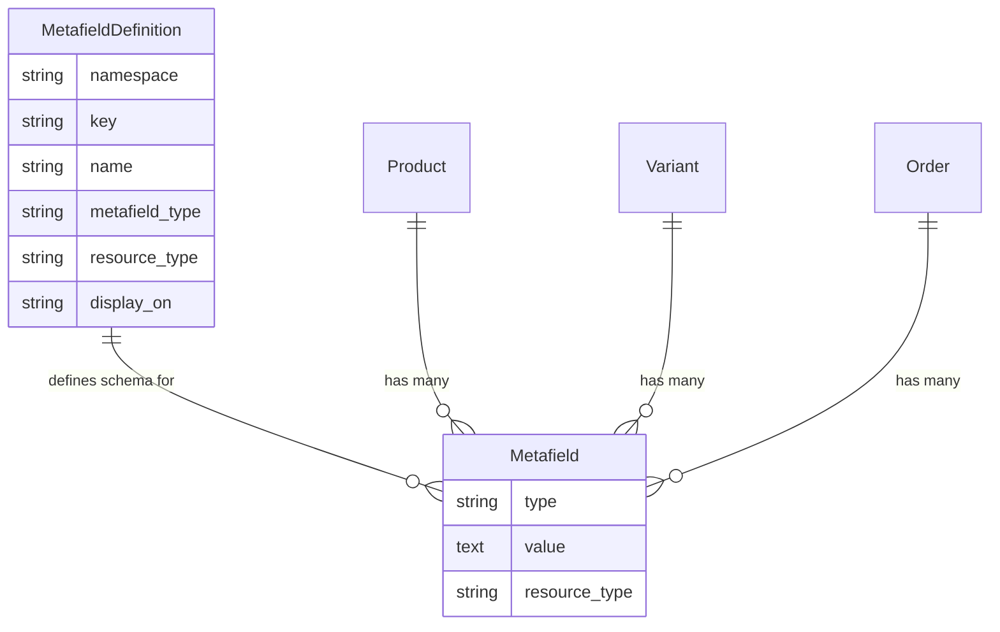
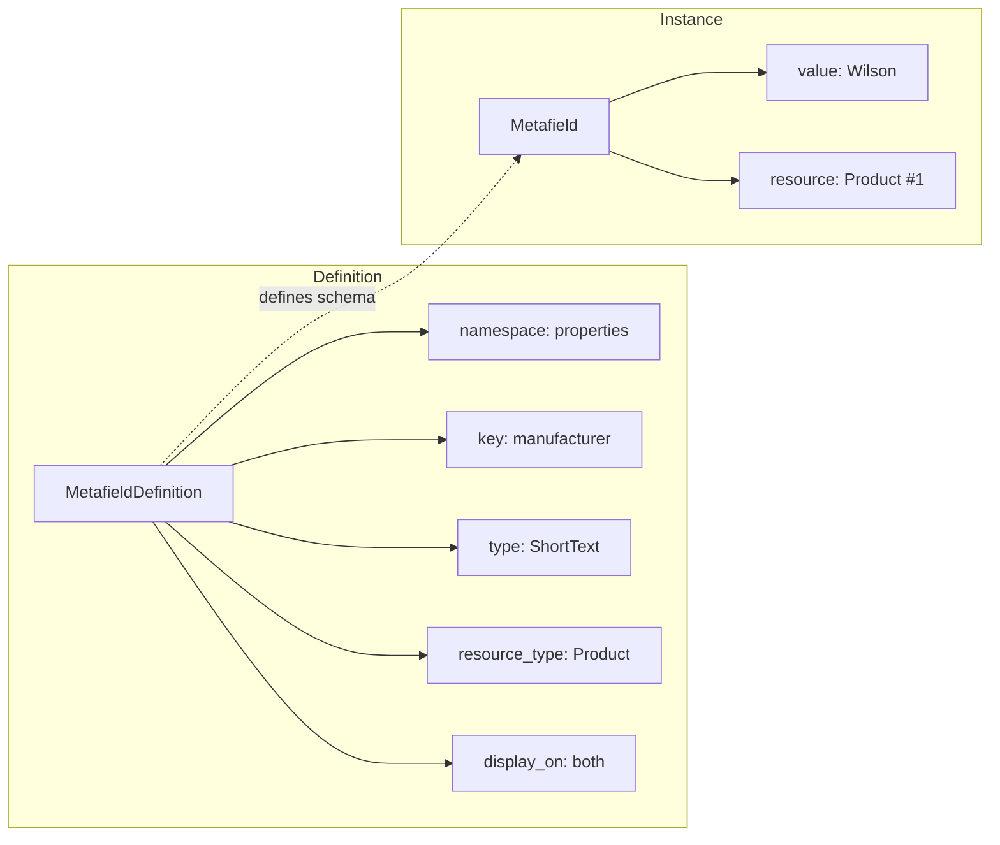

## Overview

Metafields provide a flexible, type-safe system for adding custom structured data to Spree resources. Unlike [metadata](/developer/customization/metadata) which is simple JSON storage, metafields are schema-defined with strong typing, validation, and visibility controls.

Use metafields for:

- Product specifications (manufacturer, material, dimensions)
- Custom business logic fields
- Integration data from external systems
- Order-specific custom attributes

<Note>
Metafields are available from Spree 5.2 onwards.
</Note>

## Architecture





- **MetafieldDefinition** — the blueprint that defines the data type, target resource, and visibility
- **Metafield** — stores the actual value for a specific resource instance

## Data Types

| Type | Description | Example Values |
|------|-------------|----------------|
| Short Text | Brief text fields | SKU codes, brand names, tags |
| Long Text | Longer text content | Care instructions, notes |
| Rich Text | Formatted HTML content | Product descriptions with formatting |
| Number | Numeric values | Weight, quantity, ratings |
| Boolean | True/false flags | Is featured, requires signature |
| JSON | Structured data | Configuration, complex objects |

## Visibility Control

Metafields support three visibility levels via the `display_on` attribute:

| Visibility | Store API | Admin API | Use Case |
|------------|:---------:|:---------:|----------|
| `both` | Yes | Yes | Public product specifications |
| `front_end` | Yes | No | Customer-facing data |
| `back_end` | No | Yes | Internal notes, integration IDs |

## Supported Resources

Metafields can be attached to most Spree resources including Products, Variants, Orders, Line Items, Taxons, Payments, Shipments, Gift Cards, Store Credits, and more.

<Info>
Custom resources can also support metafields. See the [Customization Quickstart](/developer/customization/quickstart) for details.
</Info>

## Namespaces

Namespaces organize metafields into logical groups and prevent key conflicts:

| Namespace | Example Keys | Purpose |
|-----------|-------------|---------|
| `properties` | `manufacturer`, `material`, `fit` | Product specifications |
| `shopify` | `product_id`, `variant_id` | Integration data |
| `flags` | `featured`, `requires_approval` | Feature flags |
| `custom` | `gift_message`, `delivery_notes` | Business-specific fields |

<Info>
Namespace and key are automatically normalized to snake_case.
</Info>

## Store API

Metafields with `display_on` set to `both` or `front_end` are included in Store API responses when you request the `metafields` include:

<CodeGroup>

```typescript SDK
const product = await client.store.products.get('spree-tote', {
  includes: 'metafields',
})

product.metafields?.forEach(metafield => {
  console.log(metafield.key)   // "properties.manufacturer"
  console.log(metafield.name)  // "Manufacturer"
  console.log(metafield.value) // "Wilson"
  console.log(metafield.type)  // "short_text"
})
```

```bash cURL
curl 'https://api.mystore.com/api/v3/store/products/spree-tote?includes=metafields' \
  -H 'Authorization: Bearer spree_pk_xxx'
```

</CodeGroup>

**Response:**

```json
{
  "id": "prod_86Rf07xd4z",
  "name": "Spree T-Shirt",
  "metafields": [
    {
      "id": "mf_k5nR8xLq",
      "name": "Manufacturer",
      "key": "properties.manufacturer",
      "type": "short_text",
      "value": "Wilson"
    },
    {
      "id": "mf_m3Rp9wXz",
      "name": "Material",
      "key": "properties.material",
      "type": "short_text",
      "value": "100% Cotton"
    }
  ]
}
```

<Note>
The `display_on` attribute is intentionally excluded from Store API responses for security.
</Note>

## Admin Panel Management

### Managing Definitions

Navigate to **Settings → Metafield Definitions** in the Admin Panel to create and manage metafield definitions. Select the resource type, enter namespace and key, choose the data type, and set visibility.

### Managing Values

When editing a resource (e.g., a product), metafields appear in a dedicated section. The admin panel automatically builds forms for all defined metafields.

## Metafields vs Metadata

| Feature | Metafields | Metadata |
|---------|-----------|----------|
| Structure | Strongly typed, schema-defined | Flat key-value JSON |
| Validation | Type-specific validation | None |
| Visibility | Configurable (front/back/both) | Write-only in Store API |
| Admin UI | Dedicated management forms | JSON preview |
| Data Types | 6 specific types | Any JSON-serializable data |
| Organization | Namespaced (`namespace.key`) | Flat structure |

**Use Metafields** when you need type validation, visibility control, admin UI forms, or organized namespacing.

**Use Metadata** for external system IDs, tracking attribution, or simple write-and-forget data.

<Warning>
Product Properties are deprecated and will be removed in Spree 6.0. For new projects, always use Metafields. For existing projects, plan to migrate using the [migration guide](/developer/upgrades/5.1-to-5.2#3-migrate-to-metafields-or-keep-using-properties).
</Warning>

## Related Documentation

- [Metadata](/developer/customization/metadata) — Simple key-value metadata
- [Products](/developer/core-concepts/products) — Product catalog
- [Events](/developer/core-concepts/events) — Subscribe to metafield events
