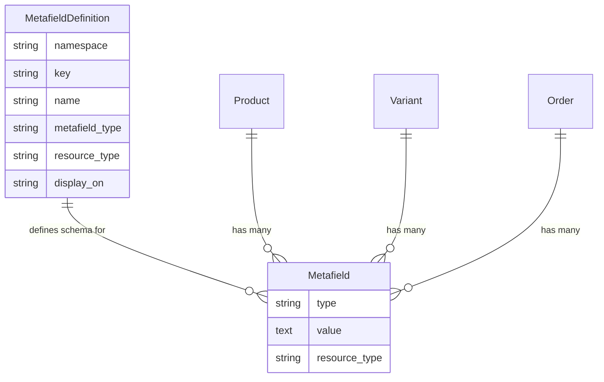
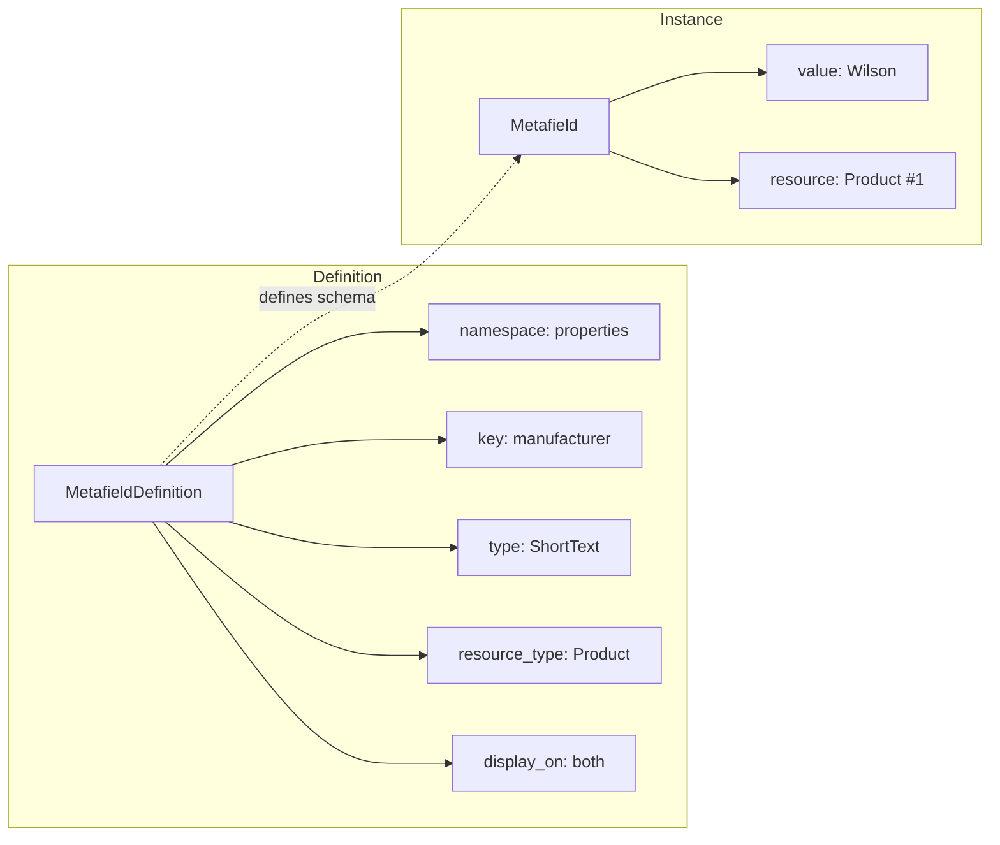

import { Since } from '/snippets/since.mdx';

<Since version="5.2" />

## Overview

Metafields provide a flexible, type-safe system for adding custom structured attributes to Spree models. Unlike [metadata](/developer/customization/metadata) which is simple JSON storage, metafields are schema-defined with strong typing, validation, and visibility controls.

Use metafields for:

- Product specifications (manufacturer, material, dimensions)
- Custom business logic fields
- Integration data from external systems
- Order-specific custom attributes

## Architecture





- **MetafieldDefinition** — the blueprint that defines the data type, target resource, and visibility
- **Metafield** — stores the actual value for a specific resource instance

## Data Types

| Type | Description | Example Values |
|------|-------------|----------------|
| Short Text | Brief text fields | SKU codes, brand names, tags |
| Long Text | Longer text content | Care instructions, notes |
| Rich Text | Formatted HTML content | Product descriptions with formatting |
| Number | Numeric values | Weight, quantity, ratings |
| Boolean | True/false flags | Is featured, requires signature |
| JSON | Structured data | Configuration, complex objects |

## Visibility Control

Metafields support two visibility levels via the `display_on` attribute:

| Visibility | Store API | Admin API | Use Case |
|------------|:---------:|:---------:|----------|
| `both` | Yes | Yes | Public product specifications |
| `back_end` | No | Yes | Internal notes, integration IDs |

## Supported Resources

Metafields can be attached to most Spree resources including Products, Variants, Orders, Line Items, Taxons, Payments, Shipments, Gift Cards, Store Credits, and more.

<Info>
Custom resources can also support metafields. See the [Customization Quickstart](/developer/customization/quickstart) for details.
</Info>

## Namespaces

Namespaces organize metafields into logical groups and prevent key conflicts:

| Namespace | Example Keys | Purpose |
|-----------|-------------|---------|
| `properties` | `manufacturer`, `material`, `fit` | Product specifications |
| `shopify` | `product_id`, `variant_id` | Integration data |
| `flags` | `featured`, `requires_approval` | Feature flags |
| `custom` | `gift_message`, `delivery_notes` | Business-specific fields |

<Info>
Namespace and key are automatically normalized to snake_case.
</Info>

## Store API

Metafields with `display_on` set to `both` are included in Store API responses when you [request the `custom_fields` expand](/api-reference/store-api/relations):

<Info>
  Metafields in API are called Custom Fields as we plan to rename Metafields to Custom Fields completely in Spree 6.0.
</Info>

<CodeGroup>

```typescript Store SDK
const product = await client.products.get('spree-tote', {
  expand: ['custom_fields'],
})

product.custom_fields?.forEach(field => {
  console.log(field.key)   // "properties.manufacturer"
  console.log(field.label) // "Manufacturer"
  console.log(field.value)      // "Wilson"
  console.log(field.field_type) // "short_text"
})
```

```typescript Admin SDK
const product = await adminClient.products.get('prod_86Rf07xd4z', {
  expand: ['custom_fields'],
})
```

```bash cURL
curl 'https://api.mystore.com/api/v3/store/products/spree-tote?expand=custom_fields' \
  -H 'X-Spree-Api-Key: pk_xxx'
```

</CodeGroup>

**Response:**

```json
{
  "id": "prod_86Rf07xd4z",
  "name": "Spree T-Shirt",
  "custom_fields": [
    {
      "id": "cf_k5nR8xLq",
      "label": "Manufacturer",
      "key": "properties.manufacturer",
      "field_type": "short_text",
      "value": "Wilson"
    },
    {
      "id": "cf_m3Rp9wXz",
      "label": "Material",
      "key": "properties.material",
      "field_type": "short_text",
      "value": "100% Cotton"
    }
  ]
}
```

<Note>
The `display_on` attribute is intentionally excluded from Store API responses for security.
</Note>

## Admin Management

### Managing Definitions

Navigate to **Settings → Metafield Definitions** in the Admin Panel to create and manage metafield definitions. Select the resource type, enter namespace and key, choose the data type, and set visibility.

Definitions are also [managed via the Admin API](/api-reference/admin-api/endpoints). `storefront_visible: true` is equivalent to `display_on: both` — it exposes the field to the Store API:

<CodeGroup>

```typescript Admin SDK
import { createAdminClient } from '@spree/admin-sdk'

const client = createAdminClient({
  baseUrl: 'https://store.example.com',
  secretKey: 'sk_xxx',
})

const definition = await client.customFieldDefinitions.create({
  resource_type: 'Spree::Product',
  namespace: 'properties',
  key: 'manufacturer',
  label: 'Manufacturer',
  field_type: 'short_text',
  storefront_visible: true,
})

await client.customFieldDefinitions.update(definition.id, { storefront_visible: false })
await client.customFieldDefinitions.delete(definition.id)
```

```bash CLI
spree api post /custom_field_definitions -d '{
  "resource_type": "Spree::Product",
  "namespace": "properties",
  "key": "manufacturer",
  "label": "Manufacturer",
  "field_type": "short_text",
  "storefront_visible": true
}'
```

</CodeGroup>

### Managing Values

When editing a resource (e.g., a product), metafields appear in a dedicated section. The admin panel automatically builds forms for all defined metafields.

To set a value programmatically, use the resource's nested `customFields` accessor (parent ID first):

<CodeGroup>

```typescript Admin SDK
await client.products.customFields.create('prod_xxx', {
  custom_field_definition_id: 'cfdef_xxx',
  value: 'Wilson',
})
```

```bash CLI
spree api post /products/prod_xxx/custom_fields -d '{
  "custom_field_definition_id": "cfdef_xxx",
  "value": "Wilson"
}'
```

</CodeGroup>

## Metafields vs Metadata

Spree has two permanent, complementary systems for custom data — **metadata for machines, metafields for humans**. They serve different purposes and are not interchangeable. Neither is going away.

| Feature | Metafields | [Metadata](/developer/customization/metadata) |
|---------|-----------|----------|
| **Purpose** | Merchant-defined structured attributes | Developer escape hatch — integration IDs, sync state |
| **Schema** | Defined via MetafieldDefinitions | Schemaless JSON — no definition required |
| **Validation** | Type-specific (text, number, boolean, etc.) | None — accepts any JSON-serializable data |
| **Visibility** | Configurable (admin-only or public) | Write-only in Store API, readable in Admin API |
| **Admin UI** | Dedicated management forms | JSON preview |
| **Data Types** | 6 specific types | Any JSON value |
| **Organization** | Namespaced (`namespace.key`) | Flat key-value structure |
| **Queryable** | Via SQL joins, Ransack scopes, search providers | Via JSONB operators (PostgreSQL) |

**Use Metafields** when you need type validation, visibility control, admin UI forms, or organized namespacing.

**Use [Metadata](/developer/customization/metadata)** for external system IDs, tracking attribution, syncing with integrations, or simple write-and-forget data that only backend systems need to read.

<Warning>
Product Properties are deprecated and will be removed in Spree 6.0. For new projects, always use Metafields. For existing projects, plan to migrate using the [migration guide](/developer/upgrades/5.1-to-5.2#migrate-to-metafields-or-keep-using-product-properties).
</Warning>

## Related Documentation

- [Metadata](/developer/customization/metadata) — Simple key-value metadata
- [Products](/developer/core-concepts/products) — Product catalog
- [Events](/developer/core-concepts/events) — Subscribe to metafield events
- [Admin SDK](/developer/sdk/admin/resources) — Manage definitions and values from TypeScript
