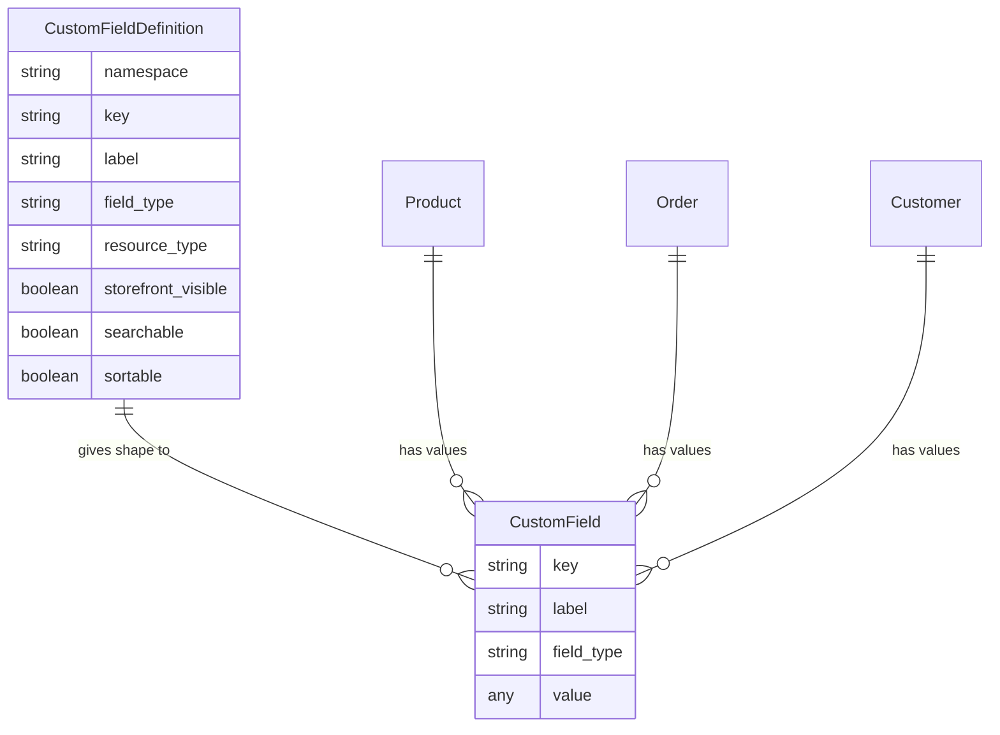

## Overview

Sooner or later you need to store something Spree doesn't have a field for. A fabric composition. A care instruction. A gift message. An ID from the system you sync with.

Custom fields are how you do that without changing the database. You declare a field once — its name, its type, who can see it — and from then on it can be set on any record of that kind, edited in the dashboard, returned by the API, and searched or filtered like any built-in field.

<Note>
Custom fields were called **metafields** before Spree 6.0. The API and SDK have always called them custom fields; now the rest of Spree does too.
</Note>

## Definitions and values

There are two halves, and it helps to keep them straight:


```mermaid
erDiagram
    CustomFieldDefinition ||--o{ CustomField : "gives shape to"
    Product ||--o{ CustomField : "has values"
    Order ||--o{ CustomField : "has values"
    Customer ||--o{ CustomField : "has values"

    CustomFieldDefinition {
        string namespace
        string key
        string label
        string field_type
        string resource_type
        boolean storefront_visible
        boolean searchable
        boolean sortable
    }

    CustomField {
        string key
        string label
        string field_type
        any value
    }
```

- A **definition** is the declaration: "products have a Material, it is short text, shoppers may see it." You create it once.
- A **custom field** is one record's answer: this product's material is `100% Cotton`.

Because the definition carries the type and the label, the dashboard can build an editing form for it automatically, and your storefront gets a value it can trust the shape of.

## Field types

| Type | For | Example |
|---|---|---|
| `short_text` | A word or a line | `Wilson`, `100% Cotton` |
| `long_text` | A paragraph | Care instructions |
| `rich_text` | Formatted HTML | A spec sheet with lists and bold |
| `number` | A quantity or measure | `3.5`, `120` |
| `boolean` | A yes or no | Requires a signature |
| `json` | Structured data | A sizing chart |

## Who can see it

`storefront_visible` decides whether a field ever leaves the back office:

| `storefront_visible` | Store API | Admin API | Use it for |
|---|:---:|:---:|---|
| `true` | Yes | Yes | Anything a shopper should see — materials, specs |
| `false` | No | Yes | Internal notes, supplier codes, sync IDs |

<Warning>
`storefront_visible: false` genuinely withholds the field from the Store API — it is not hidden in the response, it is absent. Treat it as the boundary between what a customer may read and what only staff may.
</Warning>

## Declaring a field

<CodeGroup>

```typescript Admin SDK
const definition = await adminClient.customFieldDefinitions.create({
  resource_type: 'Spree::Product',
  namespace: 'properties',
  key: 'material',
  label: 'Material',
  field_type: 'short_text',
  storefront_visible: true,
  searchable: true,
})
```

```bash CLI
spree api post /custom_field_definitions -d '{
  "resource_type": "Spree::Product",
  "namespace": "properties",
  "key": "material",
  "label": "Material",
  "field_type": "short_text",
  "storefront_visible": true,
  "searchable": true
}'
```

</CodeGroup>

`namespace` keeps groups of fields apart, so an integration's `product_id` never collides with yours. Together they form the key you'll see in responses: `properties.material`. Both are normalized to snake_case.

Definitions can also be managed in the dashboard under **Settings → Custom Fields**, which is where merchants usually add them.

## Setting and reading values

<CodeGroup>

```typescript Admin SDK
// Set a value on a product
await adminClient.products.customFields.create('prod_xxx', {
  custom_field_definition_id: definition.id,
  value: '100% Cotton',
})
```

```bash CLI
spree api post /products/prod_xxx/custom_fields -d '{
  "custom_field_definition_id": "cfdef_xxx",
  "value": "100% Cotton"
}'
```

</CodeGroup>

Reading them from a storefront is an expand on whatever you already fetch:

<CodeGroup>

```typescript Store SDK
const product = await client.products.get('spree-tote', {
  expand: ['custom_fields'],
})

product.custom_fields?.forEach((field) => {
  field.key        // "properties.material"
  field.label      // "Material"
  field.value      // "100% Cotton"
  field.field_type // "short_text"
})
```

```bash cURL
curl 'https://api.mystore.com/api/v3/store/products/spree-tote?expand=custom_fields' \
  -H 'X-Spree-API-Key: pk_xxx'
```

</CodeGroup>

```json Response
{
  "id": "prod_86Rf07xd4z",
  "name": "Spree Tote",
  "custom_fields": [
    {
      "id": "cf_k5nR8xLq",
      "key": "properties.material",
      "label": "Material",
      "field_type": "short_text",
      "value": "100% Cotton"
    }
  ]
}
```

Each value arrives with its own label and type, so you can render a spec table straight from the array without hardcoding which fields exist.

## Searching, sorting and filtering

A custom field can take part in product listings — but only if you ask, because indexing everything by default would be wasteful.

| Flag | What it enables | Works with |
|---|---|---|
| `searchable` | The value is matched by product text search | `short_text`, `long_text`, `number` |
| `sortable` | Listings can be ordered by it | `short_text`, `number` |

Setting either flag also makes the field **filterable**. Filter and sort with the field's `cf_` key, on both APIs:

```
GET /api/v3/store/products?q[cf_properties_material_i_cont]=wool
GET /api/v3/store/products?sort=-cf_properties_weight
GET /api/v3/admin/products?q[cf_properties_weight_gteq]=3.5
```

| Field type | Comparisons available |
|---|---|
| `short_text`, `long_text` | `i_cont`, `cont`, `eq`, `not_eq`, `start`, `end`, `present`, `blank` |
| `number` | `eq`, `gt`, `gteq`, `lt`, `lteq`, `present`, `blank` |

Use `i_cont` for case-insensitive matching. A comparison that doesn't suit the field's type is ignored rather than rejected, so a stale filter in a saved view can't break a page.

<Info>
If you use Meilisearch, re-index after changing these flags so the new fields are picked up. Substring matching (`i_cont`, `cont`, `start`, `end`) is a database-provider feature; Meilisearch handles equality, ranges and presence. See [Search & Filtering](/developer/core-concepts/search-filtering).
</Info>

In the dashboard, fields with these flags become available in the product table's column picker, sort menu and filter panel — off by default, so merchants opt in per column.

## What can carry custom fields

Most things you'd want to annotate: products, variants, orders, line items, customers, categories, payments, fulfillments, gift cards and store credits, among others.

## Definitions belong to a store

A definition is owned by the store it was created in. Each store keeps its own
set, so two stores can both define `custom.material` without colliding, and
neither can read or edit the other's. Everything that reads the schema — the
dashboard, CSV exports and imports, and product sorting and filtering — reads
the current store's definitions.

## Custom fields or metadata?

Spree has two ways to store your own data, and they are not competing — they solve different problems.

| | Custom fields | [Metadata](/developer/customization/metadata) |
|---|---|---|
| **For** | Data a merchant curates | Data your code keeps |
| **Shape** | Declared and typed | Any JSON, no declaration |
| **Dashboard** | Proper edit forms | Raw JSON |
| **Visibility** | Configurable per field | Never read by the Store API |
| **Searchable** | Yes, opt in | Not through the product search |

Put it simply: **custom fields are for people, metadata is for machines.** If a merchant should type it, define a custom field. If it is a sync token or an external ID that only your integration reads, use metadata.

## Related

- [Metadata](/developer/customization/metadata) — the machine-readable alternative
- [Products](/developer/core-concepts/products) — the most common place for custom fields
- [Search & Filtering](/developer/core-concepts/search-filtering) — how filters and search work
- [Admin SDK](/developer/sdk/admin/resources) — managing definitions and values in TypeScript
