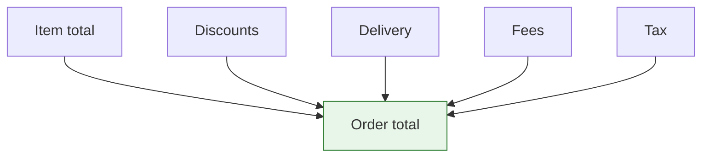

## Overview

An order total is rarely just the sum of the item prices. Tax is added or already inside them, a promo code takes something off, delivery costs something, gift wrapping costs a bit more.

Spree records each of those as its own kind of row, and keeps a running total for each kind on the order itself. That means the summary block in your checkout is a handful of fields — you don't add anything up yourself.



## The totals

```typescript Store SDK
const order = await client.orders.get('or_xxx')

order.display_item_total     // "$120.00"  items, before tax and discounts
order.display_discount_total // "-$12.00"  everything taken off
order.display_delivery_total // "$5.00"    delivery
order.display_fee_total      // "$2.50"    surcharges
order.display_tax_total      // "$22.60"   all tax
order.display_total          // "$138.10"  what the customer pays
```

| Attribute | What it sums |
|---|---|
| `item_total` | Line item prices, before tax and discounts |
| `discount_total` | Every [discount](/developer/core-concepts/discounts) |
| `delivery_total` | Delivery charges |
| `fee_total` | Every [fee](/developer/core-concepts/fees) |
| `tax_total` | All [tax](/developer/core-concepts/taxes) |
| `included_tax_total` | Tax already inside the displayed prices |
| `additional_tax_total` | Tax added on top |
| `total` | What the customer pays |
| `amount_due` | Still to pay, after gift cards and store credit |

## Two forms of every amount

Every total comes twice: `total` is the raw value, `display_total` is formatted for the order's currency.

```json
{
  "total": "138.10",
  "display_total": "$138.10"
}
```

**Render the `display_` one.** It knows the currency symbol, which side it goes on, and which separator that locale uses — `$138.10`, `138,10 €`, `¥138`. Formatting it yourself means reimplementing that, and getting it wrong for somebody.

<Note>
Money is a **string**, never a number. JavaScript can't represent every decimal exactly: `0.1 + 0.2` gives `0.30000000000000004`, which is not something you want inside a price.

If you must do arithmetic, use a decimal library or work in whole cents. Most of the time you don't need to — Spree already did it.
</Note>

## The double-counting trap

<Warning>
If you build a subtotal yourself, include `additional_tax_total` only — never `included_tax_total`.

Included tax is **already inside** the item prices. Adding it again charges the customer's eyes twice, and produces a summary that doesn't match the amount taken from their card. This is the single most common bug in a European storefront.
</Warning>

The two exist because the same order can carry both: VAT already inside the goods, and a separately-added tax on something else. `tax_total` covers both, which is why it's the safe field to display on its own line.

## Totals update themselves

Every change to a cart returns the whole cart, totals included:

```typescript Store SDK
const cart = await client.carts.items.create(cartId, {
  variant_id: 'var_xxx',
  quantity: 2,
})

cart.display_total // already correct
```

There is never a second "recalculate" request to make, and never a moment where the summary on screen disagrees with what the server thinks. Adding an item, entering an address, applying a code — each response carries the new numbers.

The totals are worked out again at the moment the cart is completed, so a price that changed while the customer sat on the review page can't lead to the wrong charge.

## Once an order is placed

The rows stop being regenerated. Editing a placed order re-adds the rows it already has rather than starting over, so today's promotions and rates can't rewrite what a customer agreed to last week.

## Where each row attaches

The individual rows are there if you need them — an itemised invoice, a tax report:

- **[Tax lines](/developer/core-concepts/taxes)** → a line item, a fulfillment, or a fee
- **[Discounts](/developer/core-concepts/discounts)** → a line item or a fulfillment
- **[Fees](/developer/core-concepts/fees)** → a line item, a fulfillment, or the order itself

Each row also keeps a copy of where it came from — the rate and label on a tax line, the code and promotion on a discount. If someone deletes that promotion next month, the order still says what the customer was actually given.

## Related

- [Taxes](/developer/core-concepts/taxes) — how tax is worked out
- [Discounts](/developer/core-concepts/discounts) — money off
- [Fees](/developer/core-concepts/fees) — surcharges and duties
- [Carts](/developer/core-concepts/carts) — checkout and completion
- [Orders](/developer/core-concepts/orders) — the placed order
