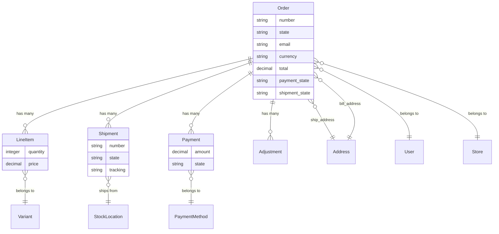

## Overview

An order is the central model connecting a customer to their purchase. It collects line items, addresses, shipments, payments, and adjustments into a single transaction that flows through a checkout state machine from cart to completion.


```mermaid
erDiagram
    Order ||--o{ LineItem : "has many"
    Order ||--o{ Shipment : "has many"
    Order ||--o{ Payment : "has many"
    Order ||--o{ Adjustment : "has many"
    Order }o--|| Address : "ship_address"
    Order }o--|| Address : "bill_address"
    Order }o--|| User : "belongs to"
    Order }o--|| Store : "belongs to"
    LineItem }o--|| Variant : "belongs to"
    Shipment }o--|| StockLocation : "ships from"
    Payment }o--|| PaymentMethod : "belongs to"

    Order {
        string number
        string state
        string email
        string currency
        decimal total
        string payment_state
        string shipment_state
    }

    LineItem {
        integer quantity
        decimal price
    }

    Shipment {
        string number
        string state
        string tracking
    }

    Payment {
        decimal amount
        string state
    }
```

**Key relationships:**
- **Line Items** link orders to [Variants](/developer/core-concepts/products#variants) (what was purchased)
- **[Shipments](/developer/core-concepts/shipments)** handle fulfillment from stock locations
- **[Payments](/developer/core-concepts/payments)** track payment attempts and their states
- **[Adjustments](/developer/core-concepts/adjustments)** apply taxes, promotions, and shipping costs
- **[Addresses](/developer/core-concepts/addresses)** store billing and shipping information

## Order Attributes

The API returns these key fields on every order:

| Attribute | Description |
|-----------|-------------|
| `number` | Unique order number (e.g., `R123456789`), shown to customers |
| `state` | Current checkout state (`cart`, `address`, `delivery`, `payment`, `confirm`, `complete`) |
| `email` | Customer's email address |
| `currency` | Order currency (e.g., `USD`) |
| `item_count` | Total number of items |
| `item_total` / `display_item_total` | Sum of line item prices |
| `ship_total` / `display_ship_total` | Shipping cost |
| `tax_total` / `display_tax_total` | Total tax |
| `promo_total` / `display_promo_total` | Total discount from promotions |
| `adjustment_total` / `display_adjustment_total` | Sum of all adjustments (tax + shipping + promos) |
| `total` / `display_total` | Final order total |
| `payment_state` | Payment status (`balance_due`, `paid`, `credit_owed`, `failed`, `void`) |
| `shipment_state` | Shipment status (`pending`, `ready`, `partial`, `shipped`, `backorder`) |
| `completed_at` | Timestamp when the order was placed |

The `display_*` fields return formatted strings with currency symbols (e.g., `"$15.99"`).

## Cart

A cart is simply an order in the `cart` state. Guest carts are identified by a cart token; authenticated users' carts are linked to their account.

<CodeGroup>

```typescript SDK
// Create a cart
const cart = await client.cart.create()
// cart.token => "abc123" (save this for guest checkout)

// Get existing cart
const cart = await client.cart.get()

// Add an item
const updatedOrder = await client.orders.lineItems.create(cart.id, {
  variant_id: 'var_xxx',
  quantity: 2,
})

// Update quantity
await client.orders.lineItems.update(cart.id, 'li_xxx', {
  quantity: 3,
})

// Remove an item
await client.orders.lineItems.delete(cart.id, 'li_xxx')
```

```bash cURL
# Create a cart
curl -X POST 'https://api.mystore.com/api/v3/store/cart' \
  -H 'Authorization: Bearer spree_pk_xxx'

# Get existing cart
curl 'https://api.mystore.com/api/v3/store/cart' \
  -H 'Authorization: Bearer spree_pk_xxx' \
  -H 'X-Spree-Order-Token: abc123'

# Add an item
curl -X POST 'https://api.mystore.com/api/v3/store/orders/or_xxx/line_items' \
  -H 'Authorization: Bearer spree_pk_xxx' \
  -H 'X-Spree-Order-Token: abc123' \
  -H 'Content-Type: application/json' \
  -d '{ "variant_id": "var_xxx", "quantity": 2 }'

# Update quantity
curl -X PATCH 'https://api.mystore.com/api/v3/store/orders/or_xxx/line_items/li_xxx' \
  -H 'Authorization: Bearer spree_pk_xxx' \
  -H 'X-Spree-Order-Token: abc123' \
  -H 'Content-Type: application/json' \
  -d '{ "quantity": 3 }'

# Remove an item
curl -X DELETE 'https://api.mystore.com/api/v3/store/orders/or_xxx/line_items/li_xxx' \
  -H 'Authorization: Bearer spree_pk_xxx' \
  -H 'X-Spree-Order-Token: abc123'
```

</CodeGroup>

Every line item mutation returns the full updated order with recalculated totals.

## Checkout Flow

The checkout is a state machine that advances the order through a series of steps. Each step collects required information before allowing the order to proceed.

<Steps>
  <Step title="cart">
    Customer has items in their cart. This is the starting state.
  </Step>
  <Step title="address">
    Customer provides shipping and billing addresses.
  </Step>
  <Step title="delivery">
    Customer selects a shipping rate for each shipment.
  </Step>
  <Step title="payment">
    Customer provides payment. Skipped if the order is fully covered by store credit.
  </Step>
  <Step title="confirm">
    Customer reviews and confirms the order.
  </Step>
  <Step title="complete">
    Order is placed. `completed_at` is set and fulfillment begins.
  </Step>
</Steps>

Advance to the next step with `next`. If the order doesn't meet the requirements for the next state (e.g., missing address), the API returns an error.

<CodeGroup>

```typescript SDK
// Set addresses
await client.orders.update(orderId, {
  email: 'john@example.com',
  ship_address: {
    firstname: 'John', lastname: 'Doe',
    address1: '123 Main St', city: 'Los Angeles',
    country_iso: 'US', state_abbr: 'CA', zipcode: '90001',
    phone: '555-0100',
  },
})

// Advance to delivery
await client.orders.next(orderId)

// Get shipments and select a shipping rate
const { data: shipments } = await client.orders.shipments.list(orderId)
await client.orders.shipments.update(orderId, shipments[0].id, {
  selected_shipping_rate_id: 'sr_xxx',
})

// Advance to payment
await client.orders.next(orderId)

// Create a payment session (e.g., Stripe)
const session = await client.orders.paymentSessions.create(orderId, {
  payment_method_id: 'pm_xxx',
})
// session.external_data.client_secret => use with Stripe.js

// Complete the payment session after provider confirmation
await client.orders.paymentSessions.complete(orderId, session.id)

// Complete the order
await client.orders.complete(orderId)
```

```bash cURL
# Set addresses
curl -X PATCH 'https://api.mystore.com/api/v3/store/orders/or_xxx' \
  -H 'Authorization: Bearer spree_pk_xxx' \
  -H 'X-Spree-Order-Token: abc123' \
  -H 'Content-Type: application/json' \
  -d '{
    "email": "john@example.com",
    "ship_address": {
      "firstname": "John", "lastname": "Doe",
      "address1": "123 Main St", "city": "Los Angeles",
      "country_iso": "US", "state_abbr": "CA", "zipcode": "90001",
      "phone": "555-0100"
    }
  }'

# Advance to next step
curl -X PATCH 'https://api.mystore.com/api/v3/store/orders/or_xxx/next' \
  -H 'Authorization: Bearer spree_pk_xxx' \
  -H 'X-Spree-Order-Token: abc123'

# Select a shipping rate
curl -X PATCH 'https://api.mystore.com/api/v3/store/orders/or_xxx/shipments/shp_xxx' \
  -H 'Authorization: Bearer spree_pk_xxx' \
  -H 'X-Spree-Order-Token: abc123' \
  -H 'Content-Type: application/json' \
  -d '{ "selected_shipping_rate_id": "sr_xxx" }'

# Complete the order
curl -X PATCH 'https://api.mystore.com/api/v3/store/orders/or_xxx/complete' \
  -H 'Authorization: Bearer spree_pk_xxx' \
  -H 'X-Spree-Order-Token: abc123'
```

</CodeGroup>

## Coupon Codes

Apply or remove promotional coupon codes during checkout:

<CodeGroup>

```typescript SDK
// Apply a coupon
await client.orders.couponCodes.apply(orderId, 'SAVE20')

// Remove a coupon
await client.orders.couponCodes.remove(orderId, 'promo_xxx')
```

```bash cURL
# Apply a coupon
curl -X POST 'https://api.mystore.com/api/v3/store/orders/or_xxx/coupon_codes' \
  -H 'Authorization: Bearer spree_pk_xxx' \
  -H 'X-Spree-Order-Token: abc123' \
  -H 'Content-Type: application/json' \
  -d '{ "code": "SAVE20" }'

# Remove a coupon
curl -X DELETE 'https://api.mystore.com/api/v3/store/orders/or_xxx/coupon_codes/promo_xxx' \
  -H 'Authorization: Bearer spree_pk_xxx' \
  -H 'X-Spree-Order-Token: abc123'
```

</CodeGroup>

## Order History

Authenticated customers can view their past orders:

<CodeGroup>

```typescript SDK
// List past orders
const { data: orders } = await client.customer.orders.list()

// Get a specific order with details
const order = await client.orders.get('or_xxx', {
  expand: ['items', 'shipments', 'payments'],
})
```

```bash cURL
# List past orders
curl 'https://api.mystore.com/api/v3/store/customer/orders' \
  -H 'Authorization: Bearer <jwt_token>'

# Get a specific order
curl 'https://api.mystore.com/api/v3/store/orders/or_xxx?expand=items,shipments,payments' \
  -H 'Authorization: Bearer <jwt_token>'
```

</CodeGroup>

## Line Items

Line items represent individual products in an order. Each line item links to a [Variant](/developer/core-concepts/products#variants) and tracks the quantity and price at the time of purchase.

When a variant is added to an order, the price is locked on the line item. If the variant's price changes later, existing orders are unaffected.

## Adjustments

[Adjustments](/developer/core-concepts/adjustments) modify an order's total — promotions decrease it, taxes and shipping increase it. Adjustments can be applied at the order level, the line item level, or the shipment level.

## Payment States

| State | Description |
|-------|-------------|
| `balance_due` | Payment total is less than the order total |
| `paid` | Payment total equals the order total |
| `credit_owed` | Payment total exceeds the order total (refund pending) |
| `failed` | Most recent payment attempt failed |
| `void` | Order was canceled and payments voided |

## Shipment States

| State | Description |
|-------|-------------|
| `pending` | All shipments are pending |
| `ready` | All shipments are ready to ship |
| `partial` | At least one shipment is shipped, others are not |
| `shipped` | All shipments have been shipped |
| `backorder` | Some inventory is on backorder |

For more details, see [Shipments](/developer/core-concepts/shipments) and [Payments](/developer/core-concepts/payments).

## Related Documentation

- [Payments](/developer/core-concepts/payments) — Payment processing and payment sessions
- [Shipments](/developer/core-concepts/shipments) — Fulfillment and shipping rates
- [Addresses](/developer/core-concepts/addresses) — Billing and shipping addresses
- [Promotions](/developer/core-concepts/promotions) — Discounts and coupon codes
- [Checkout Customization](/developer/customization/checkout) — Customizing the checkout flow
- [Events](/developer/core-concepts/events) — Subscribe to order events (e.g., `order.completed`)
