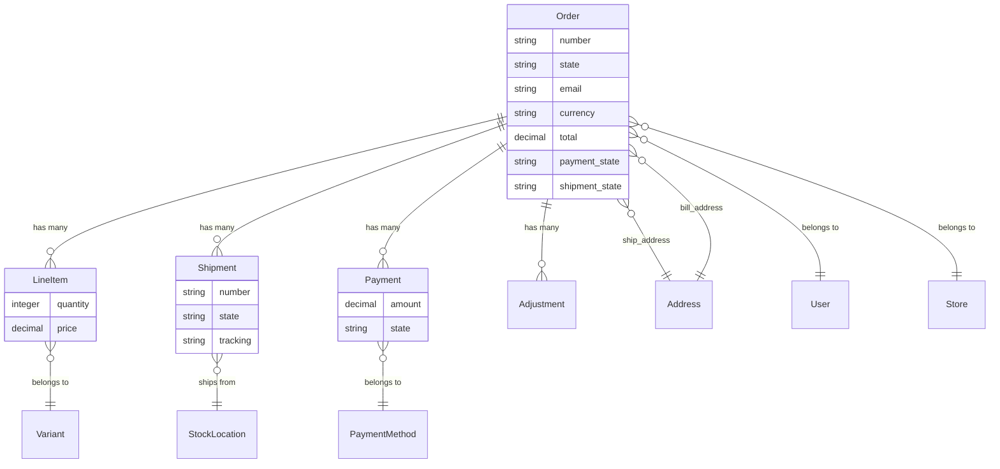

## Overview

An order is the central model connecting a customer to their purchase. It collects line items, addresses, shipments, payments, and adjustments into a single transaction that flows through a checkout state machine from cart to completion.


```mermaid
erDiagram
    Order ||--o{ LineItem : "has many"
    Order ||--o{ Shipment : "has many"
    Order ||--o{ Payment : "has many"
    Order ||--o{ Adjustment : "has many"
    Order }o--|| Address : "ship_address"
    Order }o--|| Address : "bill_address"
    Order }o--|| User : "belongs to"
    Order }o--|| Store : "belongs to"
    LineItem }o--|| Variant : "belongs to"
    Shipment }o--|| StockLocation : "ships from"
    Payment }o--|| PaymentMethod : "belongs to"

    Order {
        string number
        string state
        string email
        string currency
        decimal total
        string payment_state
        string shipment_state
    }

    LineItem {
        integer quantity
        decimal price
    }

    Shipment {
        string number
        string state
        string tracking
    }

    Payment {
        decimal amount
        string state
    }
```

**Key relationships:**
- **Line Items** link orders to [Variants](/developer/core-concepts/products#variants) (what was purchased)
- **[Shipments](/developer/core-concepts/shipments)** handle fulfillment from stock locations
- **[Payments](/developer/core-concepts/payments)** track payment attempts and their states
- **[Adjustments](/developer/core-concepts/adjustments)** apply taxes, promotions, and shipping costs
- **[Addresses](/developer/core-concepts/addresses)** store billing and shipping information

## Order Attributes

The API returns these key fields on every order:

| Attribute | Description |
|-----------|-------------|
| `number` | Unique order number (e.g., `R123456789`), shown to customers |
| `email` | Customer's email address |
| `currency` | Order currency (e.g., `USD`) |
| `total_quantity` | Total number of items |
| `item_total` / `display_item_total` | Sum of line item prices |
| `delivery_total` / `display_delivery_total` | Delivery cost |
| `tax_total` / `display_tax_total` | Total tax |
| `discount_total` / `display_discount_total` | Total discount from promotions |
| `adjustment_total` / `display_adjustment_total` | Sum of all adjustments (tax + delivery + promos) |
| `total` / `display_total` | Final order total |
| `payment_status` | Payment status (`balance_due`, `paid`, `credit_owed`, `failed`, `void`) |
| `fulfillment_status` | Fulfillment status (`pending`, `ready`, `partial`, `shipped`, `backorder`) |
| `completed_at` | Timestamp when the order was placed |

The [`display_*` fields return formatted strings with currency symbols](/api-reference/store-api/monetary-amounts) (e.g., `"$15.99"`).

## Cart

A cart is simply an order in the `cart` state. Guest carts are [identified by a cart token; authenticated users' carts are linked to their account](/api-reference/store-api/authentication).

<CodeGroup>

```typescript Store SDK
// Create a cart
const cart = await client.carts.create()
// cart.token => "abc123" (save this for guest checkout)

// Get existing cart
const cart = await client.carts.get(cartId, { spreeToken: 'xxx' })

// Add an item
const updatedOrder = await client.carts.items.create(cart.id, {
  variant_id: 'var_xxx',
  quantity: 2,
})

// Update quantity
await client.carts.items.update(cart.id, 'li_xxx', {
  quantity: 3,
})

// Remove an item
await client.carts.items.delete(cart.id, 'li_xxx')
```

```bash cURL
# Create a cart
curl -X POST 'https://api.mystore.com/api/v3/store/carts' \
  -H 'X-Spree-API-Key: pk_xxx'

# Get existing cart
curl 'https://api.mystore.com/api/v3/store/carts/cart_xxx' \
  -H 'X-Spree-API-Key: pk_xxx' \
  -H 'X-Spree-Token: abc123'

# Add an item
curl -X POST 'https://api.mystore.com/api/v3/store/carts/cart_xxx/items' \
  -H 'X-Spree-API-Key: pk_xxx' \
  -H 'X-Spree-Token: abc123' \
  -H 'Content-Type: application/json' \
  -d '{ "variant_id": "var_xxx", "quantity": 2 }'

# Update quantity
curl -X PATCH 'https://api.mystore.com/api/v3/store/carts/cart_xxx/items/li_xxx' \
  -H 'X-Spree-API-Key: pk_xxx' \
  -H 'X-Spree-Token: abc123' \
  -H 'Content-Type: application/json' \
  -d '{ "quantity": 3 }'

# Remove an item
curl -X DELETE 'https://api.mystore.com/api/v3/store/carts/cart_xxx/items/li_xxx' \
  -H 'X-Spree-API-Key: pk_xxx' \
  -H 'X-Spree-Token: abc123'
```

</CodeGroup>

Every item mutation returns the full updated order with recalculated totals.

## Checkout Flow

The checkout is a state machine that advances the order through a series of steps. Each step collects required information before allowing the order to proceed.

<Steps>
  <Step title="cart">
    Customer has items in their cart. This is the starting state.
  </Step>
  <Step title="address">
    Customer provides shipping and billing addresses.
  </Step>
  <Step title="delivery">
    Customer selects a shipping rate for each shipment.
  </Step>
  <Step title="payment">
    Customer provides payment. Skipped if the order is fully covered by store credit.
  </Step>
  <Step title="confirm">
    Customer reviews and confirms the order.
  </Step>
  <Step title="complete">
    Order is placed. `completed_at` is set and fulfillment begins.
  </Step>
</Steps>

If the order doesn't meet the requirements for the next state (e.g., missing address), the API returns an error.

<CodeGroup>

```typescript Store SDK
// Set addresses
await client.carts.update(cartId, {
  email: 'john@example.com',
  shipping_address: {
    first_name: 'John', last_name: 'Doe',
    address1: '123 Main St', city: 'Los Angeles',
    country_iso: 'US', state_abbr: 'CA', postal_code: '90001',
    phone: '555-0100',
  },
})

// Get fulfillments and select a delivery rate
// (the Store API/SDK exposes shipments as `fulfillments`)
const cart = await client.carts.get(cartId)
await client.carts.fulfillments.update(cartId, cart.fulfillments[0].id, {
  selected_delivery_rate_id: 'rate_xxx',
})

// Create a payment session (e.g., Stripe)
const session = await client.carts.paymentSessions.create(cartId, {
  payment_method_id: 'pm_xxx',
})
// session.external_data.client_secret => use with Stripe.js

// Complete the payment session after provider confirmation
await client.carts.paymentSessions.complete(cartId, session.id)

// Complete the order
await client.carts.complete(cartId)
```

```bash cURL
# Set addresses
curl -X PATCH 'https://api.mystore.com/api/v3/store/carts/cart_xxx' \
  -H 'X-Spree-API-Key: pk_xxx' \
  -H 'X-Spree-Token: abc123' \
  -H 'Content-Type: application/json' \
  -d '{
    "email": "john@example.com",
    "shipping_address": {
      "first_name": "John", "last_name": "Doe",
      "address1": "123 Main St", "city": "Los Angeles",
      "country_iso": "US", "state_abbr": "CA", "postal_code": "90001",
      "phone": "555-0100"
    }
  }'

# Select a delivery rate
curl -X PATCH 'https://api.mystore.com/api/v3/store/carts/cart_xxx/fulfillments/ful_xxx' \
  -H 'X-Spree-API-Key: pk_xxx' \
  -H 'X-Spree-Token: abc123' \
  -H 'Content-Type: application/json' \
  -d '{ "selected_delivery_rate_id": "rate_xxx" }'

# Complete the order
curl -X POST 'https://api.mystore.com/api/v3/store/carts/cart_xxx/complete' \
  -H 'X-Spree-API-Key: pk_xxx' \
  -H 'X-Spree-Token: abc123'
```

</CodeGroup>

## Coupon Codes

Apply or remove promotional coupon codes during checkout:

<CodeGroup>

```typescript Store SDK
// Apply a discount code
await client.carts.discountCodes.apply(cartId, 'SAVE20')

// Remove a discount code
await client.carts.discountCodes.remove(cartId, 'SAVE20')
```

```bash cURL
# Apply a discount code
curl -X POST 'https://api.mystore.com/api/v3/store/carts/cart_xxx/discount_codes' \
  -H 'X-Spree-API-Key: pk_xxx' \
  -H 'X-Spree-Token: abc123' \
  -H 'Content-Type: application/json' \
  -d '{ "code": "SAVE20" }'

# Remove a discount code
curl -X DELETE 'https://api.mystore.com/api/v3/store/carts/cart_xxx/discount_codes/SAVE20' \
  -H 'X-Spree-API-Key: pk_xxx' \
  -H 'X-Spree-Token: abc123'
```

</CodeGroup>

## Order History

Authenticated customers can view their past orders:

<CodeGroup>

```typescript Store SDK
// List past orders
const { data: orders } = await client.customer.orders.list()

// Get a specific order with details
const order = await client.orders.get('or_xxx', {
  expand: ['items', 'fulfillments', 'payments'],
})
```

```typescript Admin SDK
const order = await adminClient.orders.get('or_xxx')
```

```bash cURL
# List past orders
curl 'https://api.mystore.com/api/v3/store/customer/orders' \
  -H 'Authorization: Bearer <jwt_token>'

# Get a specific order
curl 'https://api.mystore.com/api/v3/store/orders/or_xxx?expand=items,fulfillments,payments' \
  -H 'Authorization: Bearer <jwt_token>'
```

</CodeGroup>

## Managing Orders

Everything above is the **Store API** — the customer's own cart and orders. Back-office order management (listing every order, creating phone/manual orders, capturing payments, cancelling) uses the [Admin API](/api-reference/admin-api/introduction).

### Listing and creating orders

List orders with [Ransack filters and pagination](/api-reference/admin-api/querying) (`state_eq`, `limit`, sorting). A draft order is created in one call; pass line items as `items` (each `{ variant_id, quantity }`):

<CodeGroup>

```typescript Admin SDK
import { createAdminClient } from '@spree/admin-sdk'

const client = createAdminClient({
  baseUrl: 'https://store.example.com',
  secretKey: 'sk_xxx',
})

// List orders (Ransack filters)
const { data: orders } = await client.orders.list({ state_eq: 'complete', limit: 25 })

// Create a draft order on a customer's behalf
const order = await client.orders.create({
  email: 'buyer@example.com',
  items: [{ variant_id: 'variant_xxx', quantity: 2 }],
  currency: 'USD',
})
```

```bash CLI
spree api get /orders -q state_eq=complete --limit 25
spree api post /orders -d '{
  "email": "buyer@example.com",
  "items": [{ "variant_id": "variant_xxx", "quantity": 2 }]
}'
```

</CodeGroup>

### Order state actions

Orders move through their [state machine](#checkout-flow) via dedicated actions rather than raw `state` writes:

<CodeGroup>

```typescript Admin SDK
await client.orders.complete('or_xxx')               // finalize a draft
await client.orders.cancel('or_xxx', { reason: 'customer' })
await client.orders.approve('or_xxx')
await client.orders.resume('or_xxx')
await client.orders.resendConfirmation('or_xxx')
```

```bash CLI
spree api patch /orders/or_xxx/complete
spree api patch /orders/or_xxx/cancel -d '{"reason": "customer"}'
spree api patch /orders/or_xxx/approve
```

</CodeGroup>

### Payments and refunds

Capture or void an authorized payment, and issue refunds, through the nested order resources:

<CodeGroup>

```typescript Admin SDK
await client.orders.payments.capture('or_xxx', 'pay_xxx')
await client.orders.payments.void('or_xxx', 'pay_xxx')
await client.orders.refunds.create('or_xxx', { payment_id: 'pay_xxx', amount: 19.99 })
```

```bash CLI
spree api patch /orders/or_xxx/payments/pay_xxx/capture
spree api post /orders/or_xxx/refunds -d '{"payment_id": "pay_xxx", "amount": 19.99}'
```

</CodeGroup>

## Line Items

Line items represent individual products in an order. Each line item links to a [Variant](/developer/core-concepts/products#variants) and tracks the quantity and price at the time of purchase.

When a variant is added to an order, the price is locked on the line item. If the variant's price changes later, existing orders are unaffected.

## Adjustments

[Adjustments](/developer/core-concepts/adjustments) modify an order's total — promotions decrease it, taxes and shipping increase it. Adjustments can be applied at the order level, the line item level, or the shipment level.

## Payment States

| State | Description |
|-------|-------------|
| `balance_due` | Payment total is less than the order total |
| `paid` | Payment total equals the order total |
| `credit_owed` | Payment total exceeds the order total (refund pending) |
| `failed` | Most recent payment attempt failed |
| `void` | Order was canceled and payments voided |

## Fulfillment Statuses

The order's `fulfillment_status` field summarizes the state of all fulfillments (the Store API/SDK exposes shipments as `fulfillments`).

| Status | Description |
|--------|-------------|
| `pending` | All fulfillments are pending |
| `ready` | All fulfillments are ready to ship |
| `partial` | At least one fulfillment is shipped, others are not |
| `shipped` | All fulfillments have been shipped |
| `backorder` | Some inventory is on backorder |

For more details, see [Shipments](/developer/core-concepts/shipments) and [Payments](/developer/core-concepts/payments).

## Related Documentation

- [Cart, Checkout & Orders](/developer/sdk/store/cart-checkout) — Store SDK guide for carts, checkout, coupon codes, and order history
- [Payments](/developer/core-concepts/payments) — Payment processing and payment sessions
- [Shipments](/developer/core-concepts/shipments) — Fulfillment and shipping rates
- [Addresses](/developer/core-concepts/addresses) — Billing and shipping addresses
- [Promotions](/developer/core-concepts/promotions) — Discounts and coupon codes
- [Checkout Customization](/developer/customization/checkout) — Customizing the checkout flow
- [Events](/developer/core-concepts/events) — Subscribe to order events (e.g., `order.completed`)
