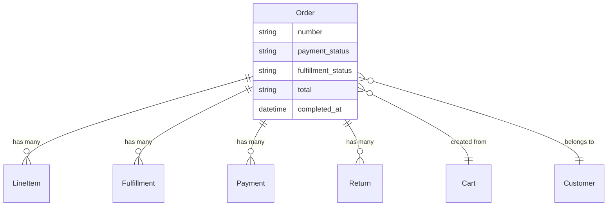

## Overview

An order is a placed purchase. It's created by completing a [Cart](/developer/core-concepts/carts) and holds its own copy of everything the customer agreed to — items, prices, taxes, discounts and delivery.


```mermaid
erDiagram
    Order ||--o{ LineItem : "has many"
    Order ||--o{ Fulfillment : "has many"
    Order ||--o{ Payment : "has many"
    Order ||--o{ Return : "has many"
    Order }o--|| Cart : "created from"
    Order }o--|| Customer : "belongs to"

    Order {
        string number
        string payment_status
        string fulfillment_status
        string total
        datetime completed_at
    }
```

## Order attributes

| Attribute | Description |
|---|---|
| `id` | Order ID, e.g. `or_86Rf07xd4z` |
| `number` | Order number shown to customers, e.g. `R1001` — sequential by default, [customizable](/developer/how-to/custom-document-numbers) |
| `cart_id` | The cart this order came from |
| `email` | Customer's email address |
| `currency` | Order currency, e.g. `USD` |
| `total_quantity` | Total number of items |
| `payment_status` | See [statuses](#statuses) below |
| `fulfillment_status` | See [statuses](#statuses) below |
| `item_total` / `display_item_total` | Sum of line item prices |
| `delivery_total` / `display_delivery_total` | Delivery cost |
| `tax_total` / `display_tax_total` | Total tax |
| `discount_total` / `display_discount_total` | Total discount |
| `total` / `display_total` | Order total |
| `amount_due` / `display_amount_due` | Still outstanding |
| `completed_at` | When the order was placed |

Every amount comes in two forms: `total` is the raw value (`"135.60"`) and [`display_total` is formatted for the currency](/api-reference/store-api/monetary-amounts) (`"$135.60"`). Render the `display_` one.

## Statuses

An order tracks payment and delivery separately, because they genuinely move at different speeds. An order can be paid but not yet sent, or sent and later partly refunded.

**`payment_status`**

| Value | Meaning |
|---|---|
| `none` | Nothing paid or authorized yet |
| `authorized` | Money is held but not taken |
| `partially_paid` | Some of the total has been taken |
| `paid` | Fully paid |
| `partially_refunded` | Some money returned |
| `refunded` | Everything returned |
| `overcharged` | More was taken than the order total |
| `voided` | The hold was released without taking money |

**`fulfillment_status`**

| Value | Meaning |
|---|---|
| `unfulfilled` | Nothing has gone out yet |
| `backorder` | Waiting on stock |
| `partial` | Some of it has gone out |
| `fulfilled` | Everything has gone out |
| `delivered` | The customer has all of it |
| `canceled` | Nothing will be sent |

A canceled parcel is ignored while others are still live, so an order whose second parcel was recalled is described by the first.

Both are worked out automatically from the order's payments, refunds and fulfillments. You change an order's status by acting on those — taking a payment, sending a parcel, issuing a refund — never by setting the status yourself.

## Reading an order

A customer can fetch their own order; guests use the order token they got at checkout.

<CodeGroup>

```typescript Store SDK
// A single order
const order = await client.orders.get('or_xxx')

// The signed-in customer's order history
const orders = await client.customers.orders.list({ per_page: 20 })
```

```bash cURL
curl 'https://api.mystore.com/api/v3/store/orders/or_xxx' \
  -H 'X-Spree-API-Key: pk_xxx' \
  -H 'X-Spree-Token: order_token_xxx'
```

</CodeGroup>

## Managing orders

Back-office work happens through the Admin API.

<CodeGroup>

```typescript Admin SDK
// Find orders needing attention
const orders = await adminClient.orders.list({
  filter: { payment_status_eq: 'paid', fulfillment_status_eq: 'unfulfilled' },
})

// Cancel an order
await adminClient.orders.cancel('or_xxx', {
  reason: 'customer',
  restock_items: true,
  refund_payments: true,
})

// Take an authorized payment
await adminClient.orders.payments.capture('or_xxx', 'pay_xxx')

// Refund against a specific payment
await adminClient.orders.refunds.create('or_xxx', {
  payment_id: 'pay_xxx',
  amount: '25.00',
})
```

```bash cURL
curl 'https://api.mystore.com/api/v3/admin/orders?filter[payment_status_eq]=paid' \
  -H 'X-Spree-API-Key: sk_xxx'

curl -X PATCH 'https://api.mystore.com/api/v3/admin/orders/or_xxx/cancel' \
  -H 'X-Spree-API-Key: sk_xxx' \
  -H 'Content-Type: application/json' \
  -d '{ "reason": "customer", "restock_items": true }'
```

</CodeGroup>

Canceling records who canceled and why, puts stock back, and settles any payments.

## Orders don't change quietly

A placed order is meant to stay put. Its items and prices are written when the cart is completed and then left alone, so an order keeps saying what the customer actually agreed to — even if a product's price changes the next day.

Where admin edits are allowed, totals are re-added from the order's existing rows rather than worked out again from scratch. Editing an order must never quietly re-apply today's promotions and hand the customer a different discount than the one they accepted.

## Money on an order

Tax, discounts and fees are kept as separate records, so you can ask what tax was charged without picking through a mixed list. See [Taxes, Discounts & Fees](/developer/core-concepts/taxes-discounts-fees).

## Events

Orders publish [events](/developer/core-concepts/events) — `order.placed`, `order.canceled`, `order.paid` and more — which also reach [webhooks](/developer/core-concepts/webhooks). This is the right way to push orders to another system, trigger fulfillment, or start an email flow.

## Related

- [Carts](/developer/core-concepts/carts) — shopping and checkout
- [Fulfillments](/developer/core-concepts/fulfillments) — getting items to the customer
- [Returns, Exchanges & Claims](/developer/core-concepts/returns-exchanges-claims) — after the sale
- [Payments](/developer/core-concepts/payments) — payment methods and processing
