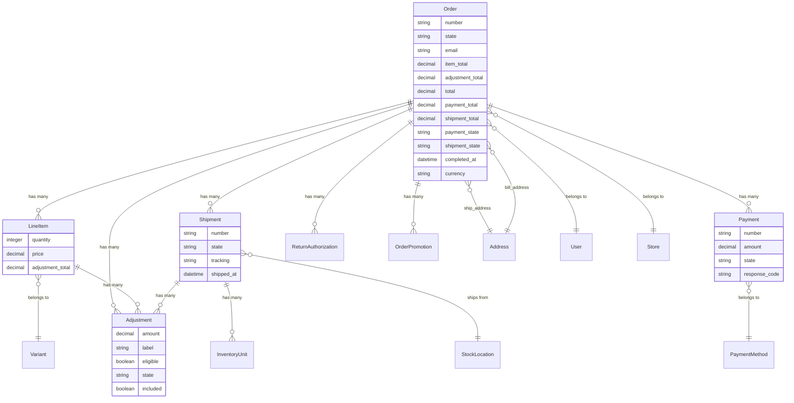

## Overview

The `Order` model is one of the key models in Spree. It provides a central place around which to collect information about a customer order - including line items, adjustments, payments, addresses, return authorizations, and shipments.

### Order Model Diagram



**Key relationships:**
- **Order** is the central model connecting customers to their purchases
- **Line Items** link orders to [Variants](/developer/core-concepts/products#variants) (what was purchased)
- **[Shipments](/developer/core-concepts/shipments)** handle fulfillment from [Stock Locations](/developer/core-concepts/inventory#stock-locations)
- **[Payments](/developer/core-concepts/payments)** track payment attempts and their states
- **[Adjustments](/developer/core-concepts/adjustments)** apply taxes, promotions, and shipping costs
- **[Addresses](/developer/core-concepts/addresses)** store billing and shipping information

### Order Attributes

| Attribute               | Description                                                                                      |
|-------------------------|--------------------------------------------------------------------------------------------------|
| `number`                | The unique identifier for this order. It begins with the letter R and ends in a 9-digit number. This number is shown to the users, and can be used to find the order by calling `Spree::Order.find_by(number: number)`. |
| `item_total`            | The sum of all the line items for this order.                                                   |
| `adjustment_total`      | The sum of all adjustments on this order.                                                       |
| `total`                 | The result of the sum of the `item_total` and the `adjustment_total`.                           |
| `payment_total`         | The total value of all finalized payments.                                                      |
| `shipment_total`        | The total value of all shipments' costs.                                                        |
| `additional_tax_total`  | The sum of all shipments' and line items' `additional_tax`.                                     |
| `included_tax_total`    | The sum of all shipments' and line items' `included_tax`.                                       |
| `promo_total`           | The sum of all shipments', line items' and promotions' `promo_total`.                           |
| `state`                 | The current state of the order. To read more about the states an order goes through, read [The Order State Machine](orders#the-order-state-machine) section of this guide. |
| `email`                 | The email address for the user who placed this order. Stored in case this order is for a guest user. |
| `user_id`               | The ID for the corresponding user record for this order. Stored only if the order is placed by a signed-in user. |
| `completed_at`          | The timestamp of when the order was completed.                                                  |
| `bill_address_id`       | The ID for the related `Address` object with billing address information.                       |
| `ship_address_id`       | The ID for the related `Address` object with shipping address information.                      |
| `shipping_method_id`    | The ID for the related `ShippingMethod` object.                                                 |
| `created_by_id`         | The ID of object that created this order.                                                       |
| `shipment_state`        | The current shipment state of the order. It takes into account all shipments. Described below in [Order Shipment states section](orders#order-shipment-states). |
| `payment_state`         | The current payment state of the order. It takes into account all payments. Described below in [Order Payment states section](orders#order-payment-states). |
| `special_instructions`  | Any special instructions for the store to do with this order. Will only appear if shipping instructions are enabled in the store configuration. |
| `currency`              | The currency for this order, eg. `USD` |
| `last_ip_address`       | The last IP address used to update this order in the frontend.                                  |
| `channel`               | The channel specified when importing orders from other stores. e.g. amazon.                     |
| `item_count`            | The total value of line items' quantity.                                                        |
| `approver_id`           | The ID of user that approved this order.                                                        |
| `confirmation_delivered`| Boolean value indicating that confirmation email was delivered.                                 |
| `token`                 | The token stored corresponding to token stored in cookies. |
| `canceler_id`           | The ID of user that canceled this order.                                                        |
| `store_id`              | The ID of `Store` in which this order was created.                                              |

## Order methods

Here is a list of methods you may find useful:

| Method                      | Description                                                                                   |
|-----------------------------|-----------------------------------------------------------------------------------------------|
| `outstanding_balance`       | The outstanding balance for the order, calculated by taking the `total` and subtracting `payment_total`. |
| `display_item_total`        | A "pretty" version of `item_total`. If `item_total` was `10.0`, `display_item_total` would be `$10.00`. |
| `display_adjustment_total`  | Same as above, except for `adjustment_total`.                                                 |
| `display_total`             | Same as above, except for `total`.                                                            |
| `display_outstanding_balance` | Same as above, except for `outstanding_balance`.                                              |

To see all available methods, please check the [Order model source code](https://github.com/spree/spree/blob/main/core/app/models/spree/order.rb).

## The Order State Machine

Each Order flows through a state machine, beginning at a `cart` state and ending up at a `complete` state.

<Note>
This is the default order flow and can be adjusted or overhauled completely.

More on this topic at [Customizing Checkout page](../customization/checkout).
</Note>

The default states are as follows:

<Steps>
  <Step title="cart">
    Initial state, you can treat it as a draft order
  </Step>
  <Step title="address">
    Buyer started the checkout process and is on the address step
  </Step>
  <Step title="delivery">
    Buyer has added Shipping and Billing addresses, now he or she needs to select a delivery option
  </Step>
  <Step title="payment">
    Buyer selected delivery option, now he or she needs to add a payment option

    <Note>
      Only available if `Order#payment_required?` returns `true`. For most orders it will be `true`, but if the order is paid entirely with [Store Credit](store-credit) it will be `false`.
    </Note>
  </Step>
  <Step title="confirm">
    Buyer added payment option, now he or she needs to confirm the order

    <Note>
      Only available if `Order#confirmation_required?` returns `true`
    </Note>
  </Step>
  <Step title="complete">
    Order was placed. It will set the `completed_at` date to the current time.
  </Step>
</Steps>

Assuming that an order meets the criteria for the next state, you will be able to transition it to the next state by calling `next` on that object, eg. 

<Tabs>
  <Tab title="SDK">
    ```javascript
    const order = await client.store.orders.next('or_abc123', {
      bearerToken: '<token>',
    })
    ```
  </Tab>
  <Tab title="console">
    ```ruby
    order = Spree::Order.find_by_prefix_id!('or_HOVtlDrOmL')
    order.next
    ```
  </Tab>
</Tabs>

If order cannot proceed to the next steps this will return an error. 

### Order Shipment states

Alongside the global Order state there's also `shipment_state` column which indicates the state of all shipments. Order can have multiple shipments.

| State     | Description |
|-----------|-------------|
| `shipped` | all Shipments are in the `shipped` state |
| `partial` | at least one Shipment has a state of `shipped` and there is another Shipment with a state other than `shipped` or there are [InventoryUnits](inventory) associated with the order that have a state of `sold` but are not associated with a Shipment |
| `ready`   | all Shipments are in the `ready` state |
| `backorder` | there is backordered inventory associated with an order |
| `pending` | all Shipments are in the `pending` state |

For more on this please go to [Shipment States page](shipments).

### Order Payment states

Alongside the global Order state there's also `payment_state` column which indicates the state of all payments. Order can have multiple payments.

| State        | Description                                         |
|--------------|-----------------------------------------------------|
| `paid`       | `payment_total` is equal to `total`                 |
| `balance_due`| `payment_total` is less than `total`                |
| `credit_owed`| `payment_total` is greater than `total`             |
| `failed`     | most recent payment is in the `failed` state        |
| `void`       | order is canceled and `payment_total` is equal to `zero` |

For more on this please go to [Payment States page](payments).

## Line Items

Line items are used to keep track of items within the context of an order. These records provide a link between orders and [Variants](/developer/core-concepts/products#variants).

<Warning>
When a variant is added to an order, the price of that item is tracked along with the line item to preserve that data. If the variant's price were to change, then the line item would still have a record of the price at the time of ordering.
</Warning>

## Addresses

An order can link to two `Address` objects. The shipping address indicates where the order's products should be shipped to. This address is used to determine which shipping methods are available for an order.

The billing address indicates where the user who's paying for the order is located. This can alter the tax rate for the order, which in turn can change how much the final order total can be.

For more information about addresses, please read the [Addresses](/developer/core-concepts/addresses) guide.

## Adjustments

Adjustments are used to affect an order's final cost, either by decreasing it ([Promotions](/developer/core-concepts/promotions)) or by increasing it ([Shipping](/developer/core-concepts/shipments), [Taxes](/developer/core-concepts/taxes)).

For more information about adjustments, please see the [Adjustments](adjustments) guide.

## Payments

Payment records are used to track payment information about an order. Each Order can hold multiple payments, eg. one for each credit card or debit card and one for the store credit. 

For more information, please read the [Payments](payments) guide.

## Return Authorizations

An order can have many `ReturnAuthorization` objects. These records keeps track of which items have been authorized for return and how the user will be compensated -- either via exchanging the items or a reimbursement.

## Updating an Order

If you change any aspect of an `Order` object within code and you wish to update the order's totals -- including associated adjustments and shipments -- call the `update_with_updater!` method on that object, which calls out to the [OrderUpdater](https://github.com/spree/spree/blob/main/core/app/models/spree/order_updater.rb) class.

For example, if you create or modify an existing payment for the order which would change the order's `payment_state` to a different value, calling `update_with_updater!` will cause the `payment_state` to be recalculated for that order.

Another example is if a `LineItem` within the order had its price changed. Calling `update_with_updater!` will cause the totals for the order to be updated, the adjustments for the order to be recalculated, and then a final total to be established.

## Related Documentation

- [Payments](/developer/core-concepts/payments) - Payment processing for orders
- [Shipments](/developer/core-concepts/shipments) - Order fulfillment and shipping
- [Promotions](/developer/core-concepts/promotions) - Discounts and promotions
- [Checkout Customization](/developer/customization/checkout) - Customizing the checkout flow
- [Events](/developer/core-concepts/events) - Subscribe to order events
