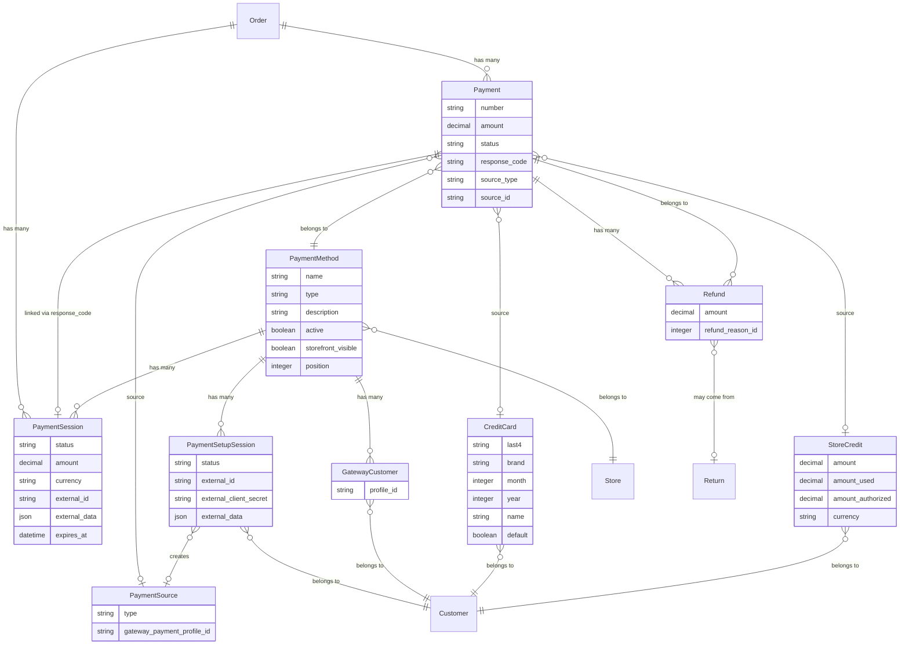
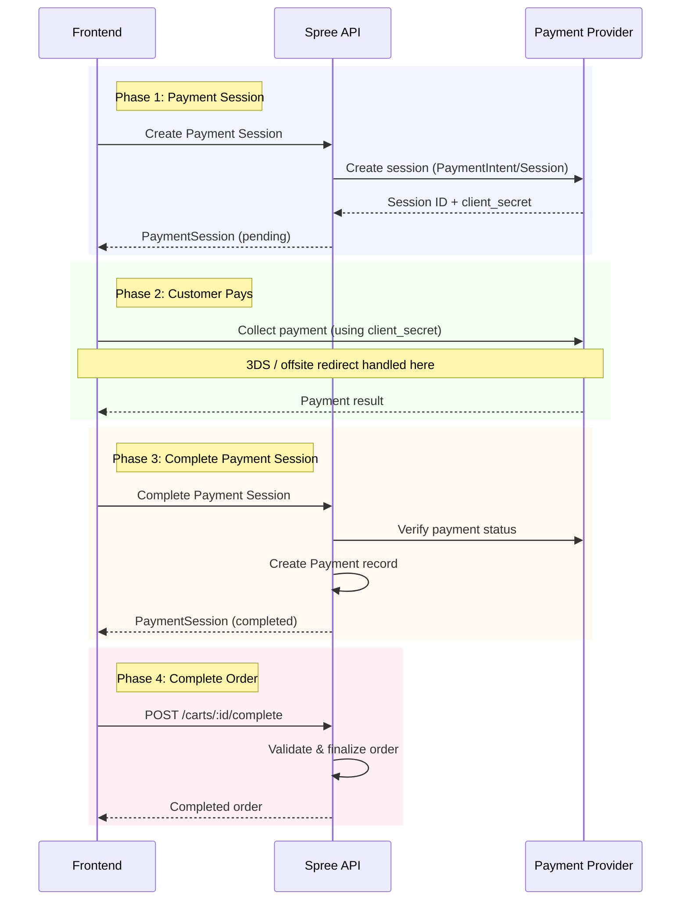
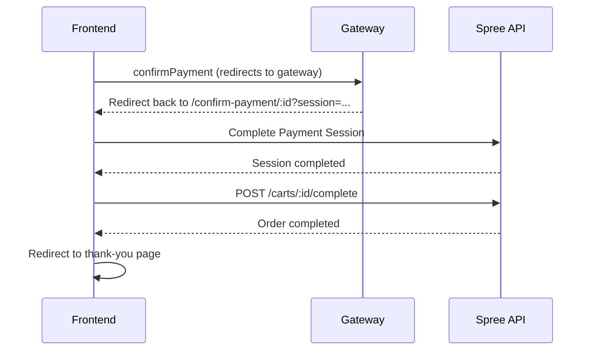
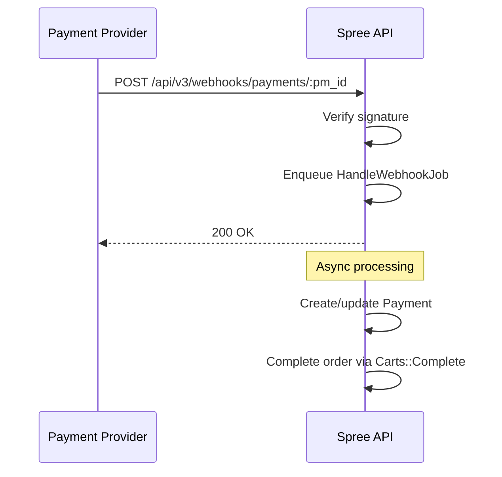
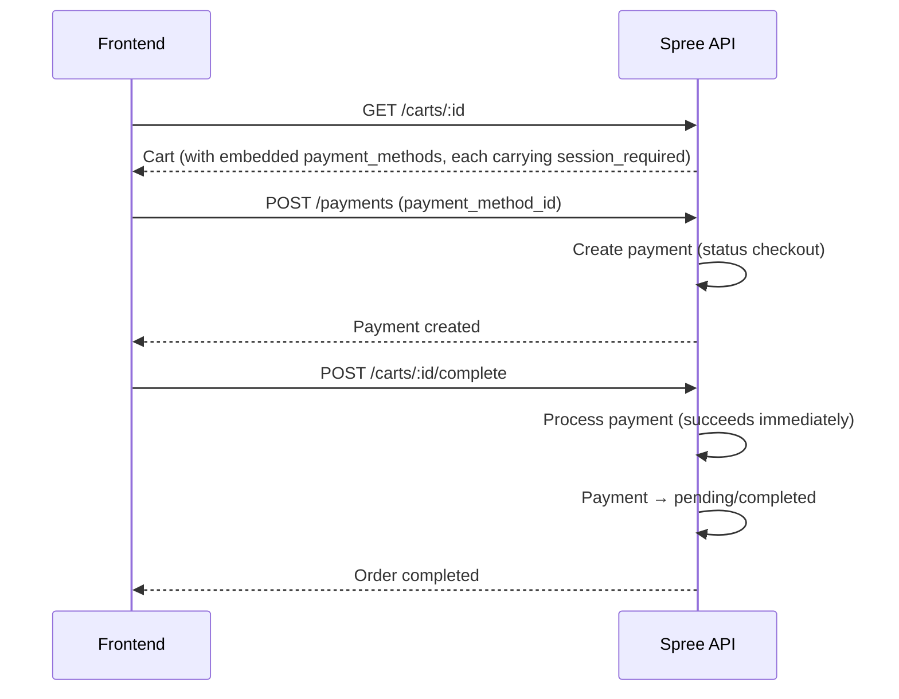
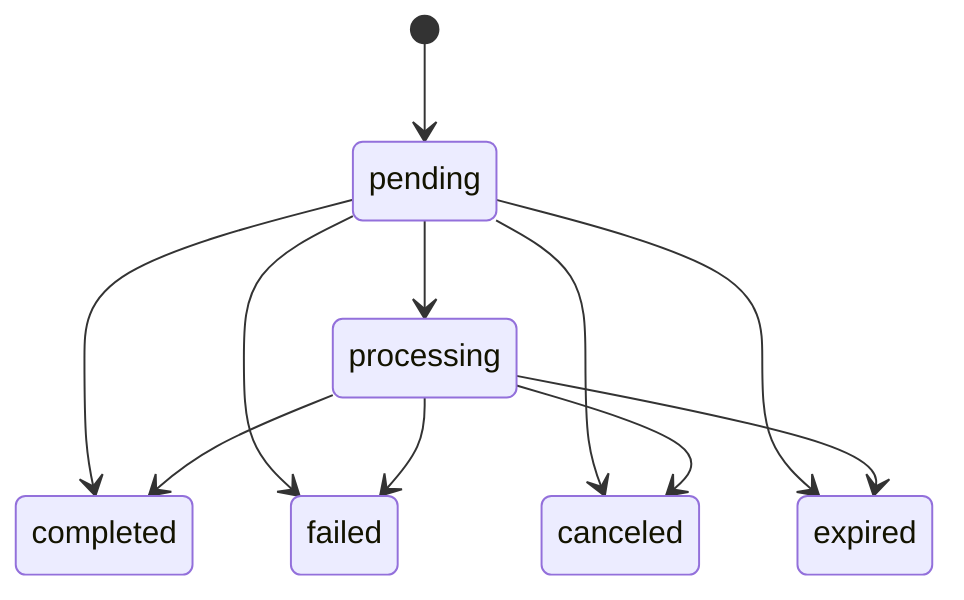
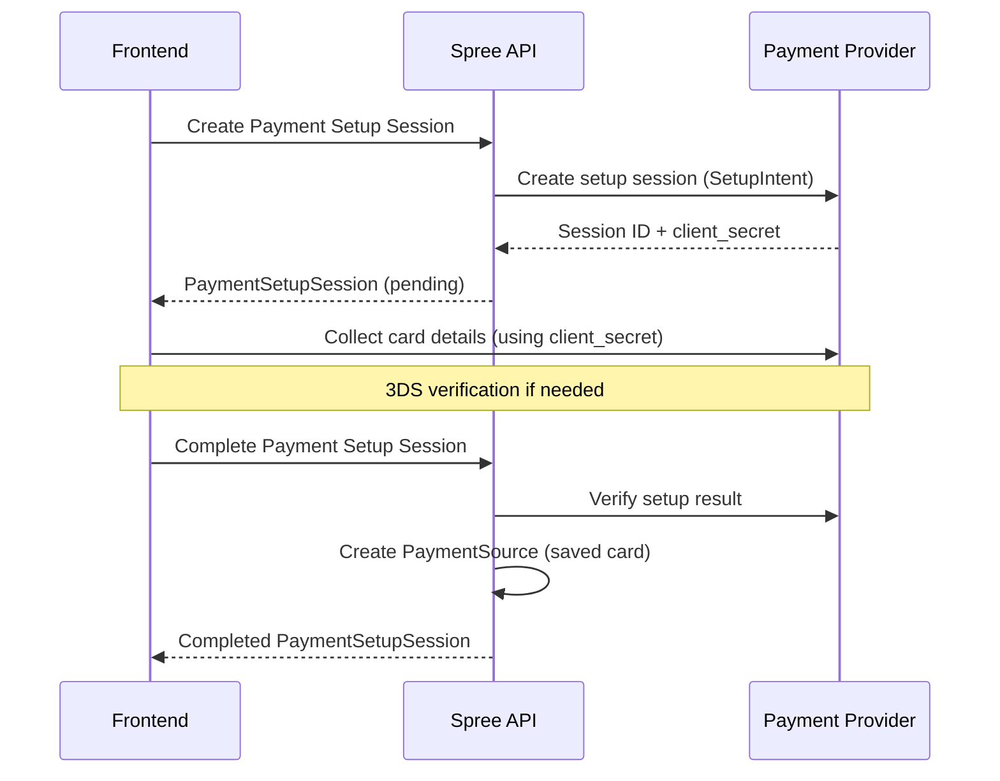

## Overview

Spree has a highly flexible payments model which allows multiple payment methods to be available during the checkout. The logic for processing payments is decoupled from orders, making it easy to define custom payment methods with their own processing logic.

Payment methods typically represent a payment gateway. Gateways will process card payments, online bank transfers, buy-now-pay-later, wallet payments, and other types of payments. Spree also comes with a Check option for offline processing.

The `Payment` model in Spree tracks payments against [Orders](/developer/core-concepts/orders). Payments relate to a `source` which indicates how the payment was made, and a `PaymentMethod`, indicating the processor used for this payment.

A payment's `number` is derived from what it belongs to — an order `R1001` numbers its payments `R1001-P1`, `R1001-P2` — so a gateway reference traces straight back to the order without a lookup.

### Payment Architecture Diagram


```mermaid
erDiagram
    Payment {
        string number
        decimal amount
        string status
        string response_code
        string source_type
        string source_id
    }

    PaymentMethod {
        string name
        string type
        string description
        boolean active
        boolean storefront_visible
        integer position
    }

    PaymentSession {
        string status
        decimal amount
        string currency
        string external_id
        json external_data
        datetime expires_at
    }

    PaymentSetupSession {
        string status
        string external_id
        string external_client_secret
        json external_data
    }

    PaymentSource {
        string type
        string gateway_payment_profile_id
    }

    CreditCard {
        string last4
        string brand
        integer month
        integer year
        string name
        boolean default
    }

    GatewayCustomer {
        string profile_id
    }

    StoreCredit {
        decimal amount
        decimal amount_used
        decimal amount_authorized
        string currency
    }

    Refund {
        decimal amount
        integer refund_reason_id
    }

    Order ||--o{ Payment : "has many"
    Order ||--o{ PaymentSession : "has many"
    Payment }o--|| PaymentMethod : "belongs to"
    Payment }o--o| CreditCard : "source"
    Payment }o--o| PaymentSource : "source"
    Payment }o--o| StoreCredit : "source"
    Payment ||--o| PaymentSession : "linked via response_code"
    Payment ||--o{ Refund : "has many"
    PaymentMethod ||--o{ PaymentSession : "has many"
    PaymentMethod ||--o{ PaymentSetupSession : "has many"
    PaymentMethod ||--o{ GatewayCustomer : "has many"
    PaymentMethod }o--|| Store : "belongs to"
    PaymentSetupSession }o--o| PaymentSource : "creates"
    PaymentSetupSession }o--|| Customer : "belongs to"
    GatewayCustomer }o--|| Customer : "belongs to"
    CreditCard }o--|| Customer : "belongs to"
    StoreCredit }o--|| Customer : "belongs to"
    Refund }o--|| Payment : "belongs to"
    Refund }o--o| Return : "may come from"
```

**Key relationships:**
- **Payment** tracks each payment attempt against an [Order](/developer/core-concepts/orders)
- **Payment Method** defines how payments are processed (Stripe, Adyen, PayPal, Check, etc.)
- **Payment Session** manages the gateway-side payment lifecycle (e.g., Stripe PaymentIntent, Adyen Session)
- **Payment Setup Session** manages saving payment methods for future use without an immediate charge (e.g., Stripe SetupIntent)
- **Source** is polymorphic - can be a Credit Card, Payment Source (for alternative methods like Klarna, iDEAL), or Store Credit
- **Gateway Customer** stores the provider-specific customer profile (e.g., Stripe Customer ID)
- **Refunds** track money returned to customers

## Payment Methods

Payment methods represent the different options a customer has for making a payment. Most sites will accept credit card payments through a payment gateway, but there are other options. Spree also comes with built-in support for a Check payment, which can be used to represent any offline payment. Gateway providers such as Stripe, Adyen, and PayPal provide a wide range of payment methods, including credit cards, bank transfers, buy-now-pay-later, and digital wallets (Apple Pay, Google Pay, etc.).

A `PaymentMethod` can have the following attributes:

| Attribute    | Description                                                                                   | Example                |
|--------------|-----------------------------------------------------------------------------------------------|------------------------|
| `type`       | The payment method type | `Check` |
| `name`       | The visible name for this payment method                                                      | `Check`                |
| `description`| The description for this payment method                                                       | `Pay by check.`        |
| `active`     | Whether or not this payment method is active. Set it `false` to hide it in the Store API.         | `true`                 |
| `storefront_visible` | Whether customers can choose this method. Leave it off for a method only staff use. | `true`                 |
| `position`   | The position of the payment method in lists. Lower numbers appear first.                      | `1`                    |

<Info>
Each payment method is associated to a Store, so you can decide which Payment Method will appear on which Store. This allows you to create different experiences for your customers in different countries.
</Info>

### Session-based vs direct payment methods

Payment methods indicate whether they use the modern session-based flow via the `session_required?` method:

| Method | Description | Default |
|--------|-------------|---------|
| `session_required?` | Returns `true` if this payment method requires a Payment Session for processing. | `false` |
| `setup_session_supported?` | Returns `true` if this payment method supports saving payment methods for future use (Payment Setup Sessions). | `false` |
| `payment_session_class` | Returns the STI subclass of `Spree::PaymentSession` for this gateway (e.g., `Spree::PaymentSessions::Stripe`). | `nil` |
| `payment_setup_session_class` | Returns the STI subclass of `Spree::PaymentSetupSession` for this gateway. | `nil` |

Gateways like Stripe and Adyen set `session_required?` to `true`; offline methods leave it `false`. Neither path is deprecated. The Store API serializer includes this as the `session_required` field so your frontend knows which flow to use.

### Direct payment methods (manual and offline)

Payment methods where `session_required?` returns `false` don't need a payment session. These are typically offline or manual payment methods such as:

- **Check** — built in
- **Cash on Delivery** — customer pays upon delivery
- **Bank Transfer / Wire** — customer transfers money to a bank account
- **Purchase Order** — common in B2B, customer provides a PO number

For these methods, the Store API allows creating a payment directly without going through the payment session flow:

<CodeGroup>

```typescript Store SDK
const options = { spreeToken: cart.token }

// Create a payment for a non-session payment method
const payment = await client.carts.payments.create(cart.id, {
  payment_method_id: 'pm_xyz789',
  amount: '99.99',              // Optional, defaults to order total minus store credits
  metadata: {                   // Optional, write-only metadata (e.g. PO number)
    purchase_order_number: 'PO-12345',
  },
}, options)
```

```bash cURL
curl -X POST 'https://api.mystore.com/api/v3/store/carts/cart_xxx/payments' \
  -H 'X-Spree-API-Key: pk_xxx' \
  -H 'X-Spree-Token: CART_TOKEN' \
  -H 'Content-Type: application/json' \
  -d '{
    "payment_method_id": "pm_xyz789",
    "amount": "99.99",
    "metadata": { "purchase_order_number": "PO-12345" }
  }'
```

</CodeGroup>

The payment starts at `checkout`. Completing the cart processes it — for a manual method there is no provider to call, so it succeeds immediately and lands on `pending`, or `completed` when the store charges at checkout.

Once the money actually arrives — the cheque clears, the transfer lands, the
driver is paid — staff capture the payment from the dashboard, or you do it
through the Admin API:

```typescript Admin SDK
await adminClient.orders.payments.capture(orderId, paymentId)
await adminClient.orders.payments.void(orderId, paymentId)
```

## Payment Flow

Spree supports two payment flows depending on the payment method type:

### Session-Based Flow (Stripe, Adyen, PayPal, etc.)

Modern payment gateways use a three-phase approach: first a **Payment Session** is created with the gateway, then the customer completes payment on the frontend, and finally the **order is completed** via an explicit API call. Payment processing and order completion are intentionally separated — this prevents race conditions and ensures reliable checkout regardless of payment method type (cards, wallets, offsite redirects).


```mermaid
sequenceDiagram
    participant Frontend
    participant Spree API
    participant Payment Provider

    rect rgb(240, 245, 255)
    note right of Frontend: Phase 1: Payment Session
    Frontend->>Spree API: Create Payment Session
    Spree API->>Payment Provider: Create session (PaymentIntent/Session)
    Payment Provider-->>Spree API: Session ID + client_secret
    Spree API-->>Frontend: PaymentSession (pending)
    end

    rect rgb(240, 255, 240)
    note right of Frontend: Phase 2: Customer Pays
    Frontend->>Payment Provider: Collect payment (using client_secret)
    Note over Frontend,Payment Provider: 3DS / offsite redirect handled here
    Payment Provider-->>Frontend: Payment result
    end

    rect rgb(255, 248, 240)
    note right of Frontend: Phase 3: Complete Payment Session
    Frontend->>Spree API: Complete Payment Session
    Spree API->>Payment Provider: Verify payment status
    Spree API->>Spree API: Create Payment record
    Spree API-->>Frontend: PaymentSession (completed)
    end

    rect rgb(255, 240, 245)
    note right of Frontend: Phase 4: Complete Order
    Frontend->>Spree API: POST /carts/:id/complete
    Spree API->>Spree API: Validate & finalize order
    Spree API-->>Frontend: Completed order
    end
```

<Steps>
  <Step title="Create Payment Session">
    The frontend calls the API to create a Payment Session for a specific payment method and order. Spree calls the gateway to create a provider-side session (e.g., Stripe PaymentIntent, Adyen Session) and returns the session data including a `client_secret` for the frontend SDK.

    <Info>
    The payment session should be created (or recreated) **after** the shipping method is selected, so the amount includes shipping costs. If the order total changes (e.g., customer selects a different shipping rate or applies a coupon), create a new payment session with the updated amount.
    </Info>
  </Step>
  <Step title="Customer pays on the frontend">
    The frontend uses the gateway's JavaScript SDK (e.g., Stripe.js, Adyen Drop-in) with the `client_secret` to securely collect payment details. Card data never touches your server — it goes directly to the payment provider, ensuring [PCI compliance](/developer/security/pci_compliance). If the payment requires **3D Secure** authentication or redirects to an offsite gateway (CashApp, Klarna, etc.), the gateway SDK handles it automatically.
  </Step>
  <Step title="Complete Payment Session">
    After the customer completes payment, the frontend calls the Complete Payment Session endpoint. Spree verifies the payment status with the gateway, creates a `Payment` record, creates the appropriate payment source (Credit Card, wallet, etc.), and marks the session as completed.

    **This step does NOT complete the order** — it only handles payment processing. For wallet payments (Apple Pay, Google Pay), the gateway also patches the order's billing address with data from the wallet at this stage.
  </Step>
  <Step title="Complete Order">
    The frontend calls `POST /carts/:id/complete` to finalize the order. Spree checks the cart has everything it needs — addresses, fulfillments, payment — and turns it into an order.

    This separation ensures the same flow works for all payment types — inline cards, offsite redirects, and wallet payments.
  </Step>
</Steps>

#### Offsite Payment Flow (CashApp, 3D Secure, Klarna, etc.)

For payment methods that redirect the customer away from your site, use an intermediate **confirm-payment** page:


```mermaid
sequenceDiagram
    participant Frontend
    participant Gateway
    participant Spree API

    Frontend->>Gateway: confirmPayment (redirects to gateway)
    Gateway-->>Frontend: Redirect back to /confirm-payment/:id?session=...
    Frontend->>Spree API: Complete Payment Session
    Spree API-->>Frontend: Session completed
    Frontend->>Spree API: POST /carts/:id/complete
    Spree API-->>Frontend: Order completed
    Frontend->>Frontend: Redirect to thank-you page
```

#### Webhook-Driven Completion (Browser Closed)

If the customer closes the browser after paying but before the frontend calls `complete`, Spree handles this via payment webhooks:


```mermaid
sequenceDiagram
    participant Payment Provider
    participant Spree API

    Payment Provider->>Spree API: POST /api/v3/webhooks/payments/:pm_id
    Spree API->>Spree API: Verify signature
    Spree API->>Spree API: Enqueue HandleWebhookJob
    Spree API-->>Payment Provider: 200 OK

    note over Spree API: Async processing
    Spree API->>Spree API: Create/update Payment
    Spree API->>Spree API: Complete order via Carts::Complete
```

Gateway extensions implement `parse_webhook_event` to normalize provider-specific payloads into a standard format. Spree core handles the rest — creating the payment record, completing the session, and finalizing the order.

### Direct Payment Flow (Check, Cash on Delivery, Bank Transfer, etc.)

Non-session payment methods use a simpler flow where a payment is created directly without involving an external payment provider:


```mermaid
sequenceDiagram
    participant Frontend
    participant Spree API

    Frontend->>Spree API: GET /carts/:id
    Spree API-->>Frontend: Cart (with embedded payment_methods, each carrying session_required)

    Frontend->>Spree API: POST /payments (payment_method_id)
    Spree API->>Spree API: Create payment (status checkout)
    Spree API-->>Frontend: Payment created

    Frontend->>Spree API: POST /carts/:id/complete
    Spree API->>Spree API: Process payment (succeeds immediately)
    Spree API->>Spree API: Payment → pending/completed
    Spree API-->>Frontend: Order completed
```

<Steps>
  <Step title="List payment methods">
    The frontend reads the cart's embedded `payment_methods` (returned by `GET /carts/:id`) and checks the `session_required` flag on each method. Methods with `session_required: false` use this direct flow.
  </Step>
  <Step title="Create payment">
    The frontend calls `POST /payments` with the `payment_method_id`. Spree creates a payment with status `checkout`. No provider is contacted.

    Two refusals to handle: a method needing a session returns `payment_session_required`, and one unavailable for this order returns `payment_method_unavailable` — both HTTP 422 with that `code`.
  </Step>
  <Step title="Complete order">
    The frontend completes the order. Completing the cart processes the payment. For a manual method there is nothing to call, so it succeeds immediately and lands on `pending`, or `completed` when the store charges at checkout. Staff capture `pending` payments from the dashboard once the money arrives.
  </Step>
</Steps>

### Payment Session

A payment session represents a server-side session with the payment gateway. It is the entry point for every payment attempt and holds the provider-specific data needed by the frontend SDK.

#### Attributes

| Attribute | Description | Example Value |
|-----------|-------------|---------------|
| `status` | Current session state: `pending`, `processing`, `completed`, `failed`, `canceled`, `expired` | `completed` |
| `amount` | The payment amount | `99.99` |
| `currency` | ISO currency code | `USD` |
| `external_id` | The provider-side session ID (e.g., Stripe PaymentIntent ID) | `pi_3ABC123` |
| `external_data` | Provider-specific data including `client_secret` for frontend SDK | `{"client_secret": "pi_3ABC_secret_xyz"}` |
| `customer_external_id` | The provider's customer ID | `cus_ABC123` |
| `expires_at` | When the session expires | `2025-01-01T12:00:00Z` |
| `cart_id` | The cart being paid for | `cart_k5nR8xLq` |

<Note>
  A session also carries `order_id`, but during checkout there is no order yet —
  it reports the cart's ID until the cart completes. Read `cart_id` while paying,
  and `order_id` once you have an order.
</Note>

#### States


```mermaid
stateDiagram-v2
    [*] --> pending
    pending --> processing
    pending --> completed
    pending --> failed
    pending --> canceled
    pending --> expired
    processing --> completed
    processing --> failed
    processing --> canceled
    processing --> expired
```

<Note>
  There is no cancel endpoint. A session reaches `canceled` when the provider
  says so through its webhook, and `expired` when it passes `expires_at`.
  Neither is something a storefront drives.
</Note>

#### API

**Create a Payment Session:**

<CodeGroup>

```typescript Store SDK
const options = { spreeToken: cart.token }

// Create a payment session for the selected payment method
const session = await client.carts.paymentSessions.create(cart.id, {
  payment_method_id: 'pm_xyz789',
  amount: '99.99',             // Optional, defaults to order total
  external_data: {},           // Optional, provider-specific data
}, options)

// The session contains provider-specific data for the frontend SDK
console.log(session.external_id)              // e.g. 'pi_3ABC123' (Stripe PaymentIntent ID)
console.log(session.external_data.client_secret) // Use with Stripe.js or Adyen Drop-in
```

```bash cURL
curl -X POST 'https://api.mystore.com/api/v3/store/carts/cart_xxx/payment_sessions' \
  -H 'X-Spree-API-Key: pk_xxx' \
  -H 'X-Spree-Token: CART_TOKEN' \
  -H 'Content-Type: application/json' \
  -d '{ "payment_method_id": "pm_xyz789", "amount": "99.99", "external_data": {} }'
```

</CodeGroup>

**Response shape (`StorePaymentSession`):**

```json Response
{
  "id": "ps_abc123",
  "status": "pending",
  "amount": "99.99",
  "currency": "USD",
  "external_id": "pi_3ABC123",
  "external_data": {
    "client_secret": "pi_3ABC123_secret_xyz"
  },
  "customer_external_id": "cus_ABC123",
  "expires_at": "2025-01-01T12:00:00Z",
  "payment_method_id": "pm_xyz789",
  "order_id": "or_ABC123",
  "payment": null
}
```

**Update a Payment Session** (e.g., after order total changes):

<CodeGroup>

```typescript Store SDK
const updated = await client.carts.paymentSessions.update(
  cart.id, session.id,
  { amount: '149.99' },
  options
)
```

```bash cURL
curl -X PATCH 'https://api.mystore.com/api/v3/store/carts/cart_xxx/payment_sessions/ps_xxx' \
  -H 'X-Spree-API-Key: pk_xxx' \
  -H 'X-Spree-Token: CART_TOKEN' \
  -H 'Content-Type: application/json' \
  -d '{ "amount": "149.99" }'
```

</CodeGroup>

**Complete a Payment Session** (after customer confirms payment on the frontend):

<CodeGroup>

```typescript Store SDK
const completed = await client.carts.paymentSessions.complete(
  cart.id, session.id,
  { session_result: '...', external_data: {} },
  options
)
console.log(completed.status) // 'completed'
```

```bash cURL
curl -X PATCH 'https://api.mystore.com/api/v3/store/carts/cart_xxx/payment_sessions/ps_xxx/complete' \
  -H 'X-Spree-API-Key: pk_xxx' \
  -H 'X-Spree-Token: CART_TOKEN' \
  -H 'Content-Type: application/json' \
  -d '{ "session_result": "...", "external_data": {} }'
```

</CodeGroup>

<Warning>
Completing a payment session does **not** complete the order. You must call `POST /carts/:id/complete` separately after the session is completed. This separation prevents race conditions between the frontend and payment webhooks.
</Warning>

**Complete the Order** (after the payment session is completed):

<CodeGroup>

```typescript Store SDK
const order = await client.carts.complete(cart.id, options)
```

```bash cURL
curl -X POST 'https://api.mystore.com/api/v3/store/carts/cart_xxx/complete' \
  -H 'X-Spree-API-Key: pk_xxx' \
  -H 'X-Spree-Token: CART_TOKEN'
```

</CodeGroup>

### Payment Webhooks

Spree provides a generic webhook endpoint at `POST /api/v3/webhooks/payments/:payment_method_id` that payment gateway extensions can use. When a payment provider sends a webhook (e.g., Stripe `payment_intent.succeeded`), Spree:

1. Verifies the webhook signature synchronously (returns `401` if invalid)
2. Enqueues a background job to process the event
3. Returns `200 OK` immediately

The background job creates/updates the Payment record, marks the session as completed, and completes the order if needed.

#### Gateway Interface

Gateway extensions implement `parse_webhook_event` to normalize provider-specific payloads:

```ruby server/app/models/my_gateway.rb
class MyGateway < Spree::Gateway
  def parse_webhook_event(raw_body, headers)
    # Verify signature — raise WebhookSignatureError if invalid
    event = verify_signature(raw_body, headers)

    case event.type
    when 'payment.captured'
      session = payment_sessions.find_by(external_id: event.payment_id)
      { action: :captured, payment_session: session }
    when 'payment.failed'
      session = payment_sessions.find_by(external_id: event.payment_id)
      { action: :failed, payment_session: session }
    else
      nil # unsupported event
    end
  end
end
```

Supported actions: `:captured`, `:authorized`, `:failed`, `:canceled`.

### Payment

Once a payment session completes, Spree creates a payment to record the result,
linked to the session by `response_code` matching its `external_id`.

#### Attributes

These are the fields the Store API returns:

| Attribute | Description | Example |
|---|---|---|
| `number` | Derived from the owner — see above. | `R1001-P1` |
| `status` | Where the payment stands. | `completed` |
| `amount` / `display_amount` | The amount, raw and formatted for its currency. | `99.99` / `$99.99` |
| `payment_method_id` | Which method took it. | `pm_xyz789` |
| `source_type` | `credit_card`, `store_credit` or `payment_source`. | `credit_card` |
| `source_id` | The source's ID. | `cc_abc123` |
| `source` | The source itself, embedded. | `{ brand: "visa", last4: "4242" }` |
| `response_code` | The gateway's transaction reference. | `pi_3ABC123` |

<Note>
  `source_type` is a plain name — `credit_card`, not a class name — so you can
  switch on it directly.
</Note>

#### Payment statuses

| Status | Meaning |
|---|---|
| `checkout` | Created, not yet processed. |
| `processing` | Being processed. Brief, and it stops a double submission. |
| `pending` | Authorized but not captured. Waiting for capture. |
| `completed` | Captured. Only these count towards the order total. |
| `failed` | The gateway rejected it. |
| `void` | Voided; it no longer counts against the order. |
| `invalid` | Superseded — written to an old checkout payment when a new one replaces it. |

When the money is taken follows the store's `capture_method`, which a payment
method can override for its own payments:

| `capture_method` | What happens |
|---|---|
| `checkout` | Charged when the order is placed — the payment goes straight to `completed`. |
| `on_dispatch` | Authorized at checkout, captured when the goods go out. |
| `manual` | Authorized at checkout; staff capture it when they choose. |

The last two leave the payment at `pending` until capture. See
[Configuration](/developer/customization/configuration) for where the store
setting lives.

<Note>
  There is no state machine behind these. A payment's status is written by the
  workflows that process, capture and void it, so nothing transitions on its own
  and there is no sequence a client has to drive.
</Note>

#### Order Payment Status

Each payment update also recalculates the order's `payment_status`, derived from its payments and refunds against the order total:

| Payment status | Description |
|---------------|-------------|
| `none` | Nothing has been authorized or captured |
| `authorized` | Approved by the gateway, not yet captured |
| `partially_paid` | Captured less than the order total |
| `paid` | Captured payments cover the order total |
| `partially_refunded` | Refunded in part; the customer has paid something net |
| `refunded` | Refunds returned everything captured |
| `overcharged` | Captured more than the order total — the customer is owed the difference |
| `voided` | The order was canceled and its authorization released |

<Warning>
Keep an eye on orders sitting at `authorized` or `partially_paid` long after placement — a sudden increase can indicate a problem with your payment gateway that is affecting customers. Check the gateway's own dashboard for recent transactions.
</Warning>

## Refunds

Refunds are an Admin API operation — there is no Store API route, so a customer
cannot start one from your storefront:

```typescript Admin SDK
await adminClient.orders.refunds.create(orderId, {
  payment_id: 'py_abc123',
  amount: '25.00',
  refund_reason_id: 'rr_xyz789',
})
```

A refund publishes `payment.refunded` and moves the order's `payment_status` to
`partially_refunded` or `refunded`.

## Payment Sources

Payment sources represent the actual instrument used for a payment. They are created automatically when a Payment Session completes.

### Saved cards

Stores non-sensitive credit card information. With modern gateways, the actual card data is tokenized by the provider - Spree only stores reference IDs and display information.

| Attribute           | Description                                                                                   | Example Value          |
|---------------------|-----------------------------------------------------------------------------------------------|------------------------|
| `month`             | The month the credit card expires.                                                           | `6`                    |
| `year`              | The year the credit card expires.                                                            | `2026`                 |
| `brand`             | The card brand.                                                                              | `visa`                 |
| `last4`             | The last four digits.                                                                        | `4242`                 |
| `name`              | The cardholder's name.                                                                       | `John Doe`             |
| `default`           | Whether this is the customer's default card.                                                 | `true`                 |
| `gateway_payment_profile_id`  | The payment token from the gateway (e.g., Stripe `pm_xxx`, Adyen `storedPaymentMethodId`).  | `pm_1ABC123`           |

<Note>
Spree never stores full credit card numbers. With modern gateways, card data is collected entirely by the gateway's frontend SDK (e.g., Stripe.js, Adyen Drop-in) and never touches your server. Spree only stores the tokenized reference (`gateway_payment_profile_id`) returned by the provider.
</Note>

### Payment Sources

A generic payment source model for non-card payment methods such as digital wallets, bank transfers, and buy-now-pay-later services. Gateway integrations create subtypes for each payment method type (e.g., Klarna, Afterpay, iDEAL, Apple Pay, Google Pay, PayPal).

### Gateway customers

Maps a Spree customer to their provider-specific customer profile. This enables features like saved payment methods, recurring billing, and customer-level fraud detection.

| Attribute | Description | Example Value |
|-----------|-------------|---------------|
| `profile_id` | The provider's customer ID (encrypted at rest) | `cus_ABC123` |
| `payment_method_id` | The gateway this customer belongs to | `1` |
| `customer_id` | The Spree customer | `42` |

A customer has at most one record per payment method, and `profile_id` is encrypted with [Active Record encryption](/developer/deployment/environment_variables#active-record-encryption) where it is configured.

<Note>
  This one is internal — the API does not expose it. It is listed here because
  gateway integrations rely on it; nothing a storefront does will read it.
</Note>

## Payment Setup Sessions

Payment setup sessions let customers save payment methods for future use **without making an immediate payment**. This maps to concepts like Stripe's SetupIntent - a secure way to collect and tokenize payment details for later charges.

### Use Cases

- Saving a credit card to the customer's account for faster future checkouts
- Authorizing a payment method for subscription billing
- Adding a payment method during account onboarding (before any purchase)

### How Payment Setup Sessions Work


```mermaid
sequenceDiagram
    participant Frontend
    participant Spree API
    participant Payment Provider

    Frontend->>Spree API: Create Payment Setup Session
    Spree API->>Payment Provider: Create setup session (SetupIntent)
    Payment Provider-->>Spree API: Session ID + client_secret
    Spree API-->>Frontend: PaymentSetupSession (pending)

    Frontend->>Payment Provider: Collect card details (using client_secret)
    Note over Frontend,Payment Provider: 3DS verification if needed

    Frontend->>Spree API: Complete Payment Setup Session
    Spree API->>Payment Provider: Verify setup result
    Spree API->>Spree API: Create PaymentSource (saved card)
    Spree API-->>Frontend: Completed PaymentSetupSession
```

### Payment Setup Session Attributes

| Attribute | Description | Example Value |
|-----------|-------------|---------------|
| `status` | Current session state: `pending`, `processing`, `completed`, `failed`, `canceled`, `expired` | `completed` |
| `external_id` | The provider-side session ID (e.g., Stripe SetupIntent ID) | `seti_ABC123` |
| `external_client_secret` | Client secret for the frontend SDK | `seti_ABC123_secret_xyz` |
| `external_data` | Provider-specific data | `{}` |
| `payment_source_id` | The saved payment source created after completion | `card_xyz789` |
| `payment_source_type` | The type of saved payment source | `Spree::CreditCard` |

### Payment Setup Session API

<Note>
Payment Setup Sessions require [customer authentication](/api-reference/store-api/authentication). The customer must be logged in.
</Note>

**Create a Payment Setup Session:**

<CodeGroup>

```typescript Store SDK
const options = { token: jwtToken }

// Create a setup session for saving a payment method
const setupSession = await client.customer.paymentSetupSessions.create({
  payment_method_id: 'pm_xyz789',
  external_data: {},
}, options)

// Use the client secret with the gateway's frontend SDK
console.log(setupSession.external_client_secret) // e.g. 'seti_ABC123_secret_xyz'
```

```bash cURL
curl -X POST 'https://api.mystore.com/api/v3/store/customers/me/payment_setup_sessions' \
  -H 'X-Spree-API-Key: pk_xxx' \
  -H 'Authorization: Bearer $CUSTOMER_JWT' \
  -H 'Content-Type: application/json' \
  -d '{ "payment_method_id": "pm_xyz789", "external_data": {} }'
```

</CodeGroup>

**Response shape (`StorePaymentSetupSession`):**

```json Response
{
  "id": "pss_abc123",
  "status": "pending",
  "external_id": "seti_ABC123",
  "external_client_secret": "seti_ABC123_secret_xyz",
  "external_data": {},
  "payment_method_id": "pm_xyz789",
  "payment_source_id": null,
  "payment_source_type": null,
  "customer_id": "cus_def456"
}
```

**Get a Payment Setup Session:**

<CodeGroup>

```typescript Store SDK
const session = await client.customer.paymentSetupSessions.get('pss_abc123', options)
```

```bash cURL
curl 'https://api.mystore.com/api/v3/store/customers/me/payment_setup_sessions/pss_abc123' \
  -H 'X-Spree-API-Key: pk_xxx' \
  -H 'Authorization: Bearer $CUSTOMER_JWT'
```

</CodeGroup>

**Complete a Payment Setup Session** (after the customer completes setup on the frontend using the gateway SDK and `external_client_secret`):

<CodeGroup>

```typescript Store SDK
const completed = await client.customer.paymentSetupSessions.complete(
  'pss_abc123',
  { external_data: {} },
  options
)
console.log(completed.status)             // 'completed'
console.log(completed.payment_source_id)  // e.g. 'card_xyz789' - the saved payment method
```

```bash cURL
curl -X PATCH 'https://api.mystore.com/api/v3/store/customers/me/payment_setup_sessions/pss_abc123/complete' \
  -H 'X-Spree-API-Key: pk_xxx' \
  -H 'Authorization: Bearer $CUSTOMER_JWT' \
  -H 'Content-Type: application/json' \
  -d '{ "external_data": {} }'
```

</CodeGroup>

Spree verifies the result with the provider and saves a payment source — usually a card — for future payments.

## Supported Gateways

Spree team maintains several payment gateway integrations. All of these gateways are **fully PCI compliant**, using native gateway SDKs, meaning no sensitive payment data is stored or processed through Spree.

<Card title="Stripe" href="/integrations/payments/stripe" icon="link">
  Stripe integration, supports all Stripe payment methods, including credit cards, bank transfers, Apple Pay, Google Pay, Klarna, Afterpay, and more. Also supports quick checkout.
</Card>

<Card title="Adyen" href="/integrations/payments/adyen" icon="link">
  Adyen integration, supports all Adyen payment methods, including credit cards, bank transfers, Apple Pay, Google Pay, Klarna, and more.
</Card>

<Card title="PayPal" href="/integrations/payments/paypal" icon="link">
  Native PayPal integration, supports PayPal, PayPal Credit, and PayPal Pay Later.
</Card>

## Payment Events

Spree publishes events throughout the payment lifecycle that you can subscribe to. For the delivered payload schemas of these events (e.g. `payment.paid`, `payment_session.completed`), see the [Webhooks & Events reference](/api-reference/webhooks-events):

### Payment Events
| Event | Description |
|-------|-------------|
| `payment.completed` | Payment reached `completed` |
| `payment.paid` | Payment was paid |
| `payment.captured` | An authorized payment was captured |
| `payment.voided` | Payment was voided |
| `payment.refunded` | Payment was refunded |
| `order.paid` | Order is fully paid |

### Payment Session Events
| Event | Description |
|-------|-------------|
| `payment_session.processing` | Session is being processed |
| `payment_session.completed` | Session completed successfully |
| `payment_session.failed` | Session processing failed |
| `payment_session.canceled` | Session was canceled |
| `payment_session.expired` | Session expired |

### Payment Setup Session Events
| Event | Description |
|-------|-------------|
| `payment_setup_session.processing` | Setup is being processed |
| `payment_setup_session.completed` | Setup completed, payment source saved |
| `payment_setup_session.failed` | Setup failed |
| `payment_setup_session.canceled` | Setup was canceled |
| `payment_setup_session.expired` | Setup expired |

See [Events](/developer/core-concepts/events) for more details on subscribing to events.

## Two paths to a completed order

A payment can finish in two places, and both have to end at the same result.

The customer's browser confirms the payment and your storefront completes the cart. Or the provider's own webhook arrives first — sometimes seconds later, sometimes because the customer closed the tab mid-redirect.

Whichever arrives first completes the order; the other finds the work already done and does nothing. That is what makes a closed tab or a flaky connection recoverable rather than a lost sale with a real charge attached.

<Warning>
Never treat the browser returning from a redirect as proof of payment. The provider's webhook is the authoritative signal — a customer can close the tab, and a browser response can be forged.
</Warning>

Both paths can be replaced if your integration needs different behaviour — see [Dependencies](/developer/customization/dependencies).

## Related Documentation

- [Payments (Store SDK)](/developer/sdk/store/payments) - SDK how-to for payment sessions, payments, and setup sessions
- [Build a Custom Payment Method](/developer/how-to/custom-payment-method) - Step-by-step guide to creating your own payment gateway integration
- [Orders](/developer/core-concepts/orders) - Order lifecycle, payment and fulfillment status
- [Checkout Customization](/developer/core-concepts/carts) - Customizing the checkout flow
- [Events](/developer/core-concepts/events) - Subscribe to payment events
