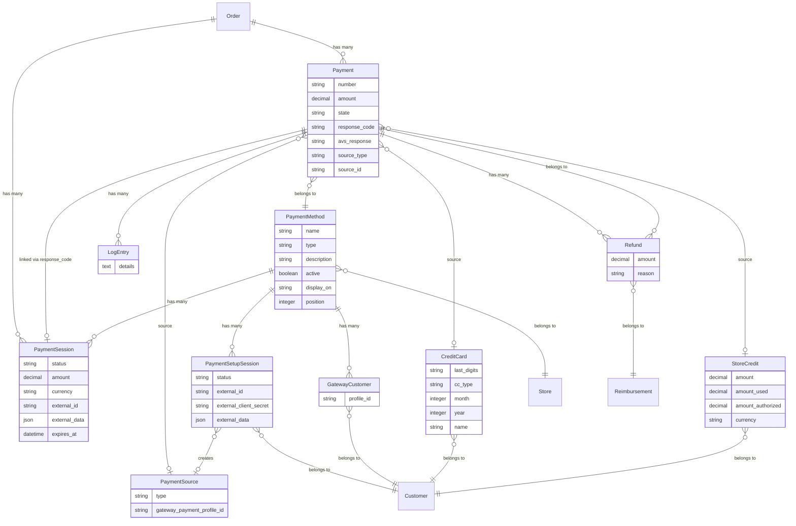

## Overview

Spree has a highly flexible payments model which allows multiple payment methods to be available during the checkout. The logic for processing payments is decoupled from orders, making it easy to define custom payment methods with their own processing logic.

Payment methods typically represent a payment gateway. Gateways will process card payments, online bank transfers, buy-now-pay-later, wallet payments, and other types of payments. Spree also comes with a Check option for offline processing.

The `Payment` model in Spree tracks payments against [Orders](orders). Payments relate to a `source` which indicates how the payment was made, and a `PaymentMethod`, indicating the processor used for this payment.

When a payment is created, it is given a unique, 8-character identifier. This is used when sending the payment details to the payment processor. Without this identifier, some payment gateways mistakenly reported duplicate payments.

### Payment Architecture Diagram



**Key relationships:**
- **Payment** tracks each payment attempt against an [Order](/developer/core-concepts/orders)
- **Payment Method** defines how payments are processed (Stripe, Adyen, PayPal, Check, etc.)
- **Payment Session** manages the gateway-side payment lifecycle (e.g., Stripe PaymentIntent, Adyen Session)
- **Payment Setup Session** manages saving payment methods for future use without an immediate charge (e.g., Stripe SetupIntent)
- **Source** is polymorphic - can be a Credit Card, Payment Source (for alternative methods like Klarna, iDEAL), or Store Credit
- **Gateway Customer** stores the provider-specific customer profile (e.g., Stripe Customer ID)
- **Log Entries** record gateway responses for debugging
- **Refunds** track money returned to customers

## Payment Methods

Payment methods represent the different options a customer has for making a payment. Most sites will accept credit card payments through a payment gateway, but there are other options. Spree also comes with built-in support for a Check payment, which can be used to represent any offline payment. Gateway providers such as Stripe, Adyen, and PayPal provide a wide range of payment methods, including credit cards, bank transfers, buy-now-pay-later, and digital wallets (Apple Pay, Google Pay, etc.).

A `PaymentMethod` can have the following attributes:

| Attribute    | Description                                                                                   | Example                |
|--------------|-----------------------------------------------------------------------------------------------|------------------------|
| `type`       | The subclass of `Spree::PaymentMethod` this payment method represents. Uses rails single table inheritance feature. | `Spree::PaymentMethod::Check` |
| `name`       | The visible name for this payment method                                                      | `Check`                |
| `description`| The description for this payment method                                                       | `Pay by check.`        |
| `active`     | Whether or not this payment method is active. Set it `false` to hide it in storefront.         | `true`                 |
| `display_on` | Determines where the payment method can be visible. Values can be `front` for storefront, `back` for admin panel only or `both` for both. | `both`                 |
| `position`   | The position of the payment method in lists. Lower numbers appear first.                      | `1`                    |

<Info>
Each payment method is associated to a Store, so you can decide which Payment Method will appear on which Store. This allows you to create different experiences for your customers in different countries.
</Info>

### Session-based vs Legacy Payment Methods

Payment methods indicate whether they use the modern session-based flow via the `session_required?` method:

| Method | Description | Default |
|--------|-------------|---------|
| `session_required?` | Returns `true` if this payment method requires a Payment Session for processing. | `false` |
| `setup_session_supported?` | Returns `true` if this payment method supports saving payment methods for future use (Payment Setup Sessions). | `false` |
| `payment_session_class` | Returns the STI subclass of `Spree::PaymentSession` for this gateway (e.g., `Spree::PaymentSessions::Stripe`). | `nil` |
| `payment_setup_session_class` | Returns the STI subclass of `Spree::PaymentSetupSession` for this gateway. | `nil` |

Modern gateways like Stripe and Adyen set `session_required?` to `true`. The Store API serializer includes this as the `session_required` field so your frontend knows which flow to use.

## Payment Flow

Modern payment gateways (Stripe, Adyen, PayPal) use a two-phase approach: first a **Payment Session** is created with the gateway, then after the customer completes payment on the frontend, Spree creates a **Payment** record to track the result. This ensures full PCI compliance, 3D Secure support, and compatibility with all payment method types.


<Steps>
  <Step title="Create Payment Session">
    The frontend calls the API to create a Payment Session for a specific payment method and order. Spree calls the gateway to create a provider-side session (e.g., Stripe PaymentIntent, Adyen Session) and returns the session data including a `client_secret` for the frontend SDK.
  </Step>
  <Step title="Customer pays on the frontend">
    The frontend uses the gateway's JavaScript SDK (e.g., Stripe.js, Adyen Drop-in) with the `client_secret` to securely collect payment details. Card data never touches your server - it goes directly to the payment provider, ensuring **PCI compliance**. If the payment requires **3D Secure** authentication, the gateway SDK automatically presents the challenge.
  </Step>
  <Step title="Payment is created and order is completed">
    After the customer completes payment, the session is completed either via a webhook from the provider or by the frontend calling the complete endpoint. Spree creates a `Payment` record (in `completed` or `pending` state depending on auto-capture settings), creates the appropriate payment source (Credit Card, Klarna, etc.), and completes the order.
  </Step>
</Steps>

### Payment Session

A `PaymentSession` (`Spree::PaymentSession`) represents a server-side session with the payment gateway. It is the entry point for every payment attempt and holds the provider-specific data needed by the frontend SDK.

#### Attributes

| Attribute | Description | Example Value |
|-----------|-------------|---------------|
| `status` | Current session state: `pending`, `processing`, `completed`, `failed`, `canceled`, `expired` | `completed` |
| `amount` | The payment amount | `99.99` |
| `currency` | ISO currency code | `USD` |
| `external_id` | The provider-side session ID (e.g., Stripe PaymentIntent ID) | `pi_3ABC123` |
| `external_data` | Provider-specific data including `client_secret` for frontend SDK | `{"client_secret": "pi_3ABC_secret_xyz"}` |
| `customer_external_id` | The provider's customer ID | `cus_ABC123` |
| `expires_at` | When the session expires | `2025-01-01T12:00:00Z` |

#### States


#### API

**Create a Payment Session:**

```typescript
const options = { orderToken: cart.token }

// Create a payment session for the selected payment method
const session = await client.store.orders.paymentSessions.create(cart.id, {
  payment_method_id: 'pm_xyz789',
  amount: '99.99',             // Optional, defaults to order total
  external_data: {},           // Optional, provider-specific data
}, options)

// The session contains provider-specific data for the frontend SDK
console.log(session.external_id)              // e.g. 'pi_3ABC123' (Stripe PaymentIntent ID)
console.log(session.external_data.client_secret) // Use with Stripe.js or Adyen Drop-in
```

**Response shape (`StorePaymentSession`):**

```json
{
  "id": "ps_abc123",
  "status": "pending",
  "amount": "99.99",
  "currency": "USD",
  "external_id": "pi_3ABC123",
  "external_data": {
    "client_secret": "pi_3ABC123_secret_xyz"
  },
  "customer_external_id": "cus_ABC123",
  "expires_at": "2025-01-01T12:00:00Z",
  "payment_method_id": "pm_xyz789",
  "order_id": "or_ABC123",
  "payment": null
}
```

**Update a Payment Session** (e.g., after order total changes):

```typescript
const updated = await client.store.orders.paymentSessions.update(
  cart.id, session.id,
  { amount: '149.99' },
  options
)
```

**Complete a Payment Session** (after customer confirms payment on the frontend):

```typescript
const completed = await client.store.orders.paymentSessions.complete(
  cart.id, session.id,
  { session_result: '...', external_data: {} },
  options
)
console.log(completed.status) // 'completed'
```

### Payment

Once a Payment Session is completed, Spree creates a `Payment` record (`Spree::Payment`) to track the result. The Payment is linked to the session via `response_code` matching the session's `external_id`.

#### Attributes

| Attribute         | Description                                                                 | Example Value       |
|-------------------|-----------------------------------------------------------------------------|---------------------|
| `number`          | A unique identifier for the payment.                                        | `P123456789`        |
| `source_type`     | The type of source used for the payment.                                    | `Spree::CreditCard` |
| `source_id`       | The ID of the source used for the payment.                                  | `1`                 |
| `amount`          | The amount of the payment.                                                  | `99.99`             |
| `payment_method_id`| The ID of the payment method used.                                          | `2`                 |
| `state`           | The current state of the payment (e.g., processing, completed, failed).     | `completed`         |
| `response_code`   | The gateway transaction ID. Links to the Payment Session's `external_id`.   | `pi_3ABC123`        |
| `avs_response`    | The address verification system response code.                              | `D`                 |

#### Payment States

After a Payment Session completes, the resulting Payment transitions through these states:


| State | Description |
|-------|-------------|
| `checkout` | Initial state. The payment has been created but not yet processed. |
| `processing` | The payment is being processed (temporary - prevents double submission). |
| `pending` | The payment has been authorized but not yet captured. Awaiting manual or scheduled capture. |
| `failed` | The payment was rejected (e.g., card declined, insufficient funds). |
| `void` | The payment has been voided and should not be counted against the order. |
| `completed` | The payment has been captured. Only payments in this state count against the order total. |

With **auto-capture** enabled (default for most gateways), the Payment goes directly from `checkout` → `processing` → `completed`. With **manual capture**, it stops at `pending` until an admin captures it.

#### Order Payment States

Each payment update also recalculates the order's `payment_state`:

| Payment State | Description |
|---------------|-------------|
| `balance_due` | Payment is required for this order |
| `failed` | The last payment for the order failed |
| `credit_owed` | This order has been paid for in excess of its total |
| `paid` | This order has been paid for in full |

<Warning>
You may want to keep tabs on the number of orders with a `payment_state` of `failed`. A sudden increase could indicate a problem with your payment gateway and most likely a serious problem affecting customer satisfaction. Check the latest `log_entries` for the most recent payments if this is happening.
</Warning>

### Legacy Processing

For payment methods that don't use sessions (e.g., `Spree::PaymentMethod::Check`), Spree uses a direct authorize/capture flow without a Payment Session:

When an order is completed, each `Payment` object has the `process!` method called on it unless `payment_required?` for the order returns `false`.

If the `PaymentMethod` is configured to auto-capture, `Payment#purchase!` is called:

```ruby
payment_method.purchase(<amount>, <source>, <gateway options>)
```

If not, `Payment#authorize!` is called instead:

```ruby
payment_method.authorize(<amount>, <source>, <gateway options>)
```

If `purchase!` succeeds, the payment is marked `completed`. If `authorize!` succeeds, the payment transitions to `pending` for manual capture later via `capture!`. Either method marks the payment as `failed` if unsuccessful.

### Log Entries

Responses from payment gateways are stored as log entries for debugging purposes:

```ruby
payment.log_entries
payment.log_entries.first.details
```

## Payment Sources

Payment sources represent the actual instrument used for a payment. They are created automatically when a Payment Session completes.

### Credit Cards (`Spree::CreditCard`)

Stores non-sensitive credit card information. With modern gateways, the actual card data is tokenized by the provider - Spree only stores reference IDs and display information.

| Attribute           | Description                                                                                   | Example Value          |
|---------------------|-----------------------------------------------------------------------------------------------|------------------------|
| `month`             | The month the credit card expires.                                                           | `6`                    |
| `year`              | The year the credit card expires.                                                            | `2026`                 |
| `cc_type`           | The type of credit card (e.g., visa, mastercard).                                            | `visa`                 |
| `last_digits`       | The last four digits of the credit card number.                                              | `1234`                 |
| `name`              | The name of the credit card holder.                                                          | `John Doe`           |
| `gateway_payment_profile_id`  | The payment token from the gateway (e.g., Stripe `pm_xxx`, Adyen `storedPaymentMethodId`).  | `pm_1ABC123`           |

<Note>
Spree never stores full credit card numbers. With modern gateways, card data is collected entirely by the gateway's frontend SDK (e.g., Stripe.js, Adyen Drop-in) and never touches your server. Spree only stores the tokenized reference (`gateway_payment_profile_id`) returned by the provider.
</Note>

### Payment Sources (`Spree::PaymentSource`)

A generic payment source model for non-card payment methods such as digital wallets, bank transfers, and buy-now-pay-later services. Gateway extensions create STI subclasses for each payment method type:

```ruby
# Examples of payment source subclasses created by gateway gems:
SpreeStripe::PaymentSources::Klarna    # Klarna BNPL
SpreeStripe::PaymentSources::AfterPay  # Afterpay/Clearpay
SpreeStripe::PaymentSources::Ideal     # iDEAL bank transfer
SpreeStripe::PaymentSources::Link      # Stripe Link wallet
SpreeAdyen::PaymentSources::ApplePay   # Apple Pay
SpreeAdyen::PaymentSources::Paypal     # PayPal via Adyen
```

### Gateway Customers (`Spree::GatewayCustomer`)

Maps a Spree customer to their provider-specific customer profile. This enables features like saved payment methods, recurring billing, and customer-level fraud detection.

| Attribute | Description | Example Value |
|-----------|-------------|---------------|
| `profile_id` | The provider's customer ID (encrypted at rest) | `cus_ABC123` |
| `payment_method_id` | The gateway this customer belongs to | `1` |
| `user_id` | The Spree user | `42` |

Each customer has at most one `GatewayCustomer` record per payment method. The `profile_id` is encrypted using Active Record Encryption when available.

## Payment Setup Sessions

Payment Setup Sessions (`Spree::PaymentSetupSession`) allow customers to save payment methods for future use **without making an immediate payment**. This maps to concepts like Stripe's SetupIntent - a secure way to collect and tokenize payment details for later charges.

### Use Cases

- Saving a credit card to the customer's account for faster future checkouts
- Authorizing a payment method for subscription billing
- Adding a payment method during account onboarding (before any purchase)

### How Payment Setup Sessions Work


### Payment Setup Session Attributes

| Attribute | Description | Example Value |
|-----------|-------------|---------------|
| `status` | Current session state: `pending`, `processing`, `completed`, `failed`, `canceled`, `expired` | `completed` |
| `external_id` | The provider-side session ID (e.g., Stripe SetupIntent ID) | `seti_ABC123` |
| `external_client_secret` | Client secret for the frontend SDK | `seti_ABC123_secret_xyz` |
| `external_data` | Provider-specific data | `{}` |
| `payment_source_id` | The saved payment source created after completion | `ps_xyz789` |
| `payment_source_type` | The type of saved payment source | `Spree::CreditCard` |

### Payment Setup Session API

<Note>
Payment Setup Sessions require customer authentication. The customer must be logged in.
</Note>

**Create a Payment Setup Session:**

```typescript
const options = { token: jwtToken }

// Create a setup session for saving a payment method
const setupSession = await client.store.customer.paymentSetupSessions.create({
  payment_method_id: 'pm_xyz789',
  external_data: {},
}, options)

// Use the client secret with the gateway's frontend SDK
console.log(setupSession.external_client_secret) // e.g. 'seti_ABC123_secret_xyz'
```

**Response shape (`StorePaymentSetupSession`):**

```json
{
  "id": "pss_abc123",
  "status": "pending",
  "external_id": "seti_ABC123",
  "external_client_secret": "seti_ABC123_secret_xyz",
  "external_data": {},
  "payment_method_id": "pm_xyz789",
  "payment_source_id": null,
  "payment_source_type": null,
  "customer_id": "usr_def456"
}
```

**Get a Payment Setup Session:**

```typescript
const session = await client.store.customer.paymentSetupSessions.get('pss_abc123', options)
```

**Complete a Payment Setup Session** (after the customer completes setup on the frontend using the gateway SDK and `external_client_secret`):

```typescript
const completed = await client.store.customer.paymentSetupSessions.complete(
  'pss_abc123',
  { external_data: {} },
  options
)
console.log(completed.status)             // 'completed'
console.log(completed.payment_source_id)  // e.g. 'ps_xyz789' - the saved payment method
```

Spree will verify the result with the provider and create a saved payment source (e.g., `Spree::CreditCard`) that can be used for future payments.

## Supported Gateways

Spree team maintains several payment gateway integrations. All of these gateways are **fully PCI compliant**, using native gateway SDKs, meaning no sensitive payment data is stored or processed through Spree.

<Card title="Stripe" href="/integrations/payments/stripe" icon="link">
  Stripe integration, supports all Stripe payment methods, including credit cards, bank transfers, Apple Pay, Google Pay, Klarna, Afterpay, and more. Also supports quick checkout.
</Card>

<Card title="Adyen" href="/integrations/payments/adyen" icon="link">
  Adyen integration, supports all Adyen payment methods, including credit cards, bank transfers, Apple Pay, Google Pay, Klarna, and more.
</Card>

<Card title="PayPal" href="/integrations/payments/paypal" icon="link">
  Native PayPal integration, supports PayPal, PayPal Credit, and PayPal Pay Later.
</Card>

## Payment Events

Spree publishes events throughout the payment lifecycle that you can subscribe to:

### Payment Events
| Event | Description |
|-------|-------------|
| `payment.paid` | Payment was completed |
| `order.paid` | Order is fully paid |

### Payment Session Events
| Event | Description |
|-------|-------------|
| `payment_session.processing` | Session is being processed |
| `payment_session.completed` | Session completed successfully |
| `payment_session.failed` | Session processing failed |
| `payment_session.canceled` | Session was canceled |
| `payment_session.expired` | Session expired |

### Payment Setup Session Events
| Event | Description |
|-------|-------------|
| `payment_setup_session.completed` | Setup completed, payment source saved |
| `payment_setup_session.failed` | Setup failed |
| `payment_setup_session.canceled` | Setup was canceled |

See [Events](/developer/core-concepts/events) for more details on subscribing to events.

## Related Documentation

- [Build a Custom Payment Method](/developer/how-to/custom-payment-method) - Step-by-step guide to creating your own payment gateway integration
- [Orders](/developer/core-concepts/orders) - Order management and state machine
- [Checkout Customization](/developer/customization/checkout) - Customizing the checkout flow
- [Events](/developer/core-concepts/events) - Subscribe to payment events
