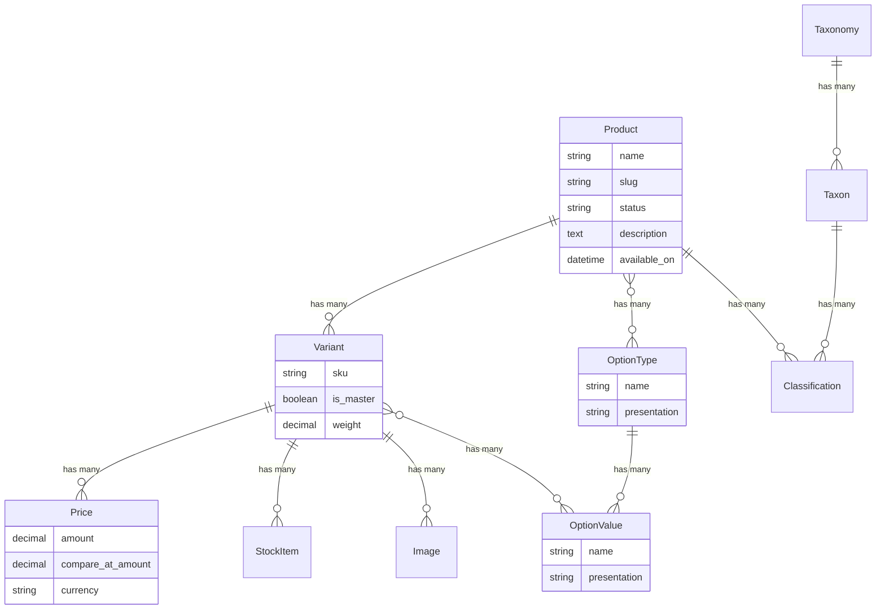

import { Since } from '/snippets/since.mdx';

## Overview

A product represents something you sell. Each product has one or more **variants** — the actual purchasable items with their own SKU, price, and inventory. For example, a "T-Shirt" product might have variants for each size and color combination.

Products are organized into **categories** — a flexible hierarchy for grouping products. Categories can be filtered, sorted, and searched via the Store API.

<Info>
Product names, descriptions, slugs, and SEO fields are [translatable](/developer/core-concepts/translations#resource-translations).
</Info>


```mermaid
erDiagram
    Product ||--o{ Variant : "has many"
    Product }o--o{ OptionType : "has many"
    Product ||--o{ Classification : "has many"
    Variant ||--o{ Price : "has many"
    Variant ||--o{ StockItem : "has many"
    Variant ||--o{ Image : "has many"
    Variant }o--o{ OptionValue : "has many"
    OptionType ||--o{ OptionValue : "has many"
    Taxon ||--o{ Classification : "has many"
    Taxonomy ||--o{ Taxon : "has many"

    Product {
        string name
        string slug
        string status
        text description
        datetime available_on
    }

    Variant {
        string sku
        boolean is_master
        decimal weight
    }

    Price {
        decimal amount
        decimal compare_at_amount
        string currency
    }

    OptionType {
        string name
        string presentation
    }

    OptionValue {
        string name
        string presentation
    }
```

## Product Attributes

| Attribute | Description | Translatable |
|-----------|-------------|:---:|
| `name` | Product name | Yes |
| `description` | Full product description | Yes |
| `slug` | URL-friendly identifier (e.g., `spree-tote`) | Yes |
| `status` | `draft`, `active`, or `archived` | No |
| `available_on` | Date the product becomes available for sale | No |
| `discontinue_on` | Date the product is no longer available | No |
| `meta_title` | Custom SEO title | Yes |
| `meta_description` | SEO description | Yes |
| `meta_keywords` | SEO keywords | Yes |
| `purchasable` | Whether the product can be added to cart | No |
| `in_stock` | Whether any variant has stock available | No |
| `price` | Default variant's price in the current currency | No |
| `thumbnail_url` | URL to the product's first image — always returned, no expand needed | No |
| `tags` | Array of tag strings for filtering | No |

## Listing Products

<CodeGroup>

```typescript SDK
// List products with pagination
const { data: products, meta } = await client.products.list({
  limit: 12,
  page: 1,
})

// Filter by price range and availability
const filtered = await client.products.list({
  price_gte: 10,
  price_lte: 50,
  in_stock: true,
})

// Search by keyword
const results = await client.products.list({
  search: 'tote bag',
})

// Sort products
const sorted = await client.products.list({
  sort: 'price_high_to_low',  // or: price_low_to_high, newest, name_a_z, name_z_a
})
```

```bash cURL
# List products
curl 'https://api.mystore.com/api/v3/store/products?limit=12&page=1' \
  -H 'X-Spree-API-Key: pk_xxx'

# Filter by price and stock
curl 'https://api.mystore.com/api/v3/store/products?q[price_gte]=10&q[price_lte]=50&q[in_stock]=true' \
  -H 'X-Spree-API-Key: pk_xxx'

# Search
curl 'https://api.mystore.com/api/v3/store/products?q[search]=tote+bag' \
  -H 'X-Spree-API-Key: pk_xxx'
```

</CodeGroup>

See [Querying](/api-reference/store-api/querying) for the full list of filtering, sorting, and pagination options.

## Getting a Product

<CodeGroup>

```typescript SDK
// Get by slug
const product = await client.products.get('spree-tote')

// Get with included relations
const detailed = await client.products.get('spree-tote', {
  expand: ['variants', 'media', 'option_types', 'categories'],
})
// detailed.variants => [{ id: "var_xxx", sku: "TOTE-S-R", price: { amount: "15.99", currency: "USD" }, ... }]
// detailed.media => [{ id: "img_xxx", url: "https://cdn...", position: 1 }]
// detailed.option_types => [{ name: "size", presentation: "Size", option_values: [...] }]
```

```bash cURL
curl 'https://api.mystore.com/api/v3/store/products/spree-tote?expand=variants,media,option_types,categories' \
  -H 'X-Spree-API-Key: pk_xxx'
```

</CodeGroup>

## Product Filters

Get available filter options for building a faceted search UI. Returns price ranges, option values, and categories with counts:

<CodeGroup>

```typescript SDK
const filters = await client.products.filters()
// {
//   option_types: [{ name: "size", option_values: [{ name: "Small", count: 12 }, ...] }],
//   price_range: { min: 9.99, max: 199.99 },
//   categories: [{ id: "ctg_xxx", name: "Clothing", count: 45 }],
// }

// Scoped to a specific category
const categoryFilters = await client.products.filters({
  category_id: 'ctg_xxx',
})
```

```bash cURL
curl 'https://api.mystore.com/api/v3/store/products/filters' \
  -H 'X-Spree-API-Key: pk_xxx'

# Scoped to a category
curl 'https://api.mystore.com/api/v3/store/products/filters?category_id=ctg_xxx' \
  -H 'X-Spree-API-Key: pk_xxx'
```

</CodeGroup>

## Variants

Variants are the purchasable units of a product. Each variant has its own SKU, price, inventory, and images, and is defined by a unique combination of option values.

| Attribute | Description |
|-----------|-------------|
| `sku` | Unique stock keeping unit |
| `barcode` | Barcode (UPC, EAN, etc.) |
| `price` | Price in the current currency |
| `original_price` | Compare-at price for showing discounts |
| `weight`, `height`, `width`, `depth` | Dimensions for shipping calculations |
| `in_stock` | Whether stock is available |
| `backorderable` | Whether the variant can be ordered when out of stock |
| `option_values` | The option values that define this variant (e.g., Size: Small, Color: Red) |

### Master Variant

Every product has a **master variant** that holds default pricing and inventory. If a product has no option types (e.g., a book with no size/color), the master variant is the only purchasable variant.

### Regular Variants

When a product has option types, each unique combination of option values creates a variant. For example, a T-shirt with sizes (S, M, L) and colors (Red, Green) has 6 variants:

| SKU | Size | Color |
|-----|------|-------|
| `TEE-S-R` | Small | Red |
| `TEE-S-G` | Small | Green |
| `TEE-M-R` | Medium | Red |
| `TEE-M-G` | Medium | Green |
| `TEE-L-R` | Large | Red |
| `TEE-L-G` | Large | Green |

The product's `default_variant_id` points to the first non-master variant (or the master variant if none exist).

## Option Types and Option Values

Option types define the axes of variation for a product (e.g., Size, Color, Material). Option values are the specific choices within each type (e.g., Small, Medium, Large).

A product must have at least one option type to have multiple variants. Option types and their values are included in the product response when requested:

<CodeGroup>

```typescript SDK
const product = await client.products.get('spree-tee', {
  expand: ['option_types'],
})

product.option_types?.forEach(optionType => {
  console.log(optionType.presentation) // "Size"
  optionType.option_values.forEach(value => {
    console.log(value.presentation)    // "Small", "Medium", "Large"
  })
})
```

```bash cURL
curl 'https://api.mystore.com/api/v3/store/products/spree-tee?expand=option_types' \
  -H 'X-Spree-API-Key: pk_xxx'
```

</CodeGroup>

<Info>
Option type `name` and `presentation` fields are translatable.
</Info>

## Media

Media can be attached to the product (via the master variant) or to individual variants. When displaying a product, show the images for the selected variant, falling back to the product-level images.

### Thumbnails

Every product response includes a `thumbnail_url` field — the URL to the first image, ready to use without any expands. Similarly, each variant includes a `thumbnail_url` URL and an `media_count` counter.

Use these fields for product listing pages to avoid loading all images:

<CodeGroup>

```typescript SDK
// List products — thumbnail_url is always included
const { data: products } = await client.products.list({ limit: 12 })

products.forEach(product => {
  product.thumbnail_url // "https://cdn.../tote-front.jpg" — no expand needed
})
```

```bash cURL
# thumbnail_url is always in the response — no ?expand needed
curl 'https://api.mystore.com/api/v3/store/products?limit=12' \
  -H 'X-Spree-API-Key: pk_xxx'
```

</CodeGroup>

<Warning>
Avoid using `?expand=media` on listing pages. This loads **all** images for every product in the response, which is unnecessary when you only need a thumbnail. Use `thumbnail_url` instead and only expand full media on the product detail page.
</Warning>

### All Images

On the product detail page, expand `media` and `variants` to get the full set of images. Images are ordered by `position`:

<CodeGroup>

```typescript SDK
const product = await client.products.get('spree-tote', {
  expand: ['media', 'variants'],
})

// Product-level images (from master variant)
product.media // [{ url: "https://cdn.../tote-front.jpg", position: 1 }, ...]

// Each variant has its own thumbnail and media_count
product.variants?.forEach(variant => {
  variant.thumbnail    // "https://cdn.../tote-red.jpg" — always available
  variant.media_count  // 3 — quick check without loading media
  variant.media        // full image array (only when ?expand=media)
})
```

```bash cURL
curl 'https://api.mystore.com/api/v3/store/products/spree-tote?expand=media,variants' \
  -H 'X-Spree-API-Key: pk_xxx'
```

</CodeGroup>

| Field | Available on | Always returned | Description |
|-------|-------------|:---:|-------------|
| `thumbnail_url` | Product | Yes | URL to the product's first media |
| `thumbnail_url` | Variant | Yes | URL to the variant's first media |
| `media_count` | Variant | Yes | Number of media |
| `media` | Product, Variant | No | Full image array (requires `?expand=media`) |

## Prices

Each variant can have multiple prices — one per currency, plus additional prices from [Price Lists](/developer/core-concepts/pricing) that apply conditionally based on market, geography, customer segment, or quantity.

The API automatically returns the correct price based on the current currency and market context:

| Field | Description |
|-------|-------------|
| `price` | Current selling price |
| `original_price` | Compare-at price (for showing strikethrough discounts) |

See the [Pricing](/developer/core-concepts/pricing) guide for details on Price Lists, Price Rules, and market-specific pricing.

## Categories

Categories provide a flexible way to organize products into hierarchical trees. Internally, Spree uses Taxonomies (category trees) and Taxons (nodes within those trees), but the Store API exposes them simply as **Categories**.

For example:
- **Categories** → Clothing → T-Shirts, Dresses
- **Brands** → Nike, Adidas, Puma
- **Collections** → Summer 2025, Best Sellers

Products can belong to multiple categories.

<CodeGroup>

```typescript SDK
// List categories
const { data: categories } = await client.categories.list()

// Get a category by permalink
const category = await client.categories.get('clothing/shirts')

// List products in a category
const { data: products } = await client.categories.products.list('clothing/shirts', {
  limit: 12,
})
```

```bash cURL
# List categories
curl 'https://api.mystore.com/api/v3/store/categories' \
  -H 'X-Spree-API-Key: pk_xxx'

# Get a category by permalink
curl 'https://api.mystore.com/api/v3/store/categories/clothing/shirts' \
  -H 'X-Spree-API-Key: pk_xxx'

# List products in a category
curl 'https://api.mystore.com/api/v3/store/categories/clothing/shirts/products?limit=12' \
  -H 'X-Spree-API-Key: pk_xxx'
```

</CodeGroup>

<Info>
Category `name` and `description` fields are translatable.
</Info>

## Publications and Sales Channels <Since version="5.5" />

A product is visible on a [Channel](/developer/core-concepts/channels) only when a `ProductPublication` record joins the two. Publications carry an optional time window so a product can be scheduled to go live and come down without code or manual toggles.

| Publication state | What customers see |
|---|---|
| No publication exists | Product is not on this channel — invisible |
| Publication has no dates set | Live now and indefinitely |
| `published_at` is in the future | Scheduled — not yet visible |
| `unpublished_at` is in the past | Hidden — was visible, now sunset |
| Within the window | Live |

Product `status` (`draft` / `active` / `archived`) is the **outer gate**: a Draft or Archived product is hidden on every channel regardless of its publication window. Only `active` products consult publication state.

### Reading publications

Publications appear in the API under `product_publications` when expanded; the same data is available through the `channels` association as a flat list of joined channels.

<CodeGroup>

```typescript SDK
const product = await adminClient.products.get('prod_abc', {
  expand: ['product_publications', 'channels'],
})
```

```bash cURL
curl 'https://api.mystore.com/api/v3/admin/products/prod_abc?expand=product_publications,channels' \
  -H 'X-Spree-API-Key: sk_xxx'
```

</CodeGroup>

```json Response
{
  "data": {
    "id": "prod_abc",
    "status": "active",
    "channels": [
      { "id": "ch_online", "code": "online", "name": "Online Store" }
    ],
    "product_publications": [
      {
        "id": "pp_xyz",
        "channel_id": "ch_online",
        "published_at": "2026-07-01T00:00:00Z",
        "unpublished_at": null
      }
    ]
  }
}
```

### Writing publications

Two write surfaces serve different shapes:

- **Per-product, full-set** — `PATCH /api/v3/admin/products/{id}` with a `product_publications` array. The array represents the complete desired state; channels absent from the payload are detached.

  <CodeGroup>

  ```typescript SDK
  await adminClient.products.update('prod_abc', {
    product_publications: [
      { channel_id: 'ch_online' },
      { channel_id: 'ch_pos', published_at: '2026-07-01T00:00:00Z' },
    ],
  })
  ```

  ```bash cURL
  curl -X PATCH 'https://api.mystore.com/api/v3/admin/products/prod_abc' \
    -H 'X-Spree-API-Key: sk_xxx' \
    -H 'Content-Type: application/json' \
    -d '{
      "product_publications": [
        { "channel_id": "ch_online" },
        { "channel_id": "ch_pos", "published_at": "2026-07-01T00:00:00Z" }
      ]
    }'
  ```

  </CodeGroup>

- **Per-channel, bulk** — `POST /api/v3/admin/channels/{id}/add_products` and `POST /api/v3/admin/channels/{id}/remove_products` for publishing or unpublishing many products at once. Idempotent: re-publishing an already-published product is a no-op for its window unless `published_at` / `unpublished_at` are explicitly passed.

  <CodeGroup>

  ```typescript SDK
  await adminClient.channels.addProducts('ch_online', {
    product_ids: ['prod_abc', 'prod_def'],
    published_at: '2026-07-01T00:00:00Z',
  })

  await adminClient.channels.removeProducts('ch_online', {
    product_ids: ['prod_abc'],
  })
  ```

  ```bash cURL
  curl -X POST 'https://api.mystore.com/api/v3/admin/channels/ch_online/add_products' \
    -H 'X-Spree-API-Key: sk_xxx' \
    -H 'Content-Type: application/json' \
    -d '{
      "product_ids": ["prod_abc", "prod_def"],
      "published_at": "2026-07-01T00:00:00Z"
    }'

  curl -X POST 'https://api.mystore.com/api/v3/admin/channels/ch_online/remove_products' \
    -H 'X-Spree-API-Key: sk_xxx' \
    -H 'Content-Type: application/json' \
    -d '{ "product_ids": ["prod_abc"] }'
  ```

  </CodeGroup>

The two surfaces converge on the same `spree_product_publications` table — pick whichever matches your call site.

### Listing products on a specific channel

Storefronts and `client.products.list()` calls return only products published on the resolved channel (live within the publication window, with the product itself `active`). To scope a Store SDK request to a non-default channel — e.g. a POS app querying for the POS catalog — set the channel `code` on the client or per-request:

<CodeGroup>

```typescript SDK
// Client-level default
const client = createClient({ baseUrl, publishableKey, channel: 'pos' })

// Per-request override
const posProducts = await client.products.list({}, { channel: 'pos' })
```

```bash cURL
curl 'https://api.mystore.com/api/v3/store/products' \
  -H 'X-Spree-API-Key: pk_xxx' \
  -H 'X-Spree-Channel: pos'
```

</CodeGroup>

For Admin API filtering across channels (back-office reports, admin UI lists), use Ransack instead: `q[channels_id_in][]=ch_xxx`. See [Sales Channels](/developer/core-concepts/channels) for the resolution rules.

### Auto-publish on the default channel

When a product is created via the dashboard, it is auto-published on the store's default channel (the only channel where `default = true`). The Admin API does **not** auto-publish — supply `product_publications: [{ channel_id }]` on create or call `add_products` afterwards.

See [Sales Channels](/developer/core-concepts/channels) for the full channel lifecycle, including default-channel resolution and the `X-Spree-Channel` header.

## Related Documentation

- [Sales Channels](/developer/core-concepts/channels) — Channels, publications, and order attribution
- [Pricing](/developer/core-concepts/pricing) — Price Lists, Price Rules, and market-specific pricing
- [Inventory](/developer/core-concepts/inventory) — Stock management and backorders
- [Media](/developer/core-concepts/media) — Image management
- [Translations](/developer/core-concepts/translations) — Translating product content
- [Search & Filtering](/developer/core-concepts/search-filtering) — Full-text search and Ransack filtering
- [Querying](/api-reference/store-api/querying) — API filtering, sorting, and pagination
