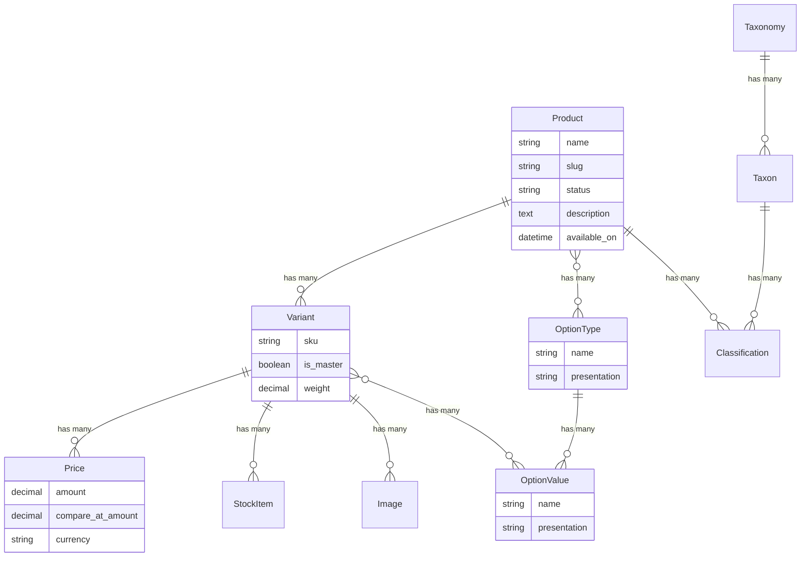

## Overview

A product represents something you sell. Each product has one or more **variants** — the actual purchasable items with their own SKU, price, and inventory. For example, a "T-Shirt" product might have variants for each size and color combination.

Products are organized into categories using **taxonomies** and **taxons**, and can be filtered, sorted, and searched via the Store API.

<Info>
Product names, descriptions, slugs, and SEO fields are [translatable](/developer/core-concepts/translations#resource-translations).
</Info>


```mermaid
erDiagram
    Product ||--o{ Variant : "has many"
    Product }o--o{ OptionType : "has many"
    Product ||--o{ Classification : "has many"
    Variant ||--o{ Price : "has many"
    Variant ||--o{ StockItem : "has many"
    Variant ||--o{ Image : "has many"
    Variant }o--o{ OptionValue : "has many"
    OptionType ||--o{ OptionValue : "has many"
    Taxon ||--o{ Classification : "has many"
    Taxonomy ||--o{ Taxon : "has many"

    Product {
        string name
        string slug
        string status
        text description
        datetime available_on
    }

    Variant {
        string sku
        boolean is_master
        decimal weight
    }

    Price {
        decimal amount
        decimal compare_at_amount
        string currency
    }

    OptionType {
        string name
        string presentation
    }

    OptionValue {
        string name
        string presentation
    }
```

## Product Attributes

| Attribute | Description | Translatable |
|-----------|-------------|:---:|
| `name` | Product name | Yes |
| `description` | Full product description | Yes |
| `slug` | URL-friendly identifier (e.g., `spree-tote`) | Yes |
| `status` | `draft`, `active`, or `archived` | No |
| `available_on` | Date the product becomes available for sale | No |
| `discontinue_on` | Date the product is no longer available | No |
| `meta_title` | Custom SEO title | Yes |
| `meta_description` | SEO description | Yes |
| `meta_keywords` | SEO keywords | Yes |
| `purchasable` | Whether the product can be added to cart | No |
| `in_stock` | Whether any variant has stock available | No |
| `price` | Default variant's price in the current currency | No |
| `thumbnail_url` | URL to the product's first image — always returned, no includes needed | No |
| `tags` | Array of tag strings for filtering | No |

## Listing Products

<CodeGroup>

```typescript SDK
// List products with pagination
const { data: products, meta } = await client.store.products.list({
  per_page: 12,
  page: 1,
})

// Filter by price range and availability
const filtered = await client.store.products.list({
  price_gte: 10,
  price_lte: 50,
  in_stock: true,
})

// Search by keyword
const results = await client.store.products.list({
  multi_search: 'tote bag',
})

// Sort products
const sorted = await client.store.products.list({
  sort: 'price_high_to_low',  // or: price_low_to_high, newest, name_a_z, name_z_a
})
```

```bash cURL
# List products
curl 'https://api.mystore.com/api/v3/store/products?per_page=12&page=1' \
  -H 'Authorization: Bearer spree_pk_xxx'

# Filter by price and stock
curl 'https://api.mystore.com/api/v3/store/products?q[price_gte]=10&q[price_lte]=50&q[in_stock]=true' \
  -H 'Authorization: Bearer spree_pk_xxx'

# Search
curl 'https://api.mystore.com/api/v3/store/products?q[multi_search]=tote+bag' \
  -H 'Authorization: Bearer spree_pk_xxx'
```

</CodeGroup>

See [Querying](/api-reference/store-api/querying) for the full list of filtering, sorting, and pagination options.

## Getting a Product

<CodeGroup>

```typescript SDK
// Get by slug
const product = await client.store.products.get('spree-tote')

// Get with included relations
const detailed = await client.store.products.get('spree-tote', {
  includes: 'variants,images,option_types,taxons',
})
// detailed.variants => [{ id: "var_xxx", sku: "TOTE-S-R", price: { amount: "15.99", currency: "USD" }, ... }]
// detailed.images => [{ id: "img_xxx", url: "https://cdn...", position: 1 }]
// detailed.option_types => [{ name: "size", presentation: "Size", option_values: [...] }]
```

```bash cURL
curl 'https://api.mystore.com/api/v3/store/products/spree-tote?includes=variants,images,option_types,taxons' \
  -H 'Authorization: Bearer spree_pk_xxx'
```

</CodeGroup>

## Product Filters

Get available filter options for building a faceted search UI. Returns price ranges, option values, and taxons with counts:

<CodeGroup>

```typescript SDK
const filters = await client.store.products.filters()
// {
//   option_types: [{ name: "size", option_values: [{ name: "Small", count: 12 }, ...] }],
//   price_range: { min: 9.99, max: 199.99 },
//   taxons: [{ id: "txn_xxx", name: "Clothing", count: 45 }],
// }

// Scoped to a specific taxon
const taxonFilters = await client.store.products.filters({
  taxon_id_eq: 'txn_xxx',
})
```

```bash cURL
curl 'https://api.mystore.com/api/v3/store/products/filters' \
  -H 'Authorization: Bearer spree_pk_xxx'

# Scoped to a taxon
curl 'https://api.mystore.com/api/v3/store/products/filters?taxon_id_eq=txn_xxx' \
  -H 'Authorization: Bearer spree_pk_xxx'
```

</CodeGroup>

## Variants

Variants are the purchasable units of a product. Each variant has its own SKU, price, inventory, and images, and is defined by a unique combination of option values.

| Attribute | Description |
|-----------|-------------|
| `sku` | Unique stock keeping unit |
| `barcode` | Barcode (UPC, EAN, etc.) |
| `price` | Price in the current currency |
| `original_price` | Compare-at price for showing discounts |
| `weight`, `height`, `width`, `depth` | Dimensions for shipping calculations |
| `in_stock` | Whether stock is available |
| `backorderable` | Whether the variant can be ordered when out of stock |
| `option_values` | The option values that define this variant (e.g., Size: Small, Color: Red) |

### Master Variant

Every product has a **master variant** that holds default pricing and inventory. If a product has no option types (e.g., a book with no size/color), the master variant is the only purchasable variant.

### Regular Variants

When a product has option types, each unique combination of option values creates a variant. For example, a T-shirt with sizes (S, M, L) and colors (Red, Green) has 6 variants:

| SKU | Size | Color |
|-----|------|-------|
| `TEE-S-R` | Small | Red |
| `TEE-S-G` | Small | Green |
| `TEE-M-R` | Medium | Red |
| `TEE-M-G` | Medium | Green |
| `TEE-L-R` | Large | Red |
| `TEE-L-G` | Large | Green |

The product's `default_variant_id` points to the first non-master variant (or the master variant if none exist).

## Option Types and Option Values

Option types define the axes of variation for a product (e.g., Size, Color, Material). Option values are the specific choices within each type (e.g., Small, Medium, Large).

A product must have at least one option type to have multiple variants. Option types and their values are included in the product response when requested:

<CodeGroup>

```typescript SDK
const product = await client.store.products.get('spree-tee', {
  includes: 'option_types',
})

product.option_types?.forEach(optionType => {
  console.log(optionType.presentation) // "Size"
  optionType.option_values.forEach(value => {
    console.log(value.presentation)    // "Small", "Medium", "Large"
  })
})
```

```bash cURL
curl 'https://api.mystore.com/api/v3/store/products/spree-tee?includes=option_types' \
  -H 'Authorization: Bearer spree_pk_xxx'
```

</CodeGroup>

<Info>
Option type `name` and `presentation` fields are translatable.
</Info>

## Images

Images can be attached to the product (via the master variant) or to individual variants. When displaying a product, show the images for the selected variant, falling back to the product-level images.

### Thumbnails

Every product response includes a `thumbnail_url` field — the URL to the first image, ready to use without any includes. Similarly, each variant includes a `thumbnail` URL and an `image_count` counter.

Use these fields for product listing pages to avoid loading all images:

<CodeGroup>

```typescript SDK
// List products — thumbnail_url is always included
const { data: products } = await client.store.products.list({ per_page: 12 })

products.forEach(product => {
  product.thumbnail_url // "https://cdn.../tote-front.jpg" — no includes needed
})
```

```bash cURL
# thumbnail_url is always in the response — no ?includes needed
curl 'https://api.mystore.com/api/v3/store/products?per_page=12' \
  -H 'Authorization: Bearer spree_pk_xxx'
```

</CodeGroup>

<Warning>
Avoid using `?includes=images` on listing pages. This loads **all** images for every product in the response, which is unnecessary when you only need a thumbnail. Use `thumbnail_url` instead and only include full images on the product detail page.
</Warning>

### All Images

On the product detail page, include `images` and `variants` to get the full set of images. Images are ordered by `position`:

<CodeGroup>

```typescript SDK
const product = await client.store.products.get('spree-tote', {
  includes: ['images', 'variants'],
})

// Product-level images (from master variant)
product.images // [{ url: "https://cdn.../tote-front.jpg", position: 1 }, ...]

// Each variant has its own thumbnail and image_count
product.variants?.forEach(variant => {
  variant.thumbnail    // "https://cdn.../tote-red.jpg" — always available
  variant.image_count  // 3 — quick check without loading images
  variant.images       // full image array (only when ?includes=images)
})
```

```bash cURL
curl 'https://api.mystore.com/api/v3/store/products/spree-tote?includes=images,variants' \
  -H 'Authorization: Bearer spree_pk_xxx'
```

</CodeGroup>

| Field | Available on | Always returned | Description |
|-------|-------------|:---:|-------------|
| `thumbnail_url` | Product | Yes | URL to the product's first image |
| `thumbnail` | Variant | Yes | URL to the variant's first image |
| `image_count` | Variant | Yes | Number of images (counter cache — no DB query) |
| `images` | Product, Variant | No | Full image array (requires `?includes=images`) |

## Prices

Each variant can have multiple prices — one per currency, plus additional prices from [Price Lists](/developer/core-concepts/pricing) that apply conditionally based on market, geography, customer segment, or quantity.

The API automatically returns the correct price based on the current currency and market context:

| Field | Description |
|-------|-------------|
| `price` | Current selling price |
| `original_price` | Compare-at price (for showing strikethrough discounts) |

See the [Pricing](/developer/core-concepts/pricing) guide for details on Price Lists, Price Rules, and market-specific pricing.

## Taxons and Taxonomies

Taxonomies provide a flexible way to categorize products. A **taxonomy** is a hierarchical category tree, and a **taxon** is a node within that tree.

For example:
- **Categories** (taxonomy) → Clothing → T-Shirts, Dresses
- **Brands** (taxonomy) → Nike, Adidas, Puma
- **Collections** (taxonomy) → Summer 2025, Best Sellers

Products can belong to multiple taxons across different taxonomies.

<CodeGroup>

```typescript SDK
// List taxonomies
const { data: taxonomies } = await client.store.taxonomies.list()

// List taxons (categories)
const { data: taxons } = await client.store.taxons.list()

// Get a taxon by permalink
const taxon = await client.store.taxons.get('categories/clothing')

// List products in a taxon
const { data: products } = await client.store.taxons.products.list('categories/clothing', {
  per_page: 12,
})
```

```bash cURL
# List taxonomies
curl 'https://api.mystore.com/api/v3/store/taxonomies' \
  -H 'Authorization: Bearer spree_pk_xxx'

# List taxons
curl 'https://api.mystore.com/api/v3/store/taxons' \
  -H 'Authorization: Bearer spree_pk_xxx'

# Get a taxon by permalink
curl 'https://api.mystore.com/api/v3/store/taxons/categories/clothing' \
  -H 'Authorization: Bearer spree_pk_xxx'

# List products in a taxon
curl 'https://api.mystore.com/api/v3/store/taxons/categories/clothing/products?per_page=12' \
  -H 'Authorization: Bearer spree_pk_xxx'
```

</CodeGroup>

<Info>
Taxon `name` and `description` fields are translatable.
</Info>

## Related Documentation

- [Pricing](/developer/core-concepts/pricing) — Price Lists, Price Rules, and market-specific pricing
- [Inventory](/developer/core-concepts/inventory) — Stock management and backorders
- [Images & Assets](/developer/core-concepts/images-assets) — Image management
- [Translations](/developer/core-concepts/translations) — Translating product content
- [Search & Filtering](/developer/core-concepts/search-filtering) — Full-text search and Ransack filtering
- [Querying](/api-reference/store-api/querying) — API filtering, sorting, and pagination
