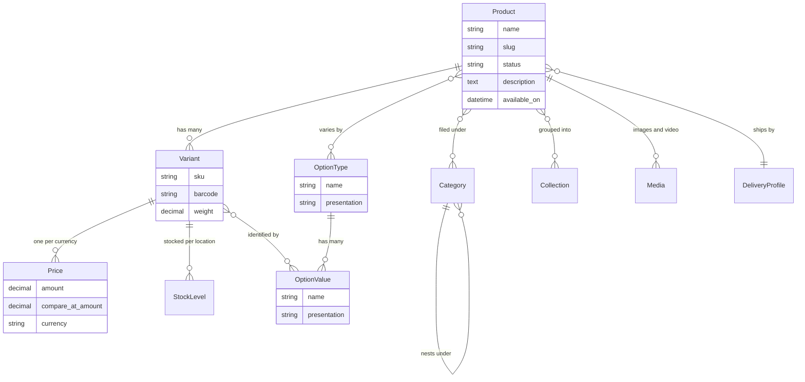
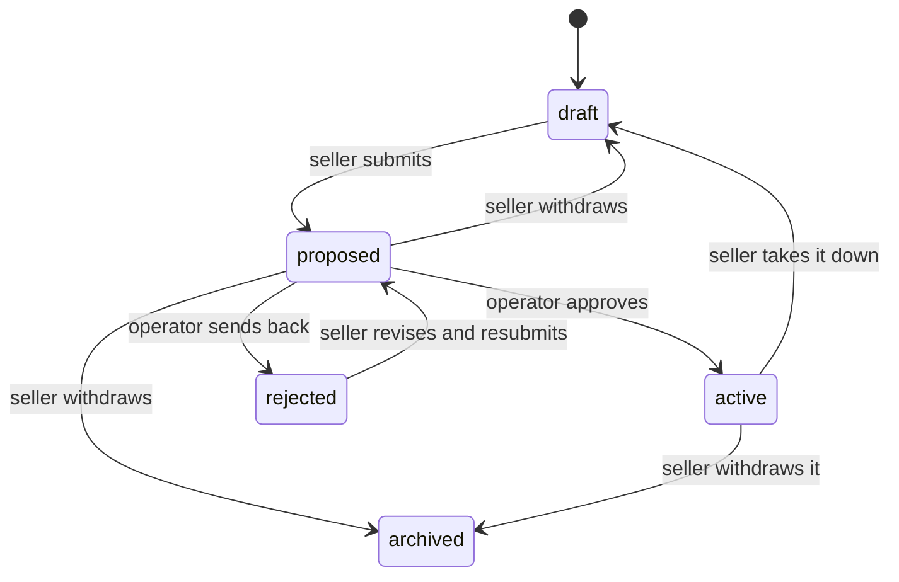
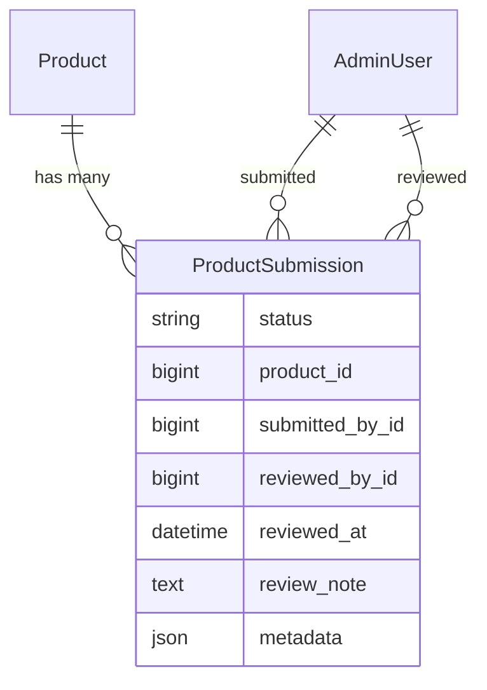
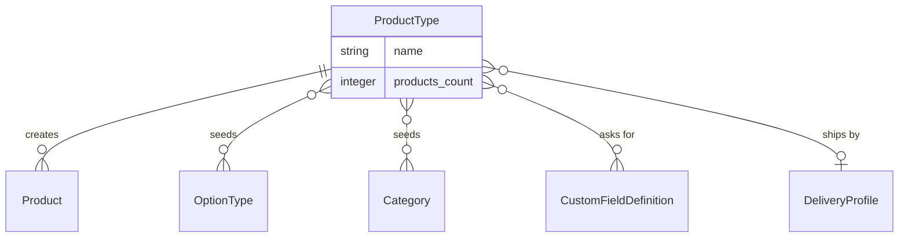

## Overview

A product is the listing a customer browses. A **variant** is the thing they actually buy.

That split runs through everything on this page. The product holds what's shared — name, description, images, which categories it's filed under. Each variant holds what differs — its SKU, its price, its stock. A T-shirt is one product; small navy is a variant.

**Every product has at least one variant**, even when there's nothing to choose. A book with no size or colour still has a single variant carrying its SKU, price and stock; you just never render a picker.

<Info>
Product names, descriptions, slugs and SEO fields are [translatable](/developer/core-concepts/translations#resource-translations).
</Info>


```mermaid
erDiagram
    Product ||--o{ Variant : "has many"
    Product }o--o{ OptionType : "varies by"
    Product }o--o{ Category : "filed under"
    Product }o--o{ Collection : "grouped into"
    Product ||--o{ Media : "images and video"
    Product }o--|| DeliveryProfile : "ships by"
    Variant ||--o{ Price : "one per currency"
    Variant ||--o{ StockLevel : "stocked per location"
    Variant }o--o{ OptionValue : "identified by"
    OptionType ||--o{ OptionValue : "has many"
    Category ||--o{ Category : "nests under"

    Product {
        string name
        string slug
        string status
        text description
        datetime available_on
    }

    Variant {
        string sku
        string barcode
        decimal weight
    }

    Price {
        decimal amount
        decimal compare_at_amount
        string currency
    }

    OptionType {
        string name
        string presentation
    }

    OptionValue {
        string name
        string presentation
    }
```

## Product Attributes

| Attribute | Description | Translatable |
|---|---|:---:|
| `name` | Product name | Yes |
| `description` / `description_html` | Description as plain text and as formatted HTML | Yes |
| `slug` | URL identifier, e.g. `spree-tote` | Yes |
| `status` | `draft`, `active` or `archived`. A marketplace adds `proposed` and `rejected` — see [Seller submissions](#seller-submissions) | No |
| `available_on` | When it goes on sale | No |
| `discontinue_on` | When it comes off | No |
| `meta_title` / `meta_description` / `meta_keywords` | SEO fields | Yes |
| `purchasable` | Whether it can be added to a cart | No |
| `in_stock` | Whether any variant has stock | No |
| `backorderable` | Whether it can be ordered while out of stock | No |
| `preorder` / `preorder_ships_at` | Whether it's sold ahead of availability, and when it ships | No |
| `available` | Whether it's on sale right now, by date and status | No |
| `price` / `original_price` | The [default variant's](#the-default-variant) price, and its compare-at price | No |
| `default_variant_id` | Which variant represents the product | No |
| `variant_count` | How many variants it has | No |
| `thumbnail_url` | First image — always returned, no expand needed | No |
| `tags` | Tags, for filtering | No |

The Admin API adds the operational fields on top: `product_type_id`, `delivery_profile_id`, `tax_category_id`, `seller_id`, `metadata`, `created_at` / `updated_at` / `deleted_at`.

## Listing Products

<CodeGroup>

```typescript Store SDK
// List products with pagination
const { data: products, meta } = await client.products.list({
  limit: 12,
  page: 1,
})

// Filter by price range and availability
const filtered = await client.products.list({
  price_gte: 10,
  price_lte: 50,
  in_stock: true,
})

// Search by keyword
const results = await client.products.list({
  search: 'tote bag',
})

// Sort products
const sorted = await client.products.list({
  sort: '-price',  // high to low; also: price, name, -name, available_on, -available_on, best_selling
})
```

```typescript Admin SDK
const { data: products, meta } = await adminClient.products.list({
  limit: 12,
  page: 1,
})
```

```bash cURL
# List products
curl 'https://api.mystore.com/api/v3/store/products?limit=12&page=1' \
  -H 'X-Spree-API-Key: pk_xxx'

# Filter by price and stock
curl 'https://api.mystore.com/api/v3/store/products?q[price_gte]=10&q[price_lte]=50&q[in_stock]=true' \
  -H 'X-Spree-API-Key: pk_xxx'

# Search
curl 'https://api.mystore.com/api/v3/store/products?q[search]=tote+bag' \
  -H 'X-Spree-API-Key: pk_xxx'
```

</CodeGroup>

See [Querying](/api-reference/store-api/querying) for the full list of filtering, sorting, and pagination options.

## Getting a Product

<CodeGroup>

```typescript Store SDK
// Get by slug
const product = await client.products.get('spree-tote')

// Get with included relations
const detailed = await client.products.get('spree-tote', {
  expand: ['variants', 'media', 'option_types', 'categories'],
})
// detailed.variants => [{ id: "var_xxx", sku: "TOTE-S-R", price: { amount: "15.99", currency: "USD" }, ... }]
// detailed.media => [{ id: "img_xxx", original_url: "https://cdn...", position: 1 }]
// detailed.option_types => [{ name: "size", label: "Size", position: 1, kind: "..." }]
// detailed.option_values => [{ name: "small", label: "S", option_type_name: "size", ... }]  // separate top-level array when expanded
```

```typescript Admin SDK
const product = await adminClient.products.get('prod_86Rf07xd4z')
```

```bash cURL
curl 'https://api.mystore.com/api/v3/store/products/spree-tote?expand=variants,media,option_types,categories' \
  -H 'X-Spree-API-Key: pk_xxx'
```

</CodeGroup>

Pass `expand` to include related resources in a single response — see [expand relations](/api-reference/store-api/relations) for how relation inclusion works.

## Managing Products

The examples above use the **Store API** (publishable key, read-only, customer-facing). To **create and manage** products, use the [Admin API](/api-reference/admin-api/introduction) — via the [Admin SDK](/developer/sdk/admin/quickstart) or the [Spree CLI](/developer/cli/admin-api).

A product's purchasable attributes (SKU, prices, stock) live on its **variants**, which you can create inline.

For a product with options, send the variants:

<CodeGroup>

```typescript Admin SDK
import { createAdminClient } from '@spree/admin-sdk'

const adminClient = createAdminClient({
  baseUrl: 'https://store.example.com',
  secretKey: 'sk_xxx',
})

const product = await adminClient.products.create({
  name: 'Premium T-Shirt',
  description: 'Soft, organic cotton.',
  status: 'active',
  variants: [
    {
      sku: 'TSHIRT-S-NAVY',
      options: [
        { name: 'size', value: 'Small' },
        { name: 'color', value: 'navy' },
      ],
      prices: [{ currency: 'USD', amount: '29.99' }],
      stock_levels: [{ stock_location_id: 'sloc_xxx', count_on_hand: 50 }],
    },
  ],
})
```

```bash CLI
spree api post /products -d '{
  "name": "Premium T-Shirt",
  "status": "active",
  "variants": [{
    "sku": "TSHIRT-S-NAVY",
    "options": [{ "name": "size", "value": "Small" }],
    "prices": [{ "currency": "USD", "amount": "29.99" }]
  }]
}'
```

</CodeGroup>

For something with no options at all, send prices directly and skip the variants array — Spree forwards them to the product's single variant:

```typescript Admin SDK
await adminClient.products.create({
  name: 'The Spree Handbook',
  status: 'active',
  prices: [{ currency: 'USD', amount: '19.99' }],
})
```

Don't pass both.

Update, clone, or archive a product (deleting soft-deletes it):

<CodeGroup>

```typescript Admin SDK
await client.products.update('prod_xxx', { name: 'Premium Tee', status: 'active' })
await client.products.clone('prod_xxx')   // duplicate as a new draft
await client.products.delete('prod_xxx')  // soft-delete
```

```bash CLI
spree api patch /products/prod_xxx -d '{"name": "Premium Tee"}'
spree api post /products/prod_xxx/clone
spree api delete /products/prod_xxx
```

</CodeGroup>

<Tip>
Operating on many products at once? The Admin API has bulk actions — `bulkStatusUpdate`, `bulkAddToCategories`, `bulkAddTags`, `bulkDestroy`, and more. See the [Admin API endpoint index](/api-reference/admin-api/endpoints).
</Tip>

## Seller submissions

On a marketplace, a seller lists a product but does not publish one. They submit it, and the marketplace decides. This adds two statuses to the three above — both hidden from the storefront, since only `active` is visible.

<Info>
This applies to products that belong to a seller. A marketplace's own catalog is unaffected: an operator publishing their own product sets `status` directly and answers to nobody.
</Info>

### The lifecycle


```mermaid
stateDiagram-v2
    [*] --> draft
    draft --> proposed : seller submits
    proposed --> active : operator approves
    proposed --> rejected : operator sends back
    rejected --> proposed : seller revises and resubmits
    proposed --> draft : seller withdraws
    proposed --> archived : seller withdraws
    active --> draft : seller takes it down
    active --> archived : seller withdraws it
```

Withdrawing a submission before anyone has ruled on it closes the open row as `withdrawn`, so a `pending` row always means the marketplace still owes an answer. A product that was already rejected keeps that decision at the head of its trail instead.

| Status | Meaning | Storefront |
|---|---|:---:|
| `draft` | The seller is still working on it | Hidden |
| `proposed` | Submitted, waiting on the marketplace | Hidden |
| `rejected` | Sent back with a reason, awaiting changes | Hidden |
| `active` | Approved and on sale | **Visible** |
| `archived` | Withdrawn | Hidden |

A seller can always take their own listing down — that is not a review decision. Putting one up is.

### The submission record

Each submission and each decision on it is a `Spree::ProductSubmission` row. The product's `status` stays the operational truth; these rows are how it got there.


```mermaid
erDiagram
    Product ||--o{ ProductSubmission : "has many"
    AdminUser ||--o{ ProductSubmission : "submitted"
    AdminUser ||--o{ ProductSubmission : "reviewed"

    ProductSubmission {
        string status
        bigint product_id
        bigint submitted_by_id
        bigint reviewed_by_id
        datetime reviewed_at
        text review_note
        json metadata
    }
```

| Column | Description |
|---|---|
| `status` | `pending`, `approved`, `rejected`, or `withdrawn` |
| `submitted_by_id` | The seller's staff member who asked |
| `reviewed_by_id` | The marketplace's staff member who decided |
| `reviewed_at` | When the decision was made |
| `review_note` | Why it was sent back — this is what the seller reads |

Rows accumulate rather than overwrite, so a seller sent back three times leaves three rows. The latest row for a product is the live one; the ones before it are the trail.

<Warning>
Never store a rejection reason on the product itself. A seller can write their own product's `metadata`, so a note kept there is erased the next time they save.
</Warning>

An approval with no `reviewed_by_id` and `metadata.auto_approved` set means the store approves listings automatically — never a decision whose author was lost. Turn that on with the `auto_approve_seller_products` store preference.

### Submitting, as a seller

Status is not writable on the seller branch. A seller moves a product with an explicit action:

<CodeGroup>

```typescript Seller SDK
import { createSellerClient } from '@spree/seller-sdk'

const client = createSellerClient({
  baseUrl: 'https://marketplace.example.com',
  sellerId: 'sel_xxx',
})

await client.products.submit('prod_xxx')   // draft or rejected → proposed
await client.products.draft('prod_xxx')    // take it back down
await client.products.archive('prod_xxx')  // withdraw it

// Why it was sent back
const product = await client.products.get('prod_xxx', 'submission')
product.submission?.review_note
```

```bash CLI
spree api patch /seller/products/prod_xxx/submit
spree api patch /seller/products/prod_xxx/draft
spree api patch /seller/products/prod_xxx/archive
```

</CodeGroup>

### Deciding, as the marketplace

<CodeGroup>

```typescript Admin SDK
await client.products.approve('prod_xxx')
await client.products.reject('prod_xxx', { reason: 'Please add a photo showing scale.' })

// The review queue
const pending = await client.products.list({ filter: { status_eq: 'proposed' } })

// Who decided, and when
const product = await client.products.get('prod_xxx', { expand: ['submission'] })
product.submission?.reviewed_by_name
```

```bash CLI
spree api patch /products/prod_xxx/approve
spree api patch /products/prod_xxx/reject -d '{"reason": "Please add a photo showing scale."}'
```

</CodeGroup>

<Note>
The seller sees the note and when the decision was made, but never who made it.
</Note>

### Leaving review is a decision

A product in `proposed` or `rejected` cannot have its status changed by an ordinary update — that would put it on sale with nobody's name against it. The refusal lives in the product update workflow, so every caller inherits it, and bulk status updates skip those products and report how many they left behind.

### Events

Each transition publishes an event you can subscribe to:

| Event | Published when |
|---|---|
| `product.proposed` | A seller submits for review |
| `product.approved` | The marketplace accepts it |
| `product.rejected` | The marketplace sends it back |
| `product.drafted` | A seller takes a listing down |
| `product.archived` | A seller withdraws it |

The submission row itself also publishes `product_submission.created` and `product_submission.updated`, carrying the status, the note and the product. See [Events](/developer/core-concepts/events).

## Product Filters

Get available filter options for building a faceted search UI. Returns price ranges, option values, and categories with counts:

<CodeGroup>

```typescript Store SDK
const filters = await client.products.filters()
// {
//   filters: [
//     { id: "price", type: "price_range", min: 9.99, max: 199.99, currency: "USD" },
//     { id: "availability", type: "availability", options: [{ id: "in_stock", count: 42 }] },
//     { id: "opt_xxx", type: "option", name: "size", label: "Size", kind: "...",
//       options: [{ id: "optv_xxx", name: "small", label: "Small", count: 12 }, ...] },
//     { id: "categories", type: "category",
//       options: [{ id: "ctg_xxx", name: "Clothing", permalink: "clothing", count: 45 }] },
//   ],
//   sort_options: [{ id: "price" }, ...],
//   default_sort: "best_selling",
//   total_count: 120,
// }

// Scoped to a specific category
const categoryFilters = await client.products.filters({
  category_id: 'ctg_xxx',
})
```

```bash cURL
curl 'https://api.mystore.com/api/v3/store/products/filters' \
  -H 'X-Spree-API-Key: pk_xxx'

# Scoped to a category
curl 'https://api.mystore.com/api/v3/store/products/filters?category_id=ctg_xxx' \
  -H 'X-Spree-API-Key: pk_xxx'
```

</CodeGroup>

## Variants

**A product is not the thing you buy — a variant is.** The product is the listing; the variant is the actual item with a SKU, a price and stock.

That distinction is worth holding onto, because everything purchasable lives on the variant:

| Attribute | Description |
|---|---|
| `sku` | Stock keeping unit |
| `barcode` | Barcode — UPC, EAN and so on |
| `price` | Price in the current currency |
| `original_price` | Compare-at price, for showing a reduction |
| `weight`, `height`, `width`, `depth` | Used for delivery rates and labels |
| `in_stock` / `purchasable` | Whether it can be bought right now |
| `backorderable` | Whether it can be ordered while out of stock |
| `preorder` / `preorder_ships_at` | Whether it's sold ahead of availability |
| `option_values` | What distinguishes it — Size: Small, Colour: Red |
| `options_text` | Those values as one readable string |
| `track_inventory` | Whether stock is counted at all |

Variants also carry the customs attributes — `hs_code`, `country_of_origin`, `customs_description` — used when a parcel crosses a border. See [Fees](/developer/core-concepts/fees#customs-classification).

### Every product has at least one variant

There's no such thing as a product without one. A book with no size or colour still has a single variant holding its SKU, price and stock — you simply never show a picker for it.

<Note>
Earlier versions of Spree had a special "master variant" alongside the real ones, which meant every query had to remember to exclude it. **That concept is gone.** A product's variants are all real, all purchasable, and all the same kind of thing.
</Note>

### The default variant

`default_variant_id` names the variant that represents the product — the price shown on a listing page, and what "add to cart" means before anyone picks anything.

```typescript Store SDK
const product = await client.products.get('spree-tote')

product.default_variant_id // "var_xxx"
product.price              // that variant's price
product.variant_count      // 6
```

For a single-variant product that's the only variant. For a product with options it's the first one, unless you say otherwise. If the default is ever removed, another is promoted automatically — a product is never left without one.

Products can also carry `buy_box_variant_id`, naming the variant a marketplace has chosen to feature when several sellers offer the same listing.

### Options make variants

A product with option types has one variant per combination. A T-shirt in three sizes and two colours is six variants:

| SKU | Size | Colour |
|---|---|---|
| `TEE-S-R` | Small | Red |
| `TEE-S-G` | Small | Green |
| `TEE-M-R` | Medium | Red |
| `TEE-M-G` | Medium | Green |
| `TEE-L-R` | Large | Red |
| `TEE-L-G` | Large | Green |

Adding one to an existing product:

<CodeGroup>

```typescript Admin SDK
await adminClient.products.variants.create('prod_xxx', {
  sku: 'TEE-L-R',
  options: [
    { name: 'size', value: 'Large' },
    { name: 'color', value: 'Red' },
  ],
  prices: [{ currency: 'USD', amount: '24.99' }],
  stock_levels: [{ stock_location_id: 'sloc_xxx', count_on_hand: 30 }],
})
```

```bash CLI
spree api post /products/prod_xxx/variants -d '{
  "sku": "TEE-L-R",
  "options": [{ "name": "size", "value": "Large" }],
  "prices": [{ "currency": "USD", "amount": "24.99" }]
}'
```

</CodeGroup>

Options are named by value rather than by ID, so you don't have to look up an option value before creating a variant that uses it.

## Option Types and Option Values

Option types define the axes of variation for a product (e.g., Size, Color, Material). Option values are the specific choices within each type (e.g., Small, Medium, Large).

A product must have at least one option type to have multiple variants. Option types and their values are included in the product response when requested:

<CodeGroup>

```typescript Store SDK
const product = await client.products.get('spree-tee', {
  expand: ['option_types', 'option_values'],
})

// Option types describe the axes of variation
product.option_types?.forEach(optionType => {
  console.log(optionType.label) // "Size"
})

// Option values are a separate flat array; each carries its parent's id/label
product.option_values?.forEach(value => {
  console.log(value.option_type_label, value.label) // "Size", "Small"
})
```

```typescript Admin SDK
const product = await adminClient.products.get('prod_k5nR8xLq', {
  expand: ['variants'],
})
```

```bash cURL
curl 'https://api.mystore.com/api/v3/store/products/spree-tee?expand=option_types,option_values' \
  -H 'X-Spree-API-Key: pk_xxx'
```

</CodeGroup>

<Info>
Option type `name` and `label` fields are translatable.
</Info>

Create option types (and their values) via the Admin API. Sending `option_values` replaces the full set, so include every value you want to keep:

<CodeGroup>

```typescript Admin SDK
const optionType = await client.optionTypes.create({
  name: 'size',
  label: 'Size',
  option_values: [
    { name: 'small', label: 'Small', position: 1 },
    { name: 'medium', label: 'Medium', position: 2 },
    { name: 'large', label: 'Large', position: 3 },
  ],
})
```

```bash CLI
spree api post /option_types -d '{
  "name": "size",
  "label": "Size",
  "option_values": [
    { "name": "small", "label": "Small" },
    { "name": "medium", "label": "Medium" }
  ]
}'
```

</CodeGroup>

## Product Types

Merchants who sell more than one kind of thing end up repeating themselves. Every pair of shoes needs Size and Colour, belongs under Footwear, and wants a Material field. Every book needs an ISBN and an author.

A **product type** captures that once. Creating a product from a type gives it the right option types, the right categories, the right delivery profile, and a form asking for the fields that kind of product actually needs.


```mermaid
erDiagram
    ProductType ||--o{ Product : "creates"
    ProductType }o--o{ OptionType : "seeds"
    ProductType }o--o{ Category : "seeds"
    ProductType }o--o{ CustomFieldDefinition : "asks for"
    ProductType }o--o| DeliveryProfile : "ships by"

    ProductType {
        string name
        integer products_count
    }
```

```typescript Admin SDK
const shoes = await adminClient.productTypes.create({
  name: 'Footwear',
  option_type_ids: ['optt_size', 'optt_color'],
  category_ids: ['ctg_footwear'],
  delivery_profile_id: 'dp_standard',
  custom_field_definitions: [
    { id: 'cfdef_material', required: true, sort_order: 0 },
  ],
})

await adminClient.products.create({
  name: 'Trail Runner',
  product_type_id: shoes.id,
  status: 'draft',
})
```

### A type is a template, not a controller

This is the part that determines how you should think about them.

<Warning>
**Editing a product type never rewrites existing products.** Add an option type to Footwear next month and the shoes you created last month are untouched.
</Warning>

That's deliberate. A merchant who adds a field to a type is describing what *new* products should look like — not asking Spree to silently restructure a live catalogue, invalidate URLs, or change what customers can pick.

So the pieces behave in two distinct ways:

| Part of the type | Behaviour |
|---|---|
| Option types, categories, delivery profile | **Stamped at creation.** Copied onto the product, then independent |
| Custom field definitions | **Live by reference.** The form always reflects the type as it is now |

Seeding is also **additive** — it adds what's missing and never removes what a product already has. Reassigning a product's type is therefore safe: it seeds the new type's option types and categories alongside whatever was already there.

If you *do* want an edited type to reach the products already using it, that's an explicit action:

```typescript Admin SDK
const { products_count } = await adminClient.productTypes.applyToProducts('pt_xxx')
```

It runs in the background and is additive like the rest — never a side effect of saving a type.

<Info>
`required` on a type's custom field is **advisory** — it marks the field in the dashboard but isn't enforced on write, since Spree saves the product and its fields in two steps. Validate in your own tooling if you need it enforced.
</Info>

A type in use can't be deleted; its products would lose the structure they were built from.

## Media

Media can be attached to a product or to individual variants. When displaying a product, show the images for the selected variant, falling back to the product's own.

### Thumbnails

Every product response includes a `thumbnail_url` field — the URL to the first image, ready to use without any expands. Similarly, each variant includes a `thumbnail_url` URL and an `media_count` counter.

Use these fields for product listing pages to avoid loading all images:

<CodeGroup>

```typescript Store SDK
// List products — thumbnail_url is always included
const { data: products } = await client.products.list({ limit: 12 })

products.forEach(product => {
  product.thumbnail_url // "https://cdn.../tote-front.jpg" — no expand needed
})
```

```typescript Admin SDK
const { data: products } = await adminClient.products.list({ limit: 12 })
```

```bash cURL
# thumbnail_url is always in the response — no ?expand needed
curl 'https://api.mystore.com/api/v3/store/products?limit=12' \
  -H 'X-Spree-API-Key: pk_xxx'
```

</CodeGroup>

<Warning>
Avoid using `?expand=media` on listing pages. This loads **all** images for every product in the response, which is unnecessary when you only need a thumbnail. Use `thumbnail_url` instead and only expand full media on the product detail page.
</Warning>

### All Images

On the product detail page, expand `media` and `variants` to get the full set of images. Images are ordered by `position`:

<CodeGroup>

```typescript Store SDK
const product = await client.products.get('spree-tote', {
  expand: ['media', 'variants'],
})

// The product's own images
product.media // [{ original_url: "https://cdn.../tote-front.jpg", position: 1 }, ...]

// Each variant has its own thumbnail and media_count
product.variants?.forEach(variant => {
  variant.thumbnail_url    // "https://cdn.../tote-red.jpg" — always available
  variant.media_count  // 3 — quick check without loading media
  variant.media        // full image array (only when ?expand=media)
})
```

```typescript Admin SDK
const product = await adminClient.products.get('prod_86Rf07xd4z', {
  expand: ['media'],
})
```

```bash cURL
curl 'https://api.mystore.com/api/v3/store/products/spree-tote?expand=media,variants' \
  -H 'X-Spree-API-Key: pk_xxx'
```

</CodeGroup>

| Field | Available on | Always returned | Description |
|-------|-------------|:---:|-------------|
| `thumbnail_url` | Product | Yes | URL to the product's first media |
| `thumbnail_url` | Variant | Yes | URL to the variant's first media |
| `media_count` | Variant | Yes | Number of media |
| `media` | Product, Variant | No | Full image array (requires `?expand=media`) |

## Prices

Each variant can have multiple prices — one per currency, plus additional prices from [Price Lists](/developer/core-concepts/pricing) that apply conditionally based on market, geography, customer segment, or quantity.

The API automatically returns the correct price based on the current currency and market context:

| Field | Description |
|-------|-------------|
| `price` | Current selling price |
| `original_price` | Compare-at price (for showing strikethrough discounts) |

See the [Pricing](/developer/core-concepts/pricing) guide for details on Price Lists, Price Rules, and market-specific pricing.

## Categories

There are two ways to group products, and they answer different questions.

**Categories** are a hierarchy — the navigation tree a shopper browses. Clothing contains T-Shirts, which contains Long Sleeve. A product can sit in several categories, and each one has a permalink built from its path.

**Collections** are flat groupings — "Summer 2025", "Best Sellers", "Under $50". A collection can be curated by hand, or defined by rules so products join and leave it on their own as their price, tags or stock change.

| | Categories | Collections |
|---|---|---|
| Shape | Nested tree | Flat list |
| Membership | You assign it | Assigned, or matched by rules |
| Typical use | Site navigation | Merchandising and campaigns |

A brand is usually best modelled as one or the other rather than as a separate concept — a category if you want it in the navigation tree, a collection if it's a landing page.

<CodeGroup>

```typescript Store SDK
// List categories
const { data: categories } = await client.categories.list()

// Get a category by permalink
const category = await client.categories.get('clothing/shirts')

// List products in a category
const { data: products } = await client.categories.products.list('clothing/shirts', {
  limit: 12,
})
```

```typescript Admin SDK
const { data: categories } = await adminClient.categories.list()
```

```bash cURL
# List categories
curl 'https://api.mystore.com/api/v3/store/categories' \
  -H 'X-Spree-API-Key: pk_xxx'

# Get a category by permalink
curl 'https://api.mystore.com/api/v3/store/categories/clothing/shirts' \
  -H 'X-Spree-API-Key: pk_xxx'

# List products in a category
curl 'https://api.mystore.com/api/v3/store/categories/clothing/shirts/products?limit=12' \
  -H 'X-Spree-API-Key: pk_xxx'
```

</CodeGroup>

<Info>
Category `name` and `description` fields are translatable.
</Info>

Collections work the same way from a storefront's point of view:

```typescript Store SDK
const { data: collections } = await client.collections.list()

const { data: products } = await client.collections.products.list('summer-2025', {
  limit: 12,
})
```

A rule-based collection is defined once and maintains itself — set it to match everything tagged `sale` and under $50, and products appear and disappear as those facts change. Ordering can be manual or by a rule such as newest first.

## Publications and Sales Channels

A product is visible on a [Channel](/developer/core-concepts/channels) only when a `ProductPublication` record joins the two. Publications carry an optional time window so a product can be scheduled to go live and come down without code or manual toggles.

| Publication state | What customers see |
|---|---|
| No publication exists | Product is not on this channel — invisible |
| Publication has no dates set | Live now and indefinitely |
| `published_at` is in the future | Scheduled — not yet visible |
| `unpublished_at` is in the past | Hidden — was visible, now sunset |
| Within the window | Live |

Product `status` (`draft` / `active` / `archived`) is the **outer gate**: a Draft or Archived product is hidden on every channel regardless of its publication window. Only `active` products consult publication state.

### Reading publications

Publications appear in the API under `product_publications` when expanded; the same data is available through the `channels` association as a flat list of joined channels.

<CodeGroup>

```typescript Admin SDK
const product = await adminClient.products.get('prod_abc', {
  expand: ['product_publications', 'channels'],
})
```

```bash cURL
curl 'https://api.mystore.com/api/v3/admin/products/prod_abc?expand=product_publications,channels' \
  -H 'X-Spree-API-Key: sk_xxx'
```

</CodeGroup>

```json Response
{
  "data": {
    "id": "prod_abc",
    "status": "active",
    "channels": [
      { "id": "ch_online", "code": "online", "name": "Online Store" }
    ],
    "product_publications": [
      {
        "id": "pp_xyz",
        "channel_id": "ch_online",
        "published_at": "2026-07-01T00:00:00Z",
        "unpublished_at": null
      }
    ]
  }
}
```

### Writing publications

Two write surfaces serve different shapes:

- **Per-product, full-set** — `PATCH /api/v3/admin/products/{id}` with a `product_publications` array. The array represents the complete desired state; channels absent from the payload are detached.

  <CodeGroup>

  ```typescript Admin SDK
  await adminClient.products.update('prod_abc', {
    product_publications: [
      { channel_id: 'ch_online' },
      { channel_id: 'ch_pos', published_at: '2026-07-01T00:00:00Z' },
    ],
  })
  ```

  ```bash cURL
  curl -X PATCH 'https://api.mystore.com/api/v3/admin/products/prod_abc' \
    -H 'X-Spree-API-Key: sk_xxx' \
    -H 'Content-Type: application/json' \
    -d '{
      "product_publications": [
        { "channel_id": "ch_online" },
        { "channel_id": "ch_pos", "published_at": "2026-07-01T00:00:00Z" }
      ]
    }'
  ```

  </CodeGroup>

- **Per-channel, bulk** — `POST /api/v3/admin/channels/{id}/add_products` and `POST /api/v3/admin/channels/{id}/remove_products` for publishing or unpublishing many products at once. Idempotent: re-publishing an already-published product is a no-op for its window unless `published_at` / `unpublished_at` are explicitly passed.

  <CodeGroup>

  ```typescript Admin SDK
  await adminClient.channels.addProducts('ch_online', {
    product_ids: ['prod_abc', 'prod_def'],
    published_at: '2026-07-01T00:00:00Z',
  })

  await adminClient.channels.removeProducts('ch_online', {
    product_ids: ['prod_abc'],
  })
  ```

  ```bash cURL
  curl -X POST 'https://api.mystore.com/api/v3/admin/channels/ch_online/add_products' \
    -H 'X-Spree-API-Key: sk_xxx' \
    -H 'Content-Type: application/json' \
    -d '{
      "product_ids": ["prod_abc", "prod_def"],
      "published_at": "2026-07-01T00:00:00Z"
    }'

  curl -X POST 'https://api.mystore.com/api/v3/admin/channels/ch_online/remove_products' \
    -H 'X-Spree-API-Key: sk_xxx' \
    -H 'Content-Type: application/json' \
    -d '{ "product_ids": ["prod_abc"] }'
  ```

  </CodeGroup>

The two surfaces converge on the same `spree_product_publications` table — pick whichever matches your call site.

### Listing products on a specific channel

Storefronts and `client.products.list()` calls return only products published on the resolved channel (live within the publication window, with the product itself `active`). To scope a Store SDK request to a non-default channel — e.g. a POS app querying for the POS catalog — set the channel `code` on the client or per-request:

<CodeGroup>

```typescript Store SDK
// Client-level default
const client = createClient({ baseUrl, publishableKey, channel: 'pos' })

// Per-request override
const posProducts = await client.products.list({}, { channel: 'pos' })
```

```typescript Admin SDK
// filter by the channel's code via Ransack (q[channels_code_eq])
const { data: products } = await adminClient.products.list({ channels_code_eq: 'pos' })
```

```bash cURL
curl 'https://api.mystore.com/api/v3/store/products' \
  -H 'X-Spree-API-Key: pk_xxx' \
  -H 'X-Spree-Channel: pos'
```

</CodeGroup>

For Admin API filtering across channels (back-office reports, admin UI lists), use Ransack instead: `q[channels_id_in][]=ch_xxx`. See [Sales Channels](/developer/core-concepts/channels) for the resolution rules.

### Auto-publish on the default channel

When a product is created via the dashboard, it is auto-published on the store's default channel (the only channel where `default = true`). The Admin API does **not** auto-publish — supply `product_publications: [{ channel_id }]` on create or call `add_products` afterwards.

See [Sales Channels](/developer/core-concepts/channels) for the full channel lifecycle, including default-channel resolution and the `X-Spree-Channel` header.

## Related Documentation

- [Sales Channels](/developer/core-concepts/channels) — Channels, publications, and order attribution
- [Pricing](/developer/core-concepts/pricing) — Price Lists, Price Rules, and market-specific pricing
- [Inventory](/developer/core-concepts/inventory) — Stock management and backorders
- [Media](/developer/core-concepts/media) — Image management
- [Translations](/developer/core-concepts/translations) — Translating product content
- [Search & Filtering](/developer/core-concepts/search-filtering) — Full-text search and Ransack filtering
- [Store SDK Products](/developer/sdk/store/products) — Listing, fetching, filtering, and categories via `client.products`
- [Querying](/api-reference/store-api/querying) — API filtering, sorting, and pagination
