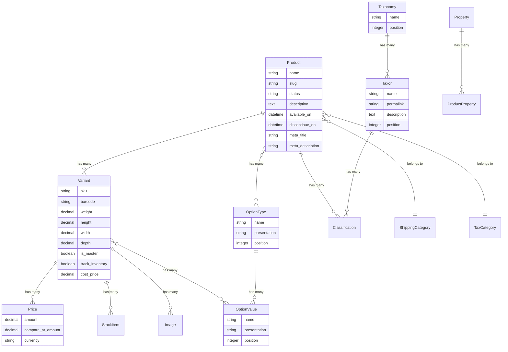

## Overview

`Product` records track unique products within your store. These differ from [Variants](#variants), which track the unique variations of a product. For instance, a product that's a T-shirt would have variants denoting its different colors and sizes. Together, Products and Variants describe what is for sale.

<Info>
Certain product fields are translatable (read more about this in [Internationalization](/developer/core-concepts/i18n#resource-translations)).
</Info>

### Product Model Diagram



**Key relationships:**
- **Product** has one master Variant and many regular Variants
- **Variants** represent purchasable items with SKU, price, and [inventory](/developer/core-concepts/inventory)
- **Option Types** (e.g., Size, Color) define variant options
- **Option Values** (e.g., Small, Red) are assigned to variants
- **Taxons** (via Classifications) organize products into categories
- **[Shipping Category](/developer/core-concepts/shipments)** and **[Tax Category](/developer/core-concepts/taxes)** determine shipping and tax rules

Products have the following attributes:

| Attribute         | Description                                                                                           | Translatable |
|-------------------|-------------------------------------------------------------------------------------------------------|--------------|
| `name`            | Short name for the product                                                                            | Yes          |
| `description`     | The most elegant, poetic turn of phrase for describing your product's benefits and features          | Yes          |
| `slug`            | SEO slug based on the product name that is placed into the URL for the product                     | Yes          |
| `status`          | The status of the product. Can be `draft`, `active`, `archived`. Defaults to `draft`. | No           |
| `available_on`    | The first date the product becomes available for sale online in your shop                            | No           |
| `discontinue_on`  | Date when the product will become unavailable for sale online in your shop                            | No           |
| `deleted_at`      | The date the product is marked as deleted. We don't remove products entirely, only soft deleting them                                                              | No           |
| `meta_title`      | Optional title used for search engines instead of `name`                                              | Yes          |
| `meta_description`| A description targeted at search engines for search engine optimization (SEO)                         | Yes          |
| `meta_keywords`   | Several words and short phrases separated by commas, also targeted at search engines                  | Yes          |

To understand how variants come to be, you must first understand option types and option values.

## Option Types and Option Values

Option types denote the different options for a variant.

A typical option type would be a `size`, with that option type's values being something such as `Small`, `Medium` and `Large`. 

Another typical option type could be a `color`, such as `Red`, `Green`, or `Blue`.

A product can be assigned many option types, but must be assigned at least one if you wish to create variants for that product

<Info>
The `name` and `presentation` fields for option types are translatable.
</Info>

## Variants

`Variant` records track the individual variants of a `Product`. Variants are of two types: master variants and normal variants.

| Attribute          | Description                                                                                   | Example Value          |
|--------------------|-----------------------------------------------------------------------------------------------|------------------------|
| `sku`              | Unique identifier for each variant                                                            | `123TSHRT-M-G`      |
| `barcode`              | Barcode code                                                           | ``      |
| `barcode`              | A unique code that represents a variant, often used for scanning purposes. | `123456789` |
| `weight`           | The weight of the variant                                                                      | 2               |
| `height`           | The height of the variant                                                                     | 150               |
| `width`            | The width of the variant                                                                      | 150                |
| `depth`            | The depth of the variant                                                                      | 100                 |
| `is_master`        | Indicates if the variant is a master variant                                                  | `false`                  |
| `track_inventory`  | Indicates if the inventory is tracked for this variant                                        | `true`                   |
| `cost_price`       | The cost price of the variant                                                                 | 5.00                   |
| `cost_currency`    | The currency of the cost price                                                                | `USD`                  |
| `discontinue_on`   | Date when the variant will become unavailable for sale                                        | 2023-12-31 18:00           |

### Master Variants

Every single product has a master variant, which tracks basic information such as a count on hand, a price and a <Tooltip tip="Stock Keeping Unit - In inventory management, a stock keeping unit (abbreviated as SKU) is the unit of measure in which the stocks of a material are managed.">SKU</Tooltip>.

Whenever a product is created, a master variant for that product will be created too.

Master variants are automatically created along with a product and exist for the sole purpose of having a consistent API when associating variants and [line items](orders#line-items). If there were no master variant, then line items would need to track a polymorphic association which would either be a product or a variant.

### Regular Variants

Variants which are not the master variant are unique based on a [option type and option value](#option-types-and-option-values) combinations.

For instance, you may be selling a product which is a Baseball Jersey, which comes in the sizes "Small", "Medium" and "Large", as well as in the colors of "Red", "Green". For this combination of sizes and colors, you would be able to create 9 unique variants:

| SKU       | Size  | Color |
|-----------|-------|-------|
| SKU-S-R   | Small | Red   |
| SKU-S-G   | Small | Green |
| SKU-M-R   | Medium| Red   |
| SKU-M-G   | Medium| Green |
| SKU-L-R   | Large | Red   |
| SKU-L-G   | Large | Green |

### Default Variant

This all can sound complex and confusing, so we'll simplify things for you.

To get the default Variant for a product, you can call:

```ruby
product.default_variant
```

How this works?

* If a product has multiple Variants it will return the first non-master Variant based on their sort position set in the admin panel or Admin API.
* If there are no non-master Variants it will return the Master Variant

So you can easily rely on this method to get the default Variant for a product.

## Images

Images can be associated to the  Product (via master variant) or to the individual Variants.

Product images can be fetched via:

```ruby
product.images
```

To get all images for product and all it's variants, call `variant_images` on the product:

```ruby
product.variant_images
```

To fetch individual variant images, call `images` on the variant:

```ruby
product.default_variant.images
```

Image order is determined by the `position` attribute, which is an integer. By default, images are ordered from left to right.

## Prices

`Price` objects track a price for a particular currency and variant combination. For instance, a [Variant](#variants) may be available for $15 (`15 USD`) and €7 (`7 Euro`).

Each variant can have multiple prices — a base price per currency, plus additional prices from Price Lists that apply conditionally based on rules like [market](/developer/core-concepts/markets), geography, customer segment, or quantity.

For full details on Prices, Price Lists, Price Rules, and the Pricing Context, see the dedicated [Pricing](/developer/core-concepts/pricing) guide.

## Prototypes

A prototype is a useful way to share common `OptionType` and `Property` combinations amongst many different products. They work as a product template to speed up the creation of new products.

For instance, if you're creating a lot of clothing products, you may wish to maintain the "Size" and "Color" option types, as well as a "Fitting Type" property.

## Taxons and Taxonomies

Taxonomies provide a simple, yet robust way of categorizing products by enabling store administrators to define as many separate structures as needed.

When working with Taxonomies there are two key terms to understand:

* `Taxonomy` – a hierarchical list which is made up of individual Taxons. Each taxonomy relates to one `Taxon`, which is its root node.
* `Taxon` – a single child node which exists at a given point within a `Taxonomy`. Each `Taxon` can contain many (or no) sub / child taxons. Store administrators can define as many Taxonomies as required, and link a product to multiple Taxons from each Taxonomy.

By default, both Taxons and Taxonomies are ordered by their `position` attribute.

<Note>
Taxons use the [Nested set model](http://en.wikipedia.org/wiki/Nested_set_model) for their hierarchy. The `lft` and `rgt` columns in the `spree_taxons` table represent the locations within the hierarchy of the item. This logic is handled by the [awesome nested set](https://github.com/collectiveidea/awesome_nested_set) gem.
</Note>

Taxons link to products through an intermediary model called `Classification`. This model exists so that when a product is deleted, all of the links from that product to its taxons are deleted automatically. A similar action takes place when a taxon is deleted; all of the links to products are deleted automatically.

<Note>
Storefront uses `spree.nested_taxons_path` helper method to generate full taxon URLs, which will use the taxon's permalink, eg. 

```ruby
taxon = Spree::Taxon.find_by(permalink: 'clothes/dresses')
spree.nested_taxons_path(taxon)
```

which will output `/t/categories/clothes/dresses`.
</Note>

<Info>
The taxon `name` and `description` fields are translatable.
</Info>
