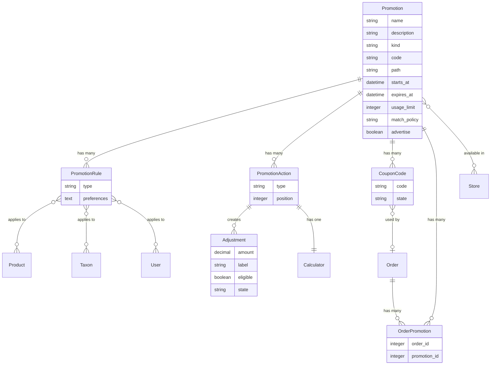

## Overview

Promotions within Spree are used to provide discounts to orders, offer free shipping, or add items at no extra cost (e.g., free gifts). The promotion system is highly flexible, allowing you to create complex promotional campaigns based on various conditions.

### Promotion Model Diagram



**Key relationships:**
- **Promotion** defines the campaign with rules and actions
- **Promotion Rules** determine eligibility conditions (FirstOrder, ItemTotal, Taxon, etc.)
- **Promotion Actions** define what happens when applied (discount, free shipping, free items)
- **Coupon Codes** track usage for code-based promotions
- **[Adjustments](/developer/core-concepts/adjustments)** are created on orders/line items to apply discounts

Promotions can be activated in two ways:

- **Automatic promotions** - Applied automatically when eligibility rules are met (e.g., free shipping on orders over $50)
- **Coupon code promotions** - Applied when a customer enters a valid code during checkout

Promotions consist of two main components:

- **Rules** - Conditions that must be met for the promotion to apply
- **Actions** - What happens when the promotion is applied (discount, free shipping, etc.)

## Promotion Attributes

| Attribute | Description | Example |
|-----------|-------------|---------|
| `name` | The name of the promotion | Summer Sale |
| `description` | Brief description (max 255 chars) | 20% off all summer items |
| `kind` | Type: `coupon_code` or `automatic` | `automatic` |
| `starts_at` | When the promotion becomes active | 2025-06-01 00:00:00 |
| `expires_at` | When the promotion expires | 2025-09-01 23:59:59 |
| `usage_limit` | Max times the promotion can be used | 500 |
| `match_policy` | How rules are evaluated: `all` or `any` | `all` |
| `advertise` | Whether to display on storefront | `true` |
| `path` | SEO-friendly URL path | `summer-sale` |

### Multi-Code Promotions

For promotions that need unique codes per customer (e.g., influencer campaigns), Spree supports bulk code generation:

| Attribute | Description | Example |
|-----------|-------------|---------|
| `multi_codes` | Enable bulk code generation | `true` |
| `number_of_codes` | How many codes to generate | 1000 |
| `code_prefix` | Prefix for generated codes | `SUMMER` |

Generated codes follow the pattern `{prefix}{random}`, e.g., `SUMMER22A0F62A230BD919`.

## Rules

Rules determine when a promotion is eligible. You can combine multiple rules and configure whether **all** rules must match or **any** rule is sufficient (via `match_policy`).

### FirstOrder

Applies only to a customer's first order. Checks both user account and email address to prevent abuse.

**Use case:** Welcome discount for new customers.

### ItemTotal

Requires the order subtotal to meet minimum and/or maximum thresholds.

**Configuration:**
- `preferred_amount_min` - Minimum order amount (default: 100.00)
- `preferred_operator_min` - Comparison operator: `gt` (greater than) or `gte` (greater than or equal)
- `preferred_amount_max` - Maximum order amount (optional)
- `preferred_operator_max` - Comparison operator: `lt` (less than) or `lte` (less than or equal)

**Use case:** "Free shipping on orders over $50", "10% off orders between $100-$500".

### Product

Requires specific products to be in the order.

**Configuration:**
- `preferred_match_policy`:
  - `any` - At least one of the specified products
  - `all` - All specified products must be present
  - `none` - None of the specified products (exclusion)

**Use case:** "Buy Product A and get 20% off", "Discount excludes sale items".

### Taxon

Requires products from specific categories (taxons) to be in the order.

**Configuration:**
- `preferred_match_policy`: `any` or `all`

The rule automatically includes products in child taxons when a parent taxon is selected.

**Use case:** "20% off Electronics", "Buy from Shoes category get 10% off".

### User

Limits the promotion to specific customer accounts.

**Use case:** Employee discounts, VIP customer promotions.

### UserLoggedIn

Requires the customer to be logged in with an account.

**Use case:** Member-only discounts.

### OneUsePerUser

Ensures each customer can only use the promotion once.

**Use case:** One-time welcome offers, limited redemption campaigns.

### Country

Limits the promotion to orders shipping to a specific country.

**Configuration:**
- `preferred_country_id` or `preferred_country_iso` (ISO 2-letter code)

**Use case:** Regional promotions, country-specific campaigns.

### Currency

Limits the promotion to orders in a specific currency.

**Configuration:**
- `preferred_currency` - Currency code (e.g., "USD", "EUR")

**Use case:** Currency-specific pricing strategies.

### OptionValue

Requires products with specific option values (e.g., size, color) to be in the order.

**Configuration:**
- `preferred_eligible_values` - Array of eligible variant IDs

**Use case:** "10% off all red items", "Discount on size XL".

### CustomerGroup

Limits the promotion to customers belonging to specific customer groups.

**Configuration:**
- `preferred_customer_group_ids` - Array of customer group IDs

Customer groups are managed in Admin > Customers > Customer Groups and allow you to segment customers for targeted promotions.

**Use case:** VIP programs, loyalty tiers, wholesale pricing, B2B customer segments.

## Actions

Actions define what happens when a promotion is applied.

### CreateAdjustment

Creates a discount on the entire order total.

**Default calculator:** `FlatPercentItemTotal` (percentage off order)

**Available calculators:**
- `FlatPercentItemTotal` - Percentage off the order total
- `FlatRate` - Fixed amount off
- `FlexiRate` - First item at one rate, additional items at another
- `TieredFlatRate` - Different rates based on order total tiers
- `TieredPercent` - Different percentages based on order total tiers

**Use case:** "10% off your order", "$20 off orders over $100".

### CreateItemAdjustments

Creates discounts on individual line items. Only applies to items that match the promotion rules (e.g., items in a specific category).

**Default calculator:** `PercentOnLineItem` (percentage off each item)

The action respects rule actionability - if a Taxon rule specifies "Electronics", only electronics items receive the discount.

**Use case:** "15% off shoes", "Buy 2+ shirts get 10% off each".

### FreeShipping

Makes all shipments free by creating negative adjustments equal to shipping costs.

**Use case:** "Free shipping on orders over $75", "Free shipping with code FREESHIP".

### CreateLineItems

Automatically adds specified products to the cart when the promotion is eligible.

**Configuration:**
- Map of variant IDs to quantities to add

The action checks stock availability before adding items. Items are not automatically removed if eligibility is lost - customers must remove them manually.

**Use case:** "Free gift with purchase", "Buy 2 get 1 free", "Spend $100 get free sample".

## Coupon Codes

Coupon codes track promotion usage and can be single-use or multi-use.

### Single Code Promotions

Set the `code` attribute directly on the promotion. The `usage_limit` controls how many times it can be redeemed.

### Multi-Code Promotions

For bulk-generated codes, each code is stored in the `spree_coupon_codes` table:

| Attribute | Description | Example |
|-----------|-------------|---------|
| `code` | The unique code | `SUMMER22A0F62A230BD919` |
| `promotion_id` | Associated promotion | 123 |
| `order_id` | Order that used the code | 456 |
| `state` | Usage state | `unused`, `used` |

## Custom Promotion Rules

You can create custom rules to implement business-specific eligibility logic.

### Step 1: Create the Rule Class

```bash
mkdir -p app/models/spree/promotion/rules
```

```ruby app/models/spree/promotion/rules/minimum_quantity.rb
module Spree
  class Promotion
    module Rules
      class MinimumQuantity < Spree::PromotionRule
        preference :quantity, :integer, default: 5

        def applicable?(promotable)
          promotable.is_a?(Spree::Order)
        end

        def eligible?(order, options = {})
          total_quantity = order.line_items.sum(&:quantity)

          if total_quantity >= preferred_quantity
            true
          else
            eligibility_errors.add(:base, "Order must contain at least #{preferred_quantity} items")
            false
          end
        end
      end
    end
  end
end
```

The `eligible?` method should return `true` or `false`. Use `eligibility_errors` to provide feedback to customers about why the promotion didn't apply.

### Step 2: Register the Rule

<Tabs>
  <Tab title="Spree 5.2+">
    ```ruby config/initializers/spree.rb
    Rails.application.config.after_initialize do
      Spree.promotions.rules << Spree::Promotion::Rules::MinimumQuantity
    end
    ```
  </Tab>
  <Tab title="Spree 5.1 and below">
    ```ruby config/initializers/spree.rb
    Rails.application.config.after_initialize do
      Rails.application.config.spree.promotions.rules << Spree::Promotion::Rules::MinimumQuantity
    end
    ```
  </Tab>
</Tabs>

### Step 3: Create the Admin Partial

```bash
touch app/views/spree/admin/promotions/rules/_minimum_quantity.html.erb
```

```erb app/views/spree/admin/promotions/rules/_minimum_quantity.html.erb
<div class="row mb-3">
  <%= f.spree_number_field :preferred_quantity, label: Spree.t(:minimum_quantity) %>
</div>
```

### Step 4: Add Translations

```yaml config/locales/en.yml
en:
  spree:
    minimum_quantity: Minimum Quantity
    promotion_rule_types:
      minimum_quantity:
        name: Minimum Quantity
        description: Order must contain at least X items
```

### Step 5: Restart Your Application

After restarting, the new rule will be available in the Admin > Promotions interface.

## Custom Promotion Actions

You can create custom actions to implement business-specific promotion behaviors.

### Step 1: Create the Action Class

```bash
mkdir -p app/models/spree/promotion/actions
```

```ruby app/models/spree/promotion/actions/add_loyalty_points.rb
module Spree
  module Promotion
    module Actions
      class AddLoyaltyPoints < Spree::PromotionAction
        preference :points, :integer, default: 100

        def perform(options = {})
          order = options[:order]
          return false unless order.user.present?

          # Add loyalty points to the user
          order.user.add_loyalty_points(preferred_points, source: promotion)
          true
        end
      end
    end
  end
end
```

The `perform` method should return `true` if the action was successfully applied, `false` otherwise.

### Step 2: Register the Action

<Tabs>
  <Tab title="Spree 5.2+">
    ```ruby config/initializers/spree.rb
    Rails.application.config.after_initialize do
      Spree.promotions.actions << Spree::Promotion::Actions::AddLoyaltyPoints
    end
    ```
  </Tab>
  <Tab title="Spree 5.1 and below">
    ```ruby config/initializers/spree.rb
    Rails.application.config.after_initialize do
      Rails.application.config.spree.promotions.actions << Spree::Promotion::Actions::AddLoyaltyPoints
    end
    ```
  </Tab>
</Tabs>

### Step 3: Add Translations

```yaml config/locales/en.yml
en:
  spree:
    promotion_action_types:
      add_loyalty_points:
        name: Add Loyalty Points
        description: Awards loyalty points to the customer
```

### Step 4: Restart Your Application

After restarting, the new action will be available in the Admin > Promotions interface.

## Promotion Flow

Understanding how promotions are evaluated and applied:

1. **Order Update** - When an order is updated, the system checks all eligible promotions
2. **Eligibility Check** - For each promotion:
   - Check if within `starts_at` and `expires_at` range
   - Check if under `usage_limit`
   - Evaluate all rules based on `match_policy` (all or any)
3. **Action Execution** - If eligible, each action's `perform()` method is called
4. **Tracking** - Applied promotions are recorded in `spree_order_promotions`
5. **Re-evaluation** - Eligibility is re-checked on every order update; adjustments from ineligible promotions are removed

## Related Documentation

- [Calculators](/developer/core-concepts/calculators) - Learn about promotion calculators
- [Orders](/developer/core-concepts/orders) - Understanding order processing
- [Customization Quickstart](/developer/customization/quickstart) - Overview of customization options
