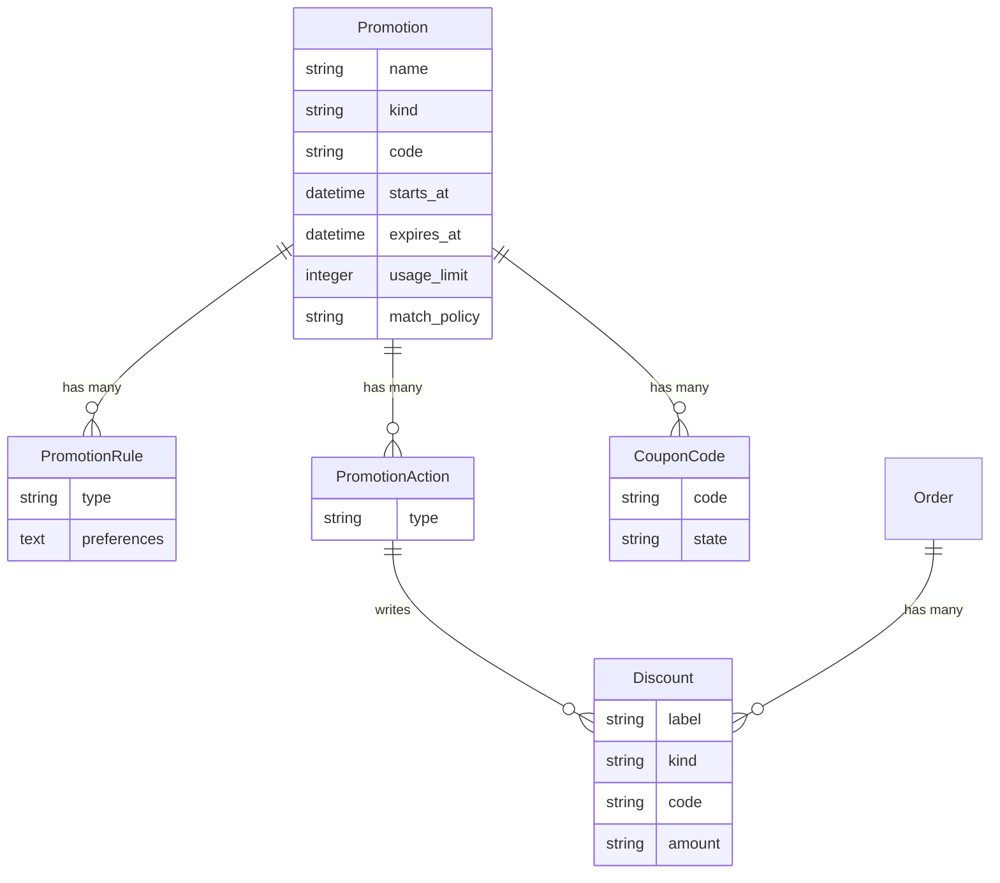

## Overview

Promotions give money off an order — a percentage off, free shipping, or free items added to the cart. A promotion is a campaign definition: **rules** decide when it applies, **actions** decide what it does. When a promotion applies, its actions write [Discount](/developer/core-concepts/taxes-discounts-fees#discounts) rows on the order.


```mermaid
erDiagram
    Promotion {
        string name
        string kind
        string code
        datetime starts_at
        datetime expires_at
        integer usage_limit
        string match_policy
    }

    PromotionRule {
        string type
        text preferences
    }

    PromotionAction {
        string type
    }

    CouponCode {
        string code
        string state
    }

    Discount {
        string label
        string kind
        string code
        string amount
    }

    Promotion ||--o{ PromotionRule : "has many"
    Promotion ||--o{ PromotionAction : "has many"
    Promotion ||--o{ CouponCode : "has many"
    PromotionAction ||--o{ Discount : "writes"
    Order ||--o{ Discount : "has many"
```

Promotions can be activated in two ways:

- **Automatic promotions** — applied on their own when the rules are met (e.g. free shipping on orders over $50)
- **Coupon code promotions** — applied when a customer enters a valid code during checkout

### How discounts are recorded

Each applied promotion becomes one or more Discount rows on the order — on a specific line item or on a fulfillment, never a loose adjustment. Each row keeps a copy of the coupon code and the configured value ("10% off"), so the order still tells the whole story even if the promotion is deleted later.

Two things follow from this design:

- **Only winners are stored.** When several promotions compete for the same item, Spree picks the one that saves the customer the most and writes only that one. Losing candidates are recomputed on every cart change, so a promotion that loses today can win tomorrow without any bookkeeping.
- **A discount on the whole order is shared out across the items.** If a customer later returns one item, Spree knows exactly how much of the discount belonged to it.

## Promotion Attributes

| Attribute | Description | Example |
|-----------|-------------|---------|
| `name` | The name of the promotion | Summer Sale |
| `description` | Brief description (max 255 chars) | 20% off all summer items |
| `kind` | Type: `coupon_code` or `automatic` | `automatic` |
| `starts_at` | When the promotion becomes active | 2026-06-01 00:00:00 |
| `expires_at` | When the promotion expires | 2026-09-01 23:59:59 |
| `usage_limit` | Max times the promotion can be used | 500 |
| `match_policy` | How rules are evaluated: `all` or `any` | `all` |
| `advertise` | Whether to display on storefront | `true` |

### Multi-Code Promotions

For promotions that need unique codes per customer (e.g. influencer campaigns), Spree supports bulk code generation:

| Attribute | Description | Example |
|-----------|-------------|---------|
| `multi_codes` | Enable bulk code generation | `true` |
| `number_of_codes` | How many codes to generate | 1000 |
| `code_prefix` | Prefix for generated codes | `SUMMER` |

Generated codes follow the pattern `{prefix}{random}`, e.g. `SUMMER22A0F62A230BD919`.

## Rules

Rules decide when a promotion is eligible. You can combine multiple rules and configure whether **all** must match or **any** is enough (via `match_policy`).

| Rule | Applies when |
|---|---|
| **FirstOrder** | It's the customer's first order (checked by account and email) |
| **ItemTotal** | The order subtotal is within configured minimum/maximum thresholds |
| **Product** | Specific products are in the order (`any` / `all` / `none` match policy) |
| **Category** | Products from specific categories are in the order — child categories count |
| **OptionValue** | Products with specific option values (size, color) are in the order |
| **User** | The customer is one of the listed accounts |
| **UserLoggedIn** | The customer is logged in |
| **OneUsePerUser** | The customer hasn't used this promotion before |
| **CustomerGroup** | The customer belongs to one of the configured customer groups |
| **Country** | The order ships to a specific country |
| **Currency** | The order is in a specific currency |
| **Channel** | The order was placed through one of the configured [channels](/developer/core-concepts/channels) |
| **Market** | The order belongs to one of the configured [markets](/developer/core-concepts/markets) |

You can also [build your own rules](/developer/how-to/custom-promotion) for business-specific conditions.

## Actions

Actions define what happens when a promotion applies.

### CreateAdjustment

A discount on the whole order. The amount is distributed proportionally across the line items — there is no single order-level row, so per-item reporting and partial returns always know their share.

**Default calculator:** `FlatPercentItemTotal` (percentage off the order). Also available: `FlatRate`, `FlexiRate`, `TieredFlatRate`, `TieredPercent`.

**Use case:** "10% off your order", "$20 off orders over $100".

### CreateItemAdjustments

A discount on individual line items. Only items that match the promotion's rules receive it — if a Category rule says "Electronics", only electronics are discounted.

**Default calculator:** `PercentOnLineItem` (percentage off each item).

**Use case:** "15% off shoes", "Buy 2+ shirts get 10% off each".

### FreeShipping

Writes a discount on each fulfillment covering its delivery cost. The row is kept even when the cost is zero — its presence is what marks the order as having free shipping.

**Use case:** "Free shipping on orders over $75", "Free shipping with code FREESHIP".

### CreateLineItems

Adds specified products to the cart when the promotion is eligible, checking stock first. Items are not removed automatically if eligibility is lost — customers remove them manually.

**Use case:** "Free gift with purchase", "Spend $100 get a free sample".

## Managing Promotions

Create and manage promotions via the [Admin API](/api-reference/admin-api/introduction). Rules and actions can be supplied inline on create — each is a `{ type, preferences }` draft using the rule and action types described above:

<CodeGroup>

```typescript Admin SDK
import { createAdminClient } from '@spree/admin-sdk'

const client = createAdminClient({
  baseUrl: 'https://store.example.com',
  secretKey: 'sk_xxx',
})

// "20% off orders over $100 with code SUMMER20"
const promotion = await client.promotions.create({
  name: 'Summer Sale',
  code: 'SUMMER20',
  kind: 'coupon_code',
  rules: [{ type: 'item_total', preferences: { amount_min: 100 } }],
  actions: [
    {
      type: 'create_adjustment',
      calculator: { type: 'flat_percent_item_total', preferences: { flat_percent: 20 } },
    },
  ],
})
```

```bash CLI
spree api post /promotions -d '{
  "name": "Summer Sale",
  "code": "SUMMER20",
  "kind": "coupon_code",
  "rules": [{ "type": "item_total", "preferences": { "amount_min": 100 } }]
}'
```

</CodeGroup>

You can also add rules and actions to an existing promotion, or update and remove the promotion itself:

<CodeGroup>

```typescript Admin SDK
await client.promotions.rules.create('promo_xxx', {
  type: 'first_order',
})
await client.promotions.update('promo_xxx', { expires_at: '2026-09-01T00:00:00Z' })
await client.promotions.delete('promo_xxx')
```

```bash CLI
spree api post /promotions/promo_xxx/promotion_rules -d '{"type": "first_order"}'
spree api patch /promotions/promo_xxx -d '{"expires_at": "2026-09-01T00:00:00Z"}'
```

</CodeGroup>

The available rule and action types — including any custom ones you register — are discoverable at `/api/v3/admin/promotion_rules/types` and `/api/v3/admin/promotion_actions/types`, together with their preference schemas. The dashboard's promotion editor is built on these endpoints, so custom types show up there without any UI work.

<Note>
Deleting a promotion doesn't disturb the orders that used it. Their discount rows stay, keeping the code and value they were created with — only the link back to the promotion is cleared.
</Note>

## Coupon Codes

Coupon codes track promotion usage and can be single-use or multi-use.

- **Single code** — set the `code` attribute on the promotion; `usage_limit` controls how many times it can be redeemed.
- **Multi-code** — bulk-generated codes each track their own state (`unused` / `used`).

Customers apply codes on the cart via the Store API:

<CodeGroup>

```typescript Store SDK
// Apply a discount code to the cart
const cart = await client.carts.discountCodes.apply('cart_abc123', 'SUMMER20', {
  spreeToken: '<token>',
})

// Remove a discount code from the cart
await client.carts.discountCodes.remove('cart_abc123', 'SUMMER20', {
  spreeToken: '<token>',
})
```

```bash cURL
# Apply a coupon code
curl -X POST 'https://api.mystore.com/api/v3/store/carts/cart_abc123/discount_codes' \
  -H 'X-Spree-API-Key: pk_xxx' \
  -H 'X-Spree-Token: <token>' \
  -H 'Content-Type: application/json' \
  -d '{ "code": "SUMMER20" }'
```

</CodeGroup>

The returned cart already carries the updated discounts and totals. If the cart doesn't qualify yet — say the code needs a $100 minimum and the cart holds $80 — the code stays on the cart and the discount activates on its own the moment the cart qualifies.

Automatic promotions need no customer action at all — they are evaluated on every cart change.

## Promotion Flow

1. **Cart change** — every change to a cart (item added, address entered, code applied) triggers a recalculation
2. **Eligibility** — each connected promotion is checked: active dates, usage limits, then rules per `match_policy`
3. **Competition** — candidate discounts are computed for every eligible promotion; per item, per fulfillment, and order-wide, the largest saving wins
4. **Persistence** — winning discounts are written as rows; anything stale from the previous pass is removed; tax is then estimated on the discounted amounts
5. **Placement** — once the order is placed, its discount rows are frozen; usage counts are recorded against the promotion

## Related Documentation

- [Taxes, Discounts & Fees](/developer/core-concepts/taxes-discounts-fees) — the Discount rows promotions write, and manual discounts
- [Build Custom Promotion Rules & Actions](/developer/how-to/custom-promotion) — step-by-step guide to custom rules, actions and adjusters
- [Calculators](/developer/core-concepts/calculators) — promotion calculators
- [Carts](/developer/core-concepts/carts) — the cart lifecycle promotions act on
- [Admin SDK Resources](/developer/sdk/admin/resources) — the `client.promotions.*` resource-client pattern used above
