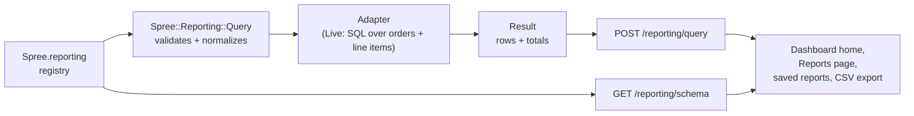

## Overview

Spree answers analytics questions through a **semantic layer**: a registry of
*metrics* (numbers) and *dimensions* (ways to group and filter them), and one
query contract that compiles a combination of the two into SQL.

Developers extend the vocabulary. Merchants, the dashboard, saved reports and
future agent tools all compose sentences from it. Nobody writes a report class
per question.



## The query contract

A query names what to measure and how to slice it. This is the whole surface:

```json
{
  "metrics": ["total_sales", "orders"],
  "dimensions": [{ "name": "completed_at", "grain": "week" }],
  "filters": [{ "dimension": "channel", "op": "eq", "value": "ch_86Rf07xd4z" }],
  "time_range": { "preset": "last_4_weeks" },
  "compare": "previous_period",
  "sort": "-total_sales",
  "limit": 50
}
```

| Field | Meaning |
|-------|---------|
| `metrics` | One or more registered metric names. Required. |
| `dimensions` | At most two. A `time` dimension also takes a `grain` (`day`, `week`, `month`). |
| `filters` | `eq` or `in` against a dimension. Values are prefixed IDs where the dimension identifies a record. |
| `time_range` | A named preset, or `since`/`until` as ISO 8601. A bare date covers the store's whole day. |
| `compare` | `previous_period` adds `previous` and `growth` to every metric. |
| `sort` / `limit` | Ranking controls; ignored for time series, which are always chronological and complete. |

Unknown members are rejected, never dropped. A malformed query answers 422,
not a partial result computed from the half the server understood.

<Note>
`GET /api/v3/admin/reporting/schema` returns the vocabulary the **calling
credential** may use, with labels, per-dimension compatible metrics, filter
operators, enumerated values and time presets. Build pickers from it rather
than hardcoding member names — that is how a new dimension reaches the UI
without a dashboard change.
</Note>

## Metrics

A metric is an aggregate over one **base** relation. Core registers four, in
three families:

| Family | Bases | Anchored on |
|--------|-------|-------------|
| `sales` | `:orders`, `:line_items` | when the order completed |
| `payments` | `:payments` | when the payment was taken |
| `inventory` | `:stock_movements` | when the stock moved |

A query draws from **one family only**. The three answer different questions on
different clocks, so a payment total beside a units-received count is two
reports wearing one table — the query refuses the mix rather than inventing a
join between grains that have no honest relationship.

```ruby
Spree.reporting.metric :total_sales,
  sql: 'SUM(%{orders}.total)', base: :orders, format: :money
```

- `sql` is a portable aggregate fragment. `%{orders}`, `%{line_items}`,
  `%{variants}`, `%{products}`, `%{addresses}`, `%{product_categories}`,
  `%{refunds}`, `%{fees}` and `%{commission_lines}` interpolate to real table
  names.
- `format` is `:money`, `:integer`, `:decimal` or `:percent`. A `:money` metric
  forces a single-currency scope and arrives with a formatted `display` string;
  a `:percent` metric arrives as the number a merchant reads (`42.5`), not the
  fraction.
- `ratio: [:numerator, :denominator]` defines a **derived** metric, computed
  after aggregation so it is correct for both rows and totals. Average order
  value is `ratio: %i[total_sales orders]`, never `AVG()`.

Money that belongs to an order but lives on another table — refunds,
commissions — is summed through a **correlated subquery** rather than a join.
An order with three refunds must stay one row; joining would multiply the base
row and inflate every other metric in the same query.

### The sales chain

Core's sales metrics follow the sequence merchants and accountants already use,
so a Spree figure means what the same word means everywhere else:

```
gross_sales − discounts − returns = net_sales
net_sales + shipping + duties + fees + taxes = total_sales
```

`returns` counts money refunded **in the period the refund was issued**, not
the period of the original order. A report over a past range can therefore
change after the fact, which is the conventional treatment and the only one an
open accounting period can produce.

`cost_of_goods`, `gross_profit` and `gross_margin` read the line item's
`cost_price`. That column is nullable, so a variant with no cost contributes
zero and margin over an incompletely-costed catalogue reads high.

## Dimensions

A dimension groups and filters. Its definition owns every behaviour keyed off
it, which is what lets an extension-registered dimension work end to end:

```ruby
Spree.reporting.dimension :channel, base: :orders, column: :channel_id,
  lookup: :channel,
  subject: -> { Spree::Channel }, key_scope: 'read_channels',
  resolve: ->(store, value) { store.channels.find_by_prefix_id!(value).id },
  hydrate: lambda { |store, ids, _params|
    store.channels.where(id: ids).to_h { |c| [c.id, { id: c.prefixed_id, label: c.name, meta: {} }] }
  }
```

| Option | Purpose |
|--------|---------|
| `base` | Which relation this axis belongs to. A base declares which other bases it reaches: `:line_items` reaches `:orders` through the order join, not the reverse. |
| `column` | A column on the base table, or a `%{table}.column` string. Must resolve to a plain identifier. |
| `expression` | SQL computing the key instead of reading a column — how `customer_type` decides first-time from returning. Use it only where a column genuinely cannot answer; it carries the same trust as a metric's `sql`. |
| `joins` | Association joins the grouping needs, applied only to the grouped query. |
| `type` | `:value` (default) or `:time`. Time dimensions take `grains` and zero-fill buckets. |
| `lookup` | Tags what the keys identify (`:product`, `:customer`), so clients know display payloads are coming. |
| `resolve` | Maps a filter's prefixed ID to the raw key, through store-scoped collections. |
| `hydrate` | Turns raw keys into `{ id:, label:, meta: }` for display. |
| `subject` / `key_scope` | Authorization — see below. |
| `values` | Enumerated raw values for status-like dimensions, published as the filter list. |

## Authorization

Reporting never widens what a caller can see. Two axes are enforced together:

- **Staff (JWT)** need `read_reports` plus `:read` on each referenced
  dimension's `subject`. Order data is always required.
- **API keys** need `read_reports` plus each dimension's `key_scope`.

Declaring `subject` without `key_scope` raises at registration, so a member
cannot ship with one axis unguarded. The schema endpoint filters by the same
rule, so a picker never offers a dimension whose query would be refused.

## Counters

Not everything on the home screen is a report over a period. "Orders to
fulfill", "Open returns" and "Low stock variants" are the state of the store
right now, with no time range and no currency. The registry holds these as
**counters** beside metrics and dimensions, and `GET /dashboard/counters`
evaluates them:

```json
{
  "channel_id": null,
  "counters": [
    {
      "key": "orders_to_fulfill",
      "label": "Orders to fulfill",
      "description": "Placed orders with nothing shipped yet.",
      "value": 12,
      "link": {
        "resource": "orders",
        "filters": [{ "field": "fulfillment_status", "operator": "eq", "value": "unfulfilled" }]
      }
    }
  ]
}
```

One request serves both surfaces that show these numbers: the home screen's
card and the sidebar's badges. A counter that badges a nav entry names it, so
the sidebar renders it without knowing which counters exist:

```json
{ "key": "open_returns", "label": "Open returns", "value": 3, "nav": "returns" }
```

A parent nav entry sums its own counter and its children's, because the
sidebar only shows the children of the section you are in — a count nobody
sees until they have already navigated there tells them nothing. Orders
carries the total of what is waiting to ship plus the open returns, exchanges
and claims; expanding the section breaks it down.

Three things follow from counters living in the registry:

- **Labels come from the server**, the same way metric labels do, so a
  counter an extension registers appears on every merchant's home screen
  without a dashboard release.
- **Each counter carries its own `subject` and `key_scope`**, filtered by the
  same rule as the rest of the vocabulary. A role without stock access gets
  a shorter list, not a refused card.
- **The link is declared beside the count.** The list a number opens shows
  exactly the rows that were counted, because the filter and the query are
  registered together. A counter with no list that can honestly show what it
  counted carries no link.

Core ships seven: orders to fulfill, payments to collect, open returns, open
exchanges, open claims, low stock variants and out of stock variants. Orders
to fulfill and the three post-sale counters badge the sidebar; payments to
collect deliberately does not, since a badge that is lit on almost every store
stops carrying information. The low stock counter reads the
store's `low_stock_threshold` preference (default five units; zero turns it
off), which merchants set under store settings → Inventory.

## What a report counts

Two rules decide what the numbers mean:

**Canceled orders are excluded.** A canceled order keeps its `completed_at`,
so both bases filter it out. Sales figures count what stayed sold. Refunds are
unaffected — they already net out of `payment_total`.

**The Total row is the dimensionless figure.** Grouping joins apply only to
the grouped query; totals run on the base rows with the same filters. A
product in three categories is counted once in the footer, and an order
without a shipping address still counts in "Sales by country". A consequence
worth stating to merchants: **rows of a fan-out breakdown need not sum to the
total**, and that is correct.

Time buckets resolve in the store's timezone, and a comparison period is the
range shifted back by its own length, paired bucket by bucket from the start.

## Saved reports

A saved report (`Spree::SavedReport`, prefixed ID `sq_…`) is a stored query
plus a name, owned by the store and visible to every staff member who may read
reports. Its visualization is inferred from the query's shape rather than
configured: a time dimension charts, any other dimension ranks, no dimension
shows totals.

Nine built-in reports are seeded per store. They are read-only on the model,
not merely in the UI — copy one to change it.

CSV export rides the existing [export pipeline](/developer/core-concepts/imports-exports)
as `Spree::Exports::Report`, so it inherits the background job, attachment and
email. The export re-authorizes its members against the requesting user, which
is why it requires a user and API keys cannot queue one.

## Relationship to `Spree::Report`

`Spree::Report` still exists and still works. It is a **row-level CSV
exporter** — one line per record, with attachment and mailer plumbing.

The two answer different questions:

| Question | Use |
|----------|-----|
| "Revenue by channel last quarter" | Reporting layer (aggregates, composable) |
| "Every order line in March, as a spreadsheet" | `Spree::Report` (row-level export) |

New report *types* for analytics are no longer accepted into core: register
metrics and dimensions instead. See
[Extend reporting](/developer/how-to/extend-reporting).

## Current limits

Worth knowing before you design an extension:

- **A new base is a registration, but a new table is not.** `registry.base`
  adds a relation to query; the `%{table}` interpolation map is still fixed, so
  a base over your own table needs an entry added to the adapter.
- **Columns are identifiers, not expressions.** A dimension's `column` must
  resolve to `table.column`; computed groupings such as `SUBSTR(...)` are
  refused.
- **The dashboard maps `lookup` to a picker from a fixed list.** A new lookup
  value still filters correctly, but through a plain ID input.

So a new axis or number over data core already knows is a registration; a base
over a table core has never seen still needs one line in the adapter's table
map.

## Related

- [Extend reporting](/developer/how-to/extend-reporting) — a worked example
- [Imports and exports](/developer/core-concepts/imports-exports) — the CSV pipeline
- [Permissions](/developer/dashboard/customization/permissions) — `read_reports` and member scopes
