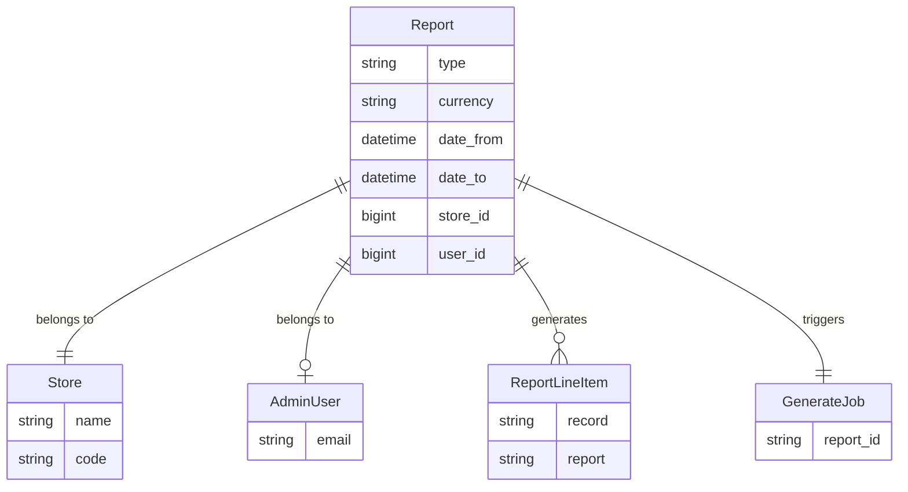

## Overview

Spree provides a flexible reporting system that allows you to generate data exports for sales analytics, product performance, and custom business metrics. Reports are generated asynchronously and delivered as downloadable CSV files.

### Report System Diagram



**Key relationships:**
- **Report** is the base model for all report types using Single Table Inheritance (STI)
- **ReportLineItem** transforms raw database records into formatted report rows
- Reports are scoped to a **Store** and optionally track the **AdminUser** who created them
- **GenerateJob** handles asynchronous CSV generation via the events system

## Architecture

The reporting system uses several design patterns:

1. **Single Table Inheritance (STI)**: All report types inherit from `Spree::Report` and are stored in the same database table with a `type` column
2. **Presenter Pattern**: `Spree::ReportLineItem` subclasses transform raw records into formatted output
3. **Event-Driven Processing**: Report generation is triggered asynchronously via Spree's events system
4. **Registry Pattern**: Reports are registered in `Spree.reports` for discovery and validation

## Built-in Reports

Spree ships with two built-in reports:

### Sales Total Report

The Sales Total report provides line-item level detail for all completed orders within a date range.

**Columns:**
- `date` - Order completion date
- `order` - Order number
- `product` - Variant descriptive name
- `quantity` - Line item quantity
- `pre_tax_amount` - Amount before taxes
- `promo_total` - Promotion discounts applied
- `shipment_total` - Shipping costs
- `tax_total` - Tax amount
- `total` - Final amount including all adjustments

### Products Performance Report

The Products Performance report aggregates sales metrics by product for the specified period.

**Columns:**
- `sku` - Product SKU
- `name` - Product name
- `vendor` - Vendor name (if multi-vendor enabled)
- `brand` - Brand name
- `category_lvl0/1/2` - Category hierarchy from main taxon
- `price` - Current product price
- `weeks_online` - Weeks since product became available
- `pre_tax_amount` - Total pre-tax sales
- `tax_total` - Total taxes collected
- `quantity` - Total units sold
- `promo_total` - Total promotion discounts
- `total` - Total revenue

## Creating Custom Reports

To create a custom report, you need three components:

1. A report class that defines the data query
2. A line item class that formats each row
3. Registration in `Spree.reports`

### Step 1: Create the Report Class

Create a new report class that inherits from `Spree::Report`:

```ruby app/models/spree/reports/customer_orders.rb
module Spree
  module Reports
    class CustomerOrders < Spree::Report
      # Define the scope of records to include in the report
      def line_items_scope
        store.orders.complete.where(
          completed_at: date_from..date_to,
          currency: currency
        ).includes(:user, :bill_address)
      end
    end
  end
end
```

The `line_items_scope` method must return an `ActiveRecord::Relation` that defines what records appear in the report. This method has access to:

- `store` - The current store
- `date_from` - Report start date
- `date_to` - Report end date
- `currency` - Report currency
- `vendor` - Vendor (if multi-vendor is enabled)

### Step 2: Create the Line Item Class

Create a corresponding line item class that transforms each record into report columns:

```ruby app/models/spree/report_line_items/customer_orders.rb
module Spree
  module ReportLineItems
    class CustomerOrders < Spree::ReportLineItem
      # Define attributes that will become columns
      attribute :order_number, :string
      attribute :completed_at, :string
      attribute :customer_email, :string
      attribute :customer_name, :string
      attribute :item_count, :integer
      attribute :total, :string

      # Map record fields to report columns
      def order_number
        record.number
      end

      def completed_at
        record.completed_at.strftime('%Y-%m-%d %H:%M')
      end

      def customer_email
        record.email
      end

      def customer_name
        record.bill_address&.full_name
      end

      def item_count
        record.line_items.sum(:quantity)
      end

      def total
        Spree::Money.new(record.total, currency: currency)
      end
    end
  end
end
```

**Important notes:**
- The class name must match the report class name (e.g., `Reports::CustomerOrders` -> `ReportLineItems::CustomerOrders`)
- Use `attribute` to define columns with their types
- Each attribute needs a corresponding method that extracts/formats data from `record`
- `record` is a single item from `line_items_scope`
- Use `Spree::Money` for currency formatting
- `currency` and `store` are delegated from the report

### Step 3: Register the Report

Add your report to the registry in an initializer:

```ruby config/initializers/spree.rb
Rails.application.config.after_initialize do
  Spree.reports << Spree::Reports::CustomerOrders
end
```

### Step 4: Add Translations

Add the report name translation:

```yaml config/locales/en.yml
en:
  spree:
    report_names:
      customer_orders: Customer Orders
```

Also add translations for any custom column headers:

```yaml config/locales/en.yml
en:
  spree:
    order_number: Order Number
    completed_at: Completed At
    customer_email: Customer Email
    customer_name: Customer Name
    item_count: Item Count
    total: Total
```

## Advanced Customization

### Complex Queries with Aggregations

For reports that aggregate data, you can use SQL directly:

```ruby app/models/spree/reports/revenue_by_category.rb
module Spree
  module Reports
    class RevenueByCategory < Spree::Report
      def line_items_scope
        line_items_sql = Spree::LineItem
          .joins(:order)
          .where(
            spree_orders: {
              completed_at: date_from..date_to,
              currency: currency
            }
          )
          .select(
            "spree_line_items.variant_id",
            "SUM(spree_line_items.quantity) as quantity",
            "SUM(spree_line_items.pre_tax_amount) as revenue"
          )
          .group(:variant_id)
          .to_sql

        store.taxons
          .where(depth: 1)  # Top-level categories
          .joins("LEFT JOIN spree_products_taxons ON spree_products_taxons.taxon_id = spree_taxons.id")
          .joins("LEFT JOIN spree_variants ON spree_variants.product_id = spree_products_taxons.product_id")
          .joins("LEFT JOIN (#{line_items_sql}) AS line_items ON line_items.variant_id = spree_variants.id")
          .select(
            "spree_taxons.*",
            "COALESCE(SUM(line_items.quantity), 0) AS total_quantity",
            "COALESCE(SUM(line_items.revenue), 0.0) AS total_revenue"
          )
          .group("spree_taxons.id")
      end
    end
  end
end
```

### Custom Summary Section

Override `to_partial_path` to use a custom template with a summary:

```ruby app/models/spree/reports/customer_orders.rb
module Spree
  module Reports
    class CustomerOrders < Spree::Report
      def summary
        {
          total_orders: line_items_scope.count,
          total_revenue: line_items_scope.sum(:total),
          average_order_value: line_items_scope.average(:total)
        }
      end
    end
  end
end
```

### Multi-Vendor Support

If you're using Spree Multi-Vendor, filter by vendor:

```ruby app/models/spree/reports/vendor_sales.rb
module Spree
  module Reports
    class VendorSales < Spree::Report
      def line_items_scope
        scope = store.line_items.where(
          order: Spree::Order.complete.where(
            completed_at: date_from..date_to,
            currency: currency
          )
        )

        # Filter by vendor if one is selected
        scope = scope.where(vendor_id: vendor.id) if defined?(vendor) && vendor.present?

        scope
      end
    end
  end
end
```

## How Reports Work Internally

### Generation Flow

1. **User creates report** via admin UI with date range, currency, and optional vendor
2. **Report is saved** to database with status tracking
3. **`report.created` event fires** via `publishes_lifecycle_events` concern
4. **`Spree::ReportSubscriber` catches event** and enqueues `GenerateJob`
5. **Background job runs `report.generate`**:
   - Iterates through `line_items_scope` in batches
   - Transforms each record via `ReportLineItem`
   - Writes CSV to temp file
   - Attaches CSV to report via ActiveStorage
   - Sends notification email to user

### Key Files

| File | Purpose |
|------|---------|
| `core/app/models/spree/report.rb` | Base report model |
| `core/app/models/spree/report_line_item.rb` | Base line item presenter |
| `core/app/models/spree/reports/*.rb` | Built-in report implementations |
| `core/app/models/spree/report_line_items/*.rb` | Built-in line item formatters |
| `core/app/subscribers/spree/report_subscriber.rb` | Event subscriber for async generation |
| `core/app/jobs/spree/reports/generate_job.rb` | Background job for CSV creation |
| `core/app/mailers/spree/report_mailer.rb` | Notification emails |
| `admin/app/controllers/spree/admin/reports_controller.rb` | Admin UI controller |

### Report Base Class Methods

```ruby
# Returns the scope of records for the report
def line_items_scope
  raise NotImplementedError
end

# Returns formatted line items (with optional limit for preview)
def line_items(options = {})
  scope = line_items_scope
  scope = scope.limit(options[:limit]) if options[:limit].present?
  scope.map { |record| line_item_class.new(record: record, report: self) }
end

# Generates the CSV file and handles attachment
def generate
  generate_csv
  handle_attachment
  send_report_done_email
end

# Returns the corresponding line item class
def line_item_class
  "Spree::ReportLineItems::#{type.demodulize}".safe_constantize
end
```

### ReportLineItem Base Class Methods

```ruby
# Returns column headers for display
def self.headers
  attribute_types.keys.map do |attribute|
    { name: attribute.to_sym, label: Spree.t(attribute.to_sym) }
  end
end

# Returns column names for CSV header row
def self.csv_headers
  attribute_types.keys
end

# Converts line item to CSV row array
def to_csv
  self.class.attribute_types.keys.map { |attr| send(attr) }
end
```

## Testing Custom Reports

Testing custom reports ensures they correctly query data and format output. Here's how to write comprehensive specs for your reports.

### Testing the Report Class

Test that your report's `line_items_scope` returns the correct records:

```ruby spec/models/spree/reports/customer_orders_spec.rb
require 'rails_helper'

RSpec.describe Spree::Reports::CustomerOrders, type: :model do
  let(:store) { create(:store) }
  let(:user) { create(:admin_user) }

  subject(:report) do
    described_class.new(
      store: store,
      user: user,
      currency: 'USD',
      date_from: 1.month.ago,
      date_to: Time.current
    )
  end

  describe '#line_items_scope' do
    let!(:completed_order) do
      create(:completed_order_with_totals, store: store, currency: 'USD', completed_at: 1.week.ago)
    end

    let!(:incomplete_order) do
      create(:order, store: store, currency: 'USD', state: 'cart')
    end

    let!(:other_currency_order) do
      create(:completed_order_with_totals, store: store, currency: 'EUR', completed_at: 1.week.ago)
    end

    let!(:old_order) do
      create(:completed_order_with_totals, store: store, currency: 'USD', completed_at: 2.months.ago)
    end

    it 'returns only completed orders within the date range and currency' do
      scope = report.line_items_scope

      expect(scope).to include(completed_order)
      expect(scope).not_to include(incomplete_order)
      expect(scope).not_to include(other_currency_order)
      expect(scope).not_to include(old_order)
    end
  end

  describe '#line_items' do
    let!(:order) do
      create(:completed_order_with_totals, store: store, currency: 'USD', completed_at: 1.week.ago)
    end

    it 'returns ReportLineItem objects' do
      items = report.line_items
      expect(items).to all(be_a(Spree::ReportLineItems::CustomerOrders))
    end

    it 'respects the limit option' do
      create(:completed_order_with_totals, store: store, currency: 'USD', completed_at: 2.days.ago)
      items = report.line_items(limit: 1)
      expect(items.length).to eq(1)
    end
  end

  describe 'registration' do
    it 'is registered in Spree.reports' do
      expect(Spree.reports).to include(described_class)
    end
  end

  describe '#line_item_class' do
    it 'resolves to the correct ReportLineItem class' do
      expect(report.line_item_class).to eq(Spree::ReportLineItems::CustomerOrders)
    end
  end

  describe '.report_type' do
    it 'returns the underscored class name' do
      expect(described_class.report_type).to eq('customer_orders')
    end
  end
end
```

### Testing the ReportLineItem Class

Test that your line item correctly formats each record:

```ruby spec/models/spree/report_line_items/customer_orders_spec.rb
require 'rails_helper'

RSpec.describe Spree::ReportLineItems::CustomerOrders, type: :model do
  let(:store) { create(:store) }
  let(:user) { create(:admin_user) }
  let(:bill_address) { create(:address) }
  let(:order) do
    create(:completed_order_with_totals,
           store: store,
           currency: 'USD',
           completed_at: 1.week.ago,
           bill_address: bill_address)
  end

  let(:report) do
    Spree::Reports::CustomerOrders.new(
      store: store,
      user: user,
      currency: 'USD',
      date_from: 1.month.ago,
      date_to: Time.current
    )
  end

  subject(:line_item) { described_class.new(record: order, report: report) }

  describe '#order_number' do
    it 'returns the order number' do
      expect(line_item.order_number).to eq(order.number)
    end
  end

  describe '#completed_at' do
    it 'returns formatted completion date' do
      expect(line_item.completed_at).to eq(order.completed_at.strftime('%Y-%m-%d %H:%M'))
    end
  end

  describe '#customer_email' do
    it 'returns the order email' do
      expect(line_item.customer_email).to eq(order.email)
    end
  end

  describe '#customer_name' do
    it 'returns the billing address full name' do
      expect(line_item.customer_name).to eq(bill_address.full_name)
    end

    context 'when no billing address' do
      let(:bill_address) { nil }

      it 'returns nil' do
        order.update_column(:bill_address_id, nil)
        order.reload
        expect(line_item.customer_name).to be_nil
      end
    end
  end

  describe '#item_count' do
    it 'returns the sum of line item quantities' do
      expected_count = order.line_items.sum(&:quantity)
      expect(line_item.item_count).to eq(expected_count)
    end
  end

  describe '#total' do
    it 'returns a Spree::Money formatted total' do
      result = line_item.total
      expect(result).to be_a(Spree::Money)
      expect(result.money.to_f).to eq(order.total.to_f)
    end
  end

  describe '.headers' do
    it 'returns headers for all attributes' do
      headers = described_class.headers
      header_names = headers.map { |h| h[:name] }

      expect(header_names).to eq(%i[order_number completed_at customer_email customer_name item_count total])
    end
  end

  describe '.csv_headers' do
    it 'returns string keys for CSV output' do
      expect(described_class.csv_headers).to eq(%w[order_number completed_at customer_email customer_name item_count total])
    end
  end

  describe '#to_csv' do
    it 'returns an array of values for CSV row' do
      csv_row = line_item.to_csv

      expect(csv_row.length).to eq(6)
      expect(csv_row[0]).to eq(order.number)
      expect(csv_row[1]).to eq(order.completed_at.strftime('%Y-%m-%d %H:%M'))
      expect(csv_row[2]).to eq(order.email)
    end
  end
end
```

### Testing Reports with Aggregations

For reports that use SQL aggregations, mock the virtual attributes:

```ruby spec/models/spree/report_line_items/revenue_by_category_spec.rb
require 'rails_helper'

RSpec.describe Spree::ReportLineItems::RevenueByCategory, type: :model do
  let(:store) { create(:store) }
  let(:user) { create(:admin_user) }
  let(:taxonomy) { create(:taxonomy, store: store) }
  let(:taxon) { create(:taxon, taxonomy: taxonomy, parent: taxonomy.root) }

  let(:report) do
    Spree::Reports::RevenueByCategory.new(
      store: store,
      user: user,
      currency: 'USD',
      date_from: 1.month.ago,
      date_to: Time.current
    )
  end

  # Mock the aggregated query result with virtual attributes
  let(:record) do
    double(
      'AggregatedTaxon',
      id: taxon.id,
      name: taxon.name,
      products: taxon.products,
      total_quantity: 25,
      total_revenue: 1250.00,
      total_tax: 100.00,
      total_promo: -50.00
    )
  end

  subject(:line_item) { described_class.new(record: record, report: report) }

  describe '#category_name' do
    it 'returns the taxon name' do
      expect(line_item.category_name).to eq(taxon.name)
    end
  end

  describe '#quantity' do
    it 'returns the total quantity as integer' do
      expect(line_item.quantity).to eq(25)
    end
  end

  describe '#revenue' do
    it 'returns a Spree::Money formatted revenue' do
      result = line_item.revenue
      expect(result).to be_a(Spree::Money)
      expect(result.money.to_f).to eq(1250.00)
    end
  end
end
```

### Running the Tests

Run your report specs with:

```bash
# Run all report specs
bundle exec rspec spec/models/spree/reports/ spec/models/spree/report_line_items/

# Run a specific report spec
bundle exec rspec spec/models/spree/reports/customer_orders_spec.rb

# Run with documentation format for detailed output
bundle exec rspec spec/models/spree/reports/ --format documentation
```

### Key Testing Patterns

1. **Test scope filtering**: Verify `line_items_scope` returns only records matching date range, currency, and store
2. **Test line item resolution**: Ensure `line_item_class` resolves to the correct presenter class
3. **Test registration**: Confirm your report is in `Spree.reports`
4. **Test attribute formatting**: Verify each attribute method returns correctly formatted data
5. **Test CSV output**: Check `headers`, `csv_headers`, and `to_csv` return expected values
6. **Test edge cases**: Handle nil values gracefully (e.g., missing addresses)

## Configuration

### Report Preview Limit

Configure the number of preview rows shown in the admin UI:

```ruby config/initializers/spree.rb
Spree::Admin::RuntimeConfig.reports_line_items_limit = 100
```

### Background Job Queue

Reports use a dedicated queue. Configure your job processor:

```ruby
# Sidekiq example
Spree.queues.reports = :reports
```

## Permissions

Report access is controlled by CanCanCan. By default, only users with the `:manage` ability on `Spree::Report` can access reports. Configure permissions in your permission sets.

```ruby
# Example: Allow all admins to view reports
can :manage, Spree::Report
```
