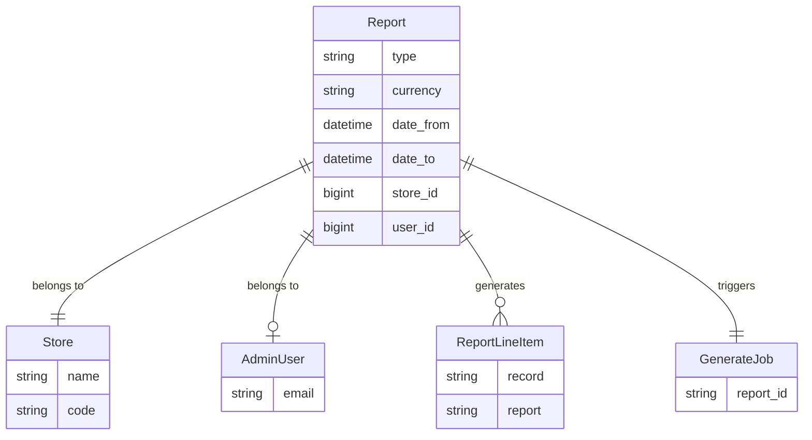

## Overview

Spree provides a flexible reporting system that allows you to generate data exports for sales analytics, product performance, and custom business metrics. Reports are generated asynchronously and delivered as downloadable CSV files.

### Report System Diagram



**Key relationships:**
- **Report** is the base model for all report types using Single Table Inheritance (STI)
- **ReportLineItem** transforms raw database records into formatted report rows
- Reports are scoped to a **Store** and optionally track the **AdminUser** who created them
- **GenerateJob** handles asynchronous CSV generation via the events system

## Architecture

The reporting system uses several design patterns:

1. **Single Table Inheritance (STI)**: All report types inherit from `Spree::Report` and are stored in the same database table with a `type` column
2. **Presenter Pattern**: `Spree::ReportLineItem` subclasses transform raw records into formatted output
3. **Event-Driven Processing**: Report generation is triggered asynchronously via Spree's events system
4. **Registry Pattern**: Reports are registered in `Spree.reports` for discovery and validation

## Built-in Reports

Spree ships with two built-in reports:

### Sales Total Report

The Sales Total report provides line-item level detail for all completed orders within a date range.

**Columns:**
- `date` - Order completion date
- `order` - Order number
- `product` - Variant descriptive name
- `quantity` - Line item quantity
- `pre_tax_amount` - Amount before taxes
- `promo_total` - Promotion discounts applied
- `shipment_total` - Shipping costs
- `tax_total` - Tax amount
- `total` - Final amount including all adjustments

### Products Performance Report

The Products Performance report aggregates sales metrics by product for the specified period.

**Columns:**
- `sku` - Product SKU
- `name` - Product name
- `vendor` - Vendor name (if multi-vendor enabled)
- `brand` - Brand name
- `category_lvl0/1/2` - Category hierarchy from main taxon
- `price` - Current product price
- `weeks_online` - Weeks since product became available
- `pre_tax_amount` - Total pre-tax sales
- `tax_total` - Total taxes collected
- `quantity` - Total units sold
- `promo_total` - Total promotion discounts
- `total` - Total revenue

## How Reports Work Internally

### Generation Flow

1. **User creates report** via admin UI with date range, currency, and optional vendor
2. **Report is saved** to database with status tracking
3. **`report.created` event fires** via `publishes_lifecycle_events` concern
4. **`Spree::ReportSubscriber` catches event** and enqueues `GenerateJob`
5. **Background job runs `report.generate`**:
   - Iterates through `line_items_scope` in batches
   - Transforms each record via `ReportLineItem`
   - Writes CSV to temp file
   - Attaches CSV to report via ActiveStorage
   - Sends notification email to user

### Key Files

| File | Purpose |
|------|---------|
| `core/app/models/spree/report.rb` | Base report model |
| `core/app/models/spree/report_line_item.rb` | Base line item presenter |
| `core/app/models/spree/reports/*.rb` | Built-in report implementations |
| `core/app/models/spree/report_line_items/*.rb` | Built-in line item formatters |
| `core/app/subscribers/spree/report_subscriber.rb` | Event subscriber for async generation |
| `core/app/jobs/spree/reports/generate_job.rb` | Background job for CSV creation |
| `core/app/mailers/spree/report_mailer.rb` | Notification emails |
| `admin/app/controllers/spree/admin/reports_controller.rb` | Admin UI controller |

### Report Base Class Methods

```ruby
# Returns the scope of records for the report
def line_items_scope
  raise NotImplementedError
end

# Returns formatted line items (with optional limit for preview)
def line_items(options = {})
  scope = line_items_scope
  scope = scope.limit(options[:limit]) if options[:limit].present?
  scope.map { |record| line_item_class.new(record: record, report: self) }
end

# Generates the CSV file and handles attachment
def generate
  generate_csv
  handle_attachment
  send_report_done_email
end

# Returns the corresponding line item class
def line_item_class
  "Spree::ReportLineItems::#{type.demodulize}".safe_constantize
end
```

### ReportLineItem Base Class Methods

```ruby
# Returns column headers for display
def self.headers
  attribute_types.keys.map do |attribute|
    { name: attribute.to_sym, label: Spree.t(attribute.to_sym) }
  end
end

# Returns column names for CSV header row
def self.csv_headers
  attribute_types.keys
end

# Converts line item to CSV row array
def to_csv
  self.class.attribute_types.keys.map { |attr| send(attr) }
end
```

## Configuration

### Report Preview Limit

Configure the number of preview rows shown in the admin UI:

```ruby config/initializers/spree.rb
Spree::Admin::RuntimeConfig.reports_line_items_limit = 100
```

### Background Job Queue

Reports use a dedicated queue. Configure your job processor:

```ruby
# Sidekiq example
Spree.queues.reports = :reports
```

## Permissions

Report access is controlled by CanCanCan. By default, only users with the `:manage` ability on `Spree::Report` can access reports. Configure permissions in your permission sets.

```ruby
# Example: Allow all admins to view reports
can :manage, Spree::Report
```

## Related Documentation

- [Build a Custom Report](/developer/how-to/custom-report) - Step-by-step guide to creating custom reports
- [Events](/developer/core-concepts/events) - How report generation uses the events system
